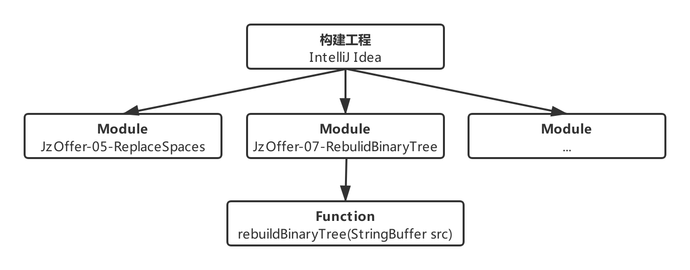

# OfferTerminator Documents

 > 偏向于软件工程师的面试资料整理。

## 推荐资料
- 📖 | 书籍 | [何海涛. 剑指 Offer [M]. 第2版. 电子工业出版社, 2017](https://book.douban.com/subject/27008702/)
- 📖 | 书籍 | [《编程之美》小组. 编程之美 [M]. 第1版. 电子工业出版社, 2018](https://book.douban.com/subject/30351275/)
- 📝 | 文章 | [ApacheCN. 简历指南 + LeetCode + Kaggle [OL]. github.com](https://github.com/apachecn/Interview) (👍)
	- `简历`：[ApacheCN. 简历分享系列视频 [OL]. bilibili.com](https://www.bilibili.com/video/av53122083)
	- `笔试`：[ApacheCN. 面试必备算法题目 [OL]. github.com](https://github.com/apachecn/Interview/tree/master/docs/Algorithm)
	- `笔试`：[0voice. BAT 等技术面试题目/答案/专家出题人分析汇总 [OL]. github.com](https://github.com/0voice/interview_internal_reference)
- 📝 | 文章 | [CyC2018. CS-Notes [OL]. github.com](https://github.com/CyC2018/CS-Notes) (👍)

	>  技术面试必备基础知识、Leetcode 题解、Java、C++、Python、后端面试、操作系统、计算机网络、系统设计等。

- 📝 | 文章 | [MisterBooo. LeetCodeAnimation [OL]. github.com](https://github.com/MisterBooo/LeetCodeAnimation)

	> 本开源项目是用动画的形式呈现 LeetCode 的解题思路。
	
- ⌨️ | 算法 | [Blankj. Awesome-Java-Leetcode [OL]. github.com](https://github.com/Blankj/awesome-java-leetcode)

	> 实现语言是 Java，题库按简单/中等/困难分类，且解释足够详细。

## 在线编程
- [牛客网 -- 剑指Offer -- 编程题](https://www.nowcoder.com/ta/coding-interviews?page=3)

## 核心内容
### 读书笔记
> 命名格式：书籍 -- 主题描述 -- 立项时间

- [剑指 Offer -- 面经与解题启发性笔记 -- 2019.08.29](doc/Coding-Interviews-Questions-Analysis-and-Solutions.md)

### 面试经验
> 命名格式：面试企业 -- 职业 -- 面试时间 -- 面试人 ( 个人 / 其他人 )

### 笔试算法
#### 开源格式说明

- 使用集成开发环境 `IntelliJ Idea` 构建工程项目，并且每一题以单独 `Module` 立项。
- 每一题目以 `类` 进行封装，同一题目的解题思路以 `函数` 为实现载体。
- 项目命名规范：`来源-序号-题目名称` / `来源-题目名称`。

	> 例如：JzOffer-05-ReplaceSpaces、JzOffer-07-RebuildBinaryTree、Leetcode-TwoSum 等。

- 函数命名规范：`驼峰式命名法`
	
	> 例如：pulbic String rebuildBinaryTree(StringBuffer src){...}

- 设计测试用例：便于解题、复习的用途，使用单元测试框架 Junit 编写测试用例。
	- 有效等价类：根据取值范围、数据类型、限制条件或规则等，求得合理的、有意义的输入数据构成的集合。
	- 无效等价类：刚好与有效等价类的概念相反。
	- 边界值分析法：作为对等价类划分法的补充，通常其测试用例来自等价类的边界。

#### 解题方案整理
- [ldxw8. OfferTerminator-Solutions. github.com](https://github.com/ldxw8/OfferTerminator-Solutions)

	> 参考另一位兄弟的开源项目，题目命名也不用愁。 [Jchanghong. CodingInterviewChinese2. github.com](https://github.com/jchanghong/CodingInterviewChinese2)
	
	- JzOffer-20-NumericString
	- JzOffer-67-Str2Int

## 参考资料