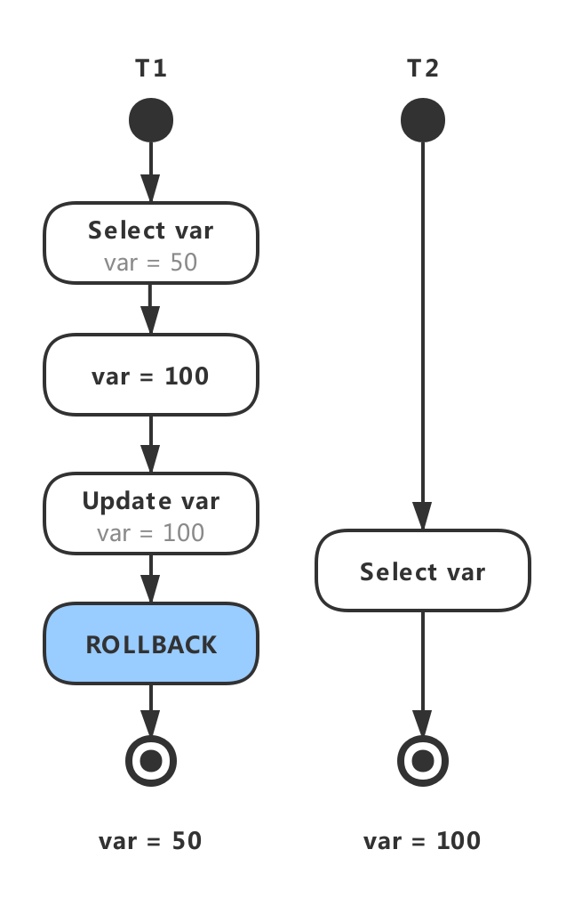
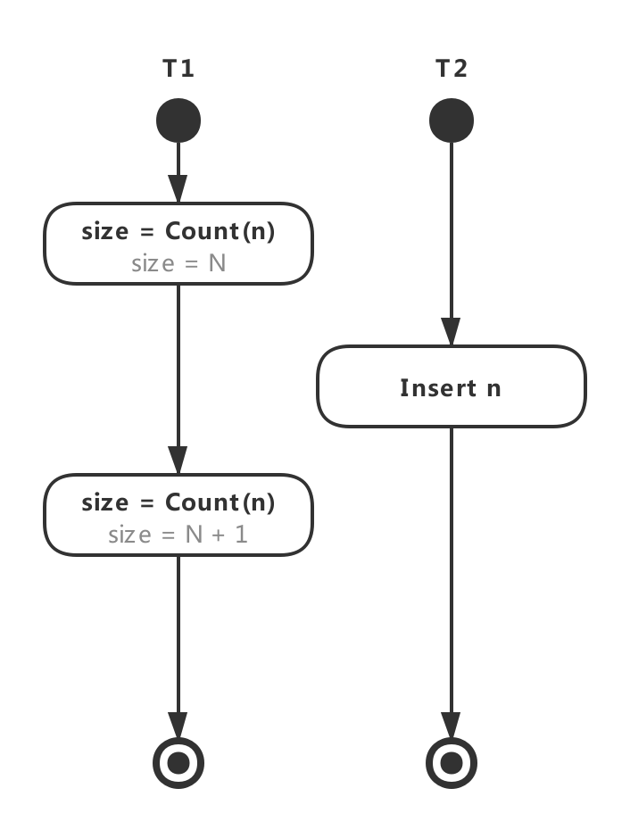
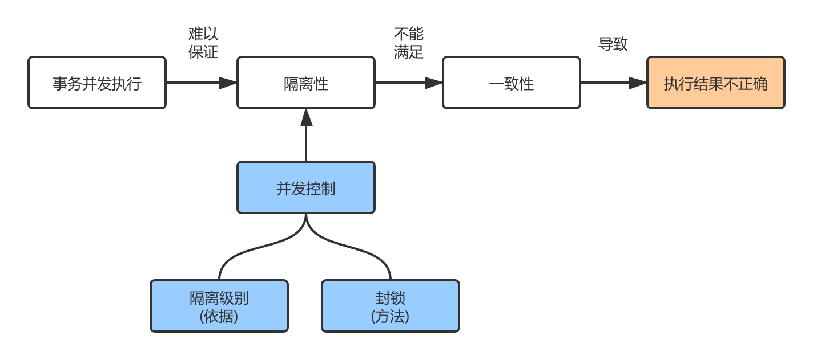
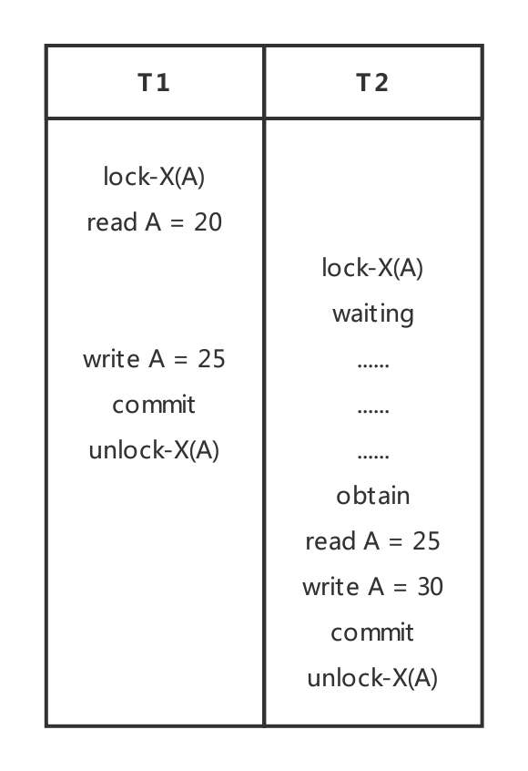
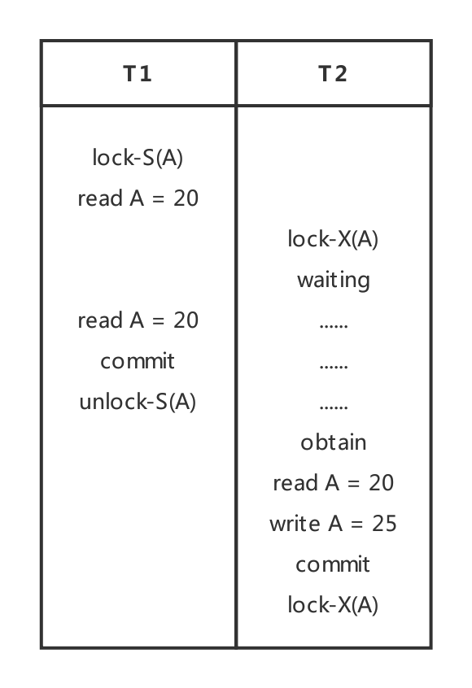
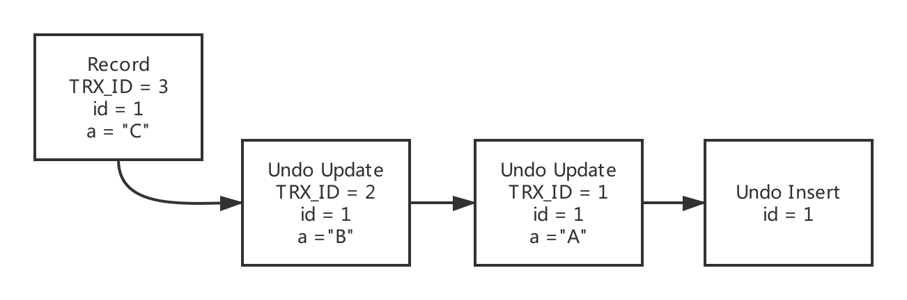
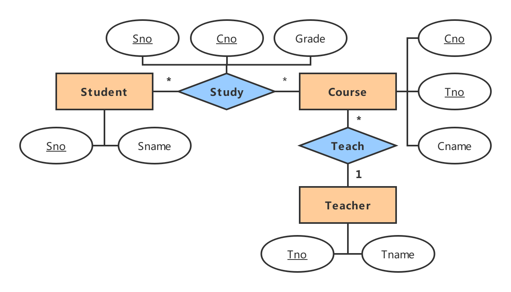

# 技术面试必备基础知识-数据库

> 在线阅读：[CS-Notes-Database](https://cyc2018.github.io/CS-Notes/#/README?id=%f0%9f%92%be-%e6%95%b0%e6%8d%ae%e5%ba%93)

## 数据库系统原理 
### 事务
- 概念：事务指的是满足 `ACID` 特性的一组操作，可以通过 Commit 提交一个事务，也可以使用 Rollback 进行回滚。
- ACID：
	- 原子性 (Atomicity)：
		- 事务被视为不可分割的最小单元，事务的所有操作要么全部提交成功，要么全部失败回滚。
		- 回滚可以用回滚日志来实现，回滚日志记录着事务所执行的修改操作，在回滚时反向执行这些修改操作即可。
	- 一致性 (Consistency)：数据库在事务执行前后都保持一致性状态。在一致性状态下，所有事务对一个数据的读取结果都是相同的。
	- 隔离性 (Isolation)：一个事务所做的修改在最终提交以前，对其它事务是不可见的。
	- 持久性 (Durability)：一旦事务提交，则其所做的修改将会永远保存到数据库中。即使系统发生崩溃，事务执行的结果也不能丢失。
	
		> 使用重做日志来保证持久性。

- 事务的 ACID 特性概念简单，但不是很好理解，主要是因为这几个特性不是一种平级关系：
	- 只有满足一致性，事务的执行结果才是正确的。
		- 在无并发的情况下，事务串行执行，隔离性一定能够满足。此时只要能满足原子性，就一定能满足一致性。
		- 在并发的情况下，多个事务并行执行，事务不仅要满足原子性，还需要满足隔离性，才能满足一致性。
	- 事务满足持久化是为了能应对数据库崩溃的情况。  

		|  |
		| :---: |
		| 图 1-1 ACID逻辑关系 |

- AUTOCOMMIT：MySQL 默认采用自动提交模式。也就是说，如果不显式使用START TRANSACTION 语句来开始一个事务，那么每个查询都会被当做一个事务自动提交。

### 并发一致性问题
#### 丢失数据
`丢失数据`：$T_1$ 和 $T_2$ 两个事务都对一个数据进行修改，$T_1$ 先修改，$T_2$ 随后修改，$T_2$ 的修改覆盖了 $T_1$ 的修改。如图 1-2 所示。 

> 简记为 `同时修改`。

#### 读脏数据
`读脏数据`：$T_1$ 对一个数据做了修改，$T_2$ 读取这一个数据。若 $T_1$ 执行 ROLLBACK 操作，则 $T_2$ 读取的结果和第一次的结果不一样。如图 1-3 所示。

> 简记为 `读取失败的修改`。最简单的场景是修改完成后，紧接着查询检验结果。

#### 不可重复读
`不可重复读`：$T_2$ 读取一个数据，$T_1$ 对该数据做了修改。如果 $T_2$ 再次读取这个数据，此时读取的结果和第一次读取的结果不同。如图 1-4 所示。

> 简记为 `读时修改`，重复读取的结果不一样。

#### 幻影读
`幻影读`：$T_1$ 读取某个范围的数据，$T_2$ 在这个范围内插入新的数据，$T_1$ 再次读取这个范围的数据，此时读取的结果和和第一次读取的结果不同。如图 1-5 所示。

> 简记为 `读时插入`，重复读取的结果不一样。

|  |  |
| :---: | :---: |
| 图 1-2 丢失数据 | 图 1-3 读脏数据 |
|  |  |
| 图 1-4 不可重复读 | 图 1-5 幻影读 |

#### 解决方案

|  |
| :-: |
| 图 1-5-1 事务并发环境下保证事务一致性的方法 |

- 在并发环境下，事务的隔离性很难保证，因此会出现很多并发一致性问题。
- 产生并发不一致性问题的主要原因是破坏了事务的隔离性。
- 解决方法是通过 `并发控制` 来保证隔离性。
	- 并发控制可以通过 `封锁` 来实现，但是封锁操作需要用户自己控制，相当复杂。
	- 数据库管理系统提供了事务的 `隔离级别`，让用户以一种更轻松的方式处理并发一致性问题。

### 封锁
#### 封锁粒度
- MySQL 中提供了两种封锁粒度：`行级锁` 以及 `表级锁`。
- 应尽量只锁定需要修改的那部分数据，而不是所有的资源。锁定的数据量越少，发生锁争用的可能就越小，系统的并发程度就越高。
- 但是加锁需要消耗资源，锁的各种操作 (包括获取锁、释放锁、以及检查锁状态) 都会增加系统开销。因此封锁粒度越小，系统开销就越大。

	> 为此，我们在选择封锁粒度时，需在 `锁开销` 和 `并发程度` 之间做一个 `权衡`。

#### 封锁类型
##### 读写锁
- 排它锁 (Exclusive)，简写为 `X 锁`，又称 `写锁`。
- 共享锁 (Shared)，简写为 `S 锁`，又称 `读锁`。

- 有以下两个规定：
	- 一个事务对数据对象 A 加了 X 锁，就可以对 A 进行读取和更新。加锁期间其它事务不能对 A 加任何锁。
	- 一个事务对数据对象 A 加了 S 锁，可以对 A 进行读取操作，但是不能进行更新操作。加锁期间其它事务能对 A 加 S 锁，但是不能加 X 锁。
- 锁的兼容关系如表 1-1 所示 :  读写锁之间的兼容关系 

	|  | 排它锁 X | 共享锁 S |
	| :---: | :---: | :---: |
	| 排它锁 X | ✖️ | ✖️ |
	| 共享锁 S | ✖️ | ✔️ |
	
	图例说明：✖️ 相互不兼容	✔️ 相互兼容

##### 意向锁
- 使用意向锁 (Intention Locks)，可以更容易地支持多粒度封锁，使得行锁和表锁能够共存。
- 在存在行级锁和表级锁的情况下，事务 T 想要对表 A 加 X 锁，就需要先检测是否有其它事务对表 A 或者表 A 中的任意一行加了锁，那么就需要对表 A 的每一行都检测一次，这是非常耗时的。

	意向锁在原来的 X/S 锁之上引入了 IX / IS，IX / IS 都是 `表级别的锁`，用来表示一个事务稍后会对表中的某个数据行上加 X 锁或 S 锁。整理可得以下两个规定：
	
	- 一个事务在获得某个数据行对象的 S 锁之前，必须先获得表的 IS 锁或者更强的锁；
	- 一个事务在获得某个数据行对象的 X 锁之前，必须先获得表的 IX 锁。

- 各种锁的兼容关系如表 1-2 所示：读写锁与意向锁的兼容关系
	- 任意 IS / IX 锁之间都是兼容的，因为它们只是表示想要 `对表加锁`，而不是真正加锁；
	- S 锁只与 S 锁和 IS 锁兼容，也就是说事务 T 想要对数据行加 S 锁，其它事务可以已经获得对表或者表中的行的 S 锁。

	|      | 排它锁  X | 意向排它锁 IX | 共享锁 S | 意向共享锁  IS |
	| :---: | :---: | :---: | :---: | :---: |
	| 排它锁 X | ✖️ | ✖️ | ✖️ | ✖️ |
	| 意向排它锁 IX | ✖️ | ✔️ | ✖️ | ✔️ |
	| 共享锁  S | ✖️ | ✖️ | ✔️ | ✔️ |
	| 意向共享锁  IS | ✖️ | ✔️ | ✔️ | ✔️ |
	
	图例说明：✖️ 相互不兼容	✔️ 相互兼容
	
#### 封锁协议
##### 三级封锁协议
- `一级封锁协议`：事务 T 要修改数据 A 时必须加 X 锁，直到 T 结束才释放锁。`防止同时修改`

	> 可解决 `丢失修改` 问题，因不能同时有两个事务对同一个数据进行修改，那么事务的修改就不会被覆盖。

- `二级封锁协议`：在一级的基础上，要求读取数据 A 时必须加 S 锁，读取完马上释放 S 锁。`防止修改时读取`

	> 可解决 `丢失修改` 和 `读脏数据` 问题，因为一个事务在对数据 A 进行修改，根据 1 级封锁协议，会加 X 锁，那么就不能再加 S 锁了，也就是不会读入数据。
	
- `三级封锁协议`：在二级的基础上，要求读取数据 A 时必须加 S 锁，直到事务结束了才能释放 S 锁。`防止读取时修改`

	> 可解决 `丢失修改` 和 `读脏数据` 问题，还进一步防止了 `不可重复读` 的问题，因为读 A 时，其它事务不能对 A 加 X 锁，从而避免了在读的期间数据发生改变。
	
	| | | |
	| :---: | :---: | :---: |
	| 图 1-6 一级封锁协议示例 | 图 1-7 二级封锁协议示例 | 图 1-8 三级封锁协议示例 |

##### 两段锁协议
- 两段锁协议是指每个事务的执行可以分为两个阶段：生长阶段 (加锁阶段) 和衰退阶段 (解锁阶段)。
- 两段封锁法可以这样来实现：
	- 事务开始后就处于加锁阶段，一直到执行 ROLLBACK 和 COMMIT 之前都是加锁阶段。
	- ROLLBACK 和 COMMIT 使事务进入解锁阶段，即在 ROLLBACK 和 COMMIT 模块中 DBMS 释放所有封锁。
- 可串行化调度：通过并发控制，使得并发执行的事务结果与某个串行执行的事务结果相同。
	- 事务遵循两段锁协议是保证可串行化调度的 `充分条件`。例如以下操作满足两段锁协议，它是可串行化调度。

		```html
		lock-x(A)...lock-s(B)...lock-s(C)...unlock(A)...unlock(C)...unlock(B)
		```

	- 但不是 `必要条件`，例如以下操作不满足两段锁协议，但是它还是可串行化调度。

		```html
		lock-x(A)...unlock(A)...lock-s(B)...unlock(B)...lock-s(C)...unlock(C)
		```

#### 隐式与显式锁定
- MySQL 的 InnoDB 存储引擎采用两段锁协议，会根据 `隔离级别` 在需要的时候 `自动加锁`，并且所有的锁都是在同一时刻 (commit 或者 rollback) 被释放，这被称为 `隐式锁定`。
- InnoDB 也可以使用特定的语句进行 `显式锁定` (where 条件里面的必须是主键，否则会锁整张表)：

	```sql
	SELECT ... LOCK In SHARE MODE;
	SELECT ... FOR UPDATE;
	```

### 隔离级别
- 概念：事务指定一个隔离级别，该隔离级别定义了一个事务必须与其他事务进行资源或数据更改相隔离的程度。隔离级别是从 `允许并发一致性问题发生` 的角度进行描述的。例如，脏读、不可重复读或幻影读。如表 1-3 所示，是关于隔离级别与并发副作用的层级关系。

	| 隔离级别 \ 并发一致性问题 | 脏读 | 不可重复读 | 幻影读 |
	| :----: | :----: | :----: | :----: |
	| 未提交读 |  ✔️  |  ✔️  |  ✔️  |
	| 提交读   |  ✖️  |  ✔️  |  ✔️  |
	| 可重复读 |  ✖️  |  ✖️  |  ✔️  |
	| 串行化读 |  ✖️  |  ✖️  |  ✖️  |
	
	图例说明：✖️ 是可避免的情况	✔️ 是允许发生的情况
  
- 实现方式：MySQL 的 InnoDB 存储引擎实现隔离级别的具体方式有：多版本并发控制 (MVCC) 与 Next-Key Locks。

#### 未提交读
- 未提交读 (Read uncommitted)：事务中的修改，即使没有提交，对其它事务也是可见的。

#### 提交读
- 提交读 (Read committed)：一个事务只能读取已经提交的修改事务。换句话说，一个事务所做的修改在提交之前对其它事务是不可见的。

	> Oracle 数据库默认的事务隔离级别。

#### 可重复读
- 可重复读 (Repeatable Read)：保证了一个事务不会修改已经由另一个事务读取但未提交 (或回滚) 的数据。

	> MySQL 数据库默认的事务隔离级别。

#### 可串行化
- 可串行化 (Serialzable)：强制事务串行执行。需要加锁实现，而其它隔离级别通常不需要加锁。

### 多版本并发控制
- 多版本并发控制 (Multi-Version Concurrency Control, MVCC) 是 MySQL 的 InnoDB 存储引擎实现隔离级别的一种具体方式，用于实现 `提交读` 和 `可重复读` 这两种隔离级别。
- `未提交读` 隔离级别总是读取最新的数据行，无需使用 MVCC。
- `可串行化` 隔离级别需要对所有读取的行都加锁，单纯使用 MVCC 无法实现。

#### 版本号
> 该版本号是指代事务的版本号。

- `系统版本号`：是一个递增的数字，每开始一个新的事务，系统版本号就会自动递增。
- `事务版本号`：事务开始时的系统版本号。

#### 隐藏列
> 该版本号是指代数据行快照的版本号。

- MVCC 在每行记录后面都保存着两个隐藏的列，用来存储两个版本号：
	- `创建版本号`：指示创建一个数据行快照时的系统版本号；
	- `删除版本号`：如果该快照的删除版本号大于当前事务版本号表示该快照有效，否则表示该快照已经被删除了。

#### Undo 日志
- MVCC 使用到的快照存储在 Undo 日志中，该日志通过回滚指针把一个数据行 (Record) 的所有快照连接起来。

	|  |
	| :---: |
	| 图 1-9 存储在 Undo日志中的快照 |

#### 实现过程
> 以下实现过程针对 `可重复读` 隔离级别。

- 当开始一个事务时，该事务的版本号肯定大于当前所有数据行快照的创建版本号，理解这一点很关键。
- 数据行快照的创建版本号是创建数据行快照时的系统版本号，系统版本号随着创建事务而递增，因此新创建一个事务时，这个事务的系统版本号比之前的系统版本号都大，也就是比所有数据行快照的创建版本号都大。

##### SELECT
- 多个事务必须读取到同一个数据行的快照，并且这个快照是距离现在最近的一个有效快照。但是也有例外，如果有一个事务正在修改该数据行，那么它可以读取事务本身所做的修改，而不用和其它事务的读取结果一致。
- 把没有对一个数据行做修改的事务称为 T，T 所要读取的数据行快照的创建版本号必须小于等于 T 的版本号，因为如果大于 T 的版本号，那么表示该数据行快照是其它事务的最新修改，因此不能去读取它。
- 除此之外，T 所要读取的数据行快照的删除版本号必须是未定义或者大于 T 的版本号，因为如果小于等于 T 的版本号，那么表示该数据行快照是已经被删除的，不应该去读取它。

##### INSERT
- 将当前系统版本号作为数据行快照的创建版本号。

##### DELETE
- 将当前系统版本号作为数据行快照的删除版本号。

##### UPDATE
- 将当前系统版本号作为更新前的数据行快照的删除版本号，并将当前系统版本号作为更新后的数据行快照的创建版本号。
- 可以理解为先执行 DELETE 后执行 INSERT。

#### 快照读与当前读
##### 快照读
- 使用 MVCC 读取的是快照中的数据，这样可以减少加锁所带来的开销。

	```sql
	SELECT * FROM table ...;
	```

##### 当前读
- 读取的是最新的数据，需要加锁。以下第一个语句需要加 S 锁，其它都需要加 X 锁。

	```sql
	SELECT * FROM table WHERE ? LOCK IN SHARE MODE;
	SELECT * FROM table WHERE ? FOR UPDATE;
	INSERT;
	UPDATE;
	DELETE;
	```

### Next-Key Locks
- Next-Key Locks 是 MySQL 的 InnoDB 存储引擎的一种锁实现。
- MVCC 不能解决 `幻影读` 问题，Next-Key Locks 就是为了解决这个问题而存在的。

	> 场景复现：可重复读保证了一个事务不会修改已经由另一个事务读取但未提交 (或回滚) 的数据，例如统计某班男生的人数。但此时插入一名男生，而同样的查询操作会导致不一致的查询结果。

- 在可重复读 (REPEATABLE READ) 隔离级别下，使用 `MVCC + Next-Key Locks` 可以解决幻读问题。

#### Record Locks
- 锁定一个记录上的索引，而不是记录本身。
- 如果表没有设置索引，InnoDB 会自动在主键上创建隐藏的聚簇索引，因此 Record Locks 依然可以使用。

#### Gap Locks
- 锁定索引之间的间隙，但是不包含索引本身。例如当一个事务执行以下语句，其它事务就不能在 t.c 中插入 15。

	```sql
	SELECT c FROM t WHERE c BETWEEN 10 and 20 FOR UPDATE;
	```

#### Next-Key Locks
- 它是 Record Locks 和 Gap Locks 的结合，不仅锁定一个记录上的索引，也锁定索引之间的间隙。例如一个索引包含以下值：10, 11, 13, and 20，那么就需要锁定以下区间：

	```sql
	(-∞, 10]
	(10, 11]
	(11, 13]
	(13, 20]
	(20, +∞)
	```
	
### 关系数据库设计理论
#### 函数依赖
- 记 $A \to B$ 表示 A 函数决定 B，也可以说 B 函数依赖于 A。
- 若 $\{A_1，A_2，... ，A_n\}$ 是关系的一个或多个属性的集合，该集合函数决定了关系的其它所有属性并且是 `最小的`，那么该集合就称为 `键码`。
- 对于 $A \to B$，如果能找到 A 的真子集 $A'$，使得 $A' \to B$，那么 $A \to B$ 就是 `部分函数依赖`，否则就是 `完全函数依赖`。
- 对于 $A \to B$，$B \to C$，则 $A \to C$ 是一个 `传递函数依赖`。

#### 异常
- 如表 1-4 所示，展示了学生课程关系的函数依赖为 {Sno, Cname} -> {Sname, Sdept, Mname, Grade}，键码为 {Sno, Cname}。也就是说，确定学生和课程后就能确定其它信息。

	| Sno | Sname | Sdept | Mname | Cname | Grade |
	| :---: | :---: | :---: | :---: | :---: | :---: |
	| 1 | 学生-1 | 学院-1 | 院长-1 | 课程-1 | 90 |
	| 2 | 学生-2 | 学院-2 | 院长-2 | 课程-2 | 80 |
	| 2 | 学生-2 | 学院-2 | 院长-2 | 课程-1 | 100 |
	| 3 | 学生-3 | 学院-2 | 院长-2 | 课程-2 | 95 |

- 不符合范式的关系，会产生很多异常，主要有以下四种异常：
	- `冗余数据`：例如 `学生-2` 出现了两次。
	- `修改异常`：修改了一个记录中的信息，但是另一个记录中相同的信息却没有被修改。
	- `删除异常`：删除一个信息，那么也会丢失其它信息。例如删除了 `课程-1` 需要删除第一行和第三行，那么 学生-1 的信息就会丢失。
	- `插入异常`：例如想要插入一个学生的信息，如果这个学生还没选课，那么就无法插入。

#### 范式
- 范式理论是为了解决以上提到四种异常。
- 高级别范式的依赖于低级别的范式，1NF 是最低级别的范式。

##### 第一范式 (1NF)
- 属性不可分。即数据库表的每一列都是不可分割的基本数据项，同一列中不能有多个值，即实体中的某个属性不能有多个值或者不能有重复的属性。

##### 第二范式 (2NF)
- 每个非主属性完全函数依赖于键码。
- 可以通过分解来满足 2NF。

###### 分解前

| Sno | Sname | Sdept | Mname | Cname | Grade |
| :---: | :---: | :---: | :---: | :---: | :---: |
| 1 | 学生-1 | 学院-1 | 院长-1 | 课程-1 | 90 |
| 2 | 学生-2 | 学院-2 | 院长-2 | 课程-2 | 80 |
| 2 | 学生-2 | 学院-2 | 院长-2 | 课程-1 | 100 |
| 3 | 学生-3 | 学院-2 | 院长-2 | 课程-2 | 95 |

- 以下学生课程关系中，{Sno, Cname} 为键码，有如下函数依赖：
	- Sno -> Sname, Sdept
	- Sdept -> Mname
	- Sno, Cname-> Grade
- 函数依赖状况分析：
	- Grade 完全函数依赖于键码，它没有任何冗余数据，每个学生的每门课都有特定的成绩。  
	- Sname, Sdept 和 Mname 都部分依赖于键码，当一个学生选修了多门课时，这些数据就会出现多次，造成大量冗余数据。

###### 分解后
- 关系-1：

	| Sno | Sname | Sdept | Mname |
	| :---: | :---: | :---: | :---: |
	| 1 | 	学生-1 |  学院-1 | 院长-1 |
	| 2 | 学生-2 | 学院-2 | 院长-2 |
	| 3 | 学生-3 | 学院-2 | 院长-2 |

- 有以下函数依赖：
	- Sno -> Sname, Sdept
	- Sdept -> Mname

- 关系-2：

	| Sno | Cname | Grade |
	| :---: | :---: | :---: |
	| 1 | 课程-1 | 90 |
	| 2 | 课程-2 | 80 |
	| 2 | 课程-1 | 100 |
	| 3 | 课程-2 | 95 |

- 有以下函数依赖： Sno, Cname $\to$ Grade

##### 第三范式 (3NF)
- 非主属性不传递函数依赖于键码。
- 上面的 关系-1 中存在以下传递函数依赖：Sno $\to$ Sdept $\to$ Mname。

###### 分解后
- 关系-11：

	| Sno | Sname | Sdept |
	| :---: | :---: | :---: |
	| 1 | 学生-1 | 学院-1 |
	| 2 | 学生-2 | 学院-2 |
	| 3 | 学生-3 | 学院-2 |

- 关系-12：

	| Sdept | Mname |
	|  :---: | :----: |
	| 学院-1 | 院长-1 |
	| 学院-2 | 院长-2 |

### ER 图
- 实体关系图 (Entity-Relationship，E-R)，有三个组成部分：实体、属性、联系。用来进行关系型数据库系统的概念设计。
	- `实体`：用矩形表示，矩形框内写明实体名.
	- `属性`：用椭圆形表示，并用无向边将其与相应的实体连接起来。
	- `联系`：用菱形表示，菱形框内写明联系名，并用无向边分别与有关实体连接起来，同时在无向边旁标上联系的类型（1...1，1...* 或 \*...\*）就是指存在的三种关系 (一对一、一对多或多对多)。
- ER 模型转换为关系模式的原则：
	- `一对一`：遇到一对一关系的话，在两个实体任选一个添加另一个实体的主键即可。
	- `一对多`：遇到一对多关系的话，在多端添加另一端的主键。
	- `多对多`：遇到多对多关系的话，我们需要将联系转换为实体，然后在该实体上加上另外两个实体的主键，作为联系实体的主键，然后再加上该联系自身带的属性即可。

	|  |
	| :---: |
	| 图 1-10 简单的学生课程 ER 模型 |


## SQL
### 基础
- 模式定义了数据如何存储、存储什么样的数据以及数据如何分解等信息，数据库和表都有模式。
- 主键的值不允许修改，也不允许复用；(不能将已经删除的主键值赋给新数据行的主键。
- 结构化查询语言 (Structured Query Language, SQL)，标准 SQL 由 ANSI 标准委员会管理，从而称为 ANSI SQL。各个 DBMS 都有自己的实现，如 PL/SQL、Transact-SQL 等。
- SQL 语句不区分大小写，但是数据库表名、列名和值是否区分依赖于具体的 DBMS 以及配置。
- SQL 支持以下三种注释：

	```sql
	# 注释 1
	SELECT *
	FROM mytable; -- 注释 2
	
	/* 注释 3-1 */
	```

- 数据库创建与使用：
	
	```sql
	CREATE DATABASE test;
	USE test;
	```

### 创建表
- 创建表：

	```sql
	CREATE TABLE mytable (
		# int 类型，不为空，自增
		id INT NOT NULL AUTO_INCREMENT,
		# int 类型，不可为空，默认值为 1，不为空
		col1 INT NOT NULL DEFAULT 1,
		# 变长字符串类型，最长为 45 个字符，可以为空
		col2 Varchar(45) NULL,
		# 日期类型，可为空
		col3 DATE NULL,
		# 设置主键为 id
		PRIMARY KEY (`id`)
	);
	```

### 修改表
- 添加列：

	```sql
	ALTER TABLE mytable
	ADD col Char(20);
	```

- 删除列：

	```sql
	ALTER TABLE mytable
	DROP COLUMN col;
	```

- 删除表：

	```sql
	DROP TABLE mytable;
	```

### 插入

### 更新

### 删除

### 查询
#### DISTINCT
- 相同值只会出现一次。它作用于所有列，也就是说所有列的值都相同才算相同。

	```sql
	SELECT DISTINCT col1, col2
	FROM mytable;
	```

#### LIMIT
> LIMIT 关键字只能在 MySQL 数据库中使用，属于 MySQL 的方言。在 SQL Server 使用 TOP 关键字替代使用。

- 限制返回的行数。可以有两个参数，第一个参数为起始行，从 0 开始；第二个参数为返回的总行数。

	```sql
	# 返回前 5 行
	SELECT *
	FROM mytable
	LIMIT 5;
	
	# 返回第 3 ~ 5 行
	SELECT *
	FROM mytable
	LIMIT 2, 3;
	
	// SQL Server
	SELECT TOP 5 * from mytable;
	```
	
### 过滤
- 不进行过滤的数据非常大，导致通过网络传输了多余的数据，从而浪费了网络带宽。因此尽量使用 SQL 语句来过滤不必要的数据，而不是传输所有的数据到客户端中然后由客户端进行过滤。

	```sql
	SELECT *
	FROM mytable
	WHERE col IS NULL;
	```
	
- 下表显示了 `WHERE` 子句可用的操作符：
	
	| 操作符 | 说明 |
	| :---: | :---: |
	| = | 等于 |
	| < | 小于 |
	| > | 大于 |
	| <> != | 不等于 |
	| <= !> | 小于等于 |
	| >= !< | 大于等于 |
	| BETWEEN | 在两个值之间 |
	| IS NULL | 为 NULL 值 |
	
	> 提示：应该注意到，NULL 与 0、空字符串都不同。
	
- `AND` 和 `OR` 用于连接多个过滤条件。优先处理 AND，当一个过滤表达式涉及到多个 AND 和 OR 时，可以使用 `()` 来决定优先级，使得优先级关系更清晰。
- `IN` 操作符用于匹配一组值，其后也可以接一个 SELECT 子句，从而匹配子查询得到的一组值。
- `NOT` 操作符用于否定一个条件。

### 通配符
- 通配符也是用在过滤语句中，但它只能用于文本字段。
	- `%` 匹配 `>=0` 个任意字符；
	- `_` 匹配 `==1` 个任意字符；
	- `[]` 可以匹配集合内的字符，例如 [ab] 将匹配字符 a 或者 b。用脱字符 ^ 可以对其进行否定，也就是不匹配集合内的字符。
- 使用 Like 来进行通配符匹配：

	```sql
	SELECT *
	FROM mytable
	WHERE col LIKE '[^AB]%'; -- 挑选不以 A 和 B 开头的任意文本
	```
	
	> 提示：不要滥用通配符，通配符位于开头处匹配会非常慢。

### 计算字段
- 在数据库服务器上完成数据的转换和格式化的工作往往比客户端上快得多，并且转换和格式化后的数据量更少的话可以减少网络通信量。
- 计算字段通常需要使用 `AS` 来取别名，否则输出的时候字段名为计算表达式。

	```sql
	SELECT col1 * col2 AS alias
	FROM mytable;
	```
	
- `CONCAT()` 用于连接 (拼接) 两个字段：

	```sql
	SELECT CONCAT(col1, '(', col2, ')') AS concat_col
	FROM mytable;
	```

### 聚合函数
- 各个 DBMS 的聚合函数都是不相同的，因此不可移植。以下主要列举的是 MySQL 的聚合函数。

#### 统计汇总
| 函 数 | 说 明 |
| :---: | :---: |
| AVG() | 返回某列的平均值 |
| COUNT() | 返回某列的行数 |
| MAX() | 返回某列的最大值 |
| MIN() | 返回某列的最小值 |
| SUM() | 返回某列值之和 |

```sql
# AVG() 会忽略 NULL 行
# 使用 DISTINCT 可以汇总不同的值
SELECT AVG(DISTINCT col1) AS avg_col
FROM mytable;
```

#### 文本处理
| 函 数 | 说 明 | 
| :---: | :---: | 
| LEFT() | 左边的字符
| RIGHT() | 右边的字符
| LOWER() | 转换为小写字符
| UPPER()	 | 转换为大写字符
| LTRIM() | 去除左边的空格
| RTRIM() | 去除右边的空格
| LENGTH() | 长度
| SOUNDEX() | 转换为语音值

```sql
# 其中 SOUNDEX() 可以将一个字符串转换为描述其语音表示的字母数字模式
SELECT *
FROM mytable
WHERE SOUNDEX(col1) = SOUNDEX('apple')
```

#### 日期和时间处理

#### 数值处理

### 分组

### 排序

### 连接

### 子查询
#### 非关联子查询
 - 概念：非相关子查询是独立于外部查询的子查询，子查询执行完毕后将值传递给外部查询。子查询中只查询一次并返回一个字段的数据。
- 可以将子查询的结果作为 WHRER 语句的过滤条件：

	```sql
	SELECT *
	FROM mytable1
	WHERE col1 IN (
		SELECT col2 FROM mytable2
	);
	```
- 下面的语句可以检索出客户的订单数量，子查询语句会对第一个查询检索出的每个客户执行一次：

	```sql
	SELECT cust_name, (
		SELECT COUNT(*)
		FROM Orders
		WHERE Orders.cust_id = Customers.cust_id) AS orders_num
	FROM Customers
	ORDER BY cust_name;
	```

#### 关联子查询
- 概念：关联子查询会引用外部查询中的一列或多列。这种子查询之所以被称为关联子查询，是因为子查询的确与外部查询有关。当问题的答案需要依赖于外部查询中包含的每一行中的值时，通常就需要使用关联子查询 $^{[3]}$。 
- 相关子查询的执行依赖于外部查询的数据，外部查询执行一行，子查询就执行一次。并且是外部先查询一次，然后再执行一次内部查询。
- 例如，查询部门工资前三高的所有员工 ([Leetcode](https://leetcode-cn.com/problems/department-top-three-salaries/submissions/))：

	```sql
	Select d.Name as Department, e.Name as Employee, e.Salary
	From Employee as e, Department as d
	Where 1=1 AND e.DepartmentId = d.Id
	Group By e.DepartmentId, e.id
	Having (
		Select Count(distinct es.Salary) 
		From Employee as es 
		Where 1=1 -- "1=1" 没有特殊意义，仅为了对齐语句格式
			AND e.DepartmentID = es.DepartmentID
			AND es.Salary > e.Salary
	) < 3
	```

### 组合查询


## LeetCode for SQL
- 更多题目和解题思路请参考原文 (内含在线编程连接)：[LeetCode for SQL](https://cyc2018.github.io/CS-Notes/#/notes/Leetcode-Database%20题解)
- 综合自己的情况，以下挑选了难度较大的题目，留作启发性笔记：
	- [184. Department Highest Salary](https://cyc2018.github.io/CS-Notes/#/notes/Leetcode-Database%20题解?id=_184-department-highest-salary)
	- [176. Second Highest Salary](https://cyc2018.github.io/CS-Notes/#/notes/Leetcode-Database%20题解?id=_176-second-highest-salary)
	- [178. Rank Scores](https://cyc2018.github.io/CS-Notes/#/notes/Leetcode-Database%20题解?id=_178-rank-scores)
	- [180. Consecutive Numbers](https://cyc2018.github.io/CS-Notes/#/notes/Leetcode-Database%20题解?id=_180-consecutive-numbers)
	- [626. Exchange Seats](https://cyc2018.github.io/CS-Notes/#/notes/Leetcode-Database%20题解?id=_626-exchange-seats)


## MySQL

### 索引
#### B+Tree 原理
##### 参考资料
- [Nullzx. B树和B+树的插入删除图文详解. cnblogs.com](https://www.cnblogs.com/nullzx/p/8729425.html)

##### 数据结构
- B Tree (平衡树, Balance Tree)：也称为 `多路平衡查找树`，并且所有叶子节点位于同一层。
- B+ Tree：
	- 基于 B Tree 和叶子节点顺序访问指针进行实现，它具有 B Tree 的平衡性，并且通过顺序访问指针来提高区间查询的性能。
	- 在 B+ Tree 中，一个节点中的 key 从左到右非递减排列，若某个指针的 $key$ 左右相邻分别是 $key_i$ 和 $key_{i+1}$，且不为 null，则该指针指向节点的所有 key 满足 $key_i \leq key \leq key_{i+1}$。
	- B+ Tree 与 B Tree 最大区别是，B+ Tree 的非叶子结点不保存数据，只用于索引，所有数据都保存在叶子结点中。

		|  |
		| :---: |
		| 图 3-1 B 树 与 B+ 树 |

##### 增删改查
- 进行查找操作时，首先在`根节点`进行 `二分查找`，找到一个 key 所在的指针，然后递归地在指针所指向的节点进行查找。直到查找到叶子节点，然后在 `叶子节点` 上进行 `二分查找`，找出 key 所对应的 data。

	> 二分查找需要表有序，正好 B Tree 和 B+ Tree 结点中的 key 从左到右非递减有序排列。

- 插入删除操作会破坏平衡树的平衡性，因此在插入删除操作之后，需要对树进行一个分裂、合并、旋转等操作来维护平衡性。

##### 与红黑树的区别
红黑树 (自平衡的二叉树) 也可以用来实现索引，但是文件系统及数据库系统普遍采用 B+ Tree 作为索引结构，主要有以下两个原因：

- `更少的查找次数`：平衡树查找操作的时间复杂度和树高 $h$ 相关，$O(h)=O(log_dN)$，其中 d 为每个节点的出度。红黑树的出度为 2，而 B+ Tree 的出度一般都非常大，所以红黑树的树高 h 很明显比 B+ Tree 大，查找的次数也就大。

- `利用磁盘预读特性`：为了减少磁盘 I/O 操作，磁盘往往不是严格按需读取，而是每次都会 `预读`。预读过程中，磁盘进行 `顺序读取`，顺序读取不需要进行 `磁盘寻道`，只需要很短的磁盘旋转时间，速度非常快。

	操作系统一般将内存和磁盘分割成固定大小的块，每一块称为一页，内存与磁盘以页为单位交换数据。数据库系统将索引的一个节点的大小设置为页的大小，使得一次 I/O 就能完全载入一个节点。并且可以利用预读特性，相邻的节点也能够被预先载入。

#### MySQL 索引
- 索引是在 `存储引擎层` 实现的，而不是在服务器层实现的，所以不同存储引擎具有不同的索引类型和实现。

##### B+Tree 索引
- B+Tree 索引是大多数 MySQL 存储引擎的默认索引类型。
- InnoDB 的 B+Tree 索引分为 `主索引` 和 `辅助索引`。主索引的叶子节点 data 域记录着完整的数据记录，这种索引方式被称为 `聚簇索引`。因为无法把数据行存放在两个不同的地方，所以一个表只能有一个聚簇索引。
- 因为不再需要进行全表扫描，只需要对树进行搜索即可，所以查找速度快很多。
- 因为 B+ Tree 的 `有序性`，因此可用于 `查找`、`排序` 和 `分组`。
- 可以指定多个列作为索引列，多个索引列共同组成键。
- 适用于全键值、键值范围和键前缀查找，其中键前缀查找只适用于最左前缀查找。若不是按照索引列的顺序进行查找，则无法使用索引。

##### Hash 索引
- Hash 索引能以 O(1) 时间进行查找，但是失去了有序性。
- 无法用于排序与分组；无法用于 `部分查找` 和 `范围查找`，只支持精确查找。

	> Hash 索引仅满足 `=`，`IN` 和 `<=>` 查询，不能使用范围查询。因为 Hash 索引比较的是 Hash 运算后的 Hash 值，所以它只能用于等值的过滤。

- InnoDB 存储引擎有一个特殊的功能叫 `自适应哈希索引`，当某个索引值被使用的非常频繁时，会在 B+Tree 索引之上再创建一个哈希索引，这样就让 B+Tree 索引具有哈希索引的一些优点，比如快速的哈希查找。

##### 全文索引
- MyISAM 存储引擎支持全文索引，用于查找文本中的关键词，而不是直接比较是否相等。
- 查找条件使用 MATCH AGAINST，而不是普通的 WHERE。
- 全文索引使用倒排索引实现，它记录着关键词到其所在文档的映射。
- InnoDB 存储引擎在 `MySQL 5.6.4` 版本中也开始支持全文索引。

##### 空间数据索引
- MyISAM 存储引擎支持空间数据索引 (R-Tree)，可以用于地理数据存储。空间数据索引会从所有维度来索引数据，可以有效地使用任意维度来进行组合查询。
- 必须使用 GIS 相关的函数来维护数据。

#### 索引优化
- 独立的列：在进行查询时，索引列不能是 `表达式` 的一部分，也不能是 `函数参数`，否则无法使用索引。例如下面的查询不能使用 `actor_id` 列的索引：

	```sql
	SELECT actor_id FROM sakila.actor WHERE actor_id + 1 = 5;
	```
	
- 多列索引：在需要使用多个列作为条件进行查询时，使用多列索引比使用多个单列索引性能更好。例如下面的语句中，最好把 actor\_id 和 film\_id 设置为多列索引。

	```sql
	SELECT film_id, actor_ id FROM sakila.film_actor
	WHERE actor_id = 1 AND film_id = 1;
	```

- 索引列的顺序：让选择性最强的索引列放在前面。

	> 索引的选择性：不重复的索引值和记录总数的比值最大值为 1，此时每个记录都有唯一的索引与其对应。选择性越高，每个记录的区分度越高，查询效率也越高。

	例如，从下面显示的结果中可知，customer\_id 的选择性比 staff\_id 更高，因此最好把 customer_id 列放在多列索引的前面。
		
	```sql
	SELECT 
		COUNT(DISTINCT staff_id)/COUNT(*) AS StaffId,
		COUNT(DISTINCT customer_id)/COUNT(*)  AS CustomerId,
		COUNT(*)
	FROM payment;
		
	/**
	 * StaffId: 0.0001
	 * CustomerId: 0.0373
	 * COUNT(*): 16049
	 */
	```

- 前缀索引：对于 BLOB、TEXT 和 VARCHAR 类型的列，必须使用前缀索引，只索引开始的部分字符。前缀长度的选取需要根据索引选择性来确定。

- 覆盖索引：索引包含所有需要查询的字段的值。具有以下优点：
	- 索引通常远小于数据行的大小，只读取索引能大大减少数据访问量。
	- 一些存储引擎（例如 MyISAM）在内存中只缓存索引，而数据依赖于操作系统来缓存。因此，只访问索引可以不使用系统调用（通常比较费时）。
	- 对于 InnoDB 引擎，若辅助索引能够覆盖查询，则无需访问主索引。

#### 索引的优点
#### 索引的使用条件

### 查询性能优化

### 存储引擎

### 数据类型

### 切分

### 复制

## Redis


## 参考资料
- [1] [美团技术团队. Innodb 中的事务隔离级别和锁的关系 [OL]. meituan.com, 2014](https://tech.meituan.com/2014/08/20/innodb-lock.html)
- [2] [Draveness. 浅入浅出 MySQL 和 InnoDB [OL]. draveness.me, 2017](https://draveness.me/mysql-innodb)
- [3] [普里斯 . Oracle Database 10g SQL开发指南 [M]. 清华大学出版社, 2005](https://book.douban.com/subject/1318884/)