# 技术面试必备基础知识-Java-并发

> 原文：[CS-Notes-Java-并发](https://cyc2018.github.io/CS-Notes/#/notes/Java%20%E5%B9%B6%E5%8F%91)

## 线程状态
-  Java 语言定义了 5 种线程状态，在任意时间点，一个线程有且只能拥有一种状态。

	| 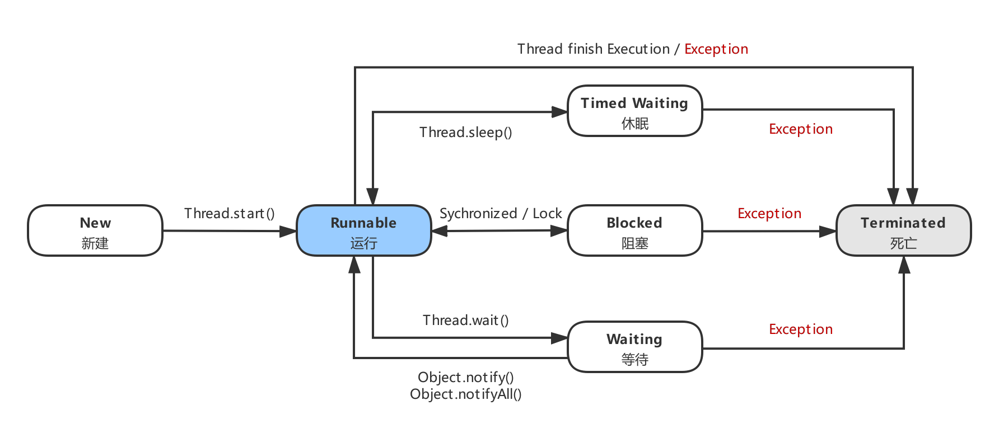 |
	| :-: |
	| 图 1-1 线程状态转换 |

### 新建 / New
- 创建后尚未启动的线程。

### 运行 / Runable
- 可能正在运行，也可能正在等待 CPU 时间片。包含了操作系统线程状态中的 Running 和 Ready。

### 阻塞 / Blocked
- 等待获取一个排它锁，如果其线程释放了锁就会结束此状态。

### 无限期等待 / Waiting 
- 处于这种状态的线程不会被分配 CPU 执行时间，需等待其它线程 `显式地` 唤醒，否则不会被分配 CPU 时间片。

  | 进入方法 | 退出方法 |
  | :--- | :--- |
  | 没有设置 Timeout 参数的 Object.wait() 方法 | Object.notify() / Object.notifyAll() |
  | 没有设置 Timeout 参数的 Thread.join() 方法 | 被调用的线程执行完毕 |
  | LockSupport.park() 方法 | LockSupport.unpark(Thread) |

### 限期等待 / Timed Waiting
- 处于这种状态的线程不会被分配 CPU 执行时间，不过无需等待其它线程显式地唤醒，在一定时间之后会被 `系统自动唤醒`。

	| 进入方法 | 退出方法 |
	| :--- | :--- |
	| Thread.sleep() 方法 | 时间结束 |
	| 设置了 Timeout 参数的 Object.wait() 方法 | 时间结束 / Object.notify() / Object.notifyAll() |
	| 设置了 Timeout 参数的 Thread.join() 方法 | 时间结束 / 被调用的线程执行完毕 |
	| LockSupport.parkNanos() 方法 | LockSupport.unpark(Thread) |
	| LockSupport.parkUntil() 方法 | LockSupport.unpark(Thread) |
	
	- 调用 Thread.sleep() 方法使线程进入限期等待状态时，常常用使一个线程 `睡眠` 进行描述。
	- 调用 Object.wait() 方法使线程进入限期等待或者无限期等待时，常常用 `挂起` 一个线程进行描述。
	- 睡眠和挂起是用来描述行为，而阻塞和等待用来描述状态。
	- 阻塞和等待的区别在于，`阻塞` 是 `被动` 的，它是在等待获取一个排它锁。而 `等待` 是 `主动` 的，通过调用 Thread.sleep() 和 Object.wait() 等方法进入。

### 死亡 / Terminated
- 可以是线程结束任务之后自己结束，或者产生了异常而结束。

## 使用线程
- Java 中有三种使用线程的方法： 实现 `Runnable` 接口；实现 `Callable` 接口；继承 `Thread` 类。

	> 实现 Runnable 和 Callable 接口的类只能当做一个可以在线程中运行的任务，不是真正意义上的线程。因此最后还需要通过 Thread 来调用，可以说任务是通过线程驱动从而执行的。

### 实现 Runnable 接口
- 需要实现 run() 方法；通过 Thread 调用 start() 方法来启动线程。

	```java
	public class MyRunnable implements Runnable {
	    public void run() {
	        // ...
	    }
	}
	
	public static void main(String[] args) {
	    MyRunnable instance = new MyRunnable();
	    Thread thread = new Thread(instance);
	    thread.start();
	}
	```

### 实现 Callable 接口
- 与 Runnable 相比，Callable 可以有返回值，返回值通过 FutureTask 进行封装。

	```java
	public class MyCallable implements Callable<Integer> {
	    public Integer call() {
	        return 123;
	    }
	}
	
	public static void main(String[] args) 
	    throws ExecutionException, InterruptedException {
	    MyCallable mc = new MyCallable();
	    FutureTask<Integer> ft = new FutureTask<>(mc);
	    Thread thread = new Thread(ft);
	    thread.start();
	    System.out.println(ft.get());
	}
	```

### 继承 Thread 类
- 同样也是需要实现 run() 方法，因为 Thread 类也实现了 Runable 接口。

	当调用 start() 方法启动一个线程时，虚拟机会将该线程放入就绪队列中等待被调度，当一个线程被调度时会执行该线程的 run() 方法。
	
	```java	
	public class MyThread extends Thread {
	    public void run() {
	        // ...
	    }
	}
	
	public static void main(String[] args) {
	    MyThread mt = new MyThread();
	    mt.start();
	}
	```

### 实现接口 / 继承 Thread
- Java 不支持多重继承，因此继承了 Thread 类就无法继承其它类，但是可以实现多个接口；
- 类可能只要求可执行就行，继承整个 Thread 类开销过大。

	> 为此实现接口会更好一些。

## 基础线程机制
### Executor
- Executor 管理 `多个异步任务` 的执行，而无需程序员显式地管理线程的生命周期。这里的异步是指多个任务的执行互不干扰，不需要进行同步操作。
- 主要有三种 Executor：
	- CachedThreadPool：一个任务创建一个线程；
	- FixedThreadPool：所有任务只能使用固定大小的线程；
	- SingleThreadExecutor：相当于大小为 1 的 FixedThreadPool。

		```java
		public static void main(String[] args) {
		    ExecutorService executorService =
    	        Executors.newCachedThreadPool();
		    for (int i = 0; i < 5; i++) {
		        executorService.execute(new MyRunnable());
		    }
		    executorService.shutdown();
		}
		```

### Daemon
- `守护线程` 是程序运行时在 `后台` 提供服务的线程，不属于程序中不可或缺的部分。

- 当所有非守护线程结束时，程序也就终止，同时会杀死所有守护线程。

	> 其中 main() 属于非守护线程。

- 在线程启动之前使用 setDaemon() 方法可以将一个线程设置为守护线程。

	```java
	public static void main(String[] args) {
	    Thread thread = new Thread(new MyRunnable());
	    thread.setDaemon(true);
	}
	```

### sleep()
- `Thread.sleep(millisec)` 方法会 `休眠` 当前正在执行的线程，`millisec` 单位为毫秒。
- sleep() 可能会抛出 InterruptedException，因为异常不能跨线程传播回 main() 中，因此必须在本地进行处理。线程中抛出的其它异常也同样需要在本地进行处理。

	```java
	public void run() {
	    try {
	        Thread.sleep(3000);
	    } catch (InterruptedException e) {
	        e.printStackTrace();
	    }
	}
	```

### yield()
- 对静态方法 `Thread.yield()` 的调用声明了当前线程已经完成了生命周期中最重要的部分，可以切换给其它线程来执行。该方法只是对线程调度器的一个 `建议`，而且也只是建议具有相同优先级的其它线程可以运行。

	```java
	public void run() {
	    Thread.yield();
	}
	```

## 线程中断机制
- 一个线程 `执行完毕` 之后会 `自动结束`，如果在运行过程中 `发生异常` 也会 `提前结束`。

### InterruptedException
- 通过调用一个线程的 `interrupt()` 来中断该线程，如果该线程处于阻塞、限期等待或者无限期等待状态，那么就会抛出 InterruptedException，从而提前结束该线程。但是不能中断 I/O 阻塞和 synchronized 锁阻塞。
- 对于以下代码，在 main() 中启动一个线程之后再中断它，由于线程中调用了 Thread.sleep() 方法，因此会抛出一个 InterruptedException，从而提前结束线程，不执行之后的语句。

    ```java
    public class InterruptExample {
        private static class MyThread extends Thread {
            @Override
            public void run() {
                try {
                    Thread.sleep(2000);
                    System.out.println("Thread run");
                } catch (InterruptedException e) {
                    e.printStackTrace();
                }
            }
        }
    }
    
    public static void main(String[] args) throws InterruptedException {
	    Thread thread = new MyThread();
	    thread.start();
	    thread.interrupt();
	    System.out.println("Main run");
	}
    ```
    
    抛出异常：
    
    ```html
	Main run
	java.lang.InterruptedException: sleep interrupted
		at java.lang.Thread.sleep(Native Method)
		at InterruptExample.lambda$main$0(InterruptExample.java:5)
		at InterruptExample$$Lambda$1/713338599.run(Unknown Source)
		at java.lang.Thread.run(Thread.java:745)
    ```

### interrupted()
- 如果一个线程的 run() 方法执行一个无限循环，并且没有执行 sleep() 等会抛出 InterruptedException 的操作，那么调用线程的 interrupt() 方法就无法使线程提前结束。
- 但是调用 interrupt() 方法会设置线程的 `中断标记`，此时调用 interrupted() 方法会返回 true。因此可以在循环体中使用 interrupted() 方法来判断线程是否处于中断状态，从而提前结束线程。

    ```java
	public class InterruptExample {
	    private static class MyThread extends Thread {
	        @Override
            public void run() {
	            while (!interrupted()) {
	                // 忽略代码细节
	            }
	            System.out.println("Thread end");
	        }
	    }
	}

    public static void main(String[] args) throws InterruptedException {
        Thread thread = new MyThread();
        thread.start();
        thread.interrupt();
    }

    // Output: Thread end
    ```

### Executor 的中断操作
- 调用 Executor 的 shutdown() 方法会等待线程都执行完毕之后再关闭，但是如果调用的是 shutdownNow() 方法，则相当于调用每个线程的 interrupt() 方法。
- 以下使用 Lambda 创建线程，相当于创建了一个匿名内部线程。

    ```java
	public static void main(String[] args) {
	    ExecutorService executorService = 
	        Executors.newCachedThreadPool();
	    executorService.execute(() -> {
	        try {
	            Thread.sleep(2000);
	            System.out.println("Thread run");
	        } catch (InterruptedException e) {
	            e.printStackTrace();
	        }
	    });
	    executorService.shutdownNow();
	    System.out.println("Main run");
	}
    ```

    抛出异常：

    ```html
	Main run
	java.lang.InterruptedException: sleep interrupted
		at java.lang.Thread.sleep(Native Method)
		at ExecutorInterruptExample.lambda$main$0(ExecutorInterruptExample.java:9)
		at ExecutorInterruptExample$$Lambda$1/1160460865.run(Unknown Source)
		at java.util.concurrent.ThreadPoolExecutor.runWorker(ThreadPoolExecutor.java:1142)
		at java.util.concurrent.ThreadPoolExecutor$Worker.run(ThreadPoolExecutor.java:617)
		at java.lang.Thread.run(Thread.java:745)
    ```
    
- 如果只想中断 Executor 中的一个线程，可以通过使用 submit() 方法来提交一个线程，它会返回一个 Future<?> 对象，通过调用该对象的 cancel(true) 方法就可以中断线程。
  

	```java
	Future<?> future = executorService.submit(() -> {
	    // 忽略代码细节
	});
	future.cancel(true);
	```

## 线程协作
- 当多个线程可以一起工作去解决某个问题时，如果某些部分必须在其它部分之前完成，那么就需要对线程进行协调。

### join()
- 在线程中调用另一个线程的 join() 方法，会将当前线程挂起，而不是忙等待，直到目标线程结束。
- 对于以下代码，虽然 b 线程先启动，但是因为在 b 线程中调用了 a 线程的 join() 方法，b 线程会等待 a 线程结束才继续执行，因此最后能够保证 a 线程的输出先于 b 线程的输出。

	```java
	public class JoinExample {
	    private class A extends Thread {
	        @Override
	        public void run() {
	            System.out.println("A");
	        }
	    }
	
	    private class B extends Thread {
	        private A a;
	
	        B(A a) {
	            this.a = a;
	        }
	
	        @Override
	        public void run() {
	            try {
	                a.join();
	            } catch (InterruptedException e) {
	                e.printStackTrace();
	            }
	            System.out.println("B");
	        }
	    }
	
	    public void test() {
	        A a = new A();
	        B b = new B(a);
	        b.start();
	        a.start();
	    }
	}
	
	public static void main(String[] args) {
	    JoinExample example = new JoinExample();
	    example.test();
	}
	
	// Output:
	// A
	// B
	```

### wait() notify() notifyAll()
- 调用 wait() 使得线程等待某个条件满足，线程在等待时会被挂起，当其他线程的运行使得这个条件满足时，其它线程会调用 notify() 或者 notifyAll() 来唤醒挂起的线程。
- 它们都属于 Object 的一部分，而不属于 Thread。
- 只能用在 `同步方法` 或者 `同步控制块` 中使用，否则会在运行时抛出 `IllegalMonitorStateException`。
- 使用 wait() 挂起期间，线程会释放锁。这是因为没有释放锁，其它线程就无法进入对象的同步方法或者同步控制块中，那么就无法执行 notify() 或者 notifyAll() 来唤醒挂起的线程，造成死锁。

	```java
	public class WaitNotifyExample {
	    public synchronized void before() {
	        System.out.println("before");
	        notifyAll();
	    }
	
	    public synchronized void after() {
	        try {
	            wait();
	        } catch (InterruptedException e) {
	            e.printStackTrace();
	        }
	        System.out.println("after");
	    }
	}
	
	public static void main(String[] args) {
	    ExecutorService executorService = 
	        Executors.newCachedThreadPool();
	    WaitNotifyExample example = new WaitNotifyExample();
	    executorService.execute(() -> example.after());
	    executorService.execute(() -> example.before());
	}
	
	// Output:
	// before
	// after
  ```

- wait() 和 sleep() 的区别：
	- wait() 是 Object 的方法，而 sleep() 是 Thread 的静态方法；
	- wait() 会释放锁，sleep() 不会。

### await() signal() signalAll()
- `java.util.concurrent` 类库中提供了 Condition 类来实现线程之间的协调，可以在 Condition 上调用 await() 方法使线程等待，其它线程调用 signal() 或 signalAll() 方法唤醒等待的线程。
- 相比于 wait() 这种等待方式，await() 可以指定等待的条件，因此更加灵活。
- 使用 Lock 来获取一个 Condition 对象。

	```java
	public class AwaitSignalExample {
	    private Lock lock = new ReentrantLock();
	    private Condition condition = lock.newCondition();

	    public void before() {
	        lock.lock();
	        try {
	            System.out.println("before");
	            condition.signalAll();
	        } finally {
	            lock.unlock();
	        }
	    }

	    public void after() {
	        lock.lock();
	        try {
	            condition.await();
	            System.out.println("after");
	        } catch (InterruptedException e) {
	            e.printStackTrace();
	        } finally {
	            lock.unlock();
	        }
	    }
	}

	public static void main(String[] args) {
	    ExecutorService executorService = 
	        Executors.newCachedThreadPool();
	    AwaitSignalExample example = new AwaitSignalExample();
	    executorService.execute(() -> example.after());
	    executorService.execute(() -> example.before());
	}

	// Output:
	// before
	// after
  ```

## 同步互斥
- Java 提供了两种锁机制来控制 `多个线程` 对共享资源的 `互斥访问`，第一个是 JVM 实现的 `synchronized`，而另一个是 JDK 实现的 `ReentrantLock`。

### 参考资料
- [Aoho. 并发编程的锁机制 synchronized 和 lock. juejin.im](https://juejin.im/post/5a43ad786fb9a0450909cb5f)
- [Matrix海子. Java并发编程 Lock. cnblogs.com](https://www.cnblogs.com/dolphin0520/p/3923167.html)
- [Cyc2018. Java并发-互斥同步. cyc2018.github.io](https://cyc2018.github.io/CS-Notes/#/notes/Java%20并发?id=五、互斥同步)

###  锁的分类
- 锁的分类有很多种，比如自旋锁、自旋锁的其他种类、阻塞锁、可重入锁、读写锁、互斥锁、悲观锁、乐观锁、公平锁、可重入锁等。

	我们这边重点看如下几种：`可重入锁`、`读写锁`、`可中断锁`、`公平锁`。
	
	|  | Synchronized | ReentrantLock | ReentrantReadWirteLock |
	| :-: | :-: | :-: | :-: |
	| 可重入锁 | ✓ | ✓ | - |
	| 读写锁 | - | - | ✓ |
	| 可中断锁 | ✕ | ✓ | - |
	| 公平锁 | ✕ | ✕ or ✓ | ✕ or ✓ |
	
	> ✓ 表示支持；✕ 表示不支持；- 表示无关

- `可重入锁`：可重入性表明了锁的分配机制，即基于线程的分配，而不是基于方法调用的分配。若锁具备可重入性则称其为可重入锁。

	`synchronized` 和 `ReentrantLock` 都是可重入锁。
	
	> 例如：一个线程执行到 method1 的 synchronized 方法时，而在 method1中会调用另外一个 synchronized 方法 method2，此时该线程不必重新去申请锁，而是可以直接执行方法 method2。

- `读写锁`：读写锁将对一个资源的访问分成了 2 个锁。比如文件，一个读锁 (共享锁) 和一个写锁 (排它锁)。正因为有了读写锁，才使得多个线程之间的读操作不会发生冲突。

	`ReadWriteLock` 接口就是读写锁，`ReentrantReadWriteLock` 实现了这个接口。可以通过 readLock() 获取读锁，通过 writeLock() 获取写锁。

- `可中断锁`：即可以中断的锁。`synchronized` 就不是 `可中断锁`，而 `Lock` 是 `可中断锁`。Lock 接口中的 `lockInterruptibly()` 方法就体现了 Lock 的可中断性。

	> 例如：某一线程 A 正在执行锁中的代码，另一线程 B 正在等待获取该锁，可能由于等待时间过长，线程 B 不想等待了，想先处理其他事情，我们可以让它中断自己或者在别的线程中中断它，这种就是可中断锁。

- `公平锁`：尽量以 `请求锁的顺序` 来获取锁。同时若有多个线程在等待一个锁，当这个锁被释放时，等待时间最久的线程或 `最先请求的线程` 会获得该锁，这种就是公平锁。

	非公平锁即无法保证锁的获取是按照请求锁的顺序进行的，这样就可能导致某个或者一些线程永远获取不到锁。
	
	- synchronized 就不是 `公平锁`，它无法保证等待的线程获取锁的顺序。
	- Lock 也不是 `公平锁`，它无法保证等待的线程获取锁的顺序。对于 `ReentrantLock` 和 `ReentrantReadWriteLock`，默认是非公平锁，可设置为公平锁。

### Lock 和 synchronized
#### synchronized
- synchronized 是 Java 的关键字，当它用来修饰一个方法或者一个代码块的时候，能够保证在同一时刻最多只有一个线程执行该段代码。简单总结如下四种用法：
	- `代码块`：对某一代码块使用，synchronized 后跟括号，括号里是变量。

		```java
		public int func(int m){
			synchronized(m) {
				//...
			}
		}
		```
	
	- `方法声明`：它和同步代码块一样，作用于同一个对象。即一次只能一个线程进入该方法，其他线程想在此时调用该方法只能排队等候。

		```java
		// 放在范围操作符之后，返回类型声明之前
		public synchronized void func() {
			// ...
		}
		```

	- `同步一个对象`：synchronized 后面括号里是对象，此时线程获得的是对象锁。由于调用的是同一个对象的同步代码块，因此这两个线程会进行同步。当一个线程进入同步语句块时，另一个线程就必须等待。

		> 同一对象需同步，不同对象不同步。
		
		```java
		public class SynchronizedExample {
			public void func1() {
				synchronized (this) {
					for (int i = 0; i < 10; i++) {
						System.out.print(i + " ");
					}
				}
			}
		}
		
		// Output: 0 1 2 3 4 5 6 7 8 9 0 1 2 3 4 5 6 7 8 9
		public static void main(String[] args) {
			SynchronizedExample e1 =  new SynchronizedExample();
			ExecutorService executorService =
				Executors.newCachedThreadPool();
			executorService.execute(() -> e1.func1());
			executorService.execute(() -> e1.func1());
		}
		
		// Output: 0 0 1 1 2 2 3 3 4 4 5 5 6 6 7 7 8 8 9 9
		public static void main(String[] args) {
			SynchronizedExample e1 = new SynchronizedExample();
			SynchronizedExample e2 = new SynchronizedExample();
			ExecutorService executorService = 
				Executors.newCachedThreadPool();
			executorService.execute(() -> e1.func1());
			executorService.execute(() -> e2.func1());
		}
		```

	- `同步一个类`：作用于整个类，也就是说两个线程调用同一个类的不同对象上的这种同步语句，也会进行同步。

		> 同一个类，不同一对象需同步。
		
		```java
		public class SynchronizedExample {
			public void func2() {
				synchronized (SynchronizedExample.class) {
					for (int i = 0; i < 10; i++) {
						System.out.print(i + " ");
					}
				}
			}
		}
		
		// Output: 0 1 2 3 4 5 6 7 8 9 0 1 2 3 4 5 6 7 8 9
		public static void main(String[] args) {
		SynchronizedExample e1 = new SynchronizedExample();
		SynchronizedExample e2 = new SynchronizedExample();
		ExecutorService executorService =
			Executors.newCachedThreadPool();
		executorService.execute(() -> e1.func2());
		executorService.execute(() -> e2.func2());
		}
		```

	-  同步一个 `静态方法`：

		```java
		public synchronized static void fun() {
			// ...
		}
		```
	
#### Lock
> Lock 是锁接口，其实现类为 ReetrantLock。  
> ReadWriteLock 是读写锁接口，其实现类为 ReetrantReadWriteLock。  

- Lock：

	```java
	public interface Lock {
		/**
		 * 获取锁，如果锁被其他线程获取，处于等待状态
		 * 必须主动去释放锁，并且在发生异常时不会自动释放锁。
		 * 因此一般来说，使用 Lock 必须在 try{...}catch{...} 块中进行，
		 * 并且将释放锁的操作放在 `finally` 块中进行，
		 * 以保证锁一定被被释放，防止死锁的发生。
		 */
		void lock();
		
		// 尝试获取锁
		// 若失败，等待的过程中可响应中断 threadWait.interrupt()
		void lockInterruptibly() throws InterruptedException;  
		
		// 尝试获取锁，若获取成功，就马上返回 true
		// 否则马上返回 false (锁已经被其他线程获取)
		boolean tryLock();  
		
		// 尝试获取锁，若获取失败，会等待 unit 时间
		// 等待期间还拿不到锁就马上返回 false
		boolean tryLock(long time, TimeUnit unit) 
			throws InterruptedException;  
			
		// 释放锁，一定要在 finally 块中释放
		void unlock();  
		Condition newCondition();
	}
	```

- ReetrantLock：可重入锁，Lock 接口的实现类，且内部定义了公平锁与非公平锁 (默认为非公平锁)：

	```java
	// 默认情况
	public ReentrantLock() {  
		sync = new NonfairSync();  
	}
	
	// 可以手动设置为公平锁：
	public ReentrantLock(boolean fair) {  
		sync = fair ? new FairSync() : new NonfairSync();  
	}  
	```

- ReadWriteLock：一个用来获取读锁 (共享锁)，一个用来获取写锁 (排它锁)。也就是说将文件的读写操作分开，分成 2 个锁来分配给线程，从而使得多个线程可以同时进行读操作。

	```java
	public interface ReadWriteLock {  
		Lock readLock();	// 获取读锁  
		Lock writeLock();	// 获取写锁  
	}
	```

- ReentrantReadWirteLock 实现了 ReadWirteLock 接口，并未实现 Lock 接口。

	```java
	private ReadWriteLock rwl = new ReentrantReadWriteLock();
	
	public static void main(String[] args) {
		final Main main = new Main();
	
		new Thread(
			() -> main.testRWL(Thread.currentThread()) ).start();
		new Thread(
			() -> main.testRWL(Thread.currentThread()) ).start();
	
	    // 输出的结果是两个 thread 交替输出“正在读”
	}
	
	public void testRWL(Thread thread) {
		rwl.readLock().lock();
		try {
			long finish = System.currentTimeMillis() + 1;
			while (System.currentTimeMillis() <= finish) {
				System.out.println(thread.getName() + "正在读");
			}
			System.out.println(thread.getName() + "读结束");
		} finally {
			rwl.readLock().unlock();
		}
	}
	```
	
	- 若一个线程已经占用了读锁，其他线程可以马上获得读锁，但需要等待才能获取写锁，则申请写锁的线程会一直等待释放读锁。
	
	- 若一个线程已经占用了写锁，其他线程要获取读锁或写锁都需要等待，则申请的线程会一直等待释放写锁。

###  锁的比较
- `锁的实现`：synchronized 是 Java 关键字，Lock 是接口。synchronized 是 JVM 实现的，而 Lock / ReentrantLock 是 JDK 实现的。
- `性能比较`：新版本 Java 对 synchronized 进行了很多优化，例如自旋锁等。synchronized 与 ReentrantLock 大致相同。
- `异常处理方式`：
	- synchronized：会自动释放线程占有的锁，因此不会导致死锁现象发生；
	- Lock：若没有主动通过 unLock() 去释放锁，则很可能造成死锁现象，因此使用 Lock 时需要在 finally 块中释放锁。
- `等待可中断`：当持有锁的线程长期不释放锁的时候，正在等待的线程可以选择放弃等待，改为处理其他事情。

	> Lock / ReentrantLock 可中断，而 synchronized 不行。

### 使用选择
- 除非需要使用 Lock / ReentrantLock 的 `高级功能`，否则优先使用 `synchronized`。

	> Lock 是基于在语言层面实现的锁，Lock 锁可以被中断，支持定时锁等。

- 因为 synchronized 是 `JVM` 实现的一种锁机制，JVM 原生地支持它，而 ReentrantLock 不是所有的 JDK 版本都支持。
- 并且使用 synchronized 不用担心没有释放锁而导致 `死锁问题`，因为 JVM 会确保锁的释放。

## 线程不安全示例
- 若多个线程对同一个共享数据进行访问而不采取同步操作的话，那么操作的结果是不一致的。

	以下代码演示了 1000 个线程同时对 cnt 执行自增操作，操作结束之后它的值有可能小于 1000。
	
	```java
	public class ThreadUnsafeExample {
	    private int cnt = 0;
	    
	    public void add() {
	        cnt++;
	    }
	
	    public int get() {
	        return cnt;
	    }
	}
	
	public static void main(String[] args) throws InterruptedException {
	    final int threadSize = 1000;
	    
	    ThreadUnsafeExample example = 
	    	new ThreadUnsafeExample();
	    	
	    final CountDownLatch countDownLatch = 
	    	new CountDownLatch(threadSize);
	    	
	    ExecutorService executorService = 
	    	Executors.newCachedThreadPool();
	    	
	    for (int i = 0; i < threadSize; i++) {
	        executorService.execute(() -> {
	            example.add();
	            countDownLatch.countDown();
	        });
	    }
	    countDownLatch.await();
	    executorService.shutdown();
	    System.out.println(example.get());
	}
	
	// Output: 997
	```

## Java 内存模型
- Java 内存模型试图屏蔽各种 `硬件` 和 `操作系统` 的内存访问差异，以实现让 Java 程序在各种平台下都能达到一致的内存访问效果。

### 主内存与工作内存
- 处理器上的寄存器的读写的速度比内存快几个数量级，为了解决这种 `速度矛盾`，在它们之间加入了 `高速缓存`。

	加入高速缓存带来了一个新的问题：`缓存一致性`。如果多个缓存共享同一块主内存区域，那么多个缓存的数据可能会不一致，需要一些 `协议` 来解决这个问题。
	
	| 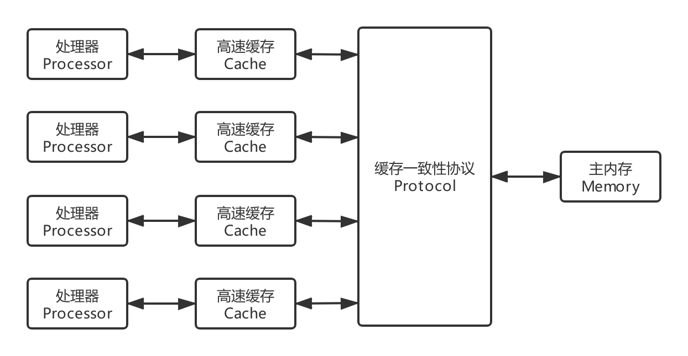 |
	| :-: |
	| 图 8-1 处理器、高速缓存、主内存间的交互关系 |

- 所有的变量都存储在主内存中，每个线程还有自己的工作内存，工作内存存储在高速缓存或者寄存器中，保存了该线程使用的变量的主内存副本拷贝。

	线程只能直接操作工作内存中的变量，不同线程之间的变量值传递需要通过主内存来完成。
	
	| 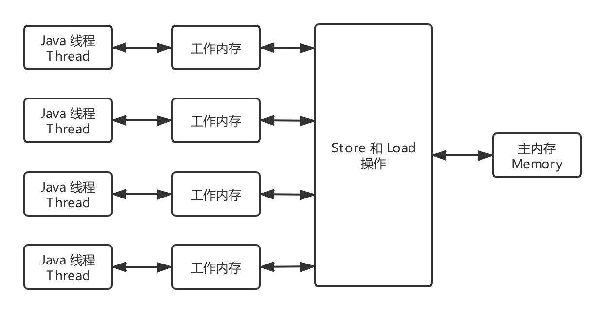 |
	| :-: |
	| 图 8-2 线程、工作内存、主内存间的交互关系 (对比图 3-7) |

- 主内存、工作内存与 JVM 内存模型中的 Java 堆、栈、方法区等并不是同一层次的内存划分。若两者的关系一定要对应起来：
	- 从变量、主内存、工作内存的定义来看，主内存主要对应于 Java 堆中的对象实例数据部分，工作内存则对应于虚拟机栈中的部分区域。
	- 从更低层次上说，主内存直接对应于物理硬件的内存，工作内存优先存储于寄存器和高速缓存中。

### 两内存间交互操作
| 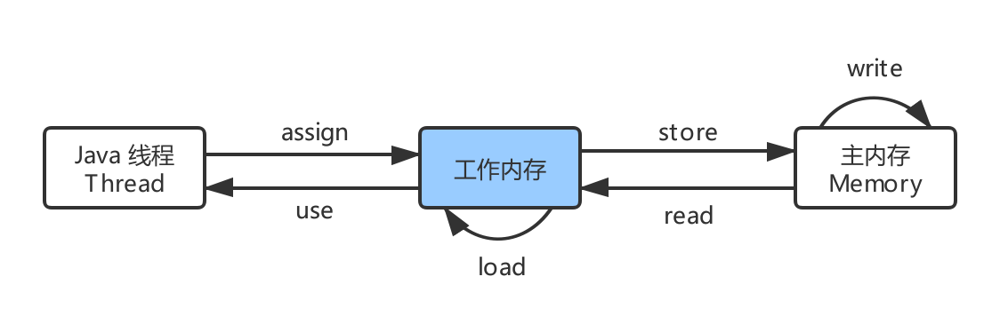 |
| :-: |
| 图 8-3 主内存和工作内存的交互操作 |

- Java 内存模型定义了 8 个操作来完成主内存和工作内存的交互操作，如图 8-3 所示：
	- lock：作用于主内存的变量，把一个变量标识别为一条线程独占的状态。
	- unlock：作用于主内存的变量，释放出于锁定状态的变量。
	- read：作用于主内存的变量，把一个变量的值从主内存传输到工作内存中。
	- load：作用于工作内存的变量，在 read 之后执行，把 read 得到的值放入工作内存的变量副本中。
	- use：作用于工作内存的变量，把工作内存中一个变量的值传递给执行引擎。
	- assign：作用于工作内存的变量，把一个从执行引擎接收到的值赋给工作内存的变量。
	- store：作用于工作内存的变量，把工作内存的一个变量的值传送到主内存中。
	- write：作用于主内存的变量，在 store 之后执行，把 store 得到的值放入主内存的变量中。

### 内存模型三大特征
#### 原子性
- Java 内存模型保证了 read、load、assign、use、store、write、lock 和 unlock 操作具有原子性，例如对一个 int 类型的变量执行 assign 赋值操作，这个操作就是原子性的。

	> long 和 double 的非原子性协定：Java 内存模型允许虚拟机将没有被 `volatile` 修饰的 64 位数据 (long，double) 的读写操作划分为两次 32 位的操作来进行，即 load、store、read 和 write 操作可以不具备原子性。

- 有一个错误认识就是，int 等原子性的类型在多线程环境中不会出现线程安全问题。前面的 [线程不安全示例](线程不安全示例) 代码中，cnt 属于 int 类型变量，1000 个线程对它进行自增操作之后，得到的值为 997 而不是 1000。

	下图演示了两个线程同时对 cnt 进行操作，load、assign、store 这一系列操作整体上看不具备原子性，那么在 T1 修改 cnt 并且还没有将修改后的值写入主内存，T2 依然可以读入旧值。可以看出，这两个线程虽然执行了两次自增运算，但是主内存中 cnt 的值最后为 1 而不是 2。因此对 int 类型读写操作满足原子性只是说明 load、assign、store 这些单个操作具备原子性。
	
	> 为了方便讨论，将内存间的交互操作简化为 3 个：load、assign、store。
	
	| 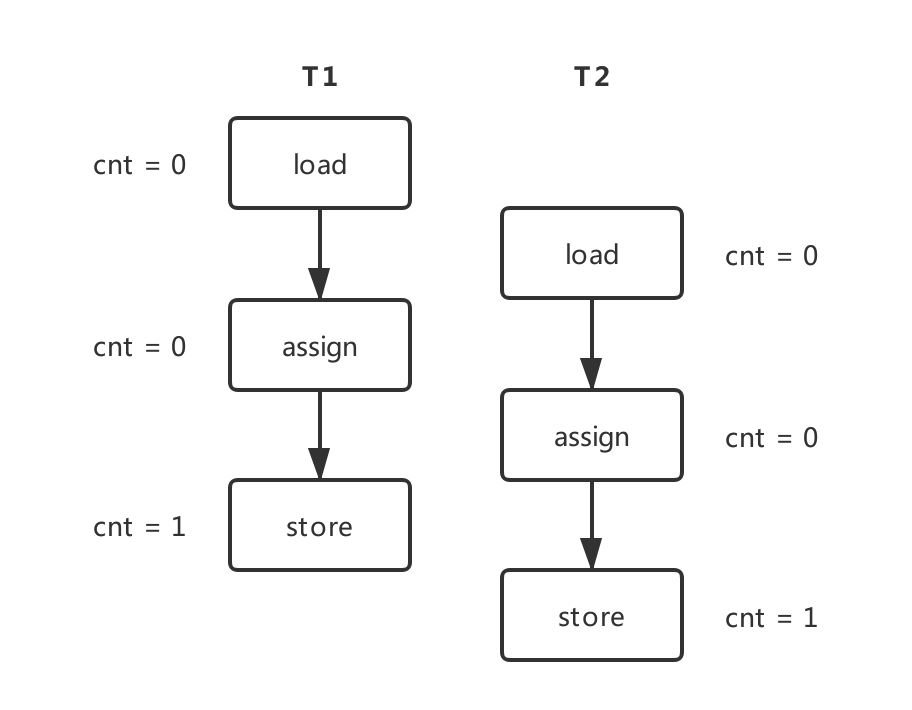 | 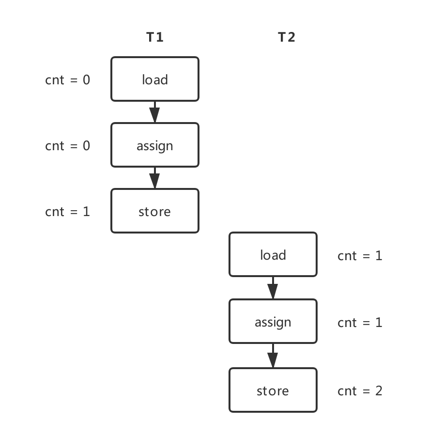 |
	| :-: | :-: |
	| 图 8-4 两个线程同时对 cnt 进行操作示意 | 图 8-5 AtomicInteger 对 cnt 进行操作示意 |

- `AtomicInteger` 能保证多个线程修改的原子性，如图 8-5 所示。

- 使用 AtomicInteger 重写之前线程不安全的代码之后得到以下线程安全实现：

	```java
	public class AtomicExample {
	    private AtomicInteger cnt = new AtomicInteger();
	
	    public void add() {
		    cnt.incrementAndGet();
	    }
	
	    public int get() {
		    return cnt.get();
	    }
	}
	
	public static void main(String[] args) throws InterruptedException {
	    final int threadSize = 1000;
	    AtomicExample example = new AtomicExample(); // 只修改这条语句
	    final CountDownLatch countDownLatch = new CountDownLatch(threadSize);
	    ExecutorService executorService = Executors.newCachedThreadPool();
	    for (int i = 0; i < threadSize; i++) {
	        executorService.execute(() -> {
	            example.add();
	            countDownLatch.countDown();
	        });
	    }
	    countDownLatch.await();
	    executorService.shutdown();
	    System.out.println(example.get());
	}
	
	// Output: 1000
	```

- 除了使用原子类之外，也可以使用 `synchronized` 互斥锁来保证操作的原子性。它对应的内存间交互操作为 lock 和 unlock，在虚拟机实现上对应的字节码指令为 monitorenter 和 monitorexit。

	```java
	public class AtomicSyncExample {
	    private int cnt = 0;
	
	    public synchronized void add() {
	        cnt++;
	    }
	
	    public synchronized int get() {
	        return cnt;
	    }
	}
	
	public static void main(String[] args) throws InterruptedException {
	    final int threadSize = 1000;
	    AtomicSyncExample example = new AtomicSyncExample();
	    final CountDownLatch countDownLatch = new CountDownLatch(threadSize);
	    ExecutorService executorService = Executors.newCachedThreadPool();
	    for (int i = 0; i < threadSize; i++) {
	        executorService.execute(() -> {
	            example.add();
	            countDownLatch.countDown();
	        });
	    }
	    countDownLatch.await();
	    executorService.shutdown();
	    System.out.println(example.get());
	}
	
	// Output: 1000
	```

#### 可见性
- 可见性：指当一个线程修改了共享变量的值，其它线程能够立即得知这个修改。Java 内存模型是通过在变量修改后将新值同步回主内存，在变量读取前从主内存刷新变量值来实现可见性的。
- 主要有三种实现可见性的方式：
	- `volatile`：volatile 的特殊规则保证了新值能立即同步到主内存，以及每次使用前立即从主内存刷新。
	- `synchronized`：对一个变量执行 unlock 操作之前，必须把变量值同步回主内存。
	- `final`：被 final 关键字修饰的字段在构造器中一旦初始化完成，并且没有发生 `this引用逃逸`，那么其它线程就能看见 final 字段的值。

		> `this引用逃逸`：其它线程通过 this 引用访问到初始化了一半的对象。

- 对前面的线程不安全示例中的 cnt 变量使用 volatile 修饰，不能解决线程不安全问题，因为 volatile 并不能保证操作的原子性。

#### 有序性
- 有序性：指在本线程内观察，所有操作都是有序的。在一个线程观察另一个线程，所有操作都是无序的，无序是因为发生了指令重排序。在 Java 内存模型中，允许编译器和处理器对指令进行重排序，重排序过程不会影响到单线程程序的执行，却会影响到多线程并发执行的正确性。

- `volatile` 关键字通过添加内存屏障的方式来禁止指令重排，即重排序时不能把后面的指令放到内存屏障之前。

- 也可以通过 `synchronized` 来保证有序性，它保证每个时刻只有一个线程执行同步代码，相当于是让线程顺序执行同步代码。

### 先行发生原则
- 上面提到了可以用 volatile 和 synchronized 来保证有序性。除此之外，JVM 还规定了先行发生原则，让一个操作无需控制就能先于另一个操作完成。
- 若两个操作之间的关系不在下列规则，并且无法从下列规则推导出来的话，则它们没有顺序性保障，JVM 可以对它们随意地进行重排序。

#### 程序次序原则
- 程序次序原则 (Program Order Rule)：在一个线程内，在程序前面的操作先行发生于后面的操作。更准确说,应该是代码中控制流的顺序，因为要考虑分支、循环结构。如图 8-6 所示。

	| 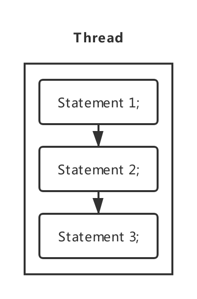 |
	| :-: |
	| 图 8-6 程序次序原则 |

#### 管程锁定规则
- 管程锁定规则 (Monitor Lock Rulu)：一个 unlock 操作先行发生于后面对同一个锁的 lock 操作。如图 8-7 所示。

	> 必须是同一个锁；“后面” 指时间上的先后顺序。
	
	| 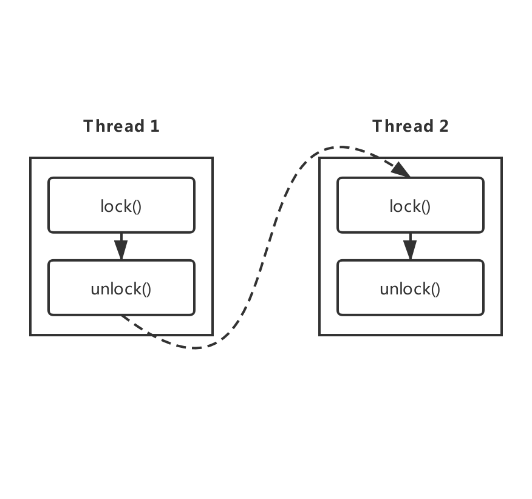 |
	| :-: |
	| 图 8-7 管程锁定规则 |

#### Volatile 变量规则
- volatile 变量规则 (Volatile Variable Rule)：对一个 volatile 变量的写操作先行发生于后面对这个变量的读操作。如图 8-8 所示。

	> “后面” 指时间上的先后顺序。
	
	| 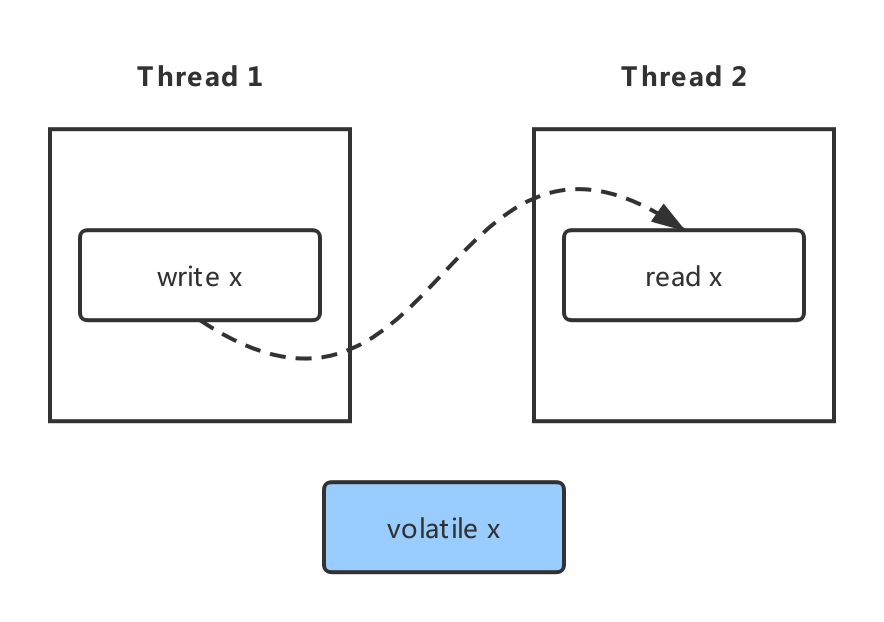 |
	| :-: |
	| 图 8-8 Volatile 变量规则 |

#### 线程启动规则
- 线程启动规则 (Thread Start Rule)：Thread 对象的 start() 方法调用先行发生于此线程的每一个动作。

	| 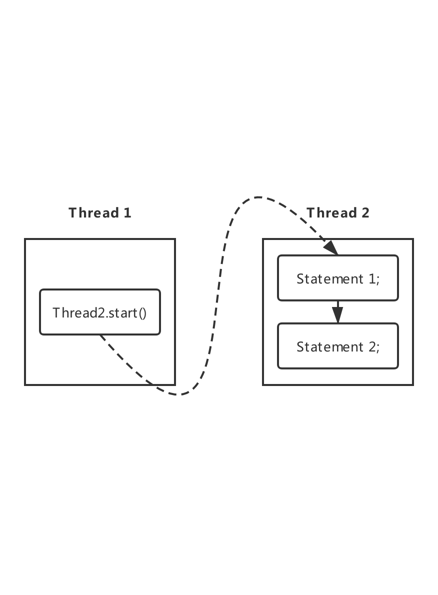 |
	| :-: |
	| 图 8-9 线程启动规则 |

#### 线程终止规则
- 线程终止规则 (Thread Termination Rule)：线程中的所有操作都先行发生于对此线程的终止检测。可通过 Thread.join() 方法结束、Thread.isAlive() 的返回值等手段检测到线程已经终止执行。

	| 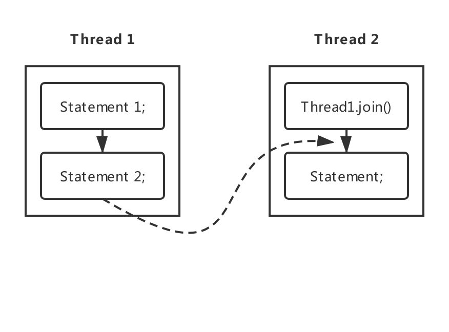 |
	| :-: |
	| 图 8-10 线程终止规则 |

#### 线程中断规则
- 线程中断规则 (Thread Interruption Rule)：对线程 interrupt() 方法的调用先行发生于被中断线程的代码检测到中断事件的发生，可以通过 Thread.interrupted() 方法检测到是否有中断发生。

#### 对象终结规则
- 对象终结规则 (Finalizer Rule)：一个对象的初始化完成 (构造函数执行结束) 先行发生于它的 finalize() 方法的开始。

#### 传递性
- 传递性 (Transitivity)：如果操作 A 先行发生于操作 B，操作 B 先行发生于操作 C，那么操作 A 先行发生于操作 C。

## 线程安全
- 线程安全：当多个线程访问一个对象时，如果不考虑这些线程在运行时环境下的调度和交替执行，也不需要进行额外的同步，或者在调用方法进行任何其他的协调操作，调用这个对象的行为都可以获得正确的结果，那么这个对象是线程安全的  $^{[1, 2]}$。

	> 该定义较严谨，它要求线程安全的代码都必须具备一个特征：代码本身封装了所有必要的正确性保障手段 (同步互斥等)，令调用者无须关系多线程的问题，无须自己采取措施来保证多线程的正确调用。

### 参考资料
- [1] [周志明. 深入理解 Java 虚拟机 [M]. 第二版. 机械工业出版社, 2013](https://book.douban.com/subject/24722612/)
- [2] [ Brian Goetz. Java Concurrency in Practice [M]. Addison-Wesley Professional, 2016](https://book.douban.com/subject/1888733/)

### Java 语言的线程安全
- 不可变：
	- 不可变 (Immutable) 的对象一定是线程安全的，不需要再采取任何的线程安全保障措施。只要一个不可变的对象被正确地构建出来，永远也不会看到它在多个线程之中处于不一致的状态。
	- 多线程环境下，应当尽量使对象成为不可变，来满足线程安全。

- 不可变的类型：
	- final 关键字修饰的基本数据类型；
	- String 类型；
	- 枚举类型；
	- Number 部分子类，如 Long 和 Double 等数值包装类型，BigInteger 和 BigDecimal 等大数据类型。但同为 Number 的原子类 AtomicInteger 和 AtomicLong 则是可变的。

- 对于集合类型：可以使用 `Collections.unmodifiableXXX()` 方法来获取一个不可变的集合。

	```java
	public class ImmutableExample {
	    public static void main(String[] args) {
	        Map<String, Integer> map = new HashMap<>();
	        Map<String, Integer> unmodifiableMap = 
	            Collections.unmodifiableMap(map);
	        unmodifiableMap.put("a", 1);
	    }
	}
	```
	
	- 执行 unmodifiableMap.put() 则会抛出以下异常：
	
		```java
		Exception in thread "main" java.lang.UnsupportedOperationException
		    at java.util.Collections$UnmodifiableMap.put(Collections.java:1457)
		    at ImmutableExample.main(ImmutableExample.java:9)
		```
	
	- Collections.unmodifiableXXX() 先对原始的集合进行拷贝，需要对集合进行修改的方法都直接抛出异常。
	
		```java
		public V put(K key, V value) {
		    throw new UnsupportedOperationException();
		}
		```

### 线程安全的实现方法
#### 互斥同步
- 互斥同步 (Synchronization) 是常见的一种并发正确性保障手段。
	- 同步是指多个线程并发访问共享数据时，保证共享数据在同一时刻只被一个线程使用 (使用信号量时可以是一些线程)。
	- 互斥是实现同步的一种手段，临界区、互斥量和信号量都是主要的互斥实现方式。

		> 互斥是因，同步是果；互斥是方法，同步是目的。
	
- synchronized 关键字和 ReentrantLock 接口。详细见上述章节 [同步互斥](#同步互斥)。

#### 非阻塞同步
- 互斥同步最主要的问题就是 `线程阻塞和唤醒` 所带来的 `性能问题`，因此这种同步也称为阻塞同步 (Blocking Synchronization)。
- `互斥同步` 属于一种 `悲观并发策略`，总是认为只要不去做正确的同步措施，那就肯定会出现问题。无论共享数据是否真的会出现竞争，它都要进行加锁 (这里讨论的是概念模型，实际上虚拟机会优化掉很大一部分不必要的加锁)、用户态核心态转换、维护锁计数器和检查是否有被阻塞的线程需要唤醒等操作。
- 随着硬件指令集的发展，我们可以使用基于 `冲突检测` 的 `乐观并发策略`：先进行操作，如果没有其它线程争用共享数据，那操作就成功了，否则采取补偿措施，即 `不断地重试`，直到成功为止。这种乐观的并发策略的许多实现都不需要将线程阻塞，因此这种同步操作称为 `非阻塞同步`。

##### CAS
- 乐观锁需要操作和冲突检测这两个步骤具备原子性，这里就不能再使用互斥同步来保证了，只能靠硬件来完成。硬件支持的原子性操作最典型的是：`比较并交换` (Compare-and-Swap，CAS)。
- CAS 指令需要有 3 个操作数，分别是内存地址 V、旧的预期值 A 和新值 B。当执行操作时，只有当 V 的值等于 A，才将 V 的值更新为 B。

##### AtomicInteger
- J.U.C 包 (java.util.concurrent) 里面的整数原子类 AtomicInteger 的方法调用了 Unsafe 类的 CAS 操作。

	- 以下代码使用了 AtomicInteger 执行了自增的操作。
	
		```java
		private AtomicInteger cnt = new AtomicInteger();
	
		public void add() {
		    cnt.incrementAndGet();
		}
	```
	
	- 以下代码是 incrementAndGet() 的源码，它调用了 Unsafe 的 getAndAddInt() 。

		```java
		public final int incrementAndGet() {
		    return unsafe.getAndAddInt(this, valueOffset, 1) + 1;
		}
		```
	
	- 以下代码是 getAndAddInt() 源码，var1 指示对象内存地址，var2 指示该字段相对对象内存地址的偏移，var4 指示操作需要加的数值，这里为 1。

		通过 getIntVolatile(var1, var2) 得到旧的预期值，通过调用 compareAndSwapInt() 来进行 CAS 比较，如果该字段内存地址中的值等于 var5，那么就更新内存地址为 var1+var2 的变量为 var5+var4。
		
		可以看到 getAndAddInt() 在一个循环中进行，发生冲突的做法是不断的进行重试。
		
		```java
		public final int getAndAddInt(Object var1, long var2, int var4) {
		    int var5;
		    do {
		        var5 = this.getIntVolatile(var1, var2);
		    } while(!this.compareAndSwapInt(var1, var2, var5, var5 + var4));
		
		    return var5;
		}
		```

##### ABA
- 如果一个变量初次读取的时候是 A 值，它的值被改成了 B，后来又被改回为 A，那 CAS 操作就会误认为它从来没有被改变过。
- J.U.C 包提供了一个带有标记的原子引用类 AtomicStampedReference 来解决这个问题，它可以通过控制变量值的版本来保证 CAS 的正确性。大部分情况下 ABA 问题不会影响程序并发的正确性，如果需要解决 ABA 问题，改用传统的 `互斥同步` 可能会比原子类更高效。

#### 无同步方案
- 要保证线程安全，同步并不是必要步骤。毕竟同步只是保证共享数据争用时的正确性手段，若一个方法本身就不设计不涉及共享数据，那么它无须任何同步措施去确保正确性。

##### 栈封闭
- 多个线程访问同一个方法的局部变量时，不会出现线程安全问题，因为 `局部变量` 存储在 `虚拟机栈` 中，属于线程私有的。

	```java
	public class StackClosedExample {
	    public void add() {
	        int cnt = 0;
	        for (int i = 0; i < 100; i++) {
	            cnt++;
	        }
	        System.out.println(cnt);
	    }
	}
	
	public static void main(String[] args) {
	    StackClosedExample example = new StackClosedExample();
	    ExecutorService executorService = Executors.newCachedThreadPool();
	    executorService.execute(() -> example.add());
	    executorService.execute(() -> example.add());
	    executorService.shutdown();
	}
	```

#####  线程本地存储
- 线程本地存储 (Thread Local Storage)：如果一段代码中所需要的数据必须与其他代码共享，判断这些共享数据的代码是否能保证在同一个线程中执行。若能保证就可以把共享数据的可见范围限制在同一个线程之内，这样无须同步也能保证线程之间不出现数据争用的问题。

- 符合这种特点的应用并不少见，大部分使用 `消费队列架构模式` (如 `生产者-消费者` 模式) 都会将产品的消费过程尽量在一个线程中消费完。

	> 一个经典应用实例就是 Web 交互模型中的 “一个请求对应一个服务器线程” (Thread-per-Request)，这种处理方式的广泛应用使得很多 Web 服务端应用都可以使用线程本地存储来解决线程安全问题。

- 可以使用 `java.lang.ThreadLocal` 类来实现线程本地存储功能。
	- 对于以下代码，thread1 中设置 threadLocal 为 1，而 thread2 设置 threadLocal 为 2。过了一段时间之后，thread1 读取 threadLocal 依然是 1，不受 thread2 的影响。

		```java
		public class ThreadLocalExample {
		    public static void main(String[] args) {
		        ThreadLocal threadLocal = new ThreadLocal();
		        Thread thread1 = new Thread(() -> {
		            threadLocal.set(1);
		            try {
		                Thread.sleep(1000);
		            } catch (InterruptedException e) {
		                e.printStackTrace();
		            }
		            System.out.println(threadLocal.get());
		            threadLocal.remove();
		        });
		        Thread thread2 = new Thread(() -> {
		            threadLocal.set(2);
		            threadLocal.remove();
		        });
		        thread1.start();
		        thread2.start();
		    }
		}
	```
	
	- 为了理解 ThreadLocal，先看以下代码：

		```java
		public class ThreadLocalExample1 {
		    public static void main(String[] args) {
		        ThreadLocal threadLocal1 = new ThreadLocal();
		        ThreadLocal threadLocal2 = new ThreadLocal();
		        Thread thread1 = new Thread(() -> {
		            threadLocal1.set(1);
		            threadLocal2.set(1);
		        });
		        Thread thread2 = new Thread(() -> {
		            threadLocal1.set(2);
		            threadLocal2.set(2);
		        });
		        thread1.start();
		        thread2.start();
		    }
		}
		```
		
		它所对应的底层结构图为：
		
		| 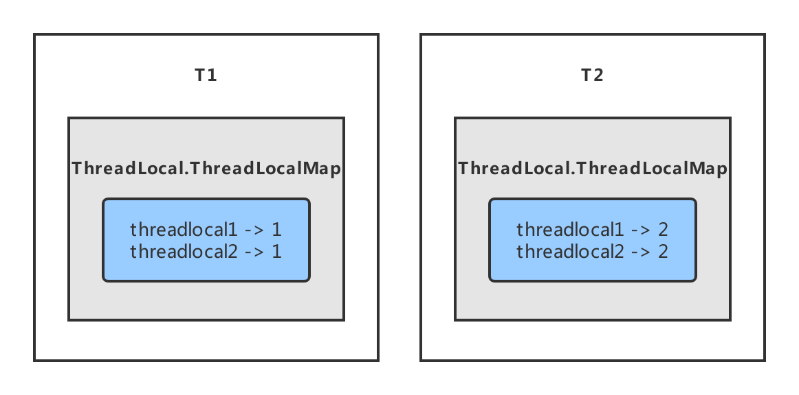 |
		| :-: |
		| 图 9-1 ThreadLocal底层结构图 |
	
	- 每个 Thread 都有一个 ThreadLocal.ThreadLocalMap 对象。

		```java
		/**
		 * ThreadLocal values pertaining to this thread. 
		 * This map is maintained by the ThreadLocal class.
		 */
		ThreadLocal.ThreadLocalMap threadLocals = null;
		```
	
	- 当调用一个 ThreadLocal 的 set(T value) 方法时，先得到当前线程的 ThreadLocalMap 对象，然后将 ThreadLocal->value 键值对插入到该 Map 中。

		> get() 方法类似。
		
		```java
		public void set(T value) {
		    Thread t = Thread.currentThread();
		    ThreadLocalMap map = getMap(t);
		    if (map != null)
		        map.set(this, value);
		    else
		        createMap(t, value);
		}
		```

- ThreadLocal 从理论上讲并不是用来解决多线程并发问题的，因为根本不存在多线程竞争。

	在一些场景下，尤其是使用线程池，由于 ThreadLocal.ThreadLocalMap 的底层数据结构导致 ThreadLocal 有内存泄漏的情况，应该尽可能在每次使用 ThreadLocal 后手动调用 remove()，以避免出现 ThreadLocal 经典的内存泄漏甚至是造成自身业务混乱的风险。

#####  可重入代码
-  可重入代码 (Reentrant Code)：也称纯代码 (Pure Code)，可以在代码执行的任何时刻中断它，转而去执行另外一段代码 (包括递归调用它本身)，而在控制权返回后，原来的程序不会出现任何错误。
- 可重入代码有一些共同的特征，例如不依赖存储在堆上的数据和公用的系统资源、用到的状态量都由参数中传入、不调用非可重入的方法等。
- 通过简单原则来判断代码是否具备可重入性：如果一个方法，它的返回结果是可以预测的，只要输入相同的数据就能返回相同的结果，那么它满足可重入性的要求，当然也是线程安全的。

## 锁优化
- 这里的锁优化主要是指 JVM 对 `synchronized` 的优化。

### 自旋锁
- 互斥同步进入阻塞状态的开销都很大，应该尽量避免。在许多应用中，共享数据的锁定状态只会持续很短的一段时间。自旋锁的思想是让一个线程在请求一个共享数据的锁时执行 `忙循环 (自旋)` 一段时间，如果在这段时间内能获得锁，就可以避免进入阻塞状态。
- 自旋锁虽然能避免进入阻塞状态从而减少开销，但是它需要进行忙循环操作占用 CPU 时间，它只适用于共享数据的锁定状态很短的场景。
- 在 JDK 1.6 中引入了自适应的自旋锁。自适应意味着自旋的次数不再固定了，而是由前一次在同一个锁上的自旋次数及锁的拥有者的状态来决定。

### 锁消除
- 锁消除是指对于被检测出不可能存在竞争的共享数据的锁进行消除。
- 锁消除主要是通过 `逃逸分析` 来支持，如果堆上的共享数据不可能逃逸出去被其它线程访问到，那么就可以把它们当成私有数据对待，也就可以将它们的锁进行消除。
- 对于一些看起来没有加锁的代码，其实 `隐式` 的加了很多锁。例如下面的字符串拼接代码就隐式加了锁：

	```java
	public static String concatString(String s1, String s2, String s3) {
	    return s1 + s2 + s3;
	}
	```

- String 是一个不可变的类，编译器会对 String 的拼接自动优化。在 JDK 1.5 之前，会转化为 StringBuffer 对象的连续 append() 操作：

	每个 append() 方法中都有一个同步块。虚拟机观察变量 sb，很快就会发现它的动态作用域被限制在 concatString() 方法内部。也就是说，sb 的所有引用永远不会逃逸到 concatString() 方法之外，其他线程无法访问到它，因此可以进行消除。
	
	```java
	public static String concatString(String s1, String s2, String s3) {
	    StringBuffer sb = new StringBuffer();
	    sb.append(s1);
	    sb.append(s2);
	    sb.append(s3);
	    return sb.toString();
	}
	```

### 锁粗化
- 如果一系列的连续操作都对同一个对象反复加锁和解锁，频繁的加锁操作就会导致性能损耗。

- 上一节的示例代码中连续的 append() 方法就属于这类情况。如果虚拟机探测到由这样的一串零碎的操作都对同一个对象加锁，将会把加锁的范围扩展 (粗化) 到整个操作序列的外部。

	对于上一节的示例代码就是扩展到第一个 append() 操作之前直至最后一个 append() 操作之后，这样只需要加锁一次就可以了。

### 轻量级锁
- JDK 1.6 引入了偏向锁和轻量级锁，从而让锁拥有了四个状态：无锁状态 (unlocked)、偏向锁状态 (biasble)、轻量级锁状态 (lightweight locked) 和重量级锁状态 (inflated)。

	> 轻量级锁是较于传统的 “重量级” 锁的说法，它并不是用来代替重量级锁的，而是在没有多线程的前提下，减少传统的重量级锁定使用操作系统互斥量产生的 `性能消耗`。

### 偏向锁
- 偏向锁的思想是偏向于让第一个获取锁对象的线程，这个线程在之后获取该锁就不再需要进行同步操作，甚至连 CAS 操作也不再需要。
- 当有另外一个线程去尝试获取这个锁对象时，偏向状态就宣告结束，此时撤销偏向 (Revoke Bias) 后恢复到未锁定状态或者轻量级锁状态。

## 多线程开发良好实践
> 摘录自原文：[CyC2018. Java 并发-多线程开发良好的实践. cyc2018.github.io](https://cyc2018.github.io/CS-Notes/#/notes/Java%20并发?id=十三、多线程开发良好的实践)

- 定义线程，起个有意义的名字，便于识别，且方便找 BUG。

- 缩小同步范围，从而减少锁争用。例如对于 synchronized，应该尽量使用同步块而不是同步方法。

- 多用同步工具，少用 wait() 和 notify()。
	- 例如，CountDownLatch, CyclicBarrier, Semaphore 和 Exchanger 这些同步类简化了编码操作，而用 wait() 和 notify() 很难实现复杂控制流；
	- 其次，这些同步类是由最好的企业编写和维护，在后续的 JDK 中还会不断优化和完善。

- 使用 BlockingQueue 实现 `生产者-消费者` 架构模式。
- 多用并发集合，少用同步集合。 例如应该使用 ConcurrentHashMap 而不是 HashMap。
- 使用本地变量和不可变类来保证线程安全。
- 使用线程池，而不是直接创建线程，这是因为创建线程代价很高，线程池可以有效地利用有限的线程来启动任务。