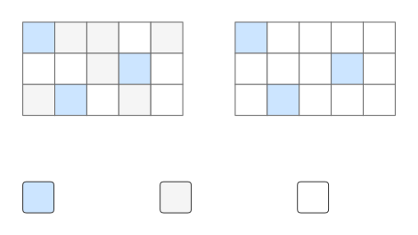

# 技术面试必备基础知识-Java-虚拟机

## JVM 运行时数据区域
- Java 虚拟机（Java Virtual Machine，JVM）在执行 Java 程序过程中会把它所管理的内存划分为若干不同的数据区域。
- 这些区域各有用途以及各自创建和销毁的时间。比如，有的区域随着虚拟机进程的启动而存在，有些区域以用户线程的启动而创建、结束而销毁。

	|  |
	| :---: |
	| JVM 运行时数据区域 |

### 程序计数器
- 程序计数器，可看作是当前线程所执行字节码的行号指示器。若执行的是 Java 方法，则记录正在执行的虚拟机字节码指令的地址；若执行的是本地方法则为空。
- Java 的多线程是通过线程轮流切换并分配处理器执行时间的方式实现的，任何时刻一个处理器 （多核心处理器是内核）只会执行一条线程中的指令，当某个线程的时间片消耗完毕会自动切换至下一个线程继续执行。
- 为此，确保线程切换后能恢复正确的执行位置，每条线程都需要拥有一个独立的程序计数器，以保存当前线程的执行位置，我们称这类内存区域为 `线程私有的内存`。

### 虚拟机栈
- Java 虚拟机栈：`线程的私有内存`。每个 Java 方法在执行的同时会创建一个栈帧用于存储局部变量表、操作数栈、常量池引用等信息。从方法调用直至执行完成的过程，对应着一个栈帧在 Java 虚拟机栈中入栈和出栈的过程。

	|  |
	| :---: |
	| Java 方法执行的内存模型 |

- 栈帧结构
	- 操作数栈：字节码执行时使用的栈结构。
	- 局部变量表：用于定义方法中的局部变量，实际上局部变量表在 class 文件中就已定义好了。
	
	- 常量池引用：当前方法调用其他方法时，能够从运行时常量池中找到对应的符号引用，然后将符号引用转换为直接引用，以调用对应方法。这也叫做动态链接。
	- 方法出口：方法该如何结束（抛出异常或是正常返回）。
	
- 模拟虚拟机栈的运作流程：
	
	```java
	// 主方法执行后会依次执行三个方法再返回结果
	// a() -> b() -> c() -> 返回结果
	public class Main {
		public static void main(String[] args) {
			int res = a();
			System.out.println(res);
		}
		
		public static int a(){ return b(); }
		public static int b(){ return c(); }
		
		public static int c(){
			int a = 10;
			int b = 20;
			return a + b;
		}
	}
	```
	
	|  |
	| :---: |
	| 虚拟机栈运作流程 |

- 该区域可能抛出以下异常：
	- 当线程请求的栈深度超过最大值，会抛出 StackOverflowError 异常。

		> 比如无限递归。

	- 栈进行动态扩展时如果无法申请到足够内存，会抛出 OutOfMemoryError 异常。
- 可以通过 `-Xss` 这个虚拟机参数来指定每个线程的 Java 虚拟机栈内存大小，在 JDK 1.4 中默认为 256K，而在 JDK 1.5+ 默认为 1M：

	```shell
	java -Xss2M HackTheJava
	```

### 本地方法栈
- 本地方法栈与 Java 虚拟机栈类似，它们之间的区别只不过是本地方法栈为本地方法服务。
- 本地方法一般是用其它语言（C / C++  / 汇编语言）编写的，且被编译为基于本机硬件和操作系统的程序，对待这些方法需要特别处理。

### 堆
- 所有线程共享的内存区域，虚拟机启动时创建。
- `所有对象` 和 `数组` 都在这里分配内存，是垃圾收集的主要区域（GC 堆，Garbage Collected Heap）。
- 现代的垃圾收集器基本都是采用 `分代收集算法`，其主要的思想是针对不同类型的对象采取不同的垃圾回收算法。可以将堆分成两块：
	- 新生代（Young Generation）
	- 老年代（Old Generation）
- 堆不需要连续内存（不要求物理上连续的内存空间，逻辑连续即可），并且可以动态增加其内存，增加失败会抛出 OutOfMemoryError 异常。可通过 `-Xms` 和 `-Xmx` 这两个虚拟机参数来指定一个程序的堆内存大小，第一个参数设置初始值，第二个参数设置最大值。

	```shell
	java -Xms1M -Xmx2M HackTheJava
	```

### 方法区
- 所有线程共享的内存区域，用于存放已被加载的 `类信息`、`常量`、`静态变量`、`编译时生成的常量池` 等数据。

	|  |
	| :---: |
	| 方法区结构 |

- 在 JDK 1.8 之后，原来永久代的数据被分到了堆和元空间中。元空间存储类的元信息，静态变量和常量池等则放入堆中。
	- 为了更容易管理方法区，从 JDK 1.8 开始，移除永久代并把方法区移至元空间，它位于本地内存中，而非虚拟机内存。
	- 方法区是一个 JVM 规范，永久代与元空间都是其一种实现方式。
- 和堆一样不需要连续的内存，并且可以动态扩展，动态扩展失败一样会抛出 OutOfMemoryError 异常。
- HotSpot 虚拟机把它当成 `永久代` 来进行垃圾回收。但很难确定永久代的大小，因为它受到很多因素影响，并且每次 Full GC 之后永久代的大小都会改变，所以经常会抛出 OutOfMemoryError 异常。

### 运行时常量池
- 运行时常量池是方法区的一部分。
- Class 文件中的常量池（编译器生成的字面量和符号引用）会在类加载后被放入这个区域。
- 除了在编译期生成的常量，还允许动态生成，例如 String 类的 intern()。

	```java
	// String.intern() -- JDK 1.8
	if 判断这个常量是否存在于常量池 { // 存在
	    if 判断存在内容是引用还是常量 {
	        如果是引用，返回引用地址指向堆空间对象
	    } else {
	        如果是常量，直接返回常量池常量
	    }
	} else { // 不存在
	    将当前对象引用复制到常量池,并且返回的是当前对象的引用
	}
	```

- [举例] String 类利用常量池进行优化

	```java
	public class Main {
		public static void main(String[] args) {
			// Case.01: str1、str2 被存放于常量池中
			String str1 = "Hello World";
			String str2 = "Hello World";
			String str3 = str1 + str2;						// 思考 str3 又是如何形式的？
			
			System.out.println(str1 == str2); 		// true, 地址比较
			System.out.println(str1.equals(str2));// true, 字符串比较
	
			// Case.02: 新建对象 str4、str5 存放于堆中（实参还是存放于常量池中）
			String str4 = new String("Naive");
			String str5 = new String("Naive");
			// false, 对象不同内存地址不同
			System.out.println(str1 == str2);
			
	    // Case.03
			// 第一次调用 intern 方法会把堆中字符串复制并放入常量池 
			// JDK 1.7 之后不进行复制操作，而是直接修改指向堆中引用
			// 第二次调用 intern 方法会直接返回常量池中字符串的地址
			String str6 = new String("ab") + new String("c");
			String str7 = new String("ab") + new String("c");
			// true, 对象不同内存地址不同
			System.out.println(str6.intern() == str7.intern());
		}
	}
	```


### 直接内存
- 直接内存（也称堆外内存）并不是虚拟机运行时数据区的一部分，也不是 JVM 规范中定义的内存区域。
- 在 JDK 1.4 中新引入了 `NIO`（New Input/Output）类，它可以使用 Native 函数库直接分配堆外内存，本质上就是 JVM 通过 C/C++ 调用 malloc 函数申请、释放内存。避免了在堆内存和堆外内存之间来回拷贝数据，在一些场景中显著提高性能。

	```java
	public final class Unsafe {
	
		private Unsafe() {}
	
		private static native void registerNatives();
		
		static {
			registerNatives();
			sun.reflect.Reflection
				.registerMethodsToFilter(Unsafe.class, "getUnsafe");
		}
		
		// 饿汉模式
		private static final Unsafe theUnsafe = new Unsafe();
  
		@CallerSensitive
		public static Unsafe getUnsafe() {
			Class<?> caller = Reflection.getCallerClass();
			if ( !VM.isSystemDomainLoader(caller.getClassLoader()) )
				// 不是 JDK 的类不让用
				throw new SecurityException("Unsafe");   
			return theUnsafe;
		}
	}
	
	public class Main {
		public static void main(String[] args) throws IllegalAccessException {
			Field unsafeField = Unsafe.class.getDeclaredFields()[0];
			unsafeField.setAccessible(true);
			Unsafe unsafe = (Unsafe) unsafeField.get(null);
			
			// 申请 4 字节大小的内存空间并返回地址
			long address = unsafe.allocateMemory(4);
			// 在对应地址上设定 int 值
			unsafe.putInt(address, 123);
			// 获取对应地址上的 int 值
			System.out.println(unsafe.getInt(address));
			// 释放内存
			unsafe.freeMemory(address);
		}
	}
	```
	
- 直接内存虽然不受 Java 堆大小限制，但是作为内存还是受限于载体机器的内存大小。配置堆内存最大值时，注意不要大于物理内存的大小限制，不然会导致动态扩展时抛出 OutOfMemoryError 异常。

## 垃圾收集算法与工具
- 区别于 C/C++ 手动管理内存，Java 会自动管理和释放内存，JVM 提供了一套全自动的内存管理机制。为此，我们学习 JVM 需要关注的问题：
	- 对象所占内存何时被回收
	- 如何判定对象可以被回收
	- 如何进行回收工作
- 垃圾收集（Garbage Collection, GC）主要是针对 `堆` 和 `方法区` 进行。程序计数器、虚拟机栈和本地方法栈这三个区域属于线程私有的，只存在于线程的生命周期内，随线程结束就会消失，因此不需要对这三个区域进行垃圾回收。

### 对象存活判定算法
#### 引用计数法
- 为对象添加一个引用计数器，当对象增加一个引用时计数器加 1，引用失效时计数器减 1。引用计数为 0 的对象可被回收。
- 判断一个对象是否还需要被使用：
	- 每个对象包含一个引用计数器，用于存放引用计数。
	- 每当有一个地方引用此对象时，引用计数 +1。
	- 当引用失效，引用计数 -1，比如离开了局部变量的作用域或是引用被设定为 `null`。
	- 当引用计数为 0 时，表示此对象不可再被使用，即没有任何方法可得到此对象的引用。
- 在两个对象出现循环引用的情况下，此时引用计数器永远不为 0，导致无法对它们进行 GC。正是因为循环引用的存在，为此 JVM 不使用引用计数算法。

	```java
	public class Test {
	
		public Object instance = null;
	
		public static void main(String[] args) {
			Test a = new Test();
			Test b = new Test();
			a.instance = b;
			b.instance = a;
			a = null;
			b = null;
			
			// 假设在此时发生 GC，a 和 b 能否被回收？
			System.gc();
		}
	}
	```
	
	> 答案是否定的。在上述代码中，a 与 b 引用的对象实例互相持有了对象的引用，即使我们把对 a 对象与 b 对象的引用去除之后，由于两个对象还存在互相之间的引用，导致两个 Test 对象无法被回收。

#### 可达性分析法
- 以 GC Roots 为起始点进行搜索，可达的对象都是存活的，不可达的对象可被回收。

	> 以图论角度解释，即没有一条路径可以让 GC Roots 达到这个对象。

	|  |
	| :---: |
	| 可达性分析算法判断对象是否可回收 |

- JVM 使用该算法来判断对象是否可被回收，GC Roots 一般包含以下内容：
  - 虚拟机栈中局部变量表中引用的对象， 栈帧的局部变量表，即方法得局部变量 。
  - 本地方法栈中 JNI 中引用的对象。
  - 方法区中类静态属性引用的对象。
  - 方法区中的常量引用的对象。

#### 存活最终判断
- 类似 C++ 的析构函数，用于关闭外部资源。但是 try-finally 等方式可以做得更好，并且该方法运行代价很高，不确定性大，无法保证各个对象的调用顺序，因此最好不要使用。
- 当一个对象可被回收时，如果需要执行该对象的 finalize() 方法，那么就有可能在该方法中让对象重新被引用，从而实现 "自救"。

	> 自救只能进行一次，若回收的对象之前调用了 finalize() 方法自救，后面回收时不会再调用该方法。

#### 方法区的回收
- 方法区回收：对这块区域进行垃圾回收的主要目标是对常量池的回收和对类的卸载，但比较难实现且性价比不高。
	- 因为方法区主要存放永久代对象，而永久代对象的回收率比新生代低很多，所以在方法区上进行回收性价比不高。
	- 对常量池的回收和对类的卸载。

		> 为了避免内存溢出，在大量使用反射和动态代理的场景都需虚拟机具备类卸载功能。

	- 类的卸载条件很多，需要满足以下三个条件：

		> 注意：满足了条件也不一定会被卸载。

		- 该类所有的实例都已经被回收，此时堆中不存在该类的任何实例。
		- 加载该类的 ClassLoader 已经被回收。
		- 该类对应的 Class 对象没有在任何地方被引用，也就无法在任何地方通过反射访问该类方法。

### 再谈引用类型
- 无论是通过引用计数法判断对象的引用数量，还是通过可达性分析算法判断对象引用链是否可达，判定对象是否存活都与 `引用` 有关。
- 四种 `引用强度` 依次逐渐减弱：
	- 强引用：被强引用关联的对象不会被回收。
		
		```java
		// 使用 new 一个新对象的方式来创建强引用
		Object obj = new Object();
		```
		
	- 软引用：被软引用关联的对象只有在内存不够的情况下才会被回收。
	
		```java
		// 使用 SoftReference 类来创建软引用
		Object obj = new Object();
		SoftReference<Object> sf = new SoftReference<Object>(obj);
		obj = null;  // 使对象只被软引用关联
		```
	
	- 弱引用：被弱引用关联的对象一定会被回收，也就是说它只能存活到下一次垃圾回收发生之前。
	
		```java
		// 使用 WeakReference 类来创建弱引用
		Object obj = new Object();
		WeakReference<Object> wf = new WeakReference<Object>(obj);
		obj = null;
		```
		
	- 虚引用：又称为幽灵引用或者幻影引用，一个对象是否有虚引用的存在，不会对其生存时间造成影响，也无法通过虚引用得到一个对象。
	
		为一个对象设置虚引用的唯一目的是能在这个对象被回收时收到一个系统通知。
		
		```java
		// 使用 PhantomReference 来创建虚引用
		Object obj = new Object();
		PhantomReference<Object> pf = new PhantomReference<Object>(obj, null);
		obj = null;
		```

### 垃圾收集算法
#### 分代收集机制
- 思考：对堆中每一个对象都依次判断是否存活再回收，显然效率是很低的，那么是否有更高效的回收机制呢？
- 解决方案：对堆中的对象进行分代管理。

	|  |
	| :---: |
	| JVM 堆内存 |

	- JVM 将堆内存划分为 `新生代`、`老年代` 和 `永久代`。
		- 新生代：对象存活率低，使用 `复制算法`。
		- 老年代：对象存活率高、没有额外空间对它进行分配担保，使用 `标记-清除` 算法或 `标记-整理` 算法。
		- 永久代：HotSpot 虚拟机的特有概念，在 JDK 1.8 之前方法区是采用永久代作为实现的；JDK 1.8 之后，方法区由元空间实现，并使用本地内存，容量大小取决于物理机实际大小。
	- 不同分代内存回收机制也存在一些不同之处，以 HotSpot 虚拟机为例，新生代划分为三块，一块较大的 Eden 空间和两块较小的 Survivor 空间（默认比例为 8:1:1）。

- 运作原理：对于在多次垃圾回收时都未被判定为可回收对象，可将这部分对象放在一起，让垃圾收集器减少此区域对象的回收频率。
	- 首先，所有新创建的对象在一开始都会进入新生代的 Eden 区，若为大对象则放入老年代。对新生代区域进行垃圾回收时，对所有新生代区域的对象进行扫描，并回收那些不再使用对象。
	- 接着，在一次 GC 之后，Eden 区域没有被回收的对象会放入 Survivor 区。一开始 From 和 To 都是空的，在一次 GC 中，所有 Eden 区域存活的对象都会直接被放入到 From 区。最后，From 和 To 会发生一次交换，即目前存放对象的 From 区变为 To 区，而 To 区变为 From 区。
	- 依次类推，下一次 GC 与上面是一样的，只是此时 From 区域中已存在对象了。因此，在 Eden 区的存活对象复制到 From 区域之后，所有 To 区域中的对象会进行年龄判定，每经历一轮 GC 年龄 + 1，如果对象的年龄大于 15（默认值）则直接进入到老年代，否则移动到 From 区。
	- 依次类推，新创建对象 -> Eden -> Survivor，并交换 To 与 From 区，不断重复以上步骤。

	|  |
	| :---: |
	| 分代收集运作原理 |

- 实现细节：根据 JVM 堆内存的各年代特点，采用最适当的垃圾收集算法。

	|  |
	| :----------------------------------------------------------: |
	|                         分代收集算法                         |

#### 标记-清除算法

|  |
| :-: |
| 标记-清除算法 |

- 在标记阶段，程序会检查每个对象是否为活动对象，如果是活动对象，则程序会在对象头部打上标记。
- 在清除阶段，会进行对象回收并取消标志位。另外，还会判断回收后的分块与前一个空闲分块是否连续，若连续，会合并这两个分块。回收对象就是把对象作为分块，连接到被称为 `空闲链表` 的单向链表，之后进行分配时只需要遍历这个空闲链表，找到分块即可。
- 在分配时，程序会搜索空闲链表寻找空间大于等于新对象大小 size 的块 block。如果它找到的块等于 size，会直接返回这个分块；如果找到的块大于 size，会将块分割成大小为 size 与 (block - size) 的两部分，返回大小为 size 的分块，并把大小为 (block - size) 的块返回给空闲链表。
- 不足：
	- 标记和清除过程效率都不高；
	- 会产生大量不连续的内存碎片，导致无法给大对象分配内存。
	
#### 标记-整理算法

|  |
| :-: |
| 标记-整理算法 |

- 让所有存活的对象都向一端移动，然后直接清理掉端边界以外的内存。
- 优点：不会产生内存碎片。
- 不足：需要移动大量对象，处理效率比较低。

#### 标记-复制算法

|  |
| :-: |
| 复制算法 |

- 将内存划分为大小相等的两块，每次只使用其中一块，当这一块内存用完了就将还存活的对象复制到另一块上面，然后再把使用过的内存空间全部清理。
- 不足：只使用了内存的一半。
- 现在的商业虚拟机都采用这种收集算法回收新生代，但是并不是划分为大小相等的两块，而是一块较大的 Eden 空间和两块较小的 Survivor 空间，每次使用 Eden 和其中一块 Survivor。在回收时，将 Eden 和 Survivor 中还存活着的对象全部复制到另一块 Survivor 上，最后清理 Eden 和使用过的那一块 Survivor。
	
	HotSpot 虚拟机的 Eden 和 Survivor 大小比例默认为 8:1，保证了内存的利用率达到 90%。我们没有办法保证每次回收都只有不多于 10% 的对象存活，那么一块 Survivor 就不够用了，此时需要依赖于老年代进行空间分配担保，也就是借用老年代的空间存储放不下的对象。

### HotSpot 算法实现
#### 根节点枚举
- 使用可达性分析算法，从一系列 GCRoot 对象开始，向下搜索引用链，若一个对象没有与任何 GCRoot 对象关联，这个对象就会被判定为可回收对象。

	这一过程称为 `根节点枚举`，也就是垃圾回收中的 `标记过程`。当前所有的垃圾收集器，在标记阶段都必须停止所有 Java 执行线程（Stop the wrold, STW），以保证对象引用状态不会发生变化。

- HotSpot 虚拟机使用的是准确式 GC，当执行系统停顿下来后，并不需要一个不漏地检查完所有执行上下文和全局的引用位置，而是维护了一个专门的映射表 `OopMap` 记录哪些地方存放着对象引用，来快速完成根节点枚举过程。

	在类加载完成时，HotSpot 就会把对象内某个偏移位置是否为对象引用记录下来，JIT 编译过程中，也会在特定的位置记录下栈和局部变量表中哪些位置是引用。

#### 安全点 SafePoint
- 在 OopMap 协助下，HotSpot 可快速且准确地完成 GC Roots 枚举。但是 OopMap 内容变化的指令非常多，如果为每一条指令都生成对应的 OopMap，那么将需要大量的额外空间。为每一个操作记录 OopMap 不现实，为此 HotSpot 虚拟机引入了安全点（SafePoint）的概念。

- SafePoint 是程序中的某些位置，线程执行到这些位置时，线程中的某些状态是确定的，在 SafePoint 可以记录 OopMap 信息，线程在 SafePoint 停顿，虚拟机进行 GC。

- 对于一个线程来说，可处于 SafePoint 上，也可不处于 SafePoint 上。一个线程在 SafePoint 时，它的状态可以安全地被其他 JVM 线程所操作和观测。

- SafePoint 如何在 GC 发生时让所有线程（不包括执行 JNI 调用的线程）能执行在最近的安全点上停顿下来，这里有两种方案可供选择：
	- 抢先式中断（Preemptive Suspension）：JVM 需要 GC 时，中断所有线程，让没有到达 SafePoint 的线程继续执行至 SafePoint 并中断。
	- 主动式中断（Voluntary Suspension）：在内存中设置标志位，各线程执行时主动式去轮询这个标志，发现中断标志为真时就自己中断挂起。

#### 安全区 SafeRegion
- SafePoint 无法解决线程未达到 SafePoint 并处于休眠或等待状态的情况，此时引入安全区域（SafeRegion）的概念。
- SafeRegion 是代码中的一块区域或线程的状态。在 SafeRegion 中，线程执行与否不会影响对象引用的状态。线程进入 SafeRegion 会给自己加标记，告诉虚拟机可以进行GC；线程准备离开 SafeRegion 前会询问虚拟机 GC 是否完成。

### 垃圾收集器的实现
> 以下垃圾收集器是基于 JDK 1.7 展开介绍的。

|  |
| :---: |
| HotSpot 虚拟机的垃圾收集器 |

- 若 `垃圾收集算法` 是内存回收的 `方法论`，则 `垃圾收集器` 就是内存回收的 `具体实现`。
- 上图展示了 HotSpot 虚拟机中的 7 个垃圾收集器，连线表示垃圾收集器可以 `配合使用`。

	> `配合使用`：指的是在限定的使用场景，`新生代` 和 `老年代` 各有垃圾收集器专职负责工作。

- 开始讨论垃圾收集器的语境中，我们需要了解一些名词概念：
	- 单线程与多线程：单线程指的是垃圾收集器只使用一个线程，而多线程使用多个线程。
	- 串行（Serial）：指垃圾收集器与用户程序交替执行，这意味着在执行垃圾收集时需要停顿用户程序。
	- 并行（Parallel）：指多条垃圾收集线程并行工作，但此时用户线程仍处于等待状态。
	- 并发 (Concurrency）：指的是垃圾收集器和用户程序同时执行，用户程序继续运行，垃圾收集器运行于另一个 CPU 上。但不一定是并行，可能交替执行。

		> 除了 CMS 和 G1 之外，其它垃圾收集器都是以串行的方式执行。

#### Serial 收集器
|  |
| :-: |
| 图 2-7 Serial / Serial Old 收集器运行示意图 |

- Serial 翻译为串行，也就是说它以串行的方式执行。
- 它是 `单线程` 的收集器，只会使用一个线程进行垃圾收集工作。
- 它是 `Client` 场景下的默认 `新生代收集器`，因为在该场景下内存一般来说不会很大。它收集一两百兆垃圾的停顿时间可以控制在一百多毫秒以内，只要不是太频繁，这点停顿时间是可以接受的。
- 优点：是简单高效，在单个 CPU 环境下，由于没有线程交互的开销，因此拥有最高的单线程收集效率。

#### ParNew 收集器
|  |
| :-: |
| 图 2-8 ParNew / Serial Old 收集器运行示意图 |

- 它是 Serial 收集器的 `多线程` 版本。
- 它是 `Server` 场景下默认的新生代收集器，除了性能原因外，它还能与 CMS 收集器配合使用。

#### Parallel Scavenge 收集器
|  |
| :-: |
| 图 2-9 Parallel Scavenge / Parallel Old 收集器运行示意图 |

- 与 ParNew 一样是 `多线程` 收集器。

- 其它收集器目标是尽可能缩短垃圾收集时用户线程的停顿时间，而它的目标是达到一个可控制的吞吐量，因此它被称为 `吞吐量优先` 收集器。

	> 吞吐量 = 运行用户代码的时间 / (运行用户代码时间 + 垃圾收集时间)，即 CPU 用于运行用户代码的时间与 CPU 总消耗时间的比值。

- 停顿时间越短就越适合需要与用户交互的程序，良好的响应速度能提升用户体验。而高吞吐量则可以高效率地利用 CPU 时间，尽快完成程序的运算任务，适合在后台运算而不需要太多交互的任务。

	缩短停顿时间是以牺牲吞吐量和新生代空间来换取的：新生代空间变小，垃圾回收变得频繁，导致吞吐量下降。

- 可以通过一个开关参数打开 GC 自适应的调节策略（GC Ergonomics），就不需要手工指定新生代的大小（-Xmn）、Eden 和 Survivor 区的比例、晋升老年代对象年龄等细节参数了。虚拟机会根据当前系统的运行情况收集性能监控信息，动态调整这些参数以提供最合适的停顿时间或者最大的吞吐量。

#### Serial Old 收集器
- 是 Serial 收集器的 `老年代版本`，也是给 `Client` 场景下的虚拟机使用。如果用在 Server 场景下，它有两大用途：
	- 在 JDK 1.5 以及之前版本（Parallel Old 诞生以前）与 Parallel Scavenge 收集器搭配使用。
	- 作为 CMS 收集器的后备预案，在并发收集发生 Concurrent Mode Failure 时使用。

#### Parallel Old 收集器
- 是 Parallel Scavenge 收集器的 `老年代版本`。
- 在注重吞吐量以及 CPU 资源敏感的场合，都可以优先考虑 Parallel Scavenge 加 Parallel Old 收集器。

#### CMS 收集器
|  |
| :-: |
| 图 2-10 CMS 收集器运行示意图 |

- CMS：Concurrent Mark Sweep，Mark Sweep 指的是 `标记-清除` 算法。
- CMS 运作过程可分为以下四个流程：
	- `初始标记`：仅是标记一下 GC Roots 能直接关联到的对象，速度很快，需要停顿。
	- `并发标记`：进行 GC Roots Tracing 的过程，它在整个回收过程中耗时最长，不需要停顿。
	- `重新标记`：为了修正并发标记期间因用户程序继续运作而导致标记产生变动的那一部分对象的标记记录，需要停顿。
	- `并发清除`：不需要停顿。
	
		> 在整个过程中耗时最长的并发标记和并发清除过程中，收集器线程都可以与用户线程一起工作，不需要进行停顿。

- 缺点：
	- 吞吐量低：低停顿时间是以牺牲吞吐量为代价的，导致 CPU 利用率不够高。
	- 无法处理浮动垃圾，可能出现 Concurrent Mode Failure。失败导致另一次 Full GC 的产生。

		> 浮动垃圾是指并发清除阶段由于用户线程继续运行而产生的垃圾，这部分垃圾只能到下一次 GC 时才能进行回收。由于浮动垃圾的存在，因此需要预留出一部分内存，意味着 CMS 收集不能像其它收集器那样等待老年代快满的时候再回收。如果预留的内存不够存放浮动垃圾，就会出现 Concurrent Mode Failure，这时虚拟机将临时启用 Serial Old 来替代 CMS。

	- 标记-清除算法导致的空间碎片，往往出现老年代空间剩余，但无法找到足够大连续空间来分配当前对象，不得不提前触发一次 Full GC。

#### G1 收集器
|  |
| :-: |
| 图 2-11 G1 收集器运行示意图 |

- G1：Garbage-First，它是一款面向服务端应用的垃圾收集器，在多 CPU 和大内存的场景下有很好的性能。HotSpot 开发团队赋予它的使命是未来可以替换掉 CMS 收集器。

- G1 把堆划分成多个大小相等的独立区域（Region），继续保留新生代和老年代的概念，但新生代和老年代不再 `物理隔离`。
	- 通过引入 Region 的概念，从而将原来的一整块内存空间划分成多个的小空间，使得每个小空间可以单独进行垃圾回收。
	- 这种划分方法带来了很大的灵活性，使得 `可预测的停顿时间模型` 成为可能。通过记录每个 Region 垃圾回收时间以及回收所获得的空间 (这两个值是通过过去回收的经验获得)，并维护一个 `优先列表`，每次根据允许的收集时间，优先 `回收价值最大` 的 Region。
	
		> Tips：Garbage-First 名称的由来。
	
	- 每个 Region 都有一个 Remembered Set，用来记录该 Region 对象的引用对象所在的 Region。通过使用 Remembered Set，在做 `可达性分析` 的时候就可以 `避免全堆扫描`。
	
- 如果不计算维护 Remembered Set 的操作，G1 收集器的运作大致可划分为以下几个步骤：
	- `初始标记`：仅是标记一下 GC Roots 能直接关联到的对象，速度很快，需要停顿。
	- `并发标记`：从 GC Root 开始对堆中对象进行 `可达性分析`，找出存活对象，该阶段耗时较长，但可与用户程序并发执行，不需要停顿。
	- `最终标记`：为了修正在并发标记期间因用户程序继续运作而导致标记产生变动的那一部分标记记录，虚拟机将这段时间对象变化记录在线程的 Remembered Set Logs 里面，最终标记阶段需要把 Remembered Set Logs 的数据合并到 Remembered Set 中。这阶段需要停顿线程，但是可并行执行。
	- `筛选回收`：首先对各个 Region 中的 `回收价值和成本进行排序`，根据用户所期望的 GC 停顿时间来制定回收计划。此阶段其实也可以做到与用户程序一起并发执行，但是因为只回收一部分 Region，时间是用户可控制的，而且停顿用户线程将大幅度提高收集效率。
	
- 具备如下特点：
	- `分代收集`：堆被分为新生代和老年代，其它收集器进行收集的范围都是整个新生代或者老年代。而 G1 可以不依赖其他收集器，直接对新生代和老年代一起回收。
	- `空间整合`：整体来看是基于 `标记-整理算法` 实现的收集器，从局部 (两个 Region 之间) 上来看是基于 `复制算法` 实现的，这意味着运行期间不会产生内存空间碎片。
	- `可预测的停顿`：能让使用者明确指定在一个长度为 M 毫秒的时间片段内，消耗在 GC 上的时间不得超过 N 毫秒。

#### 垃圾收集器总结
- 综上所述，7 种垃圾收集器大致的细节差异，如表 2-1 所示：

	| 收集器 | 架构模式 | 分代收集 | 运行方式 | 线程环境 | 适用场景 |
	| :---: | :---: | :---: | :---: | :---: | :--- |
	| Serial | Client | 新生代 | 串行 | 单线程 | -- |
	| ParNew | Server | 新生代 | 并行 | 多线程 | -- |
	| Parallel Scavenge | -- | 新生代 | 并行 | 多线程 | 吞吐量优先<br>CPU 资源敏感场合  |
	| Serial Old | Client | 老年代 | 串行 | 单线程 | -- |
	| Parallel Old | -- | 老年代 | 并行 | 多线程 | 吞吐量优先<br>CPU 资源敏感场合 |
	| CMS | Server | 老年代 | 并发 | 多线程 | 并发收集、低停顿；<br>会产生内存空间碎片 |
	| G1 | Server | 新 / 老 | 并发 | 多线程 | 并发收集、低停顿；<br>不产生内存空间碎片 |

## 内存分配与回收策略
### 内存分配策略
#### 对象优先在 Eden 分配
- 大多数情况下，对象在新生代 Eden 上分配，当 Eden 空间不够时，发起 Minor GC。

#### 大对象直接进入老年代
- 大对象是指需要连续内存空间的对象，最典型的大对象是那种很长的字符串以及数组。
- 经常出现大对象会提前触发垃圾收集以获取足够的连续空间分配给大对象。
- `-XX:PretenureSizeThreshold`：大于此值的对象直接在老年代分配，避免在 Eden 和 Survivor 之间的大量内存复制。

#### 长期存活对象进入老年代
- 为对象定义年龄计数器，对象在 Eden 出生并经过 Minor GC 依然存活，将移动到 Survivor 中，年龄就增加 1 岁，增加到一定年龄则移动到老年代中。
- `-XX:MaxTenuringThreshold`：用来定义年龄的阈值。

#### 动态对象年龄判定
- 虚拟机并不是永远要求对象的年龄必须达到 MaxTenuringThreshold 才能晋升老年代，如果在 Survivor 中相同年龄所有对象大小的总和大于 Survivor 空间的一半，则年龄大于或等于该年龄的对象可以直接进入老年代，无需等到 MaxTenuringThreshold 中要求的年龄。

#### 空间分配担保
- 思考：一种极端情况，在一次 GC 后新生代 Eden 区仍然存在大量的对象，然而存活对象会进入到一个 Survivor 区，但此时极有可能超出 Survivor 区的容量，如何处理？
- 方案：空间分配担保机制，把 Survivor 区无法容纳的对象直接送到老年代，让老年代进行分配担保。前提是老年代也得装得下才行，为此会发生一次 Minor GC。
- 在发生 Minor GC 之前，JVM 先检查老年代最大可用的连续空间是否大于新生代所有对象总空间，如果：
	- 条件成立，Minor GC 可确认是安全的。
	- 条件不成立，JVM 会查看 HandlePromotionFailure 的值是否允许担保失败，若允许则继续检查老年代最大可用的连续空间是否大于历次晋升到老年代对象的平均大小。
		- 如果大于，将尝试着进行一次 Minor GC；
		- 如果小于，或者 HandlePromotionFailure 的值不允许冒险，则直接进行一次 Full GC。

### 内存回收策略
#### Minor / Major / Full GC
- `Minor GC`·：次要垃圾回收，回收新生代。因新生代对象存活时间很短，因此 Minor GC 会频繁执行，执行速度也比较快。
	
	- 触发条件：新生代的 Eden 区容量已满时。
- `Major GC`：主要垃圾回收，回收老年代。
- `Full GC`：完全垃圾回收，回收老年代和新生代，因老年代对象存活时间长，因此 Full GC 很少执行，执行速度较 Minor GC 慢很多。
	- 触发条件 1：每次晋升到老年代的对象平均大小大于老年代剩余空间。
	- 触发条件 2：Minor GC 后存活的对象超过了老年代剩余空间。
	- 触发条件 3：永久代内存不足（JDK 1.8 之前）。
	- 触发条件 4：手动调用 System.gc() 方法。

#### System.gc()
- `System.gc()`：调用 System.gc() 只是 `建议` 虚拟机执行 Full GC，但虚拟机不一定真正去执行。

	> 不建议使用这种方式，而是让虚拟机管理内存。

#### 老年代空间不足
- 老年代空间不足的常见场景为前文所讲的大对象直接进入老年代、长期存活的对象进入老年代等。
- 为了避免以上原因引起的 Full GC，应当尽量不要创建过大的对象以及数组。
- 除此之外，可以通过 `-Xmn` 虚拟机参数调大新生代的大小，让对象尽量在新生代被回收掉，不进入老年代。
- 还可以通过` -XX:MaxTenuringThreshold` 调大对象进入老年代的年龄，让对象在新生代多存活一段时间。

#### 空间分配担保失败
- `空间分配担保失败`：使用复制算法的 Minor GC 需要老年代的内存空间作担保，如果担保失败会执行一次 Full GC。具体内容请参考上面 [空间分配担保](#空间分配担保)。

#### 永久代空间不足
- 在 `JDK 1.7` 及以前，HotSpot 虚拟机中的方法区是用永久代实现的，永久代中存放的为一些 Class 的信息、常量、静态变量等数据。
- 当系统中要加载的类、反射的类和调用的方法较多时，永久代可能会被占满，在未配置为采用 CMS GC 的情况下也会执行 Full GC。如果经过 Full GC 仍然回收不了，那么虚拟机会抛出 java.lang.OutOfMemoryError。
- 为避免以上原因引起的 Full GC，可采用的方法为增大永久代空间或转为使用 CMS GC。
- `Concurrent Mode Failure`：执行 CMS GC 的过程中同时有对象要放入老年代，而此时老年代空间不足（可能是 GC 过程中浮动垃圾过多导致暂时性的空间不足），便会报 Concurrent Mode Failure 错误，并触发 Full GC。

## 虚拟机类加载机制
- 类是在运行期间第一次使时才动态加载的，而不是一次性加载所有类。

### 类的生命周期
- Java 类的生命周期指的是一个 class 文件从加载到卸载的全过程。

	> 类的加载其实就是 Class 对象的加载。

	|  |
	| :-: |
	| 图 4-1 Java 类的生命周期 |
	
- 类的加载过程指的是加载、验证、准备、解析和初始化这 5 个阶段。

### 类的加载过程
#### 加载
- Java 代码的编译和加载过程：

	|  |
	| :-: |
	| 图 4-2 代码的编译和加载过程 |

- 加载过程 JVM 需要完成以下三件事：
    - 通过 `类的完全限定名称` 获取定义该类的 `二进制字节流`。
    - 将该 `字节流` 表示的 `静态存储结构` 转换为 `方法区` 的 `运行时存储结构`。
    - 在内存中生成一个代表该类的 `Class` 对象，作为方法区中该操作类中各种数据的访问入口。

#### 验证
- 确保 Class 文件的字节流中包含的信息符合当前虚拟机的要求，并且不会危害虚拟机自身的安全。

#### 准备
- `类变量` 是被 `static` 修饰的变量，准备阶段为类变量分配内存并设置初始值，使用的是 `方法区` 的内存。

	> `类变量`：独立于方法之外的变量，用 static 修饰。也称为静态成员变量。<br>
	> `实例变量`：独立于方法之外的变量，不过没有 static 修饰。<br>
	> `局部变量`：类的方法中的变量。

- 实例变量不会在这阶段分配内存，它会在对象实例化时随着对象一起被分配在 `堆` 中。实例化不是类加载的一个过程，类加载发生在所有实例化操作之前，并且类加载只进行一次，实例化可以进行多次。

- 初始值一般为 0 值，例如下面的 `类变量` value 被初始化为 0 而不是 123。

	```java
	public static int value = 123;
	```

- 如果 `类变量` 是 `常量`，那么它将初始化为表达式所定义的值而不是 0。例如下面的常量 value 被初始化为 123 而不是 0。

	```java
	public static final int value = 123;
	```

#### 解析
- 将常量池的 `符号引用` 替换为 `直接引用` 的过程。
- 其中解析过程在某些情况下可以在初始化阶段之后再开始，这是为了支持 Java 的动态绑定。

#### 初始化

- 在准备阶段，类变量已经赋过一次系统要求的初始值；而在初始化阶段，开发人员通过程序制定的主观计划去初始化类变量和其它资源。

	> 初始化阶段才真正开始执行类中定义的 Java 程序代码。

- 初始化阶段是虚拟机执行类构造器 <clinit>() 方法的过程。
- <clinit>() 是由编译器自动收集类中所有 `类变量的赋值语句` 和 `静态语句块` 中的语句合并产生的，编译器收集的顺序由语句在源文件中出现的顺序决定。特别注意的是，静态语句块只能访问到定义在它之前的类变量，定义在它之后的类变量只能赋值，不能访问。

	```java
    public class Test {
        static {
            i = 0;                // 给变量赋值可以正常编译通过
            System.out.print(i);  // 这句编译器会提示“非法向前引用”
        }
        static int i = 1;
    }
	```

- 由于父类的 <clinit>() 方法先执行，也就意味着父类中定义的静态语句块的执行要优先于子类。

    ```java
    static class Parent {
        public static int A = 1;
        static {
            A = 2;
        }
    }
    
    static class Sub extends Parent {
        public static int B = A;
    }
    
    public static void main(String[] args) {
         System.out.println(Sub.B);  // 2
    }
    ```
    
### 类初始化时机
#### 主动引用

- 虚拟机规范中并没有强制约束何时进行加载，但是规范严格规定了 `有且只有` 下列五种情况必须对类进行初始化 (加载、验证、准备都会随之发生)：
	- 遇到 new、getstatic、putstatic、invokestatic 这四条字节码指令时，如果类没有进行过初始化，则必须先触发其初始化。生成这 4 条指令的常见场景是：
		- 使用 new 关键字实例化对象时；
		- 读取或设置一个类的静态字段时 (被 final 修饰、已在编译期把结果放入常量池的静态字段除外)；
		- 以及调用一个类的静态方法时。
	- 使用 java.lang.reflect 包的方法对类进行 `反射调用` 时，如果类没有进行初始化，则需要先触发其初始化。
	- 当初始化一个类时，如果发现其父类还没有进行过初始化，则需要先触发其父类的初始化。
	- 当虚拟机启动时，用户需要指定一个要执行的主类 (包含 main() 方法的类)，虚拟机会先初始化这个主类；
	- 当使用 JDK 1.7 的动态语言支持时，如果一个 java.lang.invoke.MethodHandle 实例最后的解析结果为 REF_getStatic, REF_putStatic, REF_invokeStatic 的方法句柄，并且这个方法句柄所对应的类没有进行过初始化，则需要先触发其初始化；

#### 被动引用

- 以上 5 种场景中的行为称为对一个类进行主动引用。除此之外，所有引用类的方式都不会触发初始化，称为被动引用。被动引用的常见例子包括：
	- 通过子类引用父类的静态字段，不会导致子类初始化。

		```java
		// value 字段在 SuperClass 中定义
		System.out.println(SubClass.value);
		```
		
	- 通过数组定义来引用类，不会触发此类的初始化。该过程会对数组类进行初始化，数组类是一个由虚拟机自动生成的、直接继承自 Object 的子类，其中包含了数组的属性和方法。

		```java
		SuperClass[] sca = new SuperClass[10];
		```
		
	- 常量在编译阶段会存入调用类的常量池中，本质上并没有直接引用到定义常量的类，因此不会触发定义常量的类的初始化。

		```java
		System.out.println(ConstClass.HELLOWORLD);
		```

### 类与类加载器
- 两个类相等，需要类本身相等，并且使用同一个类加载器进行加载。这是因为每一个类加载器都拥有一个独立的 `类名称空间`。
- 这里的相等，包括类的 Class 对象的 equals() 方法、isAssignableFrom() 方法、isInstance() 方法的返回结果为 true，也包括使用 instanceof 关键字做对象所属关系判定结果为 true。

### 类加载器分类
- 从 Java `虚拟机` 的角度，只存在以下两种不同的类加载器：
	- `启动类加载器`：使用 C++ 实现，是虚拟机自身一部分；
	- `所有其它类的加载器`：使用 Java 实现，独立于虚拟机，继承自抽象类 java.lang.ClassLoader。
- 从 Java `开发人员` 的角度，类加载器可以划分得更细致些：
	- `启动类加载器` (Bootstrap ClassLoader)：
		- 此类加载器负责将存放在 `<JRE_HOME>\lib` 目录中的，或者被 `-Xbootclasspath` 参数所指定的路径中的，并且是虚拟机识别的 `类库` 加载到虚拟机内存中。

			> 仅按照文件名识别，比如 rt.jar。名字不符合的类库即使放在 lib 目录中也不会被加载。

		- 启动类加载器无法被 Java 程序直接引用，用户在编写自定义类加载器时，如果需要把加载请求委派给启动类加载器，直接使用 null 代替即可。
	- `扩展类加载器` (Extension ClassLoader)：
		- 这个类加载器是由 ExtClassLoader (sun.misc.Launcher$ExtClassLoader) 实现的。
		- 它负责将 `<JAVA_HOME>/lib/ext` 或者被 `java.ext.dir` 系统变量所指定路径中的所有类库加载到内存中，开发者可以直接使用扩展类加载器。
	- `应用程序类加载器` (Application ClassLoader)：
		- 这个类加载器是由 AppClassLoader（sun.misc.Launcher$AppClassLoader）实现的。
		- 由于这个类加载器是 ClassLoader 中的 getSystemClassLoader() 方法的返回值，因此一般称为系统类加载器。它负责加载 `用户类路径` (ClassPath) 上所指定的类库，开发者可以直接使用这个类加载器，如果应用程序中没有自定义过自己的类加载器，一般情况下这个就是程序中默认的类加载器。

### 双亲委派模型
- 应用程序是由三种类加载器互相配合从而实现类加载，除此之外还可以加入自己定义的类加载器。
- 图 4-3 展示了类加载器之间的层次关系，称为双亲委派模型 (Parents Delegation Model)。

	|  |
	| :-: |
	| 图 4-3 类加载器间的层次关系 |

	- 该模型要求除了顶层的启动类加载器外，其它的类加载器都要有自己的父类加载器。
	- 这里的父子关系一般通过组合关系（Composition）来实现，而不是继承关系（Inheritance）。

#### 工作过程

- 一个类加载器首先将类加载请求转发到父类加载器，只有当父类加载器无法完成时才尝试自己加载。

#### 好处

- 使得 Java 类随着它的类加载器一起具有一种带有优先级的层次关系，从而使得基础类得到统一。
- 例如 java.lang.Object 存放在 rt.jar 中，若编写另外一个 java.lang.Object 并放到 ClassPath 中，程序可以编译通过。
	- 由于双亲委派模型的存在，所以在 rt.jar 中的 Object 比在 ClassPath 中的 Object 优先级更高。
	- 这是因为 rt.jar 中的 Object 使用的是启动类加载器，而 ClassPath 中的 Object 使用的是应用程序类加载器。
	- rt.jar 中的 Object 优先级更高，那么程序中所有的 Object 都是这个 Object。

#### 实现

- 以下是抽象类 java.lang.ClassLoader 的代码片段，其中的 loadClass() 方法运行过程如下：先检查类是否已经加载过，如果没有则让父类加载器去加载。当父类加载器加载失败时抛出 ClassNotFoundException，此时尝试自己去加载。

	```java
	public abstract class ClassLoader {
	    // The parent class loader for delegation
	    private final ClassLoader parent;
	
	    public Class<?> loadClass(String name) 
	        throws ClassNotFoundException {
	        return loadClass(name, false);
	    }
	
	    protected Class<?> loadClass(String name, boolean resolve) 
	        throws ClassNotFoundException {
	        synchronized ( getClassLoadingLock(name) ) {
	            // First, check if the class has already been loaded
	            Class<?> c = findLoadedClass(name);
	            if (c == null) {
	                try {
	                    if (parent != null) {
	                        c = parent.loadClass(name, false);
	                    } else {
	                        c = findBootstrapClassOrNull(name);
	                    }
	                } catch (ClassNotFoundException e) {
	                    // ClassNotFoundException thrown if class not found
	                    // from the non-null parent class loader
	                }
	
	                if (c == null) {
	                    // If still not found, then invoke findClass in order
	                    // to find the class.
	                    c = findClass(name);
	                }
	            }
	            if (resolve) {
	                resolveClass(c);
	            }
	            return c;
	        }
	    }
	
	    protected Class<?> findClass(String name) 
	        throws ClassNotFoundException {
	        throw new ClassNotFoundException(name);
	    }
	}
	```

### 自定义类加载器

- 继承自 java.lang.ClassLoader，用于加载文件系统上的类。
	- 它首先根据类的全名在文件系统上查找类的字节代码文件 (.class 文件)；
	- 然后读取该文件内容，最后通过 defineClass() 方法来把这些字节代码转换成 java.lang.Class 类的实例。

- java.lang.ClassLoader 的 loadClass() 实现了双亲委派模型的逻辑，自定义类加载器一般不去重写它，但是需要重写 findClass() 方法。

	```java
	public class FileSystemClassLoader extends ClassLoader {
	
	    private String rootDir;
	
	    public FileSystemClassLoader(String rootDir) {
	        this.rootDir = rootDir;
	    }
	
	    protected Class<?> findClass(String name) 
	        throws ClassNotFoundException {
	        byte[] classData = getClassData(name);
	        if (classData == null) {
	            throw new ClassNotFoundException();
	        } else {
	            return defineClass(name, classData, 0, 
	                classData.length);
	        }
	    }
	
	    private byte[] getClassData(String className) {
	        String path = classNameToPath(className);
	        try {
	            InputStream ins = new FileInputStream(path);
	            ByteArrayOutputStream baos = 
	                new ByteArrayOutputStream();
	            int bufferSize = 4096;
	            byte[] buffer = new byte[bufferSize];
	            int bytesNumRead;
	            while ((bytesNumRead = ins.read(buffer)) != -1) {
	                baos.write(buffer, 0, bytesNumRead);
	            }
	            return baos.toByteArray();
	        } catch (IOException e) {
	            e.printStackTrace();
	        }
	        return null;
	    }
	
	    private String classNameToPath(String className) {
	        return rootDir + File.separatorChar
	            + className.replace('.', File.separatorChar) 
	            + ".class";
	    }
	}
	```
	
## 参考资料 
- [Cyc2018. Java 虚拟机 [OL]. www.cyc2018.xyz](http://www.cyc2018.xyz/Java/Java%20%E8%99%9A%E6%8B%9F%E6%9C%BA.html)
- [周志明. 深入理解 Java 虚拟机 [M]. 第二版. 机械工业出版社, 2013](https://book.douban.com/subject/24722612/)
- [归去来兮. HotSpot的安全区和安全点 [OL]. cnblogs.com](https://www.cnblogs.com/mazhimazhi/p/11337660.html)
- [青空の霞光. Java JVM [OL]. bilibili.com](https://www.bilibili.com/video/BV1Er4y1r7as)