# 技术面试必备基础知识-Java

> 在线阅读：[CS-Notes-Java](https://cyc2018.github.io/CS-Notes/#/README?id=%e2%98%95%ef%b8%8f-java)

## Java 基础

## Java 容器
### 容器概览
- 在另一则笔记 [Kofe | Java 技术手册 | 使用 Java 集合](https://www.kofes.cn/2017/09/Java-in-a-Nutshell.html#介绍集合-API) 中有对 Java 容器的概述，为建立宏观认识建议阅读。

### 容器的设计模式
#### 迭代器模式
- Collection 继承了 Iterable 接口，其中的 `iterator()` 方法能够产生一个 Iterator 对象，通过这个对象就可以迭代遍历 Collection 中的元素。
- 从 JDK 1.5 之后可以使用 `foreach()` 方法来遍历实现了 Iterable 接口的聚合对象
	
	```java
	List<String> list = new ArrayList<>();
	list.add("a");
	list.add("b");
	
	for (String str : list) {
	    System.out.println(item);
	}
	```

#### 适配器模式
- `java.util.Arrays` 的 asList() 可以把数组类型转换为 List 类型。

	```java
	@SafeVarargs
	public static <T> List<T> asList(T... a) {
		return new ArrayList<>(a);
	}
	```
	
- 应该注意的是 asList() 的参数为泛型的变长参数，不能使用 `基本类型` 数组作为参数，只能使用相应的 `包装类型` 数组。

	```java
	Integer[] arr = {1, 2, 3};
	List list = Arrays.asList(arr);
		
	// 或者直接传入参数
	List list = Arrays.asList(1, 2, 3);
	```


### 容器的源码解析
#### ArrayList
>  以下源码细节是基于 JDK 1.8 版本展开讨论的。

| 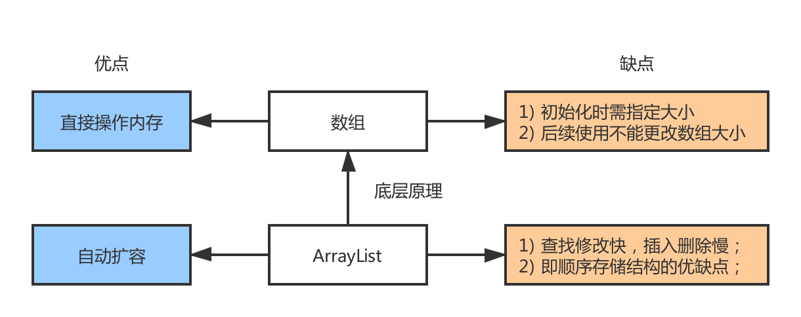|
| :---: |
| 图 2-1 ArrayList 概述 |

##### 参考资料
- [细雨蒙情. ArrayList (JDK1.8) 源码分析. jianshu.com](https://www.jianshu.com/p/ea4f943206ea)
- [十二页. ArrayList (JDK1.8/JDK1.7/JDK1.6). csdn.net](https://blog.csdn.net/u011392897/article/details/57105709)
- [YSOcean. ArrayList (JDK1.8). cnblogs.com](https://www.cnblogs.com/ysocean/p/8622264.html)

##### 基本性质
- 因为底层数组 elementData 的容量是不能改变的，为此容量不够时需要把 elementData 换成一个更大的数组，这个过程叫作 `扩容`。
-  ArrayList 所有方法都没有进行同步，它是 `线程不安全` 的。为此在多线程并发读写时需要外部同步。

	可使用 `Collections.synchronizedList()` 方法对 ArrayList 的实例进行封装。

	```java
	List list = Collections.synchronizedList(new ArrayList(...))
	```
	
- 对存储的元素无限制，允许 `null` 元素。

##### 源码细节
- 通过 ArrayList 实现的接口可知，其支持快速随机访问、能被克隆以及支持序列化 (将对象转换为字节流的过程)。

	且 ArrayList<E> 支持泛型，即支持构造任何类型的动态数组。

	```java
	public class ArrayList<E> extends AbstractList<E> 
		implements List<E>, RandomAccess, Cloneable, Serializable {
		// 忽略代码细节...
	}
	```

- 关键成员变量与构造函数解析：

	```java
	// 默认初始化容量
	private static final int DEFAULT_CAPACITY = 10;

	// 当用户指定该 ArrayList 容量为 0 时返回该空数组
	private static final Object[] EMPTY_ELEMENTDATA = {};
	
	// 当调用 ArrayList 的无参构造函数时返回该空数组
	private static final Object[] DEFAULTCAPACITY_EMPTY_ELEMENTDATA = {};
	
	// 数组对象 (非私有以简化嵌套类访问)
	transient Object[] elementData;     

	// 数组中元素的个数 (注意不是数组的长度)
	private int size;

	// 不带参数的构造方法
	public ArrayList() {
		super();
		// 将空的数组实例传给elementData
		this.elementData = EMPTY_ELEMENTDATA;
	}
	
	// 传入初始容量的构造方法
	public ArrayList(int initialCapacity) {
		super();
		if (initialCapacity < 0) {
			throw new IllegalArgumentException(
				"Illegal Capacity: "+ initialCapacity);
		}
		// 新建指定容量的 Object 类型数组
		this.elementData = new Object[initialCapacity];
	}

	// 传入外部集合的构造方法
	public ArrayList(Collection<? extends E> c) {
		// 持有传入集合的内部数组的引用
		elementData = c.toArray();

		// 更新集合元素个数大小
		if ((size = elementData.length) != 0) {
			// 判断引用的数组类型, 并将引用转换成 Object 数组引用
			if (elementData.getClass() != Object[].class) {
				elementData = Arrays
					.copyOf(elementData, size, Object[].class);
			}
		} else {
			// 使用空数组来替代
			this.elementData = EMPTY_ELEMENTDATA;
		}
	}
	```

##### 增删改查
- 增：
	- 添加时先检查容量是否足够，否则就进行扩容；
	- 添加元素到末尾。
- 插：
	- 插入位置安全性检查；
	- 容量检查；
	- (将插入位置后面的元素往后挪动)，插入元素。
- 改：直接对指定元素进行修改。
- 删：
	- 删除位置安全性检查；
	- (将删除位置后面的元素向前挪动)，删除元素。
- 查：直接返回指定下标的数组元素。

##### 动态扩容
- 扩容实际是新建一个容量更大 (原来数组长度 1.5 倍) 的数组。

	```java
	public boolean add(E e) {
		// 动态扩容的关键
		ensureCapacityInternal(size + 1);
		// 在 size+1 的位置进行赋值
		elementData[size++] = e;
		return true;
	}
	
	private void ensureCapacityInternal(int minCapacity) {
		// 如果此时还是空数组
		if (elementData == DEFAULTCAPACITY_EMPTY_ELEMENTDATA) {
			// 和默认容量比较， 取较大值
			minCapacity = Math.max(DEFAULT_CAPACITY, minCapacity);
		}
		//数组已经初始化过就执行这一步
		ensureExplicitCapacity(minCapacity);
	}

	private void ensureExplicitCapacity(int minCapacity) {
		modCount++;
		//如果最小容量大于数组长度就扩增数组
		if (minCapacity - elementData.length > 0) {
			grow(minCapacity);
		}
	}

	// 集合最大容量
	private static final int MAX_ARRAY_SIZE = Integer.MAX_VALUE - 8;
	
	// 增加数组长度
	private void grow(int minCapacity) {
		// 获取数组原先的容量
		int oldCapacity = elementData.length;
		
		// 新数组的容量, 在原来的基础上增加一半
		// 1) JDK 1.6 的计算公式是：(oldCapacity * 3) / 2 + 1
		// 若 oldCapacity = 10^9，那么上述计算结果会越界 -647483647
		// 2) JDK 1.8 / 1.7 是以下计算公式：
		int newCapacity = oldCapacity + (oldCapacity >> 1);
		
		// 检验新的容量是否小于最小容量
		if (newCapacity - minCapacity < 0) {
			newCapacity = minCapacity;
		}
		
		// 检验新的容量是否超过最大数组容量
		if (newCapacity - MAX_ARRAY_SIZE > 0) {
			newCapacity = hugeCapacity(minCapacity);
		}
		
		// 拷贝原来的数组到新数组
		elementData = Arrays.copyOf(elementData, newCapacity);
	}
	
	private static int hugeCapacity(int minCapacity) {
		if (minCapacity < 0) throw new OutOfMemoryError();
        return (minCapacity > MAX_ARRAY_SIZE) ? 
        	Integer.MAX_VALUE : MAX_ARRAY_SIZE;
	}
	```

	> 实际扩容可能不止 1.5 倍，只是 grow() 函数执行一趟扩容的大小为 1.5 倍，若容量还不足需则继续执行 grow() 扩容。

- 将原先数组的元素全部复制到新数组上， 然后舍弃原先的数组转而使用新数组。

	> Arrays.copyOf() 把原数组整个复制到新数组中，这个操作代价很高，因此最好在创建 ArrayList 对象时就指定大概的容量大小，减少扩容操作的次数。

##### 总结
- 使用 ArrayList 时尽量指定大小，以减少扩容带来的 `数组复制操作` 。
- 每次添加元素 --> 检查容量 --> 是否扩容 --> 扩大 1.5 倍。
- 每次下标操作 --> 安全性检查 --> 数组越界就立即抛出异常。
- ArrayList 所有方法都没有进行同步，因此它是线程不安全的。

#### LinkedList
>  以下源码细节是基于 JDK 1.8 版本展开讨论的。

| 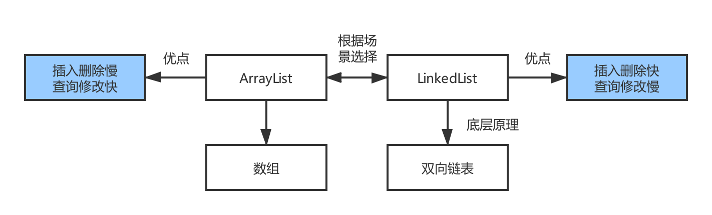 |
| :---: |
| 图 2-2 LinkedList 概述 |

##### 参考资料
- [十二页. LinkedList (JDK1.8/JDK1.7/JDK1.6). csdn.net](https://blog.csdn.net/u011392897/article/details/57115818)
- [YSOcean. LinkedList (JDK1.8). cnblogs.com](https://www.cnblogs.com/ysocean/p/8657850.html)

#####  基本性质
- JDK 1.7 之后使用的是不带头结点的普通的双向链表，增加两个节点指针 first、last 分别指向首尾节点，示意图如下：

	| 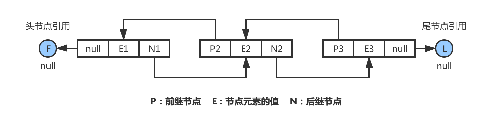 |
	| :----------------------------------------------------------: |
	|                图 2-2-1 不带头结点的双向链表                 |
	
-  与 ArrayList 一样，LinkedList 所有方法都没有进行同步，它是 `线程不安全` 的。为此在多线程并发读写时需要外部同步。

	可使用 `Collections.synchronizedList()` 方法对 LinkedList 的实例进行封装。

	```java
	List list = Collections.synchronizedList(new LinkedList(...))
	```
	
- 相比 ArrayList 此类还额外实现了 `Deque` 接口，可以充当一般的 `双端队列` 或者 `栈`，可以作为一些混合数据结构的基础。
- 理论上无容量限制，只受虚拟机自身限制影响，所以没有扩容方法。
- 对存储的元素无限制，允许 `null` 元素。

##### 源码细节
- 通过 LinkedList 实现的接口可知，其支持随机访问、能被克隆以及支持序列化 (将对象转换为字节流的过程)。

	且 LinkedList<E> 支持泛型，即支持构造任何类型的动态数组。

	```java
	public class LinkedList<E> extends AbstractSequentialList<E>
		implements List<E>, Deque<E>, Cloneable, Serializable {
		// 忽略代码细节...
	}
	```

- 关键成员变量与构造函数解析：

	```java
	// 由于 JDK 1.7 开始不再使用 header 节点
	// 因此默认构造方法不做声明，first 和 last 会被默认初始化为 null
	
	// 链表元素 (节点) 的个数
	transient int size = 0;

	/**
	 * 头节点引用
	 * 这是个固定不变的关系: 
	 * (first == null && last == null) || (first.prev == null && first.item != null) 
	 */
	transient Node<E> first;
 
	/**
	 * 尾节点引用
	 * 这是个固定不变的关系:
	 *  (first == null && last == null) || (last.next == null && last.item != null) 
	 */
	transient Node<E> last;
 
	// 默认构造方法 (无参构造方法)
	public LinkedList() {}
	
	public LinkedList(Collection<? extends E> c) {
		this();
		addAll(c);
	}
	```

- 结点由内部类 Node 表示：

	```java
	private static class Node<E> {
		E item; // 当前节点值
		Node<E> next; // 下一个节点
		Node<E> prev; // 上一个节点

		Node(Node<E> prev, E element, Node<E> next) {
			this.item = element;
			this.next = next;
			this.prev = prev;
		}
	}
	```
	
##### 增删改查
- 增：
	- 添加：在链表尾部插入 -- `linkLast()`
	- 插入：在链表中部插入 -- `linkBefore()`
- 删：
	- 给定数组下标：检查下标是否合法；删除目标节点。
	- 给定数据元素：检索链表中是否含有目标元素，有则删除目标结点。
- 查：
	- 检查下标是否合法；
	- 返回指定下标的结点的值。

		> 使用迭代器和 for 循环是存在差距的，不妨通过实现验证效果。注意迭代器的另一种形式就是使用 foreach 循环，底层实现也是使用的迭代器。
		
		```java
		LinkedList<Integer> linkedList = new LinkedList<>();
		// 向链表中添加 10 万个元素
		for(int i = 0 ; i < 100000 ; i++){
		    linkedList.add(i);
		}
		long beginTimeFor = System.currentTimeMillis();
		for(int i = 0 ; i < 100000 ; i++){
		    System.out.print(linkedList.get(i));
		}
		long endTimeFor = System.currentTimeMillis();
		System.out.println("\nFor 循环: " + (endTimeFor - beginTimeFor));
		
		long beginTimeIte = System.currentTimeMillis();
		Iterator<Integer> it = linkedList.listIterator();
		while(it.hasNext()){
		    System.out.print(it.next());
		}
		long endTimeIte = System.currentTimeMillis();
		System.out.println("\n迭代器: "+ (endTimeIte - beginTimeIte));		
		```

##### 单向队列/双向队列/栈
- 其实都是对链表的头结点和尾结点进行操作，它们都是基于以下方法实现操作：
	- 对链表两端操作：addFirst()、addLast()、reoveFirst()、removeLast()
	- 对链表中间操作：linkBefore()、unlink()

##### 总结
- LinkedList 是基于 `双向链表` 实现的，不论是增删改方法，还是栈、队列的实现，都可通过 `操作结点` 实现。
- 由于链表结构对内存要求低，LinkedList 不需要大块连续内存来满足扩容，能够自动地、动态地消耗内存；容量变小时会 `自动释放` 曾占用的内存。
- LinkedList 的所有方法都没有进行同步，它是 `线程不安全` 的。

#### HashMap
>  以下源码细节是基于 JDK 1.8 版本展开讨论的。

| 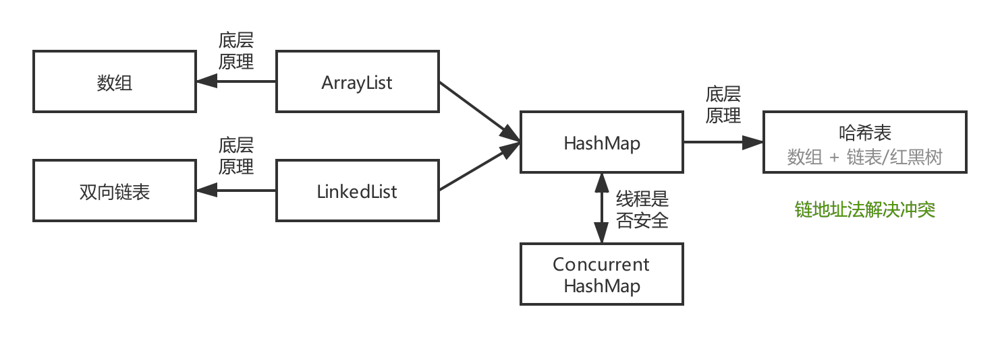 |
| :---: |
| 图 2-3 HashMap 概述 |

##### 参考资料
- [十二页. HashMap JDK1.8 源码分析. csdn.net](https://blog.csdn.net/u011392897/article/details/60151323)
- [多读书多看报. HashMap JDK1.8 实现原理. cnblogs.com](https://www.cnblogs.com/duodushuduokanbao/p/9492952.html)
- [YSOcean. HashMap (JDK1.8). cnblogs.com](https://www.cnblogs.com/ysocean/p/8711071.html)

##### 基本性质
- HashMap 存储的是 key-value 的键值对，允许 key 为 null，也允许 value 为null。
- HashMap 内部为数组和链表的组合结构。若 Hash 冲突的概率比较高，就会导致同一个桶中的链表长度过长、遍历效率降低。

	> 通过源码可知：以内部类 Node 表示结点，存储着键值对，且包含了四个字段。其中 next 字段我们可以看出 Node 会相链组成一个链表。即数组中的每个位置被当成一个桶，一个桶存放一个链表。

	故在 JDK 1.8 中如果链表长度到达阀值 (默认是8)，就会将链表转换成 `红黑二叉树` 保存，以提高 Hash 冲突时的查找速度。整体结构如图 2-3-1 所示：

	| 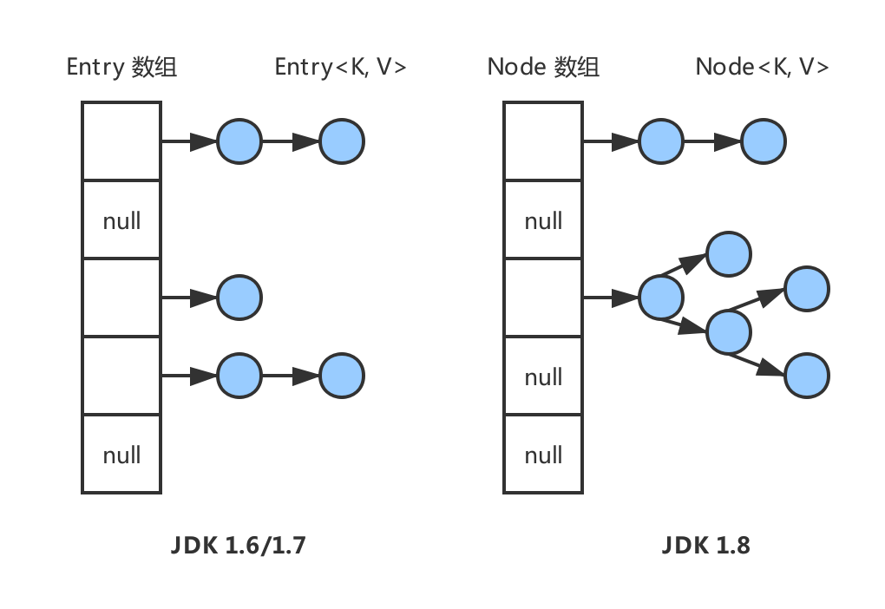 |
	| :---: |
	| 图 2-3-1 HashMap 的整体结构 |

- 链表添加时，新节点会放在链表末尾，而不是像 JDK 1.6/1.7 一样放在头部；
- 扩容操作也会尽量保证扩容后还在同一条链表上的节点之间的 `相对顺序` 不变。

##### 源码细节
- 关键成员变量与构造函数解析：

	```java
	/* 常量 */
	
	// 默认 Hash 表的初始容量
	static final int DEFAULT_INITIAL_CAPACITY = 1 << 4;
	// 默认 Hash 表最大容量
	static final int MAXIMUM_CAPACITY = 1 << 30;
	// 默认加载因子 (指哈希表可满足)
	static final float DEFAULT_LOAD_FACTOR = 0.75f;
	
	/* 新增红黑树有关的三个常量 */
 
	// 若一个 Hash 桶中的节点达到这个值，下次添加新节点时
	// 会把这个 Hash 桶的所有节点用红黑树保存
	// 若数组 table 的长度不足 64，那么也不转化为红黑树，改为扩容一次
	static final int TREEIFY_THRESHOLD = 8;
 
	// 若一棵红黑树的节点减少到这个值，那么就把它退化为链表保存
	static final int UNTREEIFY_THRESHOLD = 6;
 
	/**
	 * 转化为红黑树的另一个条件：
	 * 1) 当集合中的容量大于这个值时，表中的桶才能进行树形化，
	 * 否则桶内元素太多时会扩容，而不是树形化。
	 * 2) 为了避免进行扩容、树形化选择的冲突，
	 * 这个值不能小于 4 * TREEIFY_THRESHOLD。
	 */
	static final int MIN_TREEIFY_CAPACITY = 64;
	
	/* 变量 */
	
	// 初始化使用 (长度总是 2 的幂)
	transient Node<K,V>[] table;
	
	// 保存缓存的 entrySet()
	transient Set<Map.Entry<K,V>> entrySet;
	
	// 此映射中包含的键值映射的数量 (集合存储键值对的数量)
	transient int size;
	
	/**
	 * 跟前面ArrayList和LinkedList集合中的字段modCount一样，
	 * 记录集合被修改的次数 (主要用于迭代器中的快速失败)
	 */
	transient int modCount;
	
	/**
	 * threshold = Hash 表的初始容量 * 加载因子
	 * 当键值对的数量要超过阈值，即意味哈希表已处于饱和状态
	 * 若继续添加元素只会增加哈希冲突，使得 HashMap 性能下降
	 */
	int threshold;
	
	// 哈希表的加载因子
	final float loadFactor;
	```

- 哈希表其实是一个 Node 数组，数组中每个位置存放着单向链表的头结点。

	结点由内部类 Node 表示，且 Node 本质上是一个 Map，存储着键值对 (key-value)：

	> 注意：JDK 1.6  的结点名称是 Entry (仅命名不同)。

	- 普通结点 Node：

		```java
		static class Node<K,V> implements Map.Entry<K,V> {
			// 保存该桶的 hash 值
			// hash 值又变回 final (1.7 不是 final，1.6 是 final)
			final int hash; 
			final K key;
			V value;
			Node<K,V> next;
		
			Node(int hash, K key, V value, Node<K,V> next) {
				this.hash = hash;
				this.key = key;
				this.value = value;
				this.next = next;
			}
		}
		```
	
	- 红黑树结点 TreeNode：篇幅缘故可参考内部类 `TreeNode` 中的源码。

##### 增删改查
- 遍历元素：

	```java
	// 首先构造一个 HashMap 集合
	HashMap<String,Object> map = new HashMap<>();
	map.put("A","1");
	map.put("B","2");
	map.put("C","3");
	
	// 方法一：分别获取 key 集合和 value 集合
	// 根据 key 分别得到相应 value，
	// 遍历效率最低，适合单独取 key 或 value 时使用
	for(String key : map.keySet()){
	    System.out.println(key);
	}
	for(Object value : map.values()){
	    System.out.println(value);
	}

	// 方法二：得到 Entry 集合，然后遍历 Entry
	Set<Map.Entry<String,Object>> entrySet = map.entrySet();
	for(Map.Entry<String,Object> entry : entrySet){
		System.out.println( entry.getKey() );
		System.out.println( entry.getValue() );
	}

	// 方法三：迭代
	// 效率较前者高，且在遍历的过程中支持对集合中的元素进行删除
	Iterator<Map.Entry<String,Object>> iterator = map.entrySet().iterator();
	while(iterator.hasNext()){
	    Map.Entry<String,Object> mapEntry = iterator.next();
	    System.out.println( mapEntry.getKey() );
	    System.out.println( mapEntry.getValue() );
	}
	```

##### 实现原理
> 以下将针对具体问题出发，去探究 HashMap 的原理。

- HashMap 在构造器中做了哪些操作：
	- 设置加载因子 `localFacor`；
	- 设置键值对的容纳阈值 `threshold  = tableSizeFor(initalCapacity)`。

		```java	
		// 求不小于 cap 且满足 2^n 的数中最小的一个 (扩容也是 2^n 进行的)
		// 这个方法的原型就是 JDK 1.7 中的 Integer.highestOneBit 方法
		static final int tableSizeFor(int cap) {
			int n = cap - 1;
			n |= n >>> 1;
			n |= n >>> 2;
			n |= n >>> 4;
			n |= n >>> 8;
			n |= n >>> 16;
			return (n < 0) ? 1 : (n >= MAXIMUM_CAPACITY) ?
				MAXIMUM_CAPACITY : n + 1;
		}
		```

- 确定哈希桶数据索引位置 (计算 Hash 码)：
	- 定位数组下标是根据 Hash 码的低位值确定的；
	- key 的 Hash 码由 hashCode() 方法计算所得。

		```java
		/* JDK 1.8 -- 计算 Hash 码 */
		// 因为 JDK 1.8 使用了红黑树来保存冲突节点
		// 冲突的代价变小，Hash 函数只需移位异或一次
		static final int hash(Object key) {
			int h;
			h = key.hashCode();
			return (key == null) ? 0 : h ^ (h >>> 16);
		}
		
		/* JDK 1.7 -- 计算 Hash 码 */
		final int hash(Object k) {
			int h = hashSeed;
			// key 是 String 类型的就使用另外的哈希算法
			if (0 != h && k instanceof String) {
				return sun.misc.Hashing.stringHash32((String) k);
			}
			h ^= k.hashCode();
			// 扰动函数
			h ^= (h >>> 20) ^ (h >>> 12);
			return h ^ (h >>> 7) ^ (h >>> 4);
		}
		```
		
	- 把 Hash 码再代入求模公式中计算数组下标，即哈希桶数据索引位置：

		```java
		/* JDK 1.8 -- 计算数组下标 */
		// 取模运算已经整合于代码当中，例如：tab[hash & (n - 1)]
		
		/* JDK 1.7 -- 计算数组下标 */
		static int indexFor(int h, int length) {
			// 该项位运算等价于取模运算
			return h & (length-1);  
		}
		```
		
		| 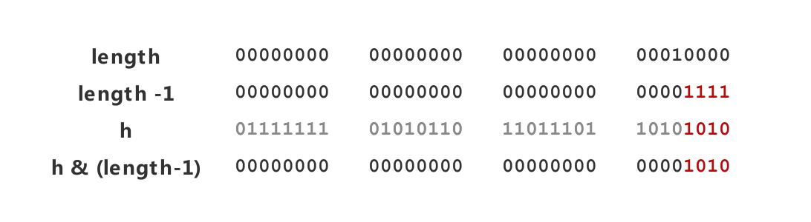 |
		| :---: |
		| 图 2-3-2 h & (length-1) 的计算原理 |
		
		> 注意：`h & (length-1)`  但要求 Entry 数组的长度大小满足 2 的幂。   
		> 原理：去掉 h 的高位值，只保留 h 的低位值作为数组下标。

-  HashMap 添加键值对时会进行什么操作：
	- Step.01：先检查哈希表 table 是否为空表，若为空表则先创建一个 table；
	- Step.02：计算 Hash 码 `hash(key)` --> 计算索引位置 `hash % (n-1)` --> 确定插入哈希数组的下标位置。
	- Step.03：计算出来的索引位置之前没有放过数据，则直接放入数据；
	- Step.04：若该索引位置不为空：
		- 1) 先判断索引第一个 key 与换入 key 是否相等，重复则直接覆盖；
		- 2) 再判断是否为红黑树，若是红黑树则直接插入树中；

			> if ( p instanceof TreeNode ) { ... }
			
		- 3) 若不是红黑树，就遍历每个结点，当链表长度大于 8 时则转换为红黑树，再插入结点；
		- 4) 在插入结点前，判断 put 的数据和之前是否重复，重复则覆盖原有 key 的 value，并返回原有 value。若 key 不相同，则插入一个 key，记录结构变化一次。

- HashMap 取键值对时会进行什么操作：
	- 判断哈希表 table 是否为空表，若为空表则返回 `null`；
	- 判断索引处第一个 key 与传入 key 是否相等，若相等直接返回 Node；
	- 若不相等，判断链表是否为红黑树，若是则直接从树中取值；否则就遍历链表取值。

##### 扩容机制
- 使用的 2 的幂的扩容 (指长度扩为原来的 2 倍)，故元素的位置要么在原位置，要么在原位置再移到 2 的幂的位置。
- 假设 `oldCapacity = 2^4 = 16` 与 `newCapacity = 2^5 = 32`。`x` 代表不用管，`?` 代表 0 或者 1 任意，二进制下标从最右边的第 0 位开始计算。

	如图 1-4 所示，我们从 B 中可以看出，当触发扩容时 oldCapacity  变为 newCapacity，(newCapacity - 1) 的 Mask 掩码范围在高位上多了 1 bit。
	
	- JDK 1.8 版本改进的结点迁移方式非常巧妙，其不仅保证了相对顺序不改变，且省去了重新计算 Hash 码的时间。

		> JDK 1.6/1.7 版本的结点迁移方式是 `遍历链表`，即一个一个重新添加到新链表的头部，会颠倒原来链表中结点的 `相对顺序`。

	- 因为新增的 1 bit 是 1 或者 0，则可以认为是随机的过程。因此在扩容 resize() 的执行过程，则可以把之前冲突的结点均匀地分散到新的哈希桶中，如图 2-3-4 所示。

	| 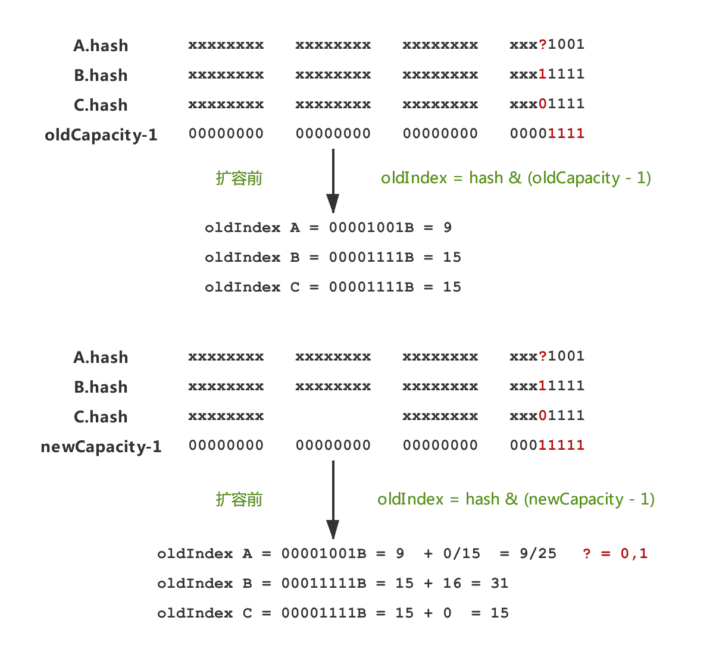 |
	| :---: |
	| 图 2-3-3 扩容机制中的结点迁移方式探究 |
	
	| 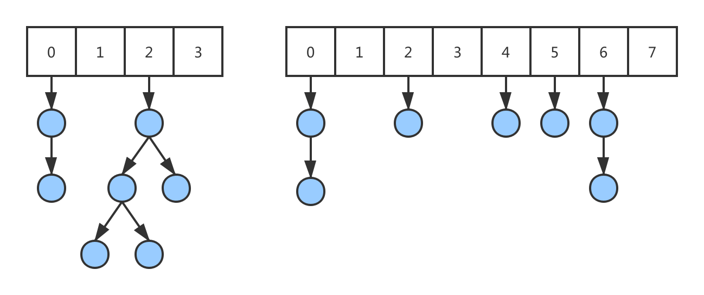 |
	| :---: |
	| 图 2-3-4 分布均匀的哈希桶 |

##### 总结
- 基于 JDK 1.8 的 HashMap 是由 `数组+链表+红黑树` 组成，当链表长度超过 8 时会自动转换成红黑树，当红黑树节点个数小于 6 时，又会转化成链表。

	相对于 HashMap 早期版本的 JDK 实现，新增 `红黑树` 作为底层数据结构，在数据量较大且哈希碰撞较多时，能够极大的增加检索的效率。
	
- 允许 key 和 value 都为 null。key 重复会被覆盖，value 允许重复。

	> (null, null), (“name”, null), (“sex”, null), 

- HashMap 的所有方法都没有进行同步，它是 `线程不安全` 的。
- 遍历 HashMap 得到元素的顺序不是按照插入的顺序输出的。

#### ConcurrentHashMap

## Java 并发
### 线程状态转换

### 使用线程
- Java 中有三种使用线程的方法： 实现 `Runnable` 接口；实现 `Callable` 接口；继承 `Thread` 类。

	> 实现 Runnable 和 Callable 接口的类只能当做一个可以在线程中运行的任务，不是真正意义上的线程。因此最后还需要通过 Thread 来调用，可以说任务是通过线程驱动从而执行的。

#### 实现 Runnable 接口

- 需要实现 run() 方法；通过 Thread 调用 start() 方法来启动线程。

	```java
	public class MyRunnable implements Runnable {
	    public void run() {
	        // ...
	    }
	}
	
	public static void main(String[] args) {
	    MyRunnable instance = new MyRunnable();
	    Thread thread = new Thread(instance);
	    thread.start();
	}
	```

#### 实现 Callable 接口
- 与 Runnable 相比，Callable 可以有返回值，返回值通过 FutureTask 进行封装。

	```java
	public class MyCallable implements Callable<Integer> {
	    public Integer call() {
	        return 123;
	    }
	}

	public static void main(String[] args) 
	    throws ExecutionException, InterruptedException {
	    MyCallable mc = new MyCallable();
	    FutureTask<Integer> ft = new FutureTask<>(mc);
	    Thread thread = new Thread(ft);
	    thread.start();
	    System.out.println(ft.get());
	}
	```

#### 继承 Thread 类
- 同样也是需要实现 run() 方法，因为 Thread 类也实现了 Runable 接口。

	当调用 start() 方法启动一个线程时，虚拟机会将该线程放入就绪队列中等待被调度，当一个线程被调度时会执行该线程的 run() 方法。

	```java	
	public class MyThread extends Thread {
	    public void run() {
	        // ...
	    }
	}
	
	public static void main(String[] args) {
	    MyThread mt = new MyThread();
	    mt.start();
	}
	```

#### 实现接口 / 继承 Thread
- Java 不支持多重继承，因此继承了 Thread 类就无法继承其它类，但是可以实现多个接口；
- 类可能只要求可执行就行，继承整个 Thread 类开销过大。

	> 为此实现接口会更好一些。

### 基础线程机制
### 中断机制

### 同步互斥
- Java 提供了两种锁机制来控制 `多个线程` 对共享资源的 `互斥访问`，第一个是 JVM 实现的 `synchronized`，而另一个是 JDK 实现的 `ReentrantLock`。

#### 参考资料
- [Aoho. 并发编程的锁机制 synchronized 和 lock. juejin.im](https://juejin.im/post/5a43ad786fb9a0450909cb5f)
- [Matrix海子. Java并发编程 Lock. cnblogs.com](https://www.cnblogs.com/dolphin0520/p/3923167.html)
- [Cyc2018. Java并发-互斥同步. cyc2018.github.io](https://cyc2018.github.io/CS-Notes/#/notes/Java%20并发?id=五、互斥同步)

####  锁的分类
- 锁的分类有很多种，比如自旋锁、自旋锁的其他种类、阻塞锁、可重入锁、读写锁、互斥锁、悲观锁、乐观锁、公平锁、可重入锁等。

	我们这边重点看如下几种：`可重入锁`、`读写锁`、`可中断锁`、`公平锁`。
	
	|  | Synchronized | ReentranLock | ReentrantReadWirteLock |
	| :-: | :-: | :-: | :-: |
	| 可重入锁 | ✔️ | ✔️ | ➖ |
	| 读写锁 | ➖ | ➖ | ✔️ |
	| 可中断锁 | ❌ | ✔️ | ➖ |
	| 公平锁 | ❌ | ❌ or ✔️ | ❌ or ✔️ |
	
	> ✔️ 表示支持；❌ 表示不支持；➖ 表示无关

- `可重入锁`：可重入性表明了锁的分配机制，即基于线程的分配，而不是基于方法调用的分配。若锁具备可重入性则称其为可重入锁。

	`synchronized` 和 `ReentrantLock` 都是可重入锁。

	> 例如：一个线程执行到 method1 的 synchronized 方法时，而在 method1中会调用另外一个 synchronized 方法 method2，此时该线程不必重新去申请锁，而是可以直接执行方法 method2。

- `读写锁`：读写锁将对一个资源的访问分成了 2 个锁。比如文件，一个读锁 (共享锁) 和一个写锁 (排它锁)。正因为有了读写锁，才使得多个线程之间的读操作不会发生冲突。

	`ReadWriteLock` 接口就是读写锁，`ReentrantReadWriteLock` 实现了这个接口。可以通过 readLock() 获取读锁，通过 writeLock() 获取写锁。

- `可中断锁`：即可以中断的锁。`synchronized` 就不是 `可中断锁`，而 `Lock` 是 `可中断锁`。Lock 接口中的 `lockInterruptibly()` 方法就体现了 Lock 的可中断性。

	> 例如：某一线程 A 正在执行锁中的代码，另一线程 B 正在等待获取该锁，可能由于等待时间过长，线程 B 不想等待了，想先处理其他事情，我们可以让它中断自己或者在别的线程中中断它，这种就是可中断锁。

- `公平锁`：尽量以 `请求锁的顺序` 来获取锁。同时若有多个线程在等待一个锁，当这个锁被释放时，等待时间最久的线程或 `最先请求的线程` 会获得该锁，这种就是公平锁。

	非公平锁即无法保证锁的获取是按照请求锁的顺序进行的，这样就可能导致某个或者一些线程永远获取不到锁。
	
	- synchronized 就不是 `公平锁`，它无法保证等待的线程获取锁的顺序。
	- Lock 也不是 `公平锁`，它无法保证等待的线程获取锁的顺序。对于 `ReentrantLock` 和 `ReentrantReadWriteLock`，默认是非公平锁，可设置为公平锁。

#### Lock 和 synchronized
##### synchronized
- synchronized 是 Java 的关键字，当它用来修饰一个方法或者一个代码块的时候，能够保证在同一时刻最多只有一个线程执行该段代码。简单总结如下四种用法：
	- `代码块`：对某一代码块使用，synchronized 后跟括号，括号里是变量。

		```java
		public int func(int m){
			synchronized(m) {
				//...
			}
		}
		```
		
	- `方法声明`：它和同步代码块一样，作用于同一个对象。即一次只能一个线程进入该方法，其他线程想在此时调用该方法只能排队等候。

		```java
		// 放在范围操作符之后，返回类型声明之前
		public synchronized void func() {
			// ...
		}
		```

	- `同步一个对象`：synchronized 后面括号里是对象，此时线程获得的是对象锁。由于调用的是同一个对象的同步代码块，因此这两个线程会进行同步。当一个线程进入同步语句块时，另一个线程就必须等待。

		> 同一对象需同步，不同对象不同步。

		```java
		public class SynchronizedExample {
			public void func1() {
				synchronized (this) {
					for (int i = 0; i < 10; i++) {
						System.out.print(i + " ");
					}
				}
			}
		}
		
		// Output: 0 1 2 3 4 5 6 7 8 9 0 1 2 3 4 5 6 7 8 9
		public static void main(String[] args) {
			SynchronizedExample e1 =  new SynchronizedExample();
			ExecutorService executorService =
				Executors.newCachedThreadPool();
			executorService.execute(() -> e1.func1());
			executorService.execute(() -> e1.func1());
		}
		
		// Output: 0 0 1 1 2 2 3 3 4 4 5 5 6 6 7 7 8 8 9 9
		public static void main(String[] args) {
			SynchronizedExample e1 = new SynchronizedExample();
			SynchronizedExample e2 = new SynchronizedExample();
			ExecutorService executorService = 
				Executors.newCachedThreadPool();
			executorService.execute(() -> e1.func1());
			executorService.execute(() -> e2.func1());
		}
		```

	- `同步一个类`：作用于整个类，也就是说两个线程调用同一个类的不同对象上的这种同步语句，也会进行同步。

		> 同一个类，不同一对象需同步。

		```java
		public class SynchronizedExample {
			public void func2() {
				synchronized (SynchronizedExample.class) {
					for (int i = 0; i < 10; i++) {
						System.out.print(i + " ");
					}
				}
			}
		}
		
		// Output: 0 1 2 3 4 5 6 7 8 9 0 1 2 3 4 5 6 7 8 9
		public static void main(String[] args) {
		SynchronizedExample e1 = new SynchronizedExample();
		SynchronizedExample e2 = new SynchronizedExample();
		ExecutorService executorService =
			Executors.newCachedThreadPool();
		executorService.execute(() -> e1.func2());
		executorService.execute(() -> e2.func2());
		}
		```

	-  同步一个 `静态方法`：

		```java
		public synchronized static void fun() {
			// ...
		}
		```
	
##### Lock
> Lock 是锁接口，其实现类为 ReetrantLock。  
> ReadWriteLock 是读写锁接口，其实现类为 ReetrantReadWriteLock。  

- Lock：

	```java
	public interface Lock {
		/**
		 * 获取锁，如果锁被其他线程获取，处于等待状态
		 * 必须主动去释放锁，并且在发生异常时不会自动释放锁。
		 * 因此一般来说，使用 Lock 必须在 try{...}catch{...} 块中进行，
		 * 并且将释放锁的操作放在 `finally` 块中进行，
		 * 以保证锁一定被被释放，防止死锁的发生。
		 */
		void lock();
		
		// 尝试获取锁
		// 若失败，等待的过程中可响应中断 threadWait.interrupt()
		void lockInterruptibly() throws InterruptedException;  
		
		// 尝试获取锁，若获取成功，就马上返回 true
		// 否则马上返回 false (锁已经被其他线程获取)
		boolean tryLock();  
		
		// 尝试获取锁，若获取失败，会等待 unit 时间
		// 等待期间还拿不到锁就马上返回 false
		boolean tryLock(long time, TimeUnit unit) 
			throws InterruptedException;  
			
		// 释放锁，一定要在 finally 块中释放
		void unlock();  
		Condition newCondition();
	}
	```

- ReetrantLock：可重入锁，Lock 接口的实现类，且内部定义了公平锁与非公平锁 (默认为非公平锁)：

	```java
	// 默认情况
	public ReentrantLock() {  
		sync = new NonfairSync();  
	}
	
	// 可以手动设置为公平锁：
	public ReentrantLock(boolean fair) {  
		sync = fair ? new FairSync() : new NonfairSync();  
	}  
	```

- ReadWriteLock：一个用来获取读锁 (共享锁)，一个用来获取写锁 (排它锁)。也就是说将文件的读写操作分开，分成 2 个锁来分配给线程，从而使得多个线程可以同时进行读操作。

	```java
	public interface ReadWriteLock {  
		Lock readLock();	// 获取读锁  
		Lock writeLock();	// 获取写锁  
	}
	```
	
- ReentrantReadWirteLock 实现了 ReadWirteLock 接口，并未实现 Lock 接口。
	
	```java
	private ReadWriteLock rwl = new ReentrantReadWriteLock();
	
	public static void main(String[] args) {
		final Main main = new Main();
	
		new Thread(
			() -> main.testRWL(Thread.currentThread()) ).start();
		new Thread(
			() -> main.testRWL(Thread.currentThread()) ).start();
	
	    // 输出的结果是两个 thread 交替输出“正在读”
	}
	
	public void testRWL(Thread thread) {
		rwl.readLock().lock();
		try {
			long finish = System.currentTimeMillis() + 1;
			while (System.currentTimeMillis() <= finish) {
				System.out.println(thread.getName() + "正在读");
			}
			System.out.println(thread.getName() + "读结束");
		} finally {
			rwl.readLock().unlock();
		}
	}
	```
	
	- 若一个线程已经占用了读锁，其他线程可以马上获得读锁，但需要等待才能获取写锁，则申请写锁的线程会一直等待释放读锁。

	- 若一个线程已经占用了写锁，其他线程要获取读锁或写锁都需要等待，则申请的线程会一直等待释放写锁。

####  锁的比较
- `锁的实现`：synchronized 是 Java 关键字，Lock 是接口。synchronized 是 JVM 实现的，而 Lock / ReentrantLock 是 JDK 实现的。
- `性能比较`：新版本 Java 对 synchronized 进行了很多优化，例如自旋锁等。synchronized 与 ReentrantLock 大致相同。
- `异常处理方式`：
	- synchronized：会自动释放线程占有的锁，因此不会导致死锁现象发生；
	- Lock：若没有主动通过 unLock() 去释放锁，则很可能造成死锁现象，因此使用 Lock 时需要在 finally 块中释放锁。
- `等待可中断`：当持有锁的线程长期不释放锁的时候，正在等待的线程可以选择放弃等待，改为处理其他事情。

	> Lock / ReentrantLock 可中断，而 synchronized 不行。

#### 使用选择
- 除非需要使用 Lock / ReentrantLock 的 `高级功能`，否则优先使用 `synchronized`。

	> Lock 是基于在语言层面实现的锁，Lock 锁可以被中断，支持定时锁等。

- 因为 synchronized 是 `JVM` 实现的一种锁机制，JVM 原生地支持它，而 ReentrantLock 不是所有的 JDK 版本都支持。
- 并且使用 synchronized 不用担心没有释放锁而导致 `死锁问题`，因为 JVM 会确保锁的释放。

### 线程之间协作
### J.U.C - AQS
### J.U.C - 其他组件
### 线程不安全示例
### Java 内存模型
### 线程安全
### 锁优化
### 多线程开发良好实践

## Java 虚拟机
### 内存区域与内存溢出异常
#### 运行时数据区域
- Java 虚拟机 (Java Virtual Machine, JVM) 在执行 Java 程序的过程中会把它所管理的内存划分为若干不同的数据区域。
- 这些区域各有用途，以及各自创建和销毁的时间。比如有的区域随着虚拟机进程的启动而存在，有些区域以来用户线程的启动而创建，结束而销毁。

|     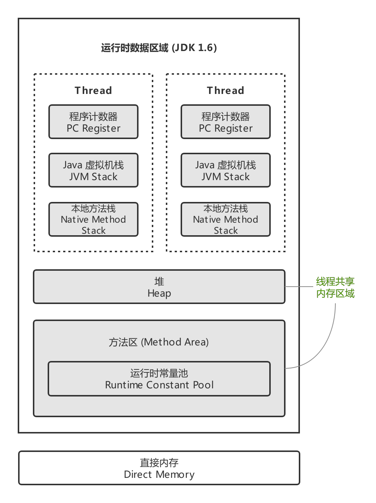     |
| :----------------------------------------------------------: |
| 图 4-1 Java 虚拟机运行时数据区域 / JVM 内存模型 (来自 [CyC2018.CS-Notes](https://cyc2018.github.io/CS-Notes/#/notes/Java%20虚拟机?id=一、运行时数据区域) ) |

##### 程序计数器
- 程序计数器：记录正在执行的虚拟机字节码指令的地址 (如果正在执行的是本地方法则为空)。

- Java 虚拟机的多线程是通过线程轮流切换并分配处理器执行时间的方式实现的，在任何时刻一个处理器 (多核心处理器是内核) 都只会执行一条线程中的指令。 

	为此，确保线程切换后能恢复正确的执行位置，每条线程都需要拥有一个独立的程序计数器。我们称这类内存区域为 `线程私有的内存`。

##### Java 虚拟机栈
- Java 虚拟机栈：`线程私有的内存`。每个 Java 方法在执行的同时会创建一个 `栈帧` 用于存储局部变量表、操作数栈、常量池引用等信息。从方法调用直至执行完成的过程，对应着一个栈帧在 Java 虚拟机栈中入栈和出栈的过程。

	| 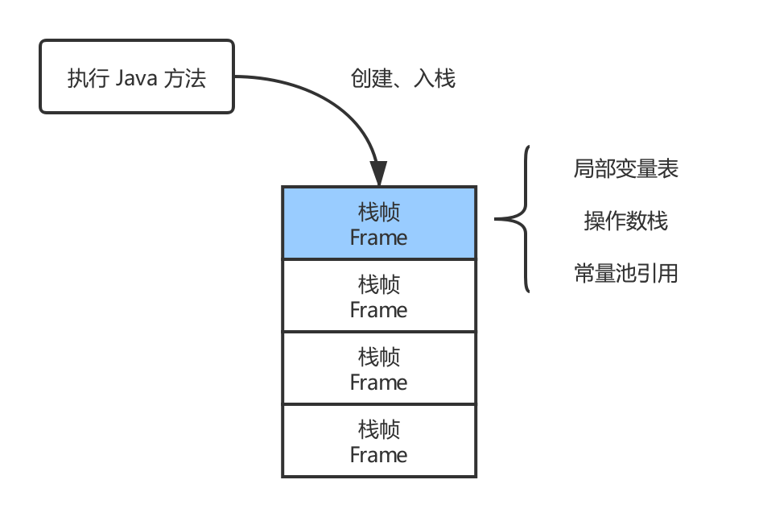 |
	| :-: |
	| 图 4-1-1 栈帧 |

- 该区域可能抛出以下异常：
	- 当线程请求的栈深度超过最大值，会抛出 StackOverflowError 异常；
	- 栈进行动态扩展时如果无法申请到足够内存，会抛出 OutOfMemoryError 异常。
- 可以通过 `-Xss` 这个虚拟机参数来指定每个线程的 Java 虚拟机栈内存大小，在 JDK 1.4 中默认为 256K，而在 JDK 1.5+ 默认为 1M：

	```shell
	java -Xss2M HackTheJava
	```

##### 本地方法栈
- 本地方法栈与 Java 虚拟机栈类似，它们之间的区别只不过是本地方法栈为本地方法服务。
- 本地方法一般是用其它语言 (C、C++ 或汇编语言等) 编写的，并且被编译为基于本机硬件和操作系统的程序，对待这些方法需要特别处理。

##### 堆
- `所有线程共享` 的内存区域，虚拟机启动是创建。
- `所有对象` 都在这里 `分配内存`，是垃圾收集的主要区域 (GC 堆，Garbage Collected Heap)。
- 现代的垃圾收集器基本都是采用 `分代收集算法`，其主要的思想是针对不同类型的对象采取不同的垃圾回收算法。可以将堆分成两块：
	- 新生代 (Young Generation)
	- 老年代 (Old Generation)
- 堆不需要连续内存 (不要求物理上连续的内存空间，逻辑连续即可)，并且可以动态增加其内存，增加失败会抛出 OutOfMemoryError 异常。

	可以通过 `-Xms` 和 `-Xmx` 这两个虚拟机参数来指定一个程序的堆内存大小，第一个参数设置初始值，第二个参数设置最大值。
	
	```shell
	java -Xms1M -Xmx2M HackTheJava
	```

##### 方法区
- `所有线程共享` 的内存区域。
- 用于存放已被加载的类信息、常量、静态变量、即时编译器编译后的代码等数据。
- 和堆一样不需要连续的内存，并且可以动态扩展，动态扩展失败一样会抛出 OutOfMemoryError 异常。
- 对这块区域进行垃圾回收的主要目标是对常量池的回收和对类的卸载，但是一般比较难实现。
- HotSpot 虚拟机把它当成 `永久代` 来进行垃圾回收。但很难确定永久代的大小，因为它受到很多因素影响，并且每次 Full GC 之后永久代的大小都会改变，所以经常会抛出 OutOfMemoryError 异常。

	> 为了更容易管理方法区，从 JDK 1.8 开始，移除永久代，并把方法区移至元空间，它位于本地内存中，而不是虚拟机内存中。

- 方法区是一个 JVM 规范，永久代与元空间都是其一种实现方式。在 JDK 1.8 之后，原来永久代的数据被分到了堆和元空间中。元空间存储类的元信息，静态变量和常量池等放入堆中。

##### 运行时常量池
- 运行时常量池是方法区的一部分。
- Class 文件中的常量池 (编译器生成的字面量和符号引用) 会在类加载后被放入这个区域。
- 除了在编译期生成的常量，还允许动态生成，例如 String 类的 intern()。

	```java
	// String.intern() -- JDK 1.8
	if 判断这个常量是否存在于常量池 { // 存在
		if 判断存在内容是引用还是常量 {
				如果是引用，返回引用地址指向堆空间对象
			} else {
				如果是常量，直接返回常量池常量
			}
	} else { // 不存在
		将当前对象引用复制到常量池,并且返回的是当前对象的引用
	}
	```

##### 直接内存
- 直接内存并不是虚拟机运行时数据区的一部分，也不是 JVM 规范中定义的内存区域。
- 在 JDK 1.4 中新引入了 NIO (New Input/Output) 类，它可以使用 Native 函数库直接分配堆外内存，然后通过一个存储在 Java 堆里的 DirectByteBuffer 对象作为这块内存的引用进行操作。这样能在一些场景中显著提高性能，因为避免了在堆内存和堆外内存来回拷贝数据。

### 垃圾收集
- 垃圾收集 (Garbage Collection, GC) 主要是针对 `堆` 和 `方法区` 进行。
- 程序计数器、虚拟机栈和本地方法栈这三个区域属于线程私有的，只存在于线程的生命周期内，随线程结束就会消失，因此不需要对这三个区域进行垃圾回收。

#### 判断对象是否可被回收
##### 引用计数算法
- 为对象添加一个引用计数器，当对象增加一个引用时计数器加 1，引用失效时计数器减 1。引用计数为 0 的对象可被回收。

- 在两个对象出现循环引用的情况下，此时引用计数器永远不为 0，导致无法对它们进行回收。正是因为循环引用的存在，因此 Java 虚拟机不使用引用计数算法。

	```java
	public class Test {

		public Object instance = null;

		public static void main(String[] args) {
			Test a = new Test();
			Test b = new Test();
			a.instance = b;
			b.instance = a;
			a = null;
			b = null;
			
			// 假设在此时发生 GC，a 和 b 能否被回收？
			System.gc();
		}
	}
	```
	
	答案是否定的。在上述代码中，a 与 b 引用的对象实例互相持有了对象的引用，因此当我们把对 a 对象与 b 对象的引用去除之后，由于两个对象还存在互相之间的引用，导致两个 Test 对象无法被回收。

##### 可达性分析算法
- 以 GC Roots 为起始点进行搜索，可达的对象都是存活的，不可达的对象可被回收。

	> 以图论角度解释，即没有一条路径可以让 GC Roots 达到这个对象。

	| 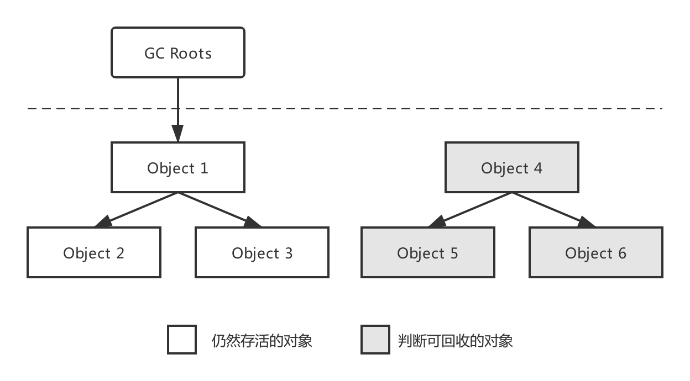 |
	| :-: |
	| 图 4-2 可达性分析算法判断对象是否可回收 |

- Java 虚拟机使用该算法来判断对象是否可被回收，GC Roots 一般包含以下内容：
  - 虚拟机栈中局部变量表 (栈帧的局部变量表)  中引用的对象。
  - 本地方法栈中 JNI 中引用的对象。
  - 方法区中类静态属性引用的对象。
  - 方法区中的常量引用的对象。

##### 方法区的回收
- 因为方法区主要存放永久代对象，而永久代对象的回收率比新生代低很多，所以在方法区上进行回收性价比不高。
- 主要是对常量池的回收和对类的卸载。

	> 为了避免内存溢出，在大量使用反射和动态代理的场景都需要虚拟机具备类卸载功能。

- 类的卸载条件很多，需要满足以下三个条件，并且满足了条件也不一定会被卸载：
	- 该类所有的实例都已经被回收，此时堆中不存在该类的任何实例。
	- 加载该类的 ClassLoader 已经被回收。
	- 该类对应的 Class 对象没有在任何地方被引用，也就无法在任何地方通过反射访问该类方法。

##### finalize()
- 类似 C++ 的析构函数，用于关闭外部资源。但是 try-finally 等方式可以做得更好，并且该方法运行代价很高，不确定性大，无法保证各个对象的调用顺序，因此最好不要使用。
- 当一个对象可被回收时，如果需要执行该对象的 finalize() 方法，那么就有可能在该方法中让对象重新被引用，从而实现自救。

	> 自救只能进行一次，若回收的对象之前调用了 finalize() 方法自救，后面回收时不会再调用该方法。

#### 引用类型
- 无论是通过引用计数算法判断对象的引用数量，还是通过可达性分析算法判断对象引用链是否可达，判定对象是否存活都与 `引用` 有关。
- 四种 `引用强度` 依次逐渐减弱：
	- 强引用：被强引用关联的对象不会被回收。
		
		```java
		// 使用 new 一个新对象的方式来创建强引用
		Object obj = new Object();
		```
		
	- 软引用：被软引用关联的对象只有在内存不够的情况下才会被回收。
	
		```java
		// 使用 SoftReference 类来创建软引用
		Object obj = new Object();
		SoftReference<Object> sf = new SoftReference<Object>(obj);
		obj = null;  // 使对象只被软引用关联
		```
	
	- 弱引用：被弱引用关联的对象一定会被回收，也就是说它只能存活到下一次垃圾回收发生之前。
	
		```java
		// 使用 WeakReference 类来创建弱引用
		Object obj = new Object();
		WeakReference<Object> wf = new WeakReference<Object>(obj);
		obj = null;
		```
		
	- 虚引用：又称为幽灵引用或者幻影引用，一个对象是否有虚引用的存在，不会对其生存时间造成影响，也无法通过虚引用得到一个对象。
	
		为一个对象设置虚引用的唯一目的是能在这个对象被回收时收到一个系统通知。
		
		```java
		// 使用 PhantomReference 来创建虚引用
		Object obj = new Object();
		PhantomReference<Object> pf = new PhantomReference<Object>(obj, null);
		obj = null;
		```
	
#### 垃圾收集算法
##### 标记-清除算法
| 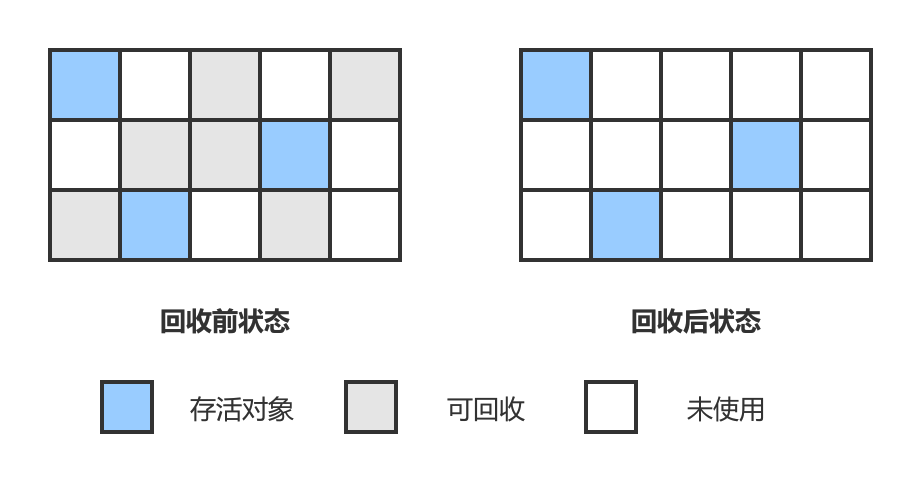 |
| :-: |
| 图 4-2-1 标记-清除算法示意 |

- 在标记阶段，程序会检查每个对象是否为活动对象，如果是活动对象，则程序会在对象头部打上标记。
- 在清除阶段，会进行对象回收并取消标志位。另外，还会判断回收后的分块与前一个空闲分块是否连续，若连续，会合并这两个分块。回收对象就是把对象作为分块，连接到被称为 `空闲链表` 的单向链表，之后进行分配时只需要遍历这个空闲链表，找到分块即可。
- 在分配时，程序会搜索空闲链表寻找空间大于等于新对象大小 size 的块 block。如果它找到的块等于 size，会直接返回这个分块；如果找到的块大于 size，会将块分割成大小为 size 与 (block - size) 的两部分，返回大小为 size 的分块，并把大小为 (block - size) 的块返回给空闲链表。
- 不足：
	- 标记和清除过程效率都不高；
	- 会产生大量不连续的内存碎片，导致无法给大对象分配内存。
	
##### 标记-整理算法
| 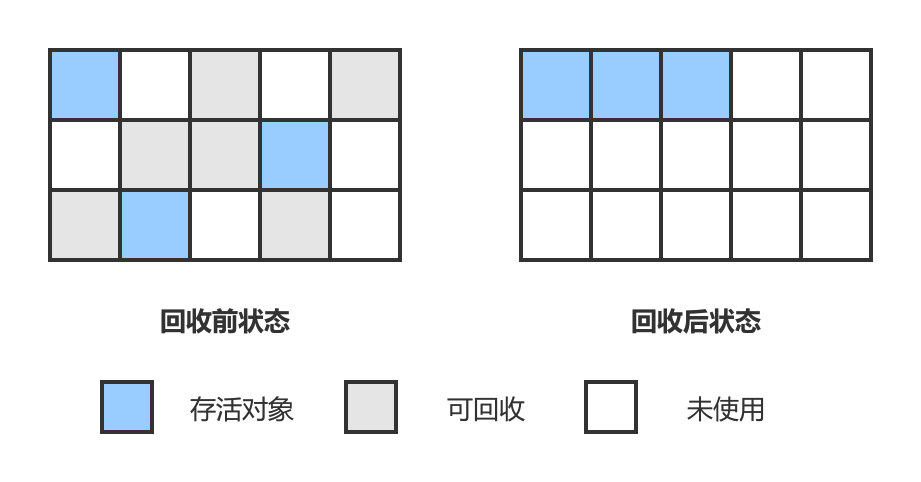 |
| :-: |
| 图 4-2-2 标记-整理算法 |

- 让所有存活的对象都向一端移动，然后直接清理掉端边界以外的内存。
- 优点:不会产生内存碎片。
- 不足:需要移动大量对象，处理效率比较低。

##### 复制算法
| 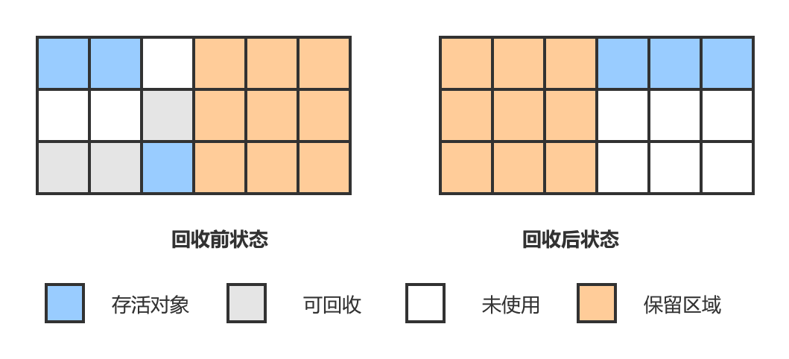 |
| :-: |
| 图 4-2-3 复制算法 |

- 将内存划分为大小相等的两块，每次只使用其中一块，当这一块内存用完了就将还存活的对象复制到另一块上面，然后再把使用过的内存空间进行一次清理。
- 不足：只使用了内存的一半。
- 现在的商业虚拟机都采用这种收集算法回收新生代，但是并不是划分为大小相等的两块，而是一块较大的 Eden 空间和两块较小的 Survivor 空间，每次使用 Eden 和其中一块 Survivor。在回收时，将 Eden 和 Survivor 中还存活着的对象全部复制到另一块 Survivor 上，最后清理 Eden 和使用过的那一块 Survivor。
	
	HotSpot 虚拟机的 Eden 和 Survivor 大小比例默认为 8:1，保证了内存的利用率达到 90%。我们没有办法保证每次回收都只有不多于 10% 的对象存活，那么一块 Survivor 就不够用了，此时需要依赖于老年代进行空间分配担保，也就是借用老年代的空间存储放不下的对象。

##### 分代收集算法
| 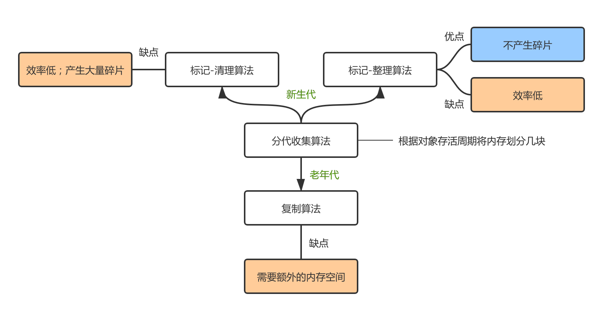 |
| :-: |
| 图 4-2-4 分代收集算法 |

- 现在的商业虚拟机采用分代收集算法，它根据对象存活周期将内存划分为几块，不同块采用适当的收集算法。

- 一般将堆分为新生代和老年代：
	- 新生代中对象存活率低，使用 `复制算法`。
	- 老年代中对象存活率高、没有额外空间对它进行分配担保，使用 `标记-清除` 算法或者 `标记-整理` 算法。

#### 垃圾收集器
| 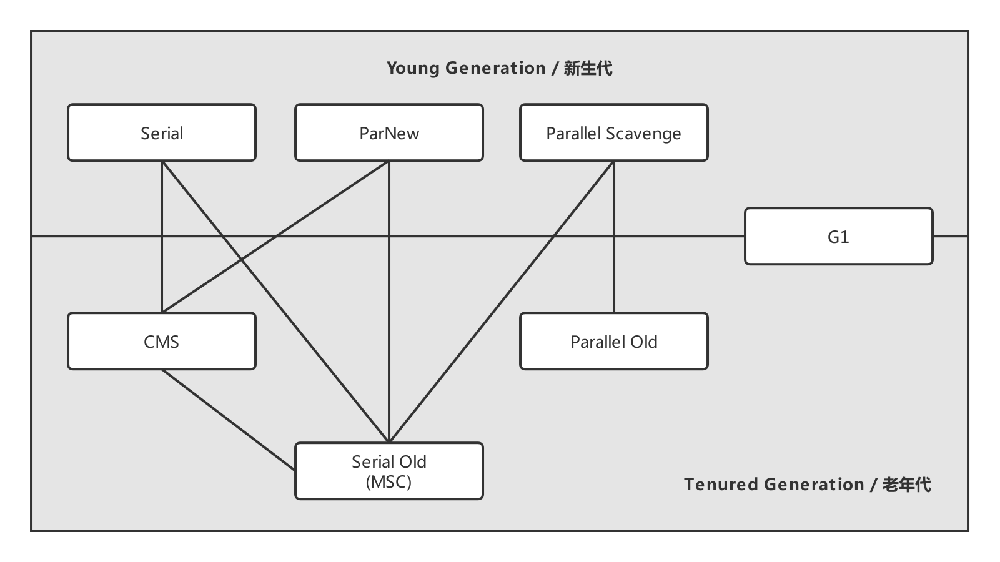 |
| :-: |
| 图 4-2-5 HotSpot 虚拟机的垃圾收集器 |

- 若 `垃圾收集算法` 是内存回收的 `方法论`，则 `垃圾收集器` 就是内存回收的 `具体实现`。
- 图 4-2-5 展示了 HotSpot 虚拟机中的 7 个垃圾收集器，连线表示垃圾收集器可以 `配合使用`。

	> `配合使用`：指的是在限定的使用场景，新生代和老年代各有垃圾收集器专职负责工作。

- 开始讨论垃圾收集器的语境中，我们需要了解一些名词概念：
	- 单线程与多线程：单线程指的是垃圾收集器只使用一个线程，而多线程使用多个线程。
	- 串行 (Serial)：指垃圾收集器与用户程序交替执行，这意味着在执行垃圾收集的时候需要停顿用户程序。
	- 并行 (Parallel)：指多条垃圾收集线程并行工作，但此时用户线程仍处于等待状态。
	- 并发 (Concurrent)：指的是垃圾收集器和用户程序同时执行，用户程序继续运行，垃圾收集器运行于另一个 CPU 上。但不一定是并行，可能交替执行。

		> 除了 CMS 和 G1 之外，其它垃圾收集器都是以串行的方式执行。

##### Serial 收集器
| 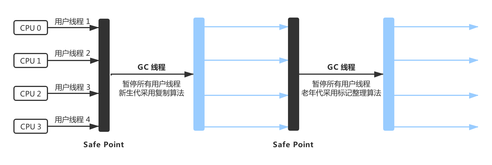 |
| :-: |
| 图 4-2-6 Serial / Serial Old 收集器运行示意图 |

- Serial 翻译为串行，也就是说它以串行的方式执行。
- 它是 `单线程` 的收集器，只会使用一个线程进行垃圾收集工作。
- 它是 `Client` 场景下的默认 `新生代收集器`，因为在该场景下内存一般来说不会很大。它收集一两百兆垃圾的停顿时间可以控制在一百多毫秒以内，只要不是太频繁，这点停顿时间是可以接受的。
- 优点：是简单高效，在单个 CPU 环境下，由于没有线程交互的开销，因此拥有最高的单线程收集效率。

##### ParNew 收集器
| 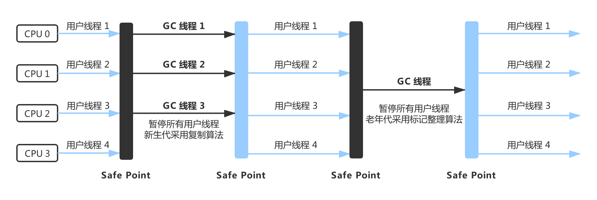 |
| :-: |
| 图 4-2-7 ParNew / Serial Old 收集器运行示意图 |

- 它是 Serial 收集器的 `多线程` 版本。
- 它是 `Server` 场景下默认的 `新生代收集器`，除了性能原因外 (Serial 收集器)，它还能与 CMS 收集器配合使用。

##### Parallel Scavenge 收集器
| 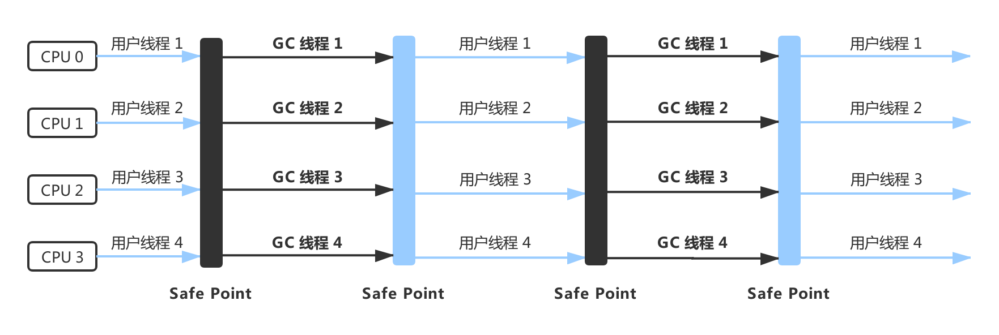 |
| :-: |
| 图 4-2-8 Parallel Scavenge / Parallel Old 收集器运行示意图 |

- 与 ParNew 一样是 `多线程` 收集器。

- 其它收集器目标是尽可能缩短垃圾收集时用户线程的停顿时间，而它的目标是达到一个可控制的吞吐量，因此它被称为 `吞吐量优先` 收集器。

	> 吞吐量 = 运行用户代码的时间 / (运行用户代码时间 + 垃圾收集时间)，即 CPU 用于运行用户代码的时间与 CPU 总消耗时间的比值。

- 停顿时间越短就越适合需要与用户交互的程序，良好的响应速度能提升用户体验。而高吞吐量则可以高效率地利用 CPU 时间，尽快完成程序的运算任务，适合在后台运算而不需要太多交互的任务。

	缩短停顿时间是以牺牲吞吐量和新生代空间来换取的：新生代空间变小，垃圾回收变得频繁，导致吞吐量下降。

- 可以通过一个开关参数打开 GC 自适应的调节策略 (GC Ergonomics)，就不需要手工指定新生代的大小 (-Xmn)、Eden 和 Survivor 区的比例、晋升老年代对象年龄等细节参数了。虚拟机会根据当前系统的运行情况收集性能监控信息，动态调整这些参数以提供最合适的停顿时间或者最大的吞吐量。

##### Serial Old 收集器
- 是 Serial 收集器的 `老年代版本`，也是给 `Client` 场景下的虚拟机使用。如果用在 Server 场景下，它有两大用途：
	- 在 JDK 1.5 以及之前版本 (Parallel Old 诞生以前) 与 Parallel Scavenge 收集器搭配使用。
	- 作为 CMS 收集器的后备预案，在并发收集发生 Concurrent Mode Failure 时使用。

##### Parallel Old 收集器
- 是 Parallel Scavenge 收集器的 `老年代版本`。
- 在注重吞吐量以及 CPU 资源敏感的场合，都可以优先考虑 Parallel Scavenge 加 Parallel Old 收集器。

##### CMS 收集器
| 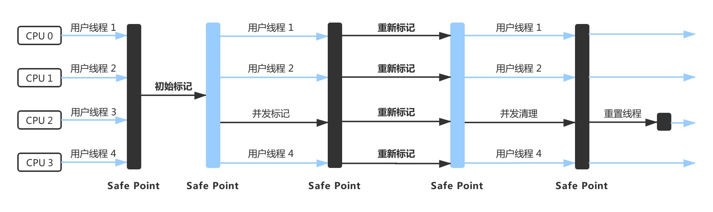 |
| :-: |
| 图 4-2-9 CMS 收集器运行示意图 |

- CMS (Concurrent Mark Sweep)，`Mark Sweep` 指的是 `标记-清除` 算法。
- CMS 运作过程可分为以下四个流程：
	- `初始标记`：仅是标记一下 GC Roots 能直接关联到的对象，速度很快，需要停顿。
	- `并发标记`：进行 GC Roots Tracing 的过程，它在整个回收过程中耗时最长，不需要停顿。
	- `重新标记`：为了修正并发标记期间因用户程序继续运作而导致标记产生变动的那一部分对象的标记记录，需要停顿。
	- `并发清除`：不需要停顿。
	
		> 在整个过程中耗时最长的并发标记和并发清除过程中，收集器线程都可以与用户线程一起工作，不需要进行停顿。

- 缺点：
	- 吞吐量低：低停顿时间是以牺牲吞吐量为代价的，导致 CPU 利用率不够高。
	- 无法处理浮动垃圾，可能出现 Concurrent Mode Failure。失败导致另一次 Full GC 的产生。

		> 浮动垃圾是指并发清除阶段由于用户线程继续运行而产生的垃圾，这部分垃圾只能到下一次 GC 时才能进行回收。由于浮动垃圾的存在，因此需要预留出一部分内存，意味着 CMS 收集不能像其它收集器那样等待老年代快满的时候再回收。如果预留的内存不够存放浮动垃圾，就会出现 Concurrent Mode Failure，这时虚拟机将临时启用 Serial Old 来替代 CMS。

	- 标记-清除算法导致的空间碎片，往往出现老年代空间剩余，但无法找到足够大连续空间来分配当前对象，不得不提前触发一次 Full GC。

##### G1 收集器
| 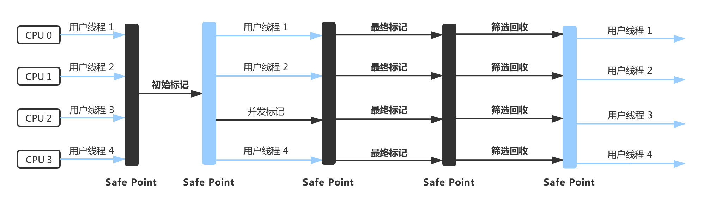 |
| :-: |
| 图 4-2-10 G1 收集器运行示意图 |

- G1 (Garbage-First)，它是一款面向服务端应用的垃圾收集器，在多 CPU 和大内存的场景下有很好的性能。HotSpot 开发团队赋予它的使命是未来可以替换掉 CMS 收集器。

- G1 把堆划分成多个大小相等的 `独立区域` (Region)，继续保留新生代和老年代的概念，但新生代和老年代不再 `物理隔离`。
	- 通过引入 Region 的概念，从而将原来的一整块内存空间划分成多个的小空间，使得每个小空间可以单独进行垃圾回收。
	- 这种划分方法带来了很大的灵活性，使得 `可预测的停顿时间模型` 成为可能。通过记录每个 Region 垃圾回收时间以及回收所获得的空间 (这两个值是通过过去回收的经验获得)，并维护一个 `优先列表`，每次根据允许的收集时间，优先 `回收价值最大` 的 Region。
	
		> Tips：Garbage-First 名称的由来。
	
	- 每个 Region 都有一个 Remembered Set，用来记录该 Region 对象的引用对象所在的 Region。通过使用 Remembered Set，在做 `可达性分析` 的时候就可以 `避免全堆扫描`。
	
- 如果不计算维护 Remembered Set 的操作，G1 收集器的运作大致可划分为以下几个步骤：
	- `初始标记`：仅是标记一下 GC Roots 能直接关联到的对象，速度很快，需要停顿。
	- `并发标记`：从 GC Root 开始对堆中对象进行 `可达性分析`，找出存活对象，该阶段耗时较长，但可与用户程序并发执行，不需要停顿。
	- `最终标记`：为了修正在并发标记期间因用户程序继续运作而导致标记产生变动的那一部分标记记录，虚拟机将这段时间对象变化记录在线程的 Remembered Set Logs 里面，最终标记阶段需要把 Remembered Set Logs 的数据合并到 Remembered Set 中。这阶段需要停顿线程，但是可并行执行。
	- `筛选回收`：首先对各个 Region 中的 `回收价值和成本进行排序`，根据用户所期望的 GC 停顿时间来制定回收计划。此阶段其实也可以做到与用户程序一起并发执行，但是因为只回收一部分 Region，时间是用户可控制的，而且停顿用户线程将大幅度提高收集效率。
	
- 具备如下特点：
	- `分代收集`：堆被分为新生代和老年代，其它收集器进行收集的范围都是整个新生代或者老年代。而 G1 可以不依赖其他收集器，直接对新生代和老年代一起回收。
	- `空间整合`：整体来看是基于 `标记-整理算法` 实现的收集器，从局部 (两个 Region 之间) 上来看是基于 `复制算法` 实现的，这意味着运行期间不会产生内存空间碎片。
	- `可预测的停顿`：能让使用者明确指定在一个长度为 M 毫秒的时间片段内，消耗在 GC 上的时间不得超过 N 毫秒。

##### 垃圾收集器总结
- 综上所述，7 种垃圾收集器大致的细节差异，如表 4-2-1 所示：

	| 收集器 | 适用主体 | 分代收集 | 运行方式 | 线程环境 | 适用场景 |
	| :---: | :---: | :---: | :---: | :---: | :--- |
	| Serial | Client | 新生代 | 串行 | 单线程 | -- |
	| ParNew | Server | 新生代 | 并行 | 多线程 | -- |
	| Parallel Scavenge | -- | 新生代 | 并行 | 多线程 | 吞吐量优先<br>CPU 资源敏感场合  |
	| Serial Old | Client | 老年代 | 串行 | 单线程 | -- |
	| Parallel Old | -- | 老年代 | 并行 | 多线程 | 吞吐量优先<br>CPU 资源敏感场合 |
	| CMS | Server | 老年代 | 并发 | 多线程 | 并发收集、低停顿；<br>会产生内存空间碎片 |
	| G1 | Server | 新 / 老 | 并发 | 多线程 | 并发收集、低停顿；<br>不产生内存空间碎片 |

### 内存分配与回收策略
#### Minor GC 和 Full GC
- Minor GC：回收新生代，因为新生代对象存活时间很短，因此 Minor GC 会频繁执行，执行的速度一般也会比较快。
- Full GC：回收老年代和新生代，老年代对象其存活时间长，因此 Full GC 很少执行，执行速度会比 Minor GC 慢很多。

#### Full GC 的触发条件
- 调用 `System.gc()`：只是建议虚拟机执行 Full GC，但是虚拟机不一定真正去执行。不建议使用这种方式，而是让虚拟机管理内存。
- `老年代空间不足`：
	- 老年代空间不足的常见场景为前文所讲的大对象直接进入老年代、长期存活的对象进入老年代等。
	- 为了避免以上原因引起的 Full GC，应当尽量不要创建过大的对象以及数组。除此之外，可以通过 -Xmn 虚拟机参数调大新生代的大小，让对象尽量在新生代被回收掉，不进入老年代。还可以通过 -XX:MaxTenuringThreshold 调大对象进入老年代的年龄，让对象在新生代多存活一段时间。
- `空间分配担保失败`：使用复制算法的 Minor GC 需要老年代的内存空间作担保，如果担保失败会执行一次 Full GC。具体内容请参考上面的第 5 小节。
- JDK 1.7 及以前的 `永久代空间不足`：
	- 在 JDK 1.7 及以前，HotSpot 虚拟机中的方法区是用永久代实现的，永久代中存放的为一些 Class 的信息、常量、静态变量等数据。
	- 当系统中要加载的类、反射的类和调用的方法较多时，永久代可能会被占满，在未配置为采用 CMS GC 的情况下也会执行 Full GC。如果经过 Full GC 仍然回收不了，那么虚拟机会抛出 java.lang.OutOfMemoryError。
	- 为避免以上原因引起的 Full GC，可采用的方法为增大永久代空间或转为使用 CMS GC。

#### 对象优先在 Eden 分配
#### 大对象直接进入老年代
#### 长期存活的对象进入老年代
#### 动态对象年龄判定
#### 空间分配担保


### 虚拟机类加载机制


## Java I/O
