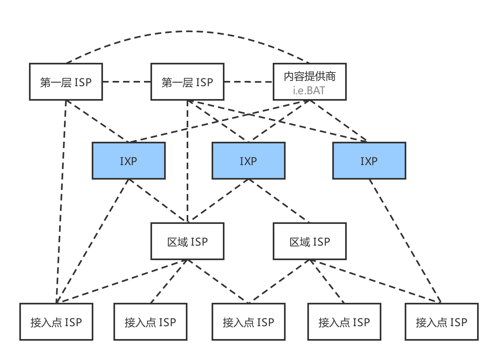
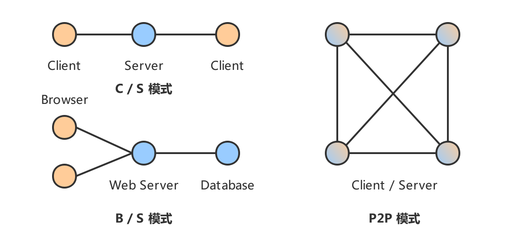
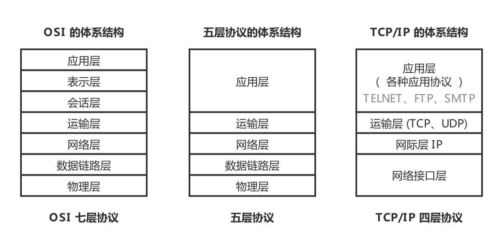
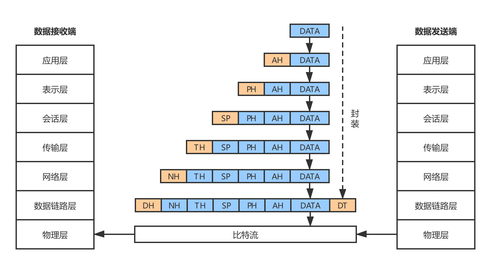

# 技术面试必备基础知识-计算机网络

> 在线阅读：[CS-Notes-Network](https://cyc2018.github.io/CS-Notes/#/README?id=%e2%98%81%ef%b8%8f-%e7%bd%91%e7%bb%9c)

## 计算机网络
### 概述
- 网络的网络：网络把主机连接起来，而互联网是把多种不同的网络连接起来，因此互联网是网络的网络。

	|  |
	| :---: |
	| 图 1-1 网络的网络 |
	
- ISP：互联网服务提供商 (Internet Service Provider, ISP)，可以从互联网管理机构获得许多 IP 地址，同时拥有通信线路以及路由器等联网设备，个人或机构向 ISP 缴纳一定的费用就可以接入互联网。

- 目前的互联网是一种多层次 ISP 结构，ISP 根据覆盖面积的大小分为第一层 ISP、区域 ISP 和接入 ISP。互联网交换中心 IXP 允许两个 ISP 直接相连而不用经过第三个 ISP。

	|  |
	| :---: |
	| 图 1-2 多层次 ISP 结构 |

#### 主机之间的通信方式
- 浏览器-服务器 (B/S)：浏览器是服务的请求方，服务器是服务的提供方。
- 客户机-服务器 (C/S)：客户是服务的请求方，服务器是服务的提供方。
- 对等 (P2P)：不区分客户和服务器 ，即每个节点的功能都是等价的，节点既是客户机也是服务器。

	|  |
	| :---: |
	| 图 1-3 主机之间的通信方式 |
	
#### 电路交换与分组交换
- 电路交换：电路交换用于 `电话通信系统`，两个用户要通信之前需要建立一条 `专用的物理链路`，并且在整个通信过程中 `始终占用` 该链路。由于通信的过程中不可能一直在使用传输线路，因此电路交换对线路的利用率很低，往往不到 10%。

- 分组交换：每个分组都有首部和尾部，包含了 `源地址` 和 `目的地址` 等控制信息，在同一个传输线路上 `同时传输多个分组` 互相不会影响，因此在同一条传输线路上允许同时传输多个分组，也就是说分组交换 `不需要占用` 传输线路。

	在一个邮局通信系统中，邮局收到一份邮件之后，先存储下来，然后把相同目的地的邮件一起转发到下一个目的地，这个过程就是存储转发过程，分组交换也使用了存储转发过程。

#### 时延
- 总时延 = 排队时延 + 处理时延 + 传输时延 + 传播时延

	|  |
	| :---: |
	| 图 1-4 总时延 |
	
- 排队时延：分组在路由器的输入队列和输出队列中排队等待的时间，取决于网络当前的通信量。
- 处理时延：主机或路由器收到分组时进行处理所需要的时间，例如分析首部、从分组中提取数据、进行差错检验或查找适当的路由等。
- 传输时延：主机或路由器传输数据帧所需要的时间。时延计算如 (1) 公式所示，$l$ 表示数据帧的长度，$v$ 表示传输速率。

	$$
	\mathcal{delay} = \frac{l(bit)}{v(bit/s)}
	\tag{1}
	$$
	
- 传播时延：电磁波在信道中传播所需要花费的时间，电磁波传播的速度接近光速。时延计算如 (2) 公式所示，其中 $l$ 表示信道长度，$v$ 表示电磁波在信道上的传播速度。

	$$
	\mathcal{delay} = \frac{l(m)}{v(m/s)}
	\tag{2}
	$$

#### 计算机网络体系结构
- 如图 1-5 为计算机网络体系结构 (包括 OSI 七层协议、五层协议以及 TCP/IP 四层协议)：

    |  |
    | :---: |
    | 图1-5计算机网络体系结构 |

- OSI 七层协议：为把在一个网络结构下开发的系统与在另一个网络结构下开发的系统互联起来，以实现更高一级的应用，使异种机之间的通信成为可能。便于网络结构标准化，国际标准化组织 (ISO) 于 1984 年形成了开放系统互连参考模型 (Open Systems Interconnection Reference Model，OSI) 的正式文件。
	- 应用层 ：为特定应用程序提供数据传输服务，例如 HTTP、DNS 等协议。数据单位为报文。
	- 表示层 ：数据压缩、加密以及数据描述，这使得应用程序不必关心在各台主机中数据内部格式不同的问题。
	- 会话层 ：建立及管理会话。

		> 五层协议没有表示层和会话层，而是将这些功能留给应用程序开发者处理。

	- 运输层 ：为进程提供通用数据传输服务。由于应用层协议很多，定义通用的传输层协议就可以支持不断增多的应用层协议。运输层包括两种协议：传输控制协议 TCP，提供面向连接、可靠的数据传输服务，数据单位为报文段；用户数据报协议 UDP，提供无连接、尽最大努力的数据传输服务，数据单位为用户数据报。TCP 主要提供完整性服务，UDP 主要提供及时性服务。
	- 网络层 ：为主机提供数据传输服务。而传输层协议是为主机中的进程提供数据传输服务。网络层把传输层传递下来的报文段或者用户数据报封装成分组。
	- 数据链路层 ：网络层针对的还是主机之间的数据传输服务，而主机之间可以有很多链路，链路层协议就是为同一链路的主机提供数据传输服务。数据链路层把网络层传下来的分组封装成帧。
	- 物理层 ：考虑的是怎样在传输媒体上传输数据比特流，而不是指具体的传输媒体。物理层的作用是尽可能屏蔽传输媒体和通信手段的差异，使数据链路层感觉不到这些差异。
- TCP/IP 四层协议：它只有四层，相当于五层协议中数据链路层和物理层合并为网络接口层。TCP/IP 体系结构不严格遵循 OSI 分层概念，应用层可能会直接使用 IP 层或者网络接口层。

    |  |
    | :---: |
    | 图 1-6 TCP/IP 体系结构 |

- 数据在各层间的传递过程：在向下的过程中，需要添加下层协议所需要的首部或者尾部，而在向上的过程中不断拆开首部和尾部。

	路由器只有下面三层协议，因为路由器位于网络核心中，不需要为进程或者应用程序提供服务，因此也就不需要传输层和应用层。
	
	|  |
  | :---: |
  | 图 1-7 数据在各层间的传递过程 |

### 物理层
### 链路层
### 网络层
### 传输层
### 应用层

## HTTP 协议
### 基本概念
### HTTP 方法
### HTTP 状态码
### HTTP 首部
### 具体应用
### HTTPS
### HTTP/2.0
### HTTP/1.1 新特性
### GET 和 POST 比较

## Socket 协议
### I/O 模型
### I/O 服用