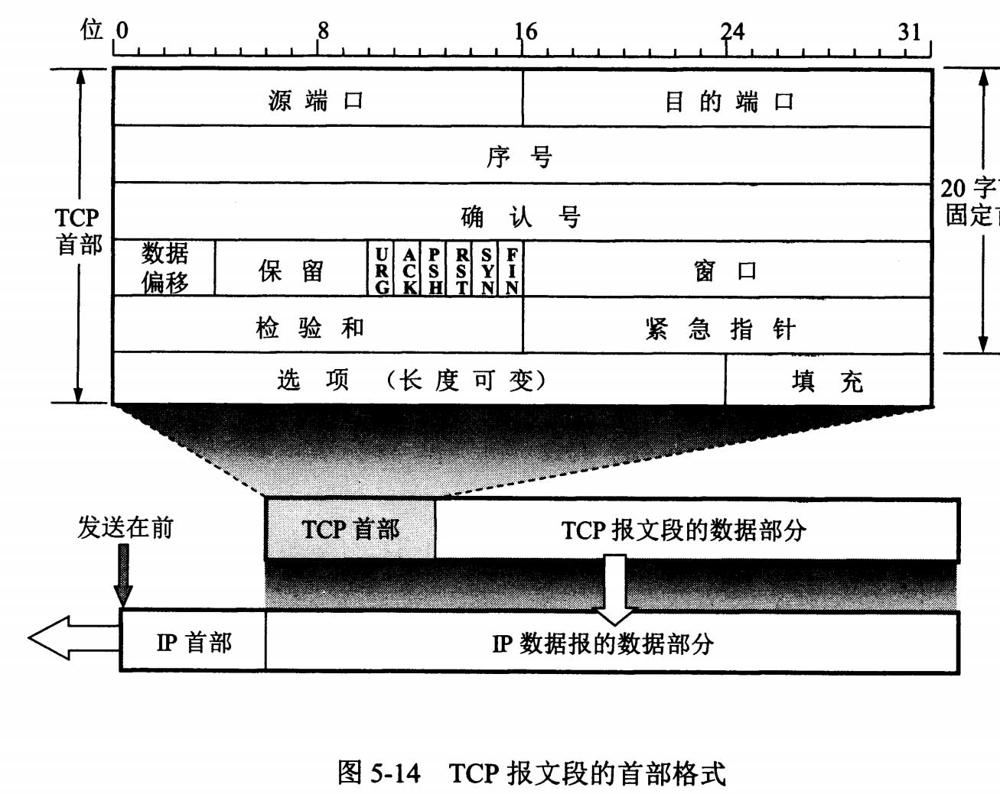
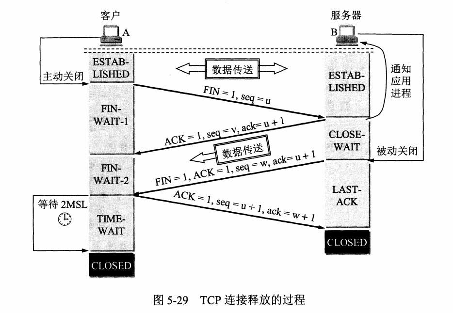
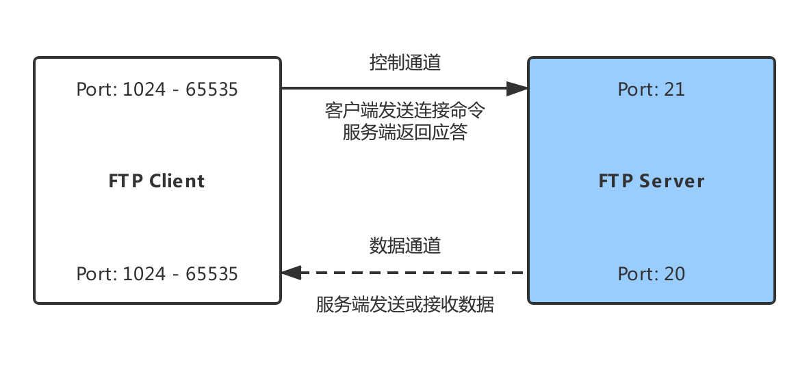
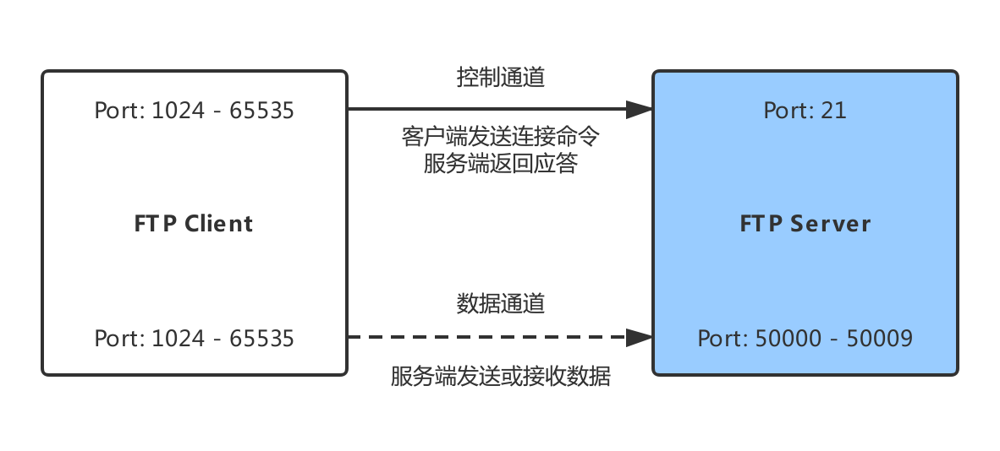

# 技术面试必备基础知识-计算机网络

> 在线阅读：[CS-Notes-Network](https://cyc2018.github.io/CS-Notes/#/README?id=%e2%98%81%ef%b8%8f-%e7%bd%91%e7%bb%9c)

## 计算机网络
### 概述
- 网络的网络：网络把主机连接起来，而互联网是把多种不同的网络连接起来，因此互联网是网络的网络。

	|  |
	| :---: |
	| 图 1-1 网络的网络 |
	
- ISP：互联网服务提供商 (Internet Service Provider, ISP)，可以从互联网管理机构获得许多 IP 地址，同时拥有通信线路以及路由器等联网设备，个人或机构向 ISP 缴纳一定的费用就可以接入互联网。

- 目前的互联网是一种多层次 ISP 结构，ISP 根据覆盖面积的大小分为第一层 ISP、区域 ISP 和接入 ISP。互联网交换中心 IXP 允许两个 ISP 直接相连而不用经过第三个 ISP。

	|  |
	| :---: |
	| 图 1-2 多层次 ISP 结构 |

#### 主机之间的通信方式
- 浏览器-服务器 (B/S)：浏览器是服务的请求方，服务器是服务的提供方。
- 客户机-服务器 (C/S)：客户是服务的请求方，服务器是服务的提供方。
- 对等 (P2P)：不区分客户和服务器 ，即每个节点的功能都是等价的，节点既是客户机也是服务器。

	|  |
	| :---: |
	| 图 1-3 主机之间的通信方式 |
	
#### 电路交换与分组交换
- 电路交换：电路交换用于 `电话通信系统`，两个用户要通信之前需要建立一条 `专用的物理链路`，并且在整个通信过程中 `始终占用` 该链路。由于通信的过程中不可能一直在使用传输线路，因此电路交换对线路的利用率很低，往往不到 10%。

- 分组交换：每个分组都有首部和尾部，包含了 `源地址` 和 `目的地址` 等控制信息，在同一个传输线路上 `同时传输多个分组` 互相不会影响，因此在同一条传输线路上允许同时传输多个分组，也就是说分组交换 `不需要占用` 传输线路。

	在一个邮局通信系统中，邮局收到一份邮件之后，先存储下来，然后把相同目的地的邮件一起转发到下一个目的地，这个过程就是存储转发过程，分组交换也使用了存储转发过程。

#### 时延
- 总时延 = 排队时延 + 处理时延 + 传输时延 + 传播时延

	|  |
	| :---: |
	| 图 1-4 总时延 |
	
- 排队时延：分组在路由器的输入队列和输出队列中排队等待的时间，取决于网络当前的通信量。
- 处理时延：主机或路由器收到分组时进行处理所需要的时间，例如分析首部、从分组中提取数据、进行差错检验或查找适当的路由等。
- 传输时延：主机或路由器传输数据帧所需要的时间。时延计算如 (1) 公式所示，$l$ 表示数据帧的长度，$v$ 表示传输速率。

	$$
	\mathcal{delay} = \frac{l(bit)}{v(bit/s)}
	\tag{1}
	$$
	
- 传播时延：电磁波在信道中传播所需要花费的时间，电磁波传播的速度接近光速。时延计算如 (2) 公式所示，其中 $l$ 表示信道长度，$v$ 表示电磁波在信道上的传播速度。

	$$
	\mathcal{delay} = \frac{l(m)}{v(m/s)}
	\tag{2}
	$$

#### 计算机网络体系结构
- 如图 1-5 为计算机网络体系结构 (包括 OSI 七层协议、五层协议以及 TCP/IP 四层协议)：

    |  |
    | :---: |
    | 图 1-5 计算机网络体系结构 |

- OSI 七层协议：为把在一个网络结构下开发的系统与在另一个网络结构下开发的系统互联起来，以实现更高一级的应用，使异种机之间的通信成为可能。便于网络结构标准化，国际标准化组织 (ISO) 于 1984 年形成了开放系统互连参考模型 (Open Systems Interconnection Reference Model，OSI) 的正式文件。
	- `应用层`：为特定应用程序提供数据传输服务，例如 HTTP、DNS 等协议。数据单位为报文。
	- `表示层`：数据压缩、加密以及数据描述，这使得应用程序不必关心在各台主机中数据内部格式不同的问题。
	- `会话层`：建立及管理会话。

		> 五层协议没有表示层和会话层，而是将这些功能留给应用程序开发者处理。

	- `运输层`：为进程提供通用数据传输服务。由于应用层协议很多，定义通用的传输层协议就可以支持不断增多的应用层协议。运输层包括两种协议：传输控制协议 TCP，提供面向连接、可靠的数据传输服务，数据单位为报文段；用户数据报协议 UDP，提供无连接、尽最大努力的数据传输服务，数据单位为用户数据报。TCP 主要提供完整性服务，UDP 主要提供及时性服务。
	- `网络层`：为主机提供数据传输服务。而传输层协议是为主机中的进程提供数据传输服务。网络层把传输层传递下来的报文段或者用户数据报封装成分组。
	- `数据链路层`：网络层针对的还是主机之间的数据传输服务，而主机之间可以有很多链路，链路层协议就是为同一链路的主机提供数据传输服务。数据链路层把网络层传下来的分组封装成帧。
	- `物理层`：考虑的是怎样在传输媒体上传输数据比特流，而不是指具体的传输媒体。物理层的作用是尽可能屏蔽传输媒体和通信手段的差异，使数据链路层感觉不到这些差异。
- TCP/IP 四层协议：它只有四层，相当于五层协议中数据链路层和物理层合并为网络接口层。如图 1-5 (c) 所示。
- 数据在各层间的传递过程：在向下的过程中，需要添加下层协议所需要的首部或者尾部，而在向上的过程中不断拆开首部和尾部。
	
	|  |
	| :---: |
	| 图 1-6 数据在各层间的传递过程 |

### 物理层
#### 通信方式
- 根据信息在传输线上的传送方向，分为以下三种通信方式：
	- 单工通信：单向传输
	- 半双工通信：双向交替传输
	- 全双工通信：双向同时传输

#### 带通调制
- `模拟信号` 是 `连续` 的信号，`数字信号` 是 `离散` 的信号。带通调制把数字信号转换为模拟信号。

	|  |
	| :---: |
	| 图 2-1 数字信号与模拟信号 |

### 链路层
### 网络层
### 传输层
- 网络层只把分组发送到目的主机，但是真正通信的并不是主机而是主机中的进程。
- 传输层提供了进程间的逻辑通信，传输层向高层用户屏蔽了下面网络层的核心细节，使应用程序看起来像是在两个传输层实体之间有一条端到端的逻辑通信信道。

#### UDP 和 TCP 的特点
- `UDP`：用户数据报协议 (User Datagram Protocol，UDP) 
	- 是 `无连接` 的，`尽最大可能交付`；
	- 没有拥塞控制，面向报文 (对于应用程序传下来的报文不合并也不拆分，只是添加 UDP 首部)；
	- 支持一对一、一对多、多对一和多对多的交互通信。
-  `TCP`：传输控制协议 (Transmission Control Protocol，TCP）
	-  是 `面向连接` 的，提供 `可靠交付`；
	-  有流量控制，拥塞控制，提供 `全双工通信`，`面向字节流` (把应用层传下来的报文看成字节流，把字节流组织成大小不等的数据块)；

		> TCP 一次传输的报文长度有限制，若太大则需分块、分次传输。但由于 TCP 连接的可靠性，接收方可按顺序接收数据块，并重新组成分块前的数据流，此过程就像直接相互传输字节流一样，即 `面向字节流`。
	
	-  每一条 TCP 连接只能是点对点的 (一对一)。

#### UDP 首部格式

|  |
| :---: |
| 图 5-1 用户数据报的首部和伪首部 |

首部字段只有 8 个字节，包括源端口、目的端口、长度、检验和。12 字节的伪首部是为了计算检验和临时添加的。

#### TCP 首部格式

|  |
| :---: |
| 图 5-2 TCP 报文段的首部格式 |

- `序号`：用于对字节流进行编号，例如序号为 301，表示第一个字节的编号为 301，如果携带的数据长度为 100 字节，那么下一个报文段的序号应为 401。

- `确认号`：期望收到的下一个报文段的序号。例如 B 正确收到 A 发送来的一个报文段，序号为 501，携带的数据长度为 200 字节，因此 B 期望下一个报文段的序号为 701，B 发送给 A 的确认报文段中确认号就为 701。

- `数据偏移`：数据部分距离报文段起始处的偏移量，实际指的是首部的长度。

- `确认 ACK`：当 ACK=1 时确认号字段有效，否则无效。TCP 规定，在连接建立后所有传送的报文段都必须把 ACK 置 1。
- `同步 SYN` ：在连接建立时用来同步序号。
	- 当 SYN=1，ACK=0 时表示这是一个 `连接请求报文段`。
	- 若对方同意建立连接，则 `响应报文段` 中 SYN=1，ACK=1。

- `终止 FIN`：用来释放一个连接，当 FIN=1 时，表示此报文段的发送方的数据已发送完毕，并要求释放连接。
- `窗口`：窗口值作为接收方让发送方设置其发送窗口的依据。之所以要有这个限制，是因为接收方的数据缓存空间是有限的。

#### TCP 的三次握手

|  |
| :---: |
| 图 5-3 TCP 的三次握手 |

> 假设 A 为客户端，B 为服务器端。

##### 细节描述
- 首先 B 处于 LISTEN 监听状态，等待客户的连接请求。

- A 向 B 发送连接请求报文，SYN=1，ACK=0，选择一个初始的序号 x。

- B 收到连接请求报文，如果同意建立连接，则向 A 发送连接确认报文，SYN=1，ACK=1，确认号为 x+1，同时也选择一个初始的序号 y。

- A 收到 B 的连接确认报文后，还要向 B 发出确认，确认号为 y+1，序号为 x+1。

- B 收到 A 的确认后，连接建立。

##### 注意事项
- 因 TCP提供的是 `全双工通信`，故通信双方的应用进程在 `任何时候` 都能发送数据
三次握手期间。
- 任何一次未收到对面的回复都会重发。
- SYN 洪泛攻击Ω：服务器易于受到 SYN 洪泛攻击，即同时多个客户端发起连接请求，从而需进行多个请求的TCP连接资源分配。

	> 服务端的TCP资源分配时刻 = 完成第二次握手时；而客户端的TCP资源分配时刻 = 完成第三次握手时。

##### 三次握手的原因
- 第三次握手是为了防止 `失效的连接请求` 到达服务器，让服务器 `错误打开连接`。

	> 例如，客户端发送的连接请求如果在网络中滞留，那么就会隔很长一段时间才能收到服务器端发回的连接确认。客户端等待一个超时重传时间之后，就会重新请求连接。但是这个滞留的连接请求最后还是会到达服务器，如果不进行三次握手，那么服务器就会打开两个连接。

- 如果有第三次握手，客户端会 `忽略` 服务器之后发送的对 `滞留连接请求` 的连接确认，不进行第三次握手，因此就不会再次打开连接。

#### TCP 的四次挥手

|  |
| :-: |
| 图 5-4 TCP 的四次挥手 |

> 以下描述不讨论序号和确认号，因为序号和确认号的规则比较简单。并且不讨论 ACK，因为 ACK 在连接建立之后都为 1。

##### 细节描述
- A 发送连接释放报文，FIN=1。

- B 收到之后发出确认，此时 TCP 属于 `半关闭状态`，B 能向 A 发送数据但是 A 不能向 B 发送数据。

- 当 B 不再需要连接时，发送连接释放报文，FIN=1。

- A 收到后发出确认，进入 TIME-WAIT 状态，等待 2 MSL（最大报文存活时间）后释放连接。

- B 收到 A 的确认后，释放连接。

##### 四次挥手的原因
- 客户端发送了 FIN 连接释放报文之后，服务器收到了这个报文，就进入了 CLOSE-WAIT 状态。这个状态是为了让服务器端发送还未传送完毕的数据，传送完毕之后，服务器会发送 FIN 连接释放报文。

- `TIME_WAIT`：客户端接收到服务器端的 FIN 报文后进入此状态，此时并不是直接进入 CLOSED 状态，还需等待一个时间计时器设置的时间 2MSL。理由如下：
	- 确保最后一个确认报文能够到达。如果 B 没收到 A 发送来的确认报文，那么就会重新发送连接释放请求报文，A 等待一段时间就是为了处理这种情况的发生。
	- 等待一段时间是为了让本连接持续时间内所产生的所有报文都从网络中消失，使得下一个新的连接不会出现旧的连接请求报文。

### 应用层
#### 域名系统 DNS
- 域名系统 (Domain Name System，DNS) 是一个分布式数据库，提供了 `主机名` 和 `IP` 地址之间相互转换的服务。这里的分布式数据库是指，每个站点只保留它自己的那部分数据。
- 域名具有层次结构，从上到下依次为：根域名、顶级域名、二级域名。

	|  |
	| :-: |
	| 图 6-1 域名系统 |

- DNS 可以使用 UDP 或者 TCP 进行传输，使用的端口号都为 `53`。大多数情况下 DNS 使用 UDP 进行传输，这就要求域名解析器和域名服务器都必须自己处理超时和重传从而保证可靠性。在两种情况下会使用 TCP 进行传输：
	- 返回的响应超过的 512 字节 (UDP 最大只支持 512 字节的数据)。
	- 区域传送：指主域名服务器向辅助域名服务器传送变化的那部分数据。

#### 文件传送协议 FTP
- 文件传输协议 (File Transfer Protocol，FTP)，使用 TCP 进行连接，它需要 `两个连接` 来传送一个文件：
	- `控制连接`：服务器打开端口号 `21` 等待客户端的连接，客户端主动建立连接后，使用这个连接将客户端的命令传送给服务器，并传回服务器的应答。
	- `数据连接`：用来传送一个文件数据。
- 根据数据连接是否是服务器端主动建立，FTP 有主动和被动两种模式：
	- `主动模式`：服务器端主动建立数据连接，其中 `服务器端` 的端口号为 `20`，`客户端` 的端口号随机，但是必须 `大于 1024`，因为 0~1023 是熟知端口号。

		|  |
		| :-: |
		| 图 6-2 主动模式 |
	
	- `被动模式`：客户端主动建立数据连接，其中客户端的端口号由客户端自己指定，服务器端的端口号随机。

		|  |
		| :----------------------------------------------: |
		| 图 6-2-1 被动模式 |
	
- 主动模式要求客户端开放端口号给服务器端，需要去配置客户端的 `防火墙`。被动模式只需要服务器端开放端口号即可，无需客户端配置防火墙。但是被动模式会导致服务器端的安全性减弱，因为开放了过多的端口号。

#### 动态主机配置协议 DHCP
- 动态主机配置协议 (Dynamic Host Configuration Protocol，DHCP) 提供了即插即用的连网方式，用户不再需要手动配置 IP 地址等信息。
- DHCP 配置的内容不仅是 IP 地址，还包括 `子网掩码`、`网关 IP 地址`。
- DHCP 工作过程如下：

	|  |
	| :-: |
	| 图 6-3 DHCP 工作过程 |

	- 客户端发送 Discover 报文，该报文的目的地址为 255.255.255.255:67，源地址为 0.0.0.0:68，被放入 UDP 中，该报文被广播到同一个子网的所有主机上。如果客户端和 DHCP 服务器不在同一个子网，就需要使用中继代理。
	- DHCP 服务器收到 Discover 报文之后，发送 Offer 报文给客户端，该报文包含了客户端所需要的信息。因为客户端可能收到多个 DHCP 服务器提供的信息，因此客户端需要进行选择。
如果客户端选择了某个 DHCP 服务器提供的信息，那么就发送 Request 报文给该 DHCP 服务器。
	- DHCP 服务器发送 Ack 报文，表示客户端此时可以使用提供给它的信息。

## HTTP 协议
### 基本概念
### HTTP 方法
### HTTP 状态码
### HTTP 首部
### 具体应用
### HTTPS
### HTTP/2.0
### HTTP/1.1 新特性
### GET 和 POST 比较

## Socket 协议
### I/O 模型
### I/O 服用