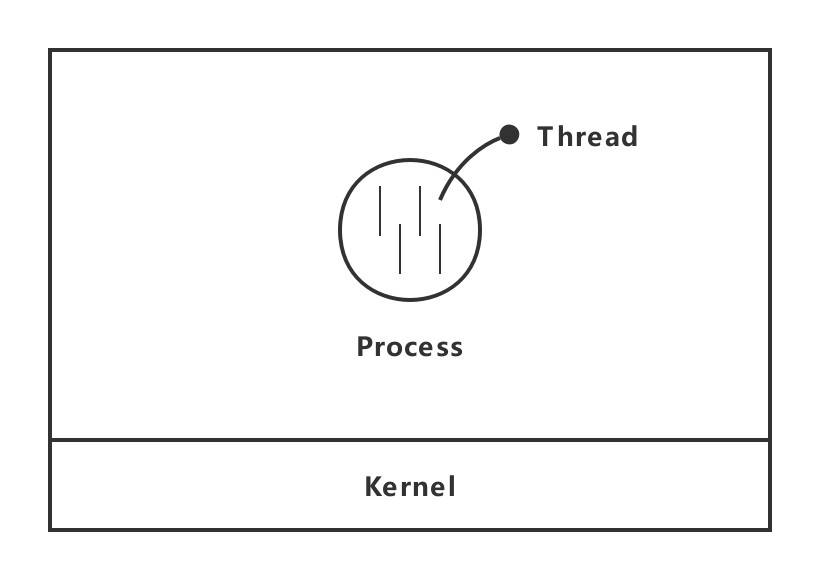
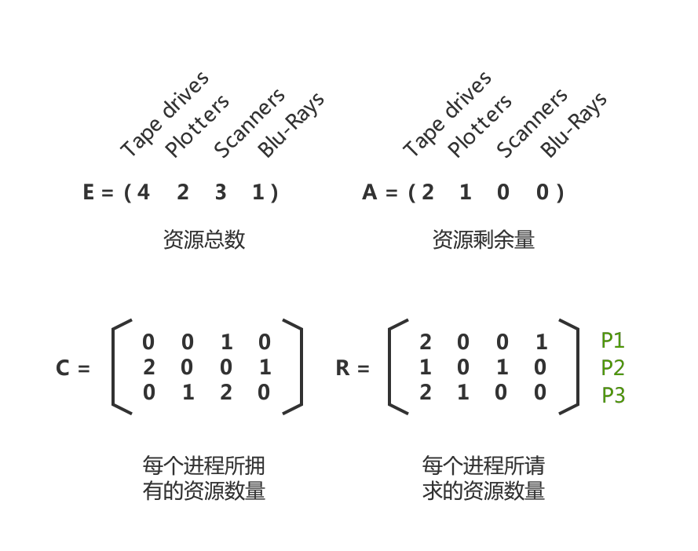

# 技术面试必备基础知识-操作系统

> 在线阅读：[CS-Notes-OS](https://cyc2018.github.io/CS-Notes/#/README?id=%f0%9f%92%bb-%e6%93%8d%e4%bd%9c%e7%b3%bb%e7%bb%9f)

## 操作系统
### 概述
#### 基本特征
##### 并发
- 并发是指宏观上在一段时间内能 `同时` 运行多个 `程序`，而并行则指 `同一时刻` 能运行多个 `指令`。
- `并行` 需要 `硬件` 支持，如多流水线、多核处理器或者分布式计算系统。
- 操作系统通过引入 `进程` 和 `线程`，使得程序能够 `并发` 运行。

##### 共享
- 共享是指系统中的资源可以被多个并发进程共同使用。

- 有两种共享方式：互斥共享和同时共享。
	- `互斥共享`：互斥共享的资源称为 `临界资源`，在同一时刻只允许一个进程访问，需要用同步机制来实现互斥访问。典型问题是 `打印机共享访问`。
	- `进程同步`：在多道程序环境下，进程是并发执行的，不同进程之间存在着不同的相互制约关系。典型的问题有 `生产消费者问题`、`哲学家进餐问题` 等。

##### 虚拟
- 虚拟技术把一个物理实体转换为多个逻辑实体。主要有两种虚拟技术：时 (时间) 分复用技术和空 (空间) 分复用技术。
	- `时分复用技术`：多个进程能在同一个处理器上并发执行使用了时分复用技术，让每个进程轮流占用处理器，每次只执行一小个时间片并快速切换。
	- `空分复用技术`：虚拟内存使用了空分复用技术，它将物理内存抽象为地址空间，每个进程都有各自的地址空间。地址空间的页被映射到物理内存，地址空间的页并不需要全部在物理内存中，当使用到一个没有在物理内存的页时，执行页面置换算法，将该页置换到内存中。

####  异步
- 异步指进程不是一次性执行完毕，而是走走停停，以不可知的速度向前推进。

#### 基本功能
##### 进程管理
- 进程控制、进程同步、进程通信、死锁处理、处理机调度等。

##### 内存管理
- 内存分配、地址映射、内存保护与共享、虚拟内存等。

##### 文件管理
- 文件存储空间的管理、目录管理、文件读写管理和保护等。

##### 设备管理
- 完成用户的 I/O 请求，方便用户使用各种设备，并提高设备的利用率。
- 主要包括缓冲管理、设备分配、设备处理、虛拟设备等。

### 进程管理
#### 进程
- 进程是 `资源分配` 的基本单位。
- 进程控制块 (Process Control Block, PCB) 描述进程的 `基本信息` 和 `运行状态`，所谓的创建进程和撤销进程，都是指对 PCB 的操作。
- 下图显示了 4 个程序创建了 4 个进程，这 4 个进程可以并发地执行。

	|  |
	| :---: |
	| 图 2-1 进程图示 |

#### 线程
- 线程是 `独立调度` 的基本单位。
- 一个进程中可以有多个线程，它们共享进程资源。

	> QQ 和浏览器是两个进程，浏览器进程里面有很多线程。例如 HTTP 请求线程、事件响应线程、渲染线程等，线程的并发执行使得在浏览器中点击一个新链接从而发起 HTTP 请求时，浏览器还可以响应用户的其它事件。
	
	|  |
	| :---: |
	| 图 2-2 线程图示 |

#### 进程和线程的区别
- `拥有资源`：进程是 `资源分配` 的基本单位，但是线程不拥有资源，线程可以访问隶属进程的资源。

- `调度`：线程是 `独立调度` 的基本单位，在同一进程中，线程的切换不会引起进程切换。但是从一个进程中的线程切换到另一个进程中的线程时，会引起进程切换。

- `系统开销`：由于创建或撤销进程时，系统都要为之分配或回收资源，如内存空间、I/O 设备等，所付出的开销远大于创建或撤销线程时的开销。类似地，在进行进程切换时，涉及当前执行进程 CPU 环境的保存及新调度进程 CPU 环境的设置，而线程切换时只需保存和设置少量寄存器内容，开销很小。

- `通信方面`：线程间可以通过直接读写同一进程中的数据进行通信，但是进程通信需要借助  `IPC` (进程间通信，Inter-Process Communication)。

### 进程通信
- 进程同步与进程通信很容易混淆，它们的区别在于：
	- 进程同步：控制多个进程按一定顺序执行；
	- 进程通信：进程间传输信息。
- 进程通信是一种 `手段`，而进程同步是一种 `目的`。即为了能够达到 `进程同步的目的`，需要让 `进程进行通信`，传输一些进程同步所需要的信息。

#### 管道
- 管道是通过调用 `pipe()` 函数创建的，`fd[0]` 用于读，`fd[1]` 用于写

#### 命名管道
- 命名管道是一种 FIFO (First-In First-Out，先进先出）对象。去除了管道只能在父子进程中使用的限制。

	```c
	#include <sys/stat.h>
	int mkfifo(const char *path, mode_t mode);
	int mkfifoat(int fd, const char *path, mode_t mode);
	```
	
- FIFO 常用于客户-服务器应用程序中，FIFO 用作汇聚点，在客户进程和服务器进程之间传递数据。

	|  |
	| :---: |
	| 图 3-1 FIFO在客户进程和服务器进程之间传递数据 |

#### 消息队列
- 相比于 FIFO，消息队列具有以下优点：

	- 消息队列可以独立于读写进程存在，从而避免了 FIFO 中同步管道的打开和关闭时可能产生的困难；

	- 避免了 FIFO 的同步阻塞问题，不需要进程自己提供同步方法；

	- 读进程可以根据消息类型有选择地接收消息，而不像 FIFO 那样只能默认地接收。

#### 信号量
- 它是一个计数器，用于为多个进程提供对共享数据对象的访问。

#### 共享存储
- 需要使用信号量用来同步对共享存储的访问。
- 允许多个进程共享一个给定的存储区。因为数据不需要在进程之间复制，所以这是最快的一种 IPC。
- 多个进程可以将同一个 `文件映射到它们的地址空间` 从而实现共享内存。另外 XSI 共享内存不是使用文件，而是使用内存的匿名段。

#### 套接字
- 与其它通信机制不同的是，它可用于不同机器间的进程通信。

### 死锁
#### 必要条件
- `互斥`：资源是独占的且排他使用，进程互斥使用资源。每个资源要么已分配给一个进程，要么就是可用的。
- `占有和等待`：已经得到的资源的某进程可再请求资源。
- `不可抢占`：已经分配给进程的资源不可强性被抢占，只能是占有进程显式地释放。
- `环路等待`：有两个及以上的进程组成一条环路，该环路中的每个进程都在等待下一个进程所占有的资源。

	> 以上给出了导致死锁的四个必要条件，只要系统发生死锁则以上四个条件至少有一个成立。反过来思考，我们可通过破坏四个条件中的任何一个来预防死锁的发生。

#### 处理方法
##### 鸵鸟策略
> 把头埋在沙子里，假装根本没发生问题。

- 因解决死锁问题的代价很高，因此鸵鸟策略这种不采取任务措施的方案会获得更高的性能。
- 大多数操作系统，包括 Unix，Linux 和 Windows，处理死锁问题的办法仅仅是忽略它。

##### 死锁检测
- 不试图阻止死锁，而是当检测到死锁发生时，采取措施进行恢复。

###### 每种类型一个资源的死锁检测

- 下图 4-1 为资源分配图，其中 `方框表示资源`，`圆圈表示进程`。资源指向进程表示该资源已经分配给该进程，进程指向资源表示进程请求获取该资源。
	
	图 (a) 可以抽取出环，如图 (b)，它满足了环路等待条件，因此会发生死锁。

	|  |
	| :---: |
	| 图 4-1 每种类型一个资源的死锁检测 |
	
- 每种类型一个资源的死锁检测算法是通过 `检测有向图是否存在环` 来实现。从一个节点出发进行 `深度优先搜索`，对访问过的节点进行标记，如果访问了已经标记的节点，就表示有向图存在环，也就是检测到死锁的发生。

###### 每种类型多个资源的死锁检测
- 如图 4-2 所示，有三个进程四个资源，每个数据代表的含义如下：
	- E 向量：资源总量
	- A 向量：资源剩余量
	- C 矩阵：每个进程所拥有的资源数量，每一行都代表一个进程拥有资源的数量
	- R 矩阵：每个进程请求的资源数量

	|  |
	| :---: |
	| 图 4-2 每种类型多个资源的死锁检测 |
	
- 进程 P1 和 P2 所请求的资源都得不到满足，只有进程 P3 可以，让 P3 执行，之后释放 P3 拥有的资源，此时 A = (2 2 2 0)。P2 可以执行，执行后释放 P2 拥有的资源，A = (4 2 2 1) 。P1 也可以执行。所有进程都可以顺利执行，没有死锁。
- 算法总结如下：每个进程最开始时都不被标记，执行过程有可能被标记。当算法结束时，任何没有被标记的进程都是死锁进程。
	- `Step.01`：寻找一个没有标记的进程 Pi，它所请求的资源小于等于 A。
	- `Step.02`：若找到了这样一个进程，那么将 C 矩阵的第 i 行向量加到 A 中，标记该进程并转回 1。
	- `Step.03`：若没找到这样一个进程，算法终止。

##### 死锁恢复
- 利用抢占恢复
- 利用回滚恢复
- 通过杀死进程恢复

##### 死锁预防
> 在程序运行前预防发生死锁。

- `破坏互斥条件`：例如假脱机打印机技术允许若干个进程同时输出，唯一真正请求物理打印机的进程是打印机守护进程。
- `破坏占有和等待条件`：一种实现方式是规定所有进程在开始执行前请求所需要的全部资源。
- `破坏不可抢占条件`：允许对资源实行抢夺。
	- 方法一：一个进程不能获得所需全部资源时便处于等待状态，等待期间他占有的资源将被隐式的释放重新加入到系统的资源列表中，可被其他的进程使用，而等待的进程只有重新获得自己原有的资源以及新申请的资源才可以重新启动执行。
	- 方法二：若一进程请求当前被另一进程占有的一个资源，则操作系统可抢占另一个进程，要求它释放资源。仅在任意两个进程的优先级都不相同的条件下，该方法才能预防死锁。
- `破坏环路等待`：给资源统一编号，进程只能按编号顺序来请求资源。

##### 死锁避免
> 在程序运行时避免发生死锁。

###### 安全状态
- 图 (a) 的第二列 Has 表示已拥有的资源数，第三列 Max 表示总共需要的资源数，Free 表示还有可以使用的资源数。
- 从图 (a) 开始出发，先让 B 拥有所需的所有资源 (图 b)，运行结束后释放 B，此时 Free 变为 5 (图 c)；接着以同样的方式运行 C 和 A，使得所有进程都能成功运行，因此可以称图 a 所示的状态时安全的。

	|  |
	| :---: |
	| 图 4-3 证明 (a) 的状态是安全的 |

- 定义：如果没有死锁发生，并且即使所有进程突然请求对资源的最大需求，也仍然存在某种 `调度次序` 能够使得 `每一个进程运行完毕`，则称该状态是安全的。

	> 安全状态的检测与死锁的检测类似，因为安全状态必须要求不能发生死锁。下面的银行家算法与死锁检测算法非常类似，可以结合着做参考对比。

###### 单个资源的银行家算法
- 一个小城镇的银行家，他向一群客户分别承诺了一定的贷款额度，算法要做的是判断对请求的满足是否会进入不安全状态，如果是，就拒绝请求；否则予以分配。

	图 (c) 为不安全状态，因此算法会拒绝之前的请求，从而避免进入图 (c) 中的状态。
	
	|  |
	| :---: |
	| 图 4-4 单个资源的银行家算法 |

###### 多个资源的银行家算法
- 如图 4-5 所示，有五个进程，四个资源。

	|  |
	| :---: |
	| 图 4-5 多个资源的银行家算法 |

	- 左边的图表示已经分配的资源，右边的图表示还需要分配的资源。
	- 最右边的 E、P 以及 A 分别表示：总资源、已分配资源以及可用资源。

		> 注意这三个为向量，而不是具体数值，例如 A = ( 1 0 2 0 )，表示 4 个资源分别还剩下 1/0/2/0。
	
- 检查一个状态是否安全的算法如下：
	- Step.01：查找右边的矩阵是否存在一行小于等于向量 A。如果不存在这样的行，那么系统将会发生死锁，状态是不安全的。
	- Step.02：假若找到这样一行，将该进程标记为终止，并将其已分配资源加到 A 中。
	- Step.03：重复以上两步，直到所有进程都标记为终止，则状态时安全的。若一个状态不是安全的，需要拒绝进入这个状态。

### 内存管理
### 设备管理
### 链接