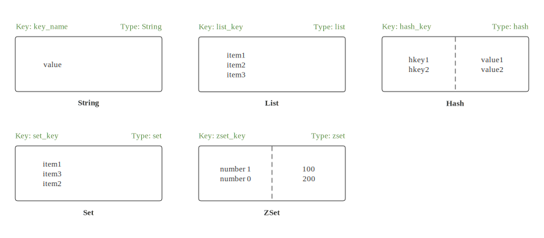
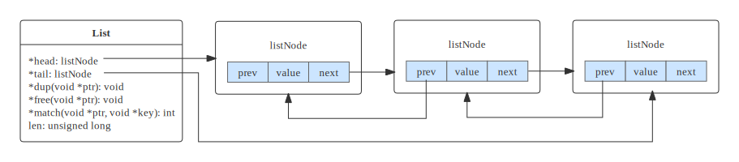
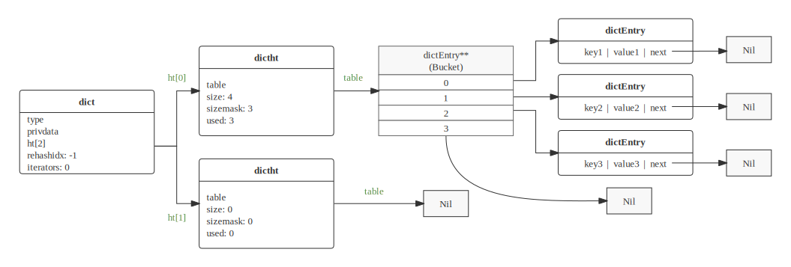
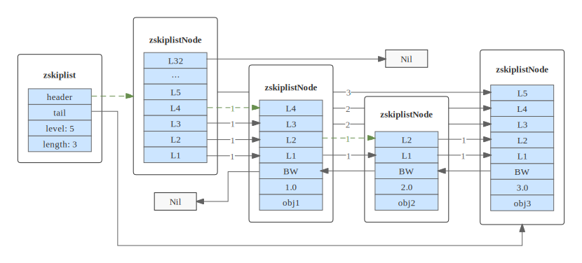
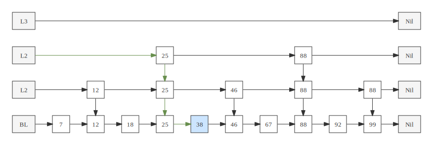

# 技术面试必备基础知识-Redis

## 基本概念
- Redis：非关系型（Non-relational database, NoSQL）的远程内存键值数据库，可存储（key）和五种不同类型值（value）之间的映射（Mapping）。
- Redis 特性介绍
	- 将内存中的数据持久化到硬盘中，
		- 快照持久化（Snapshotting）：将存在于某一时刻的所有数据都写入硬盘中。
		- AOF 持久化（Append-only file）：在执行写命令时，把执行写命令复制到硬盘中。
	- 使用 `复制` 来扩展 `读性能`。
	- 使用客户端 `分片` 来扩展 `写性能`。

		> 分片：将数据划分为多个部分的方法，数据划分可基于键包含的ID、基于键的哈希值或者两者的组合进行。数据分片后，数据可存储于多台服务器中。

## 数据类型
- 键的数据类型：字符串
- 值的数据类型：字符串、列表、集合、哈希表、有序集合

	| 数据类型 | 存储的值 | 操作 |
	| :---: | :---: | :--- |
	| String | 字符串 / 整数 / 浮点数 | 对整个字符串或者字符串的其中一部分执行操作<br>对整数和浮点数执行自增 / 自减操作 |
	| List | 列表 | 从两端压入或者弹出元素<br>对单个或者多个元素进行修剪，只保留一个范围内的元素 |
	| Set | 无序集合 | 添加、获取、移除单个元素<br>检查一个元素是否存在于集合中<br>计算交集、并集、差集<br>从集合里面随机获取元素 |
	| Hash | 包含键值对的无序哈希表 | 添加、获取、移除单个键值对<br>获取所有键值对<br>检查某个键是否存在 |
	| Zset | 有序集合 | 添加、获取、删除元素<br>根据分值范围或者成员来获取元素<br>计算一个键的排名 |

## 快速上手

|  |
| :---: |
| Redis 五大数据类型 |

### 字符 String

- set / get 命令：

	```bash
	> set key_name value
	OK
	> get key_name
	"value"
	> del key_name
	(integer) 1
	get key_name
	(nil)
	```

### 列表 List
- rpush 命令：

	```bash
	# 向列表推入新元素后会返回列表当前长度
	> rpush list_key item1
	(integer) 1
	> rpush list_key item2
	(integer) 2
	> rpush list_key item3
	(integer) 3
	```
- lrange 命令：

	```bash
	# 0 为起始索引，-1 为结束索引，取出指定范围内的所有元素
	> lrange list_key 0 -1
	1) "item1"
	2) "item2"
	3) "item3"
	```

- lindex 命令：

	```bash
	# 取出指定索引的元素
	> lindex list_key 1
	"item2"
	```

- lpop 命令：

	```bash
	# 从列表中弹出一个元素（出队）
	> lpop list_key
	"item1"
	```

### 集合 Set
- sadd 命令：

	```bash
	# 向集合中添加一个元素
	# 返回 1 表示元素被成功追加，返回 0 表示元素已存在集合中
	> sadd set_key item1
	(integer) 1
	> sadd set_key item2
	(integer) 1
	> sadd set_key item1
	(integer) 0
	```

- sismember 命令：

	```bash
	# 获取集合所有元素 --> 序列
	> sismember set_key
	1) "item1"
	2) "item2"

	# 检查元素是否存在于集合中
	> sismember set_key item3
	(integer) 0
	> sismember set_key item1
	(integer) 1
	```

- srem 命令：

	```bash
	# 从集合中移除某元素，成功返回 1，失败返回 0（键不存在）
	> srem set_key item2
	(integer) 1
	> srem set_key item2
	(integer) 0
	```

### 哈希 Hash
- hset 命令

	```bash
	# 向哈希表中添加键值对
	> hset hash_key hkey1 value1
	(integer) 1
	> hset hash_key hkey2 value2
	(integer) 1
	> hset hash_key hkey1 value3
	(integer) 0
	```

- hget 命令

	```bash
	# 获取哈希表中某个键值
	> hget hash_key hkey1
	"value1"
	```

- hgetall 命令

	```bash
	# 获取哈希表中所有键值对 --> 字典
	> hgetall hash_key
	1) "hkey1"
	2) "value1"
	3) "hkey2"
	4) "value2"
	```

- hdel 命令

	```bash
	# 删除键值对，成功返回 1，失败返回 0（键不存在）
	> hdel hash_key hkey1
	> (integer) 1
	> hdel hash_key hkey1
	> (integer) 0 
	```

### 有序集 Zset
- zadd 命令：

	```bash
	# 向有序集合中添加元素，成功返回 1，失败返回 0（键已存在）
	# 示例：zadd zset_key 分值 元素（成员）
	> zadd zset_key 100 member1
	(integer) 1
	> zadd zset_key 200 member0
	(integer) 1
	> zadd zset_key 100 member0
	(integer) 0
	```

- zrange 命令：

	```bash
	# 获取有序集合所有元素，多个元素按照分值大小排序
	> zrange zset_key 0 -1 withscores
	1) "member1"
	2) "100"
	3) "member0"
	4) "200"
	```

- zrangebyscore 命令：

	```bash
	# 根据分值筛选有序集合的一部分元素
	> zrangebyscore zset_key 150 300 withscores
	1) "member0"
	2) "200"
	```

- zrem 命令：

	```bash
	# 移除有序元素中的某个元素，成功返回 1，失败返回 0
	> zrem zset_key member1
	(integer) 1
	> zrem zset_key member1
	(integer) 0
	```

## 数据结构
### 动态字符串
- 简单动态字符串（Simple Dynamic String, sds）作为 Redis 底层所使用的字符串表示， 几乎所有 Redis 模块中都用了 sds。
- Redis 使用 sds 取代 C 默认的 char\* 类型（以 \0 结尾的 char\*）。

	```c
	typedef char *sds;

	struct sdshdr {
		int len;	// buf 已占用长度
		int free;	// buf 剩余可用长度
		char buf[];	// 实际保存字符串的字符数组
	};
	```

- 对比 C 字符串， sds 有以下特性：
	- 可以高效地执行长度计算（strlen）。
	- 可以高效地执行追加操作（append）。
	- 二进制安全：程序不应对字符串里保存的数据作任何假设，数据可以是以 \0结尾的 C 字符串，也可以是单纯的字节数组或者其他格式的数据。
	- 优化追加操作：加快追加操作速度，并降低内存分配的次数；代价是多占用了一些内存，而且这些内存不会被主动释放。

### 双向链表
- Redis 列表 List 使用两种数据结构作为底层实现：
	- 双端链表
	- 压缩列表
- 因双端链表占用的内存比压缩列表要多，为此在创建新的列表键时，列表会优先考虑使用压缩列表作为底层实现，并且在有需要之时才从压缩列表实现转换到双端链表实现。
- 双端链表的实现由 list 和 listNode 两个数据结构构成：

	```c
	typedef struct list {		// 双端链表本身
		listNode *head;			// 表头指针
		listNode *tail;			// 表尾指针
		unsigned long len;		// 节点数量
	
		void *(*dup)(void *ptr);			// 复制函数
		void (*free)(void *ptr);			// 释放函数
		int (*match)(void *ptr, void *key);	// 比对函数
	} list;
	
	typedef struct listNode {	// 双端链表节点
		struct listNode *prev;	// 前驱节点
		struct listNode *next;	// 后继节点
		void *value;			// 值
	} listNode;
	```
	
	|  |
	| :---: |
	| Redis 列表的双向链表结果 |

### 字典
- Redis 的 Hash 类型键使用以下两种数据结构作为底层实现：
	- 字典
	- 压缩列表
- 因压缩列表比字典更节省内存， 为此在创建新 Hash 键时， 默认使用压缩列表作为底层实现， 当有需要之时才会从压缩列表转换到字典。
- Redis 的字典是基于哈希表实现的，一个哈希表里面有多个哈希表节点，每个节点表示字典的一个键值对。

	```c
	/* dictht 是一个哈希表结构，使用拉链法解决哈希冲突 */
	typedef struct dictht {		// 哈希表
		dictEntry **table;		// 哈希表数组
		unsigned long size;		// 哈希表大小
		unsigned long sizemask;	// 哈希表掩码（用于计算索引值）
		unsigned long used;		// 已使用键值对数量
	} dictht;
	
	typedef struct dictEntry {	// 哈希表节点
		void *key;	// 键
		union {		// 值
			void *val;
			uint64_t u64;
			int64_t s64;
			double d;
		} v;
		struct dictEntry *next;	// 指向下一个哈希节点（拉链法解决哈希冲突）
	} dictEntry;
	```

- type 属性是一个指向 dictType 结构的指针，每个 dictType 结构保存了一簇用于操作特定类型键值对的函数， Redis 会为用途不同的字典设置不同的类型特定函数。

	```c
	typedef struct dictType {
		// 计算哈希值的函数
		unsigned int (*hashFunction)(const void *key);
		// 复制键的函数
		void *(*keyDup)(void *privdata, const void *key);
		// 复制值的函数
		void *(*valDup)(void *privdata, const void *obj);
		// 对比键的函数
		int (*keyCompare)(void *privdata, const void *key1, const void *key2);
		// 销毁键的函数
		void (*keyDestructor)(void *privdata, void *key);
		// 销毁值的函数
		void (*valDestructor)(void *privdata, void *obj);
	} dictType;
	```

- Redis 的字典 dict 中包含两个哈希表 dictht，这是为了方便进行 rehash 操作。在扩容时，将其中一个 dictht 上的键值对 rehash 到另一个 dictht 上面，完成之后释放空间并交换两个 dictht 的角色。

	```c
	typedef struct dict {
		// 特定于类型的处理函数
		dictType *type;
		// 类型处理函数的私有数据
		void *privdata;
		// 2 个哈希表（用于实现渐进式 Rehash），其中：
		// 0 号哈希表（ht[0]）是字典主要使用的哈希表
		// 1 号哈希表（ht[1]）只有在程序对 0 号哈希表进行 rehash 时才使用
		dictht ht[2];
		// Rehashing 的进程进度（-1 表示非 Rehash 状态）
		long rehashidx; 
		// 当前正在运作的安全迭代器数量
		unsigned long iterators; 
	} dict;
	```
	
	- rehash 操作不是一次性完成，而是采用渐进方式进行的。这是为了避免一次性执行过多的 rehash 操作给服务器带来过大的负担。
	- 渐进式 rehash 通过记录 dict 的 rehashidx 完成，它从 0 开始，然后每执行一次 rehash 都会递增。

		> 例如：一次 rehash 中，要把 dict[0] rehash 到 dict[1]，这一次会把 dict[0] 上 table[rehashidx] 的键值对 rehash 到 dict[1] 上，dict[0] 的 table[rehashidx] 指向 null，并令 rehashidx++。

	- 在 rehash 期间，每次对字典执行添加、删除、查找或者更新操作时，都会执行一次渐进式 rehash。

		> 注意：渐进式 rehash 执行期间，新添加的键值对一律会被保存到 ht[1]， 而 ht[0] 则不再进行任何添加操。这一措施保证了 ht[0] 包含的键值对数量会只减不增。

- 整个字典结构可表示如下：

	|  |
	| :---: |
	| Redis 字典结构 |

- 在 rehash 期间，渐进式 rehash  导致字典中的数据分散在两个 dictht 上，为此对字典的查找操作也需要到对应的 dictht 去执行。

	> 字典带有自己的迭代器实现：迭代器首先迭代字典的第一个哈希表；若 rehash 正在进行时，则继续迭代第二个哈希表。

### 跳跃表
- Redis 有序集合 Zset 的底层数据结构实现之一。
- 跳跃表是基于多指针有序链表实现的，可以看成多个有序链表。
- Redis 的跳跃表由 zskiplistNode 与 zskiplist 两个结构定义：

	- zskiplist 结构则用于保存跳跃表节点的相关信息。

		```c
		typedef struct zskiplist {
			// 表头节点和表尾节点
			struct zskiplistNode *header, *tail;
			// 表中节点的数量
			unsigned long length;
			// 表中层数最大的节点的层数
			int level;
		} zskiplist;
		```

	- zskiplistNode 结构用于表示跳跃表节点。

		```c
		typedef struct zskiplistNode {
			struct zskiplistNode *backward;		// 后退指针
			double score;						// 分值
			robj *obj;							// 成员对象
	
			struct zskiplistLevel {				// 层
				struct zskiplistNode *forward;	// 前进指针
				unsigned int span;				// 跨度
			} level[];
		} zskiplistNode;
		```
	
	- 如图所示，用虚线标记了在跳跃表中查找分值为 2.0 、 成员对象为 obj2 的节点时， 沿途经历的层，即查找节点过程中， 程序经过了两个跨度为 1 的节点， 因此可以计算出， 目标节点在跳跃表中的排位为 2 。

		|  |
		| :---: |
		| 跳跃表工作原理（抽象） |

	- 更直白图例：在查找时从上层指针开始查找，找到对应的区间之后再到下一层去查找。下图演示了查找元素 38 的过程。

		|  |
		| :---: |
		| 跳跃表工作原理（简化） |

- 与红黑树等平衡树相比，跳跃表具有以下优点：
	- 支持无锁操作。
	- 插入速度非常快速，因不需要旋转等操作来维护平衡性。

### 压缩列表

## 对象系统
- Redis 底层数据结构实现主要有：简单动态字符串（SDS）、双端链表、字典、压缩列表、整数集合等。
- 但 Redis 并没有直接使用这些数据结构来实现键值对数据库，而是基于这些数据结构创建了一个对象系统，这个系统包含字符串对象、列表对象、哈希对象、集合对象和有序集合对象这五种类型的对象。
- 通过这五种不同类型的对象，Redis 在执行命令前，根据对象的类型来判断一个对象是否可以执行给定的命令。再者，针对不同使用场景为对象设置多种不同的数据结构实现，从而优化对象在不同场景下的使用效率。
- 除此之外，Redis 对象系统还实现了:
	- 基于引用计数技术的内存回收机制。当程序不再使用某个对象的时候，这个对象所占用的内存就会被自动释放。
	- 通过引用计数技术实现了对象共享机制。这一机制可以在适当的条件下，通过让多个数据库键共享同一个对象来节约内存。

### 对象处理机制
### 字符串
### 哈希表
### 列表
### 集合
### 有序集


## 核心概念
### 持久化
#### RDB 持久化
- 将某个时间点的所有数据都存放到硬盘上。
- 可以将快照复制到其它服务器从而创建具有相同数据的服务器副本。
- 如果系统发生故障，将会丢失最后一次创建快照之后的数据。
- 如果数据量很大，保存快照的时间会很长

#### AOF 持久化
- 将写命令添加到 AOF 文件（Append Only File）的末尾。
- 使用 AOF 持久化需要设置同步选项，从而确保写命令同步到磁盘文件上的时机。这是因为对文件进行写入并不会马上将内容同步到磁盘上，而是先存储到缓冲区，然后由操作系统决定什么时候同步到磁盘。有以下同步选项：

	| 选项 | 同步频率 |
	| :---: | :---: |
	|  always  | 每个写命令都同步 |
	| everysec | 每秒同步一次 |
	|    no    | 让操作系统来决定何时同步 |
	
	- always 选项会严重减低服务器的性能。
	- everysec 选项比较合适，可以保证系统崩溃时只会丢失一秒左右的数据，并且 Redis 每秒执行一次同步对服务器性能几乎没有任何影响。
	- no 选项并不能给服务器性能带来多大的提升，而且也会增加系统崩溃时数据丢失的数量。

- 随着服务器写请求的增多，AOF 文件会越来越大。Redis 提供了一种将 AOF 重写的特性，能够去除 AOF 文件中的冗余写命令。

### 复制

### 处理故障

### 事务

### 事件

## 使用场景

## 参考资料
- [Cyc2018. Redis [OL]. cyc2018](https://cyc2018.xyz/数据库/Redis.html)
- [JosiahL.Carlson. Redis in Action [M]. Manning Publications. 2012](https://redis.com/ebook/redis-in-action/)
- [Huangz. Redis 3.0 设计与实现 [M]. redisbook.com. 2014](http://redisbook.com/)
- [Huangz. Redis 2.6 设计与实现 [M]. redisbook.com. 2013](http://origin.redisbook.com/)