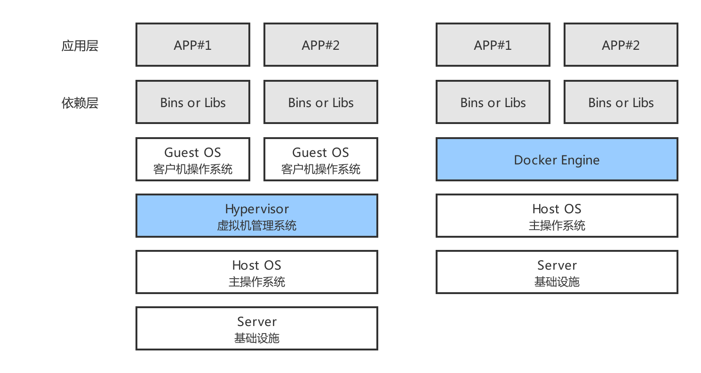

# 技术面试必备基础知识-工具-Docker

> 原文：[CS-Notes-工具-Docker](https://cyc2018.github.io/CS-Notes/#/notes/Docker)

## 参考资料
- [知乎问答. docker容器与虚拟机有什么区别. zhihu.com](https://www.zhihu.com/question/48174633)
- [杨鹏飞. Docker 容器、虚拟机与Docker概念全解析. linuxprobe.com](https://www.linuxprobe.com/docker-and-vm.html)
- [阮一峰. Docker 入门教程. ruanyifeng.com](http://www.ruanyifeng.com/blog/2018/02/docker-tutorial.html)

## 基本概念
- `Linux 容器`：一种虚拟化技术，它并不是模拟一个完整的操作系统，而是对进程隔离。
- `Docker`：创建容器的工具，是应用容器的引擎。Docker 属于 Linux 容器的一种封装，提供简单易用的容器使用接口。

## 解决的问题
- 不同机器不同的操作系统，以及不同的库和组件，将一个应用部署到多台机器上需要进行 `大量的环境配置操作`。 一种虚拟化技术 `Docker`，可解决大量、重复的 `环境配置问题`。

	|  |
	| :-: |
	| 图 1-1 Docker 引擎 (来自于 [Docker blog](https://www.docker.com/blog/docker-101-introduction-docker-webinar-recap/)) |

- Docker 拥有的特性：
	- 对 `进程隔离`，即被隔离进程独立于宿主操作系统和其他隔离进程。
	- 可不修改应用程序代码、不需要开发人员学习特定环境下的技术，即可将现有应用程序部署在其他机器上。

## 对比虚拟机
- 虚拟机是通过模拟硬件，并在硬件上安装操作系统实现虚拟化的。

	|  |
	| :-: |
	| 图 1-2 Docker 对比虚拟机 |

### 对比启动速度
- 启动虚拟机需要先启动虚拟机的操作系统，再启动应用，这个过程非常慢；
- 启动 Docker 相当于启动宿主操作系统上的一个进程。

### 对比占用资源
- 虚拟机是一个完整的操作系统，需要占用大量的磁盘、内存和 CPU 资源，一台机器能开启虚拟机的数量有限。
- Docker 只是一个进程，只需要将应用以及相关的组件打包，在运行时占用很少的资源，一台机器可以开启成百上千个 Docker。

## 优势
- 启动速度快；
- 更容易迁移：提供一致性的运行环境，打包应用程序迁移至不同机器上。
- 更容易维护：使用 `分层技术` 和 `镜像`，使得应用更容易 `复用` 重复部分。
- 更容易扩展：使用基础镜像可进一步扩展得到新的镜像。

## 镜像
- 一种静态结构，可以比作面向 `对象` 中的 `类`，而 `容器` 是 `镜像` 的实例。
- 镜像包含容器运行时所需要代码及其他组件。它是一种 `分层结构`，每一层都是只读的 (Read-only layers)。构建镜像时，会一层一层构建，前一层是后一层的基础。镜像的这种分层存储结构很适合镜像的复用以及定制。
- 构建容器时，通过在镜像的基础上添加一个可写层 (writable layer)，用来保存着容器运行过程中的修改。

	|  |
	| :-: |
	| 图 1-3 镜像的分层结构 |

