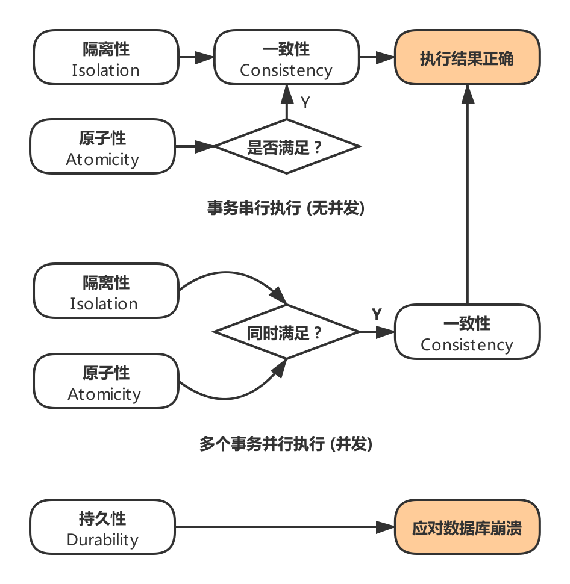
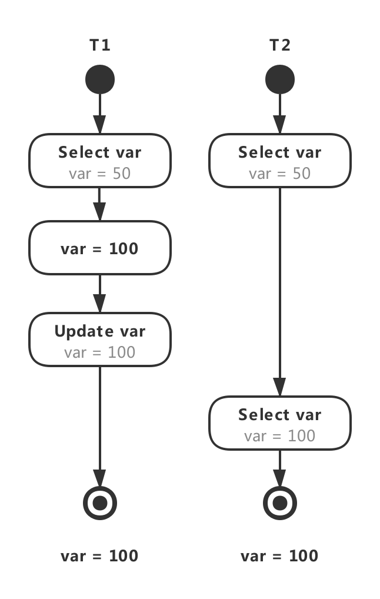

# 技术面试必备基础知识-CyC2018

> 在线阅读：[CS-Notes](https://cyc2018.github.io/CS-Notes/#/README)

## 数据库
### 事务
- 概念：事务指的是满足 `ACID` 特性的一组操作，可以通过 Commit 提交一个事务，也可以使用 Rollback 进行回滚。
- ACID：
	- 原子性 (Atomicity)：
		- 事务被视为不可分割的最小单元，事务的所有操作要么全部提交成功，要么全部失败回滚。
		- 回滚可以用回滚日志来实现，回滚日志记录着事务所执行的修改操作，在回滚时反向执行这些修改操作即可。
	- 一致性 (Consistency)：数据库在事务执行前后都保持一致性状态。在一致性状态下，所有事务对一个数据的读取结果都是相同的。
	- 隔离性 (Isolation)：一个事务所做的修改在最终提交以前，对其它事务是不可见的。
	- 持久性 (Durability)：一旦事务提交，则其所做的修改将会永远保存到数据库中。即使系统发生崩溃，事务执行的结果也不能丢失。
	
		> 使用重做日志来保证持久性。

- 事务的 ACID 特性概念简单，但不是很好理解，主要是因为这几个特性不是一种平级关系：
	- 只有满足一致性，事务的执行结果才是正确的。
		- 在无并发的情况下，事务串行执行，隔离性一定能够满足。此时只要能满足原子性，就一定能满足一致性。
		- 在并发的情况下，多个事务并行执行，事务不仅要满足原子性，还需要满足隔离性，才能满足一致性。
	- 事务满足持久化是为了能应对数据库崩溃的情况。  

		|  |
		| :---: |
		| 图 1-1 ACID逻辑关系 |

- AUTOCOMMIT：MySQL 默认采用自动提交模式。也就是说，如果不显式使用START TRANSACTION 语句来开始一个事务，那么每个查询都会被当做一个事务自动提交。

### 并发一致性问题
#### 丢失数据
`丢失数据`：$T_1$ 和 $T_2$ 两个事务都对一个数据进行修改，$T_1$ 先修改，$T_2$ 随后修改，$T_2$ 的修改覆盖了 $T_1$ 的修改。如图 1-2 所示。

#### 读脏数据
`读脏数据`：$T_1$ 对一个数据做了修改，$T_2$ 读取这一个数据。若 $T_1$ 执行 ROLLBACK 操作，则 $T_2$ 读取的结果和第一次的结果不一样。如图 1-3 所示。

#### 不可重复读
`不可重复读`：$T_2$ 读取一个数据，$T_1$ 对该数据做了修改。如果 $T_2$ 再次读取这个数据，此时读取的结果和第一次读取的结果不同。如图 1-4 所示。

#### 幻影读
`幻影读`：$T_1$ 读取某个范围的数据，$T_2$ 在这个范围内插入新的数据，$T_1$ 再次读取这个范围的数据，此时读取的结果和和第一次读取的结果不同。如图 1-5 所示。

|  |  |
| :---: | :---: |
| 图 1-2 丢失数据 | 图 1-3 读脏数据 |
|  |  |
| 图 1-4 不可重复读 | 图 1-5 幻影读 |

#### 解决方案
- 在并发环境下，事务的隔离性很难保证，因此会出现很多并发一致性问题。
- 产生并发不一致性问题的主要原因是破坏了事务的隔离性。
- 解决方法是通过 `并发控制` 来保证隔离性。
	- 并发控制可以通过 `封锁` 来实现，但是封锁操作需要用户自己控制，相当复杂。
	- 数据库管理系统提供了事务的 `隔离级别`，让用户以一种更轻松的方式处理并发一致性问题。

### 封锁
#### 封锁粒度
- MySQL 中提供了两种封锁粒度：`行级锁` 以及 `表级锁`。
- 应尽量只锁定需要修改的那部分数据，而不是所有的资源。锁定的数据量越少，发生锁争用的可能就越小，系统的并发程度就越高。
- 但是加锁需要消耗资源，锁的各种操作（包括获取锁、释放锁、以及检查锁状态）都会增加系统开销。因此封锁粒度越小，系统开销就越大。

	> 为此，我们在选择封锁粒度时，需在 `锁开销` 和 `并发程度` 之间做一个 `权衡`。

#### 封锁类型
##### 读写锁
- 排它锁 (Exclusive)，简写为 `X 锁`，又称 `写锁`。
- 共享锁 (Shared)，简写为 `S 锁`，又称 `读锁`。

- 有以下两个规定：
	- 一个事务对数据对象 A 加了 X 锁，就可以对 A 进行读取和更新。加锁期间其它事务不能对 A 加任何锁。
	- 一个事务对数据对象 A 加了 S 锁，可以对 A 进行读取操作，但是不能进行更新操作。加锁期间其它事务能对 A 加 S 锁，但是不能加 X 锁。
- 锁的兼容关系如表 1-1 所示 :  

	
表 1-1 读写锁之间的兼容关系
  

	|  | 排它锁 X | 共享锁 S |
	| :---: | :---: | :---: |
	| 排它锁 X | ✖️ | ✖️ |
	| 共享锁 S | ✖️ | ✔️ |

##### 意向锁
- 使用意向锁 (Intention Locks)，可以更容易地支持多粒度封锁。

#### 封锁协议
##### 三级封锁协议
##### 两段锁协议

#### MySQL 隐式与显示锁定

### 隔离级别

