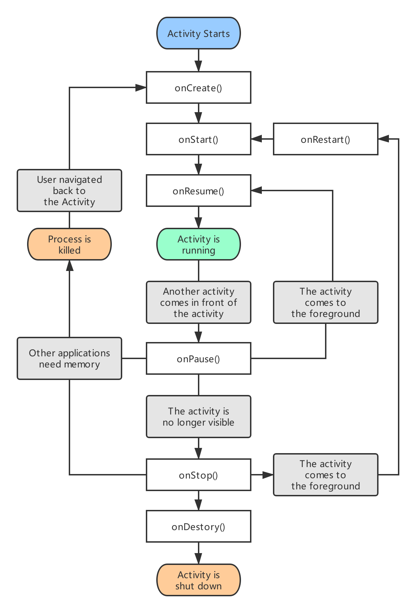
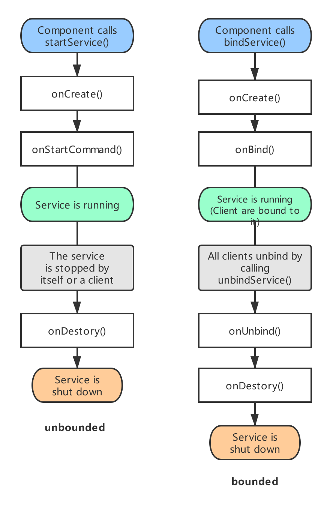
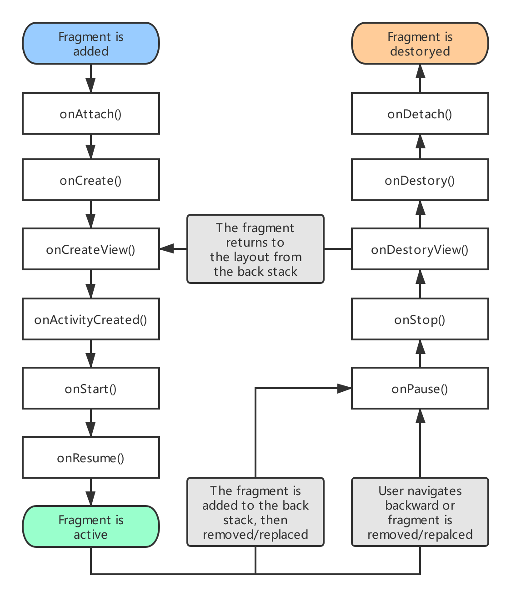

# 技术面试必备基础知识-Android

## Android 生命周期
### Activity 的生命周期

|  |
| :-: |
| 图 1-1 Activity 的完整生命周期 |

- 在系统中，触发 Activity 生命周期改变的方式：
	- 有用户参与的生命周期改变；
	- 系统回收或者配置修改导致的生命周期改变；
	
- 在 Activity 生命周期中，主要包含 6 种状态：
	- 6 种状态：onCreate()、onStart()、onResume()、onPause()、onStop()、onDestroy()。
	
		```java
		public class Activity extends ApplicationContext {
			protected void onCreate(Bundle savedInstanceState);
			protected void onStart();
			protected void onResume();
			protected void onPause();
			protected void onStop();
			protected void onDestory();
		}
		```
	
	- 6 种状态之间两两配对、有始有终，构成三组生命周期：完整的生命周期 (Entire Lifetime)、可视的生命周期 (Visible Lifetime) 以及前台的生命周期 (Foreground Lifetime)。
	
		- 完整的生命周期：表示 Activity 组件从创建到销毁的全部过程，是最外层的生命周期。生命周期发生在调用 `onCreate()` 与调用 `onDestory()` 之间。
		
			> 注意：不能保证 onDestory() 被调用的时机。例如，Activity 在 Activity 栈中，当系统内存不足时则可能触发调用 onDestory() 方法强制销毁 Activity。
	
		- 可视的生命周期：表示 Activity 组件 (当前屏幕看到的 Activity) 从用户可视到离开用户视线的全过程。生命周期发生在调用 `onStart()` 与调用 `onStop()` 之间。
		- 前台的生命周期：表示 Activity 组件显示于其他 Activity 组件前，即位于 Activity 任务栈的栈顶，拥有最高优先级的资源使用权。生命周期发生在调用 `OnResume()` 与调用 `onPause()` 之间。

			> 在可视的生命周期中，Activity 组件可能位于 `全透明` 或者 `部分透明` 的 Acticity 下。前台状态必须位于全部的 Activity 之上。

	- onRestart()、onRestoreInstanceState() 和 onSaveInstanceState()：
		- onRestart()：当页面从 Activity 栈内调至栈顶时，会调用此方法，初次创建时不会调用。
		- onSaveInstanceState()：用于储存 Activity 的状态信息。
		- onRestoreInstanceState()：用于恢复 Activity 的状态信息。
	
			> 仅用于系统导致的页面重建，而用户导致的页面重建需在 onCreate() 中由开发者自主恢复状态信息。

### Service 的生命周期

|  |
| :-: |
| 图 1-2 Service 的完整生命周期 |

### Fragment 的生命周期

|  |
| :-: |
| 图 1-3 Fragment 的完整生命周期 |