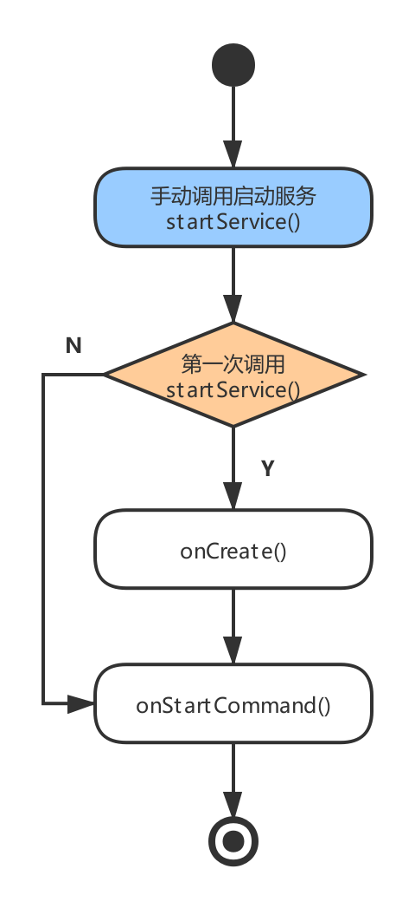
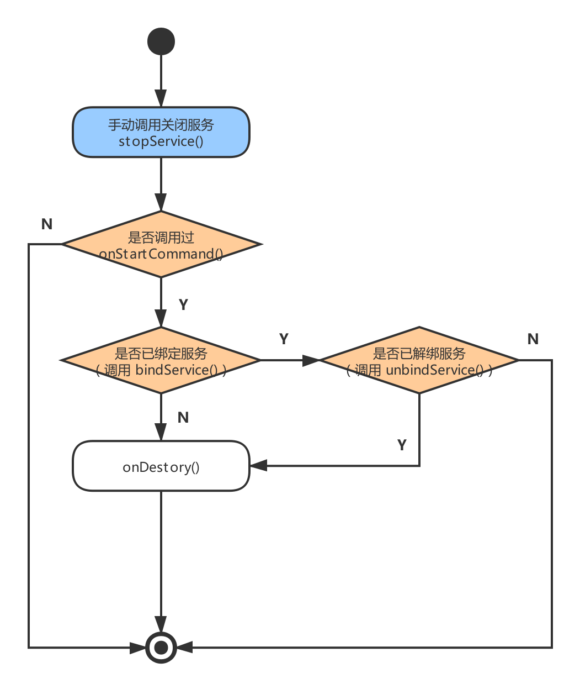
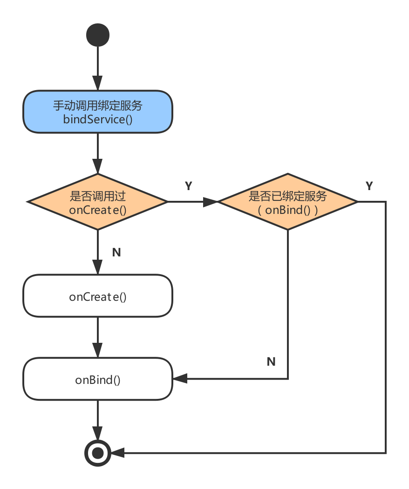
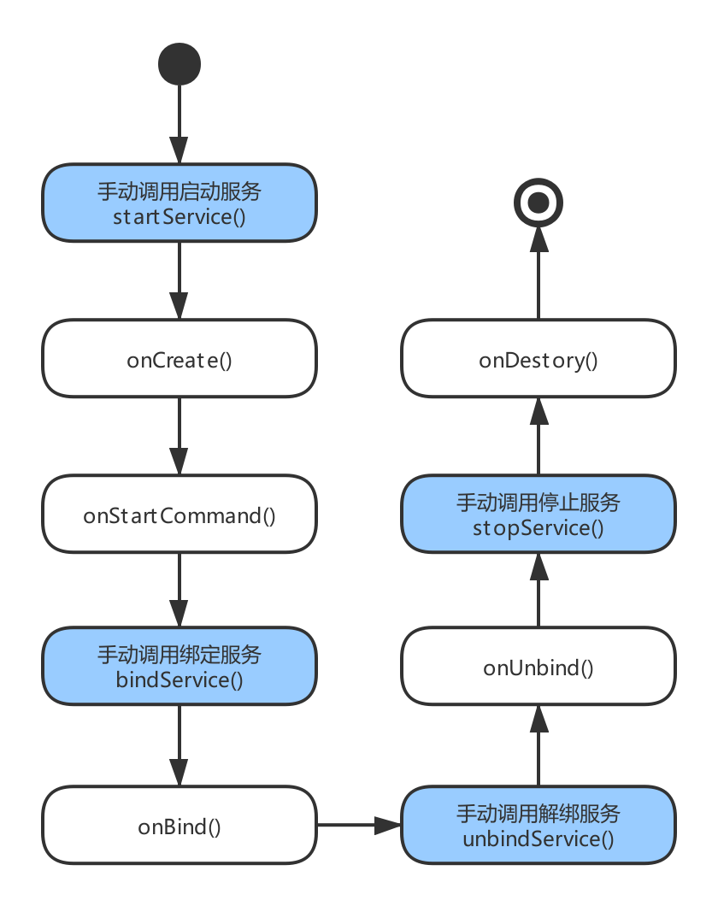
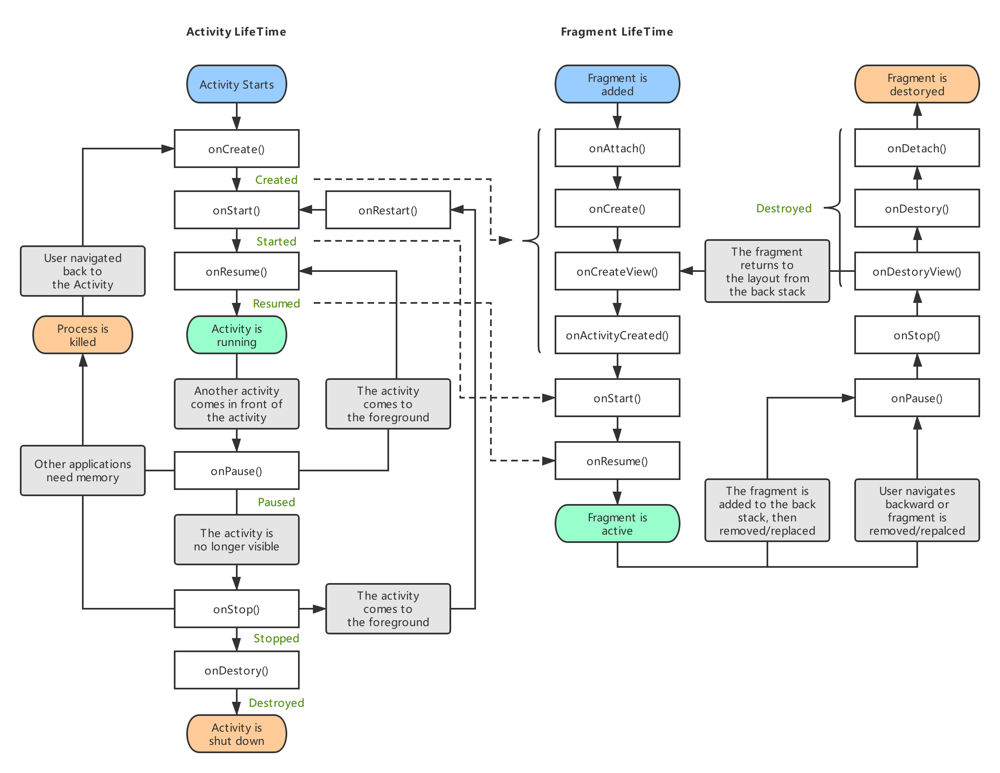
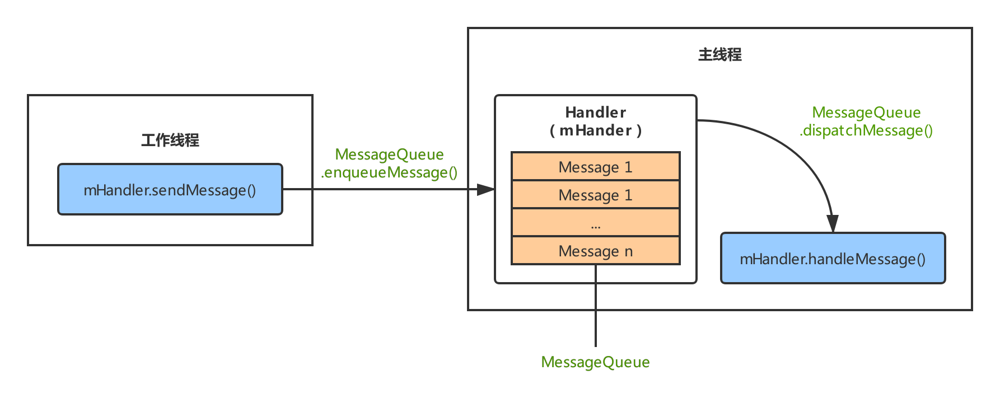
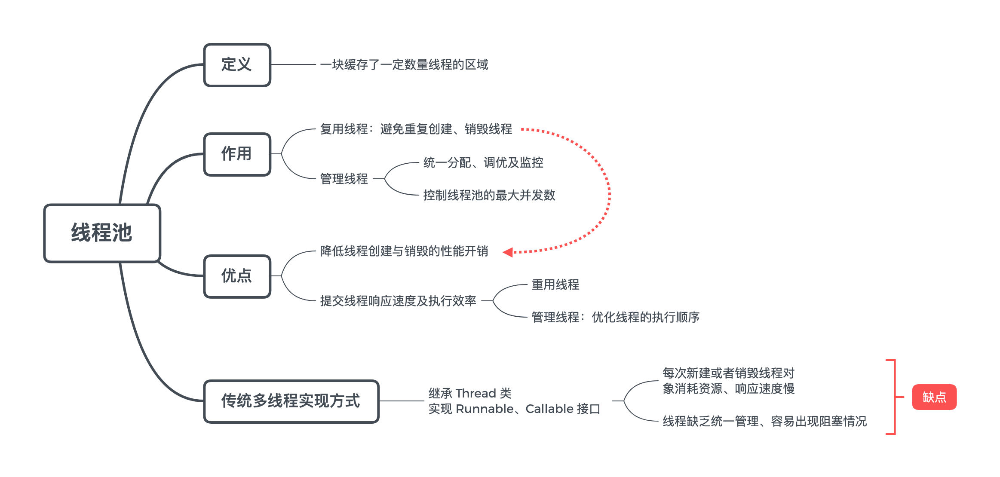
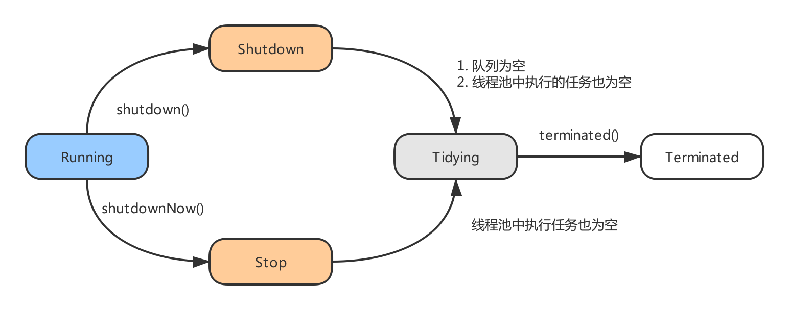

# 技术面试必备基础知识-Android

## 平台架构
### 参考资料
- [Gityuan. Android系统架构开篇. gityuan.com](http://gityuan.com/android/)
- [Deveplopers. Android 平台架构. developer.android.com](https://developer.android.com/guide/platform?hl=zh-cn)

|  |
| :-: |
| 图 1-1 Android 平台架构 |

#### Linux Kernel
- Android 平台的基础是 Linux 内核。例如 Android Runtime (ART) 依靠 Linux 内核来执行底层功能，比如 `线程` 和 `底层内存管理`。
- Linux 内核的安全机制为 Android 提供相应的保障，也允许设备制造商为内核开发硬件驱动程序。

#### Hardware Abstraction Layer
- 硬件抽象层 (HAL) 提供标准接口，HAL包含多个库模块，其中每个模块都为特定类型的硬件组件实现一组接口，比如 WIFI / 蓝牙模块，当框架 API 请求访问设备硬件时，Android 系统将为该硬件加载相应的库模块。

#### Android Runtime

- 对于运行 Android 5.0（API 级别 21）或更高版本的设备，每个应用都在其自己的进程中运行，并且有其自己的 Android Runtime (ART) 实例。ART 通过执行 DEX 文件在低内存设备上可运行多个 `虚拟机`。

	> DEX (Dalvik Executable，DEX) 文件是一种专为 Android 设计的字节码格式，经过优化使用内存很少。通常使用 Jack 编译器将 Java 源代码编译为 DEX 字节码。

- ART 的部分主要功能包括：
	- 预先 (AOT) 和即时 (JIT) 编译；
	- 优化的垃圾回收 (Gabarge Collection，GC)；
	- 支持将应用软件包中的 DEX 文件转换为更紧凑的机器代码；

		> 需 Android 9 (API 级别 28) 及更高版本的系统支持。
	
	- 更好的调试支持，包括专用采样分析器、详细的诊断异常和崩溃报告，并且能够设置观察点以监控特定字段。
- Android 还包含一套 `核心运行时库`，可提供 [Java API 框架](#Java-API-框架) 所使用的 Java 编程语言中的大部分功能，包括一些 Java 8 语言功能。

#### Nactive C/C++ Libraries
- 许多核心 Android 系统组件和服务（例如 ART 和 HAL）构建自原生代码，需要以 C / C++ 编写的原生库。

	> 例如，通过 Android 框架的 Java OpenGL API 访问 OpenGL ES，以支持在应用中绘制和操作 2D 和 3D 图形。

- 若开发需要 C / C++ 代码支持的应用，可使用 `Android NDK` 直接从原生代码访问某些原生平台库。

#### Java API Framework
- 您可通过以 Java 语言编写的 API 使用 Android OS 的整个功能集。这些 API 形成创建 Android 应用所需的构建块，它们可简化核心模块化系统组件和服务的重复使用，包括以下组件和服务：
	- `视图系统`：View System，用以构建应用的 UI，包括列表、网格、文本框、按钮甚至可嵌入的网络浏览器等。
	- `内容提供程序`：Content Provider，可让应用访问其他应用（例如“联系人”应用）中的数据或者共享其自己的数据。
	- `资源管理器`：Resource Manager，用于访问非代码资源，例如本地化的字符串、图形和布局文件。
	- `通知管理器`：Notification Manager，可让所有应用在状态栏中显示自定义提醒。
	- `活动管理器`：Activity Manager，用于管理应用的生命周期，提供常见的导航返回栈。

- 开发者可以完全访问 Android 系统应用使用的框架 [API](https://developer.android.com/reference/packages.html?hl=zh-cn)。

## 生命周期

### 参考资料
- [Carson_Ho. Service生命周期最全面解析. csdn.net](https://cloud.tencent.com/developer/article/1394219)
- [晕菜一员. Fragment生命周期及其正确使用 (建议使用自定义View替换Fragment). cnblogs.com](https://www.cnblogs.com/CharlesGrant/p/4876135.html)
- [JYGod. Android Fragment 非常详细的一篇. jianshu.com](https://www.jianshu.com/p/11c8ced79193)

### Activity 的生命周期

|  |
| :-: |
| 图 1-1 Activity 的完整生命周期 |

- 在系统中，触发 Activity 生命周期改变的方式：
	- 有用户参与的生命周期改变；
	- 系统回收或者配置修改导致的生命周期改变；
	
- 在 Activity 生命周期中，主要包含 6 种状态：
	- 6 种状态：onCreate()、onStart()、onResume()、onPause()、onStop()、onDestroy()。
	
		```java
		public class Activity extends ApplicationContext {
			protected void onCreate(Bundle savedInstanceState);
			protected void onStart();
			protected void onResume();
			protected void onPause();
			protected void onStop();
			protected void onDestory();
		}
		```
	
	- 6 种状态之间两两配对、有始有终，构成三组生命周期：完整的生命周期 (Entire Lifetime)、可视的生命周期 (Visible Lifetime) 以及前台的生命周期 (Foreground Lifetime)。
	
		- `完整的生命周期`：表示 Activity 组件从创建到销毁的全部过程，是最外层的生命周期。生命周期发生在调用 `onCreate()` 与调用 `onDestory()` 之间。
		
			> 注意：不能保证 onDestory() 被调用的时机。例如，Activity 在 Activity 栈中，当系统内存不足时则可能触发调用 onDestory() 方法强制销毁 Activity。
	
		- `可视的生命周期`：表示 Activity 组件 (当前屏幕看到的 Activity) 从用户可视到离开用户视线的全过程。生命周期发生在调用 `onStart()` 与调用 `onStop()` 之间。
		- `前台的生命周期`：表示 Activity 组件显示于其他 Activity 组件前，即位于 Activity 任务栈的栈顶，拥有最高优先级的资源使用权。生命周期发生在调用 `OnResume()` 与调用 `onPause()` 之间。

			> 在可视的生命周期中，Activity 组件可能位于 `全透明` 或者 `部分透明` 的 Acticity 下。前台状态必须位于全部的 Activity 之上。

	- onRestart()、onRestoreInstanceState() 和 onSaveInstanceState()：
		- onRestart()：当页面从 Activity 栈内调至栈顶时，会调用此方法，初次创建时不会调用。
		- onSaveInstanceState()：用于储存 Activity 的状态信息。
		- onRestoreInstanceState()：用于恢复 Activity 的状态信息。
	
			> 仅用于系统导致的页面重建，而用户导致的页面重建需在 onCreate() 中由开发者自主恢复状态信息。

### Service 的生命周期

|  |
| :-: |
| 图 1-2 Service 的完整生命周期 |

#### 生命周期常用方法
- 4 个手动调用的方法：

| 手动调用方法 | 作用 |
| :--- | :--- |
| startService()  | 启动服务 |
| stopService()   | 关闭服务 |
| bindService()   | 绑定服务 |
| unbindService() | 解绑服务 |

- 5 个自动调用的方法：

| 内部自动调用的方法 | 作用 |
| :--- | :--- |
| onCreate()         | 创建服务 |
| onStartCommand()   | 开始服务 |
| onDestroy()        | 销毁服务 |
| onBind()           | 绑定服务 |
| onUnbind()         | 解绑服务 |

#### 生命周期方法介绍
| 手动调用方法 | 活动图 | 作用 | 自动调用方法 | 备注 |
| :-: | :-: | :-: | :--- | :--- |
| startService() | 图 1-2-1 | 手动启动 Service | onCreate()<br>onStartCommand() | onStartCommand() 等于 onStartService() 的次数 |
| stopService() | 图 1-2-2 | 手动关闭 Service | onDestory() | 若 Service 被启动且绑定，在没有解绑前提下是无法使用 stopService() 停止服务的 |
| bindService() | 图 1-2-4 | 手动绑定 Service | onCreate()<br>onBind() | -- |
| unbindService() | 图 1-2-3 | 手动解绑 Service | oUnbind()<br>onDestory() | -- |

|  |  |
| :-: | :-: |
| 图 1-2-1 手动启动服务 startService() | 图 1-2-2 手动关闭服务 stopService() |
|  |  |
| 图 1-2-4 手动解绑服务 unbindService()  | 图 1-2-3 手动绑定服务 bindService() |

#### 常见生命周期使用
- 只使用 startService() 启动服务以及只使用 bindService() 绑定服务的生命周期，如图 1-2 所示。
- 同时使用 startService() 启动服务和 BindService() 绑定服务的生命周期，如图 1-2-5 所示。

	|  |
	| :-: |
	| 图 1-2-5 启动服务和绑定服务 |

- 需要注意的是：
	- startService() 和 stopService() 只能开启和关闭 Service，无法操作 Service； bindService() 和 unbindService() 可以操作 Service。
	- startService() 开启的 Service，调用者退出后 Service `仍然存在`；bindService() 开启的 Service，调用者退出后，Service `随着调用者销毁`。
	

### Fragment 的生命周期

|  |
| :-: |
| 图 1-3 Fragment 的完整生命周期 |

- Fragment 的基本概念：
	- Fragment 拥有自己的生命周期，且依赖于 Activity 而不能独立存在的。
	
		> Fragment 相当于一个有生命周期的 View，它的生命周期被所在的 Activity 的生命周期管理。
		
	- Activity 运行时，可以动态地添加或删除 Fragment。
	- Activity 可包含多个 Fragment，一个 Fragment 可被多个 Activity 重用。

- Fragment 的生命周期与 Activity 相仿：

	|  |
	| :-: |
	| 图 1-3-1 Fragment 与 Activity 生命周期的交互关系与顺序 |

	- onAttach()：在 Fragment 和 Activity 关联时调用，仅且调用一次。可以通过该方法获取 Activity 引用，还可以通过 getArguments() 获取参数。

	- onCreate()：在最初创建 Fragment 的时候会调用。

	- onCreateView()：在准备绘制 Fragment 界面时调用，返回值为 Fragment 要绘制布局的根视图，当然也可以返回 null。

		> onCreateView() 并不是一定会被调用，当添加的是没有界面的 Fragment 就不会调用，比如调用 FragmentTransaction.add() 方法。

	- onActivityCreated()：当 Activity 对象完成自己的 onCreate() 方法时调用。前提是 Activity 已经 created。

	- onStart()：Fragment 对用户可见时调用，前提是 Activity 已经 started。

	- onResume()：Fragment 可见，且与用户间可交互时调用，前提是 Activity 已经 resumed。

	- onPause()：Fragment 可见，但与用户间不可交互时会调用。宿主 Activity 对象转为 onPause 状态时调用。

	- onStop()：Fragment 不可见时会调用。宿主 Activity 对象转为 onStop 状态时调用。

	- onDestroyView()：在移除 Fragment 相关视图层级时调用。

	- onDestroy()：销毁 Fragment 时调用。

	- onDetach()：Fragment 和 Activity 解除关联时调用。

- 关于 Fragment 的依赖库版本选择问题： 
	- 建议使用 Support 库中的 `android.support.v4.app.Fragment`，而不要用系统自带的 `android.app.Fragment`。
	- 使用 Support 库的 Fragment，Activity 必须要继承 FragmentActivity (AppCompatActivity 是 FragmentActivity 的子类)。

## 通信方式
### Handler
- 内容框架：
	- `背景`：在 Android 应用中，为了 UI 操作是线程安全的，规定了只允许 UI 线程 (主线程) 更新 Activity 里的组件。
	- `冲突`：多个线程并发操作 UI 组件，造成线程不安全。
	- `解决`：Handler 消息传递机制。即工作线程更新 UI 时，通过 Handler 通知主线程才执行更新 UI 操作。
- Handler 消息机制用于同进程 (共享内存地址空间)，而 Binder / Socket 用于进程间通信。
- Handler 消息机制是指由一组 MessageQueue、Message、Looper、Handler 共同组成。

	> 例如，Android 应用中，只有主线程能更新 UI，其他工作线程往往是完成相应工作后，通过 Handler 分发相应的消息给 UI 主线程去完成 UI 更新。

- 具体实例：
	- 隶属于同一进程的工作线程与主线程共享地址空间，即 Handler 实例对象 mHandler 位于线程间共享的内存堆上，工作线程与主线程都能直接使用该对象 (需要注意多线程的同步问题)。
	- 工作线程通过 mHandler 向其成员变量 MessageQueue 中添加新 Message，主线程一直处于 loop() 方法内，当收到新的 Message 时按照一定规则分发给相应的 handleMessage() 方法来处理。
	- Handler 消息机制用于同进程的线程间通信，其核心是线程间共享内存空间，而不同进程拥有不同的地址空间，也就不能用 Handler 来实现进程间通信。

		|  |
		| :-: |
		| 图 1-1 Handler 消息机制 |

		> 上图只是 Handler 消息机制的一种处理流程，即不限制于工作线程向 UI 线程发送消息，也可以让隶属于同一进程的 `多个工作线程` 间通过 handler 互相发送消息。

### Socket

- Socket 通信方式也是 C/S 架构，多用于 Android Framework 层与 Native 层之间的通信。

### Binder

## 进程线程
### 线程池 ThreadPool
#### 概念简述

|  |
| :-: |
| 图 1-1 线程池的基本概念 |

#### 参考资料

- [Carson_Ho. Android多线程：线程池ThreadPool 全面解析. jianshu.com](https://www.jianshu.com/p/0e4a5e70bf0e) 
- [CrossoverJie. 如何优雅的使用和理解线程池. crossoverjie.top](https://crossoverjie.top/2018/07/29/java-senior/ThreadPool/)
- [CrossoverJie. 线程池没你想的那么简单(一). crossoverjie.top](https://crossoverjie.top/2019/05/20/concurrent/threadpool-01/)
- [CrossoverJie. 线程池没你想的那么简单(二). crossoverjie.top](https://crossoverjie.top/2019/06/06/concurrent/threadpool-02/)
- [Mr_OOO. 通俗易懂的 Java 线程池. csdn.net](https://blog.csdn.net/Mr_OOO/article/details/84345963)

#### 工作原理

##### 线程池的状态定义

- 了解线程池的工作原理，首先得了解线程池中所定义的状态，它们与线程的执行有着密切关联。

	|  |
	| :-: |
	| 图 1-1-1 线程池中所定义的状态 |
	
	- `RUNNING`：运行状态，指可以接受任务执行队列里的任务。
	- `SHUTDOWN`：指调用了 shutdown() 方法，不再接受新任务，但队列的任务得执行完毕。
	- `STOP`：指调用了 shutdownNow() 方法，不再接受新任务，同时抛弃阻塞队列里的所有任务并中断所有正在执行任务。
	- `TIDYING`：所有任务都执行完毕，在调用 shutdown() / shutdownNow() 中都会尝试更新为这个状态。
	- `TERMINATED`：终止状态，当执行 terminated() 后会更新为这个状态。

##### 线程池的工作流程

- 提交一个任务到线程池中，核心的逻辑是 execute() 函数：

    ```java
    public void execute(Runnable command) {
        if (command == null)
            throw new NullPointerException();
        int c = ctl.get(); // 读取 ctl
        
        // 当前任务数量小于核心线程数
        if ( workerCountOf(c) < corePoolSize ) {
            if ( addWorker(command, true) )
                return;
            c = ctl.get();
        }
        
        // 线程池状态是 Running / Shutdown，并且任务数大于核心线程数
        if ( isRunning(c) && workQueue.offer(command) ) {
            int recheck = ctl.get(); // 再次读取 ctl，防止并发
            // 若线程池的状态已发生变化，需把刚放入阻塞队列中的任务移除
            // 且使用拒绝策略
            if ( !isRunning(recheck) && remove(command) ) {
                reject(command);
            } else if ( workerCountOf(recheck) == 0 ) {
                // 到了这里表示线程池里面已经没有可执行任务的线程，
                // 但是刚又给阻塞队列中加了个任务，还不符合使用拒绝策略的条件，
                // 追加一个 Thread 执行任务，初始化任务为 null,
                // 因为要调用 getTask() 方法从阻塞队列中获取 task
                addWorker(null, false);
            }
        } else if ( !addWorker(command, false) ) {
            reject(command);
        }
    }
    ```
    
- 更通俗理解，线程池的工作流程如图 1-1-2 所示：

	|  |
	| :-: |
	| 图 1-1-2 线程池的处理流程 |
	
	> `核心线程` ：固定线程数，可闲置且不会被销毁。<br>
	> `非核心线程`：拥有闲置时的超时时长，超过这个时长非核心线程就会被回收。

	- 获取当前线程池的状态。
	- 当前线程数量小于 corePoolSize 时创建一个新的线程运行。
	- 如果当前线程处于运行状态，并且写入阻塞队列成功。
	- 双重检查，再次获取线程状态；如果线程状态变了（非运行状态）就需要从阻塞队列移除任务，并尝试判断线程是否全部执行完毕。同时执行拒绝策略。
	- 如果当前线程池为空就新创建一个线程并执行。
	- 如果在第三步的判断为非运行状态，尝试新建线程，如果失败则执行拒绝策略。
	
- 处理任务的优先级：核心线程 > 任务队列 >  最大线程

#### 使用线程池流程
##### 创建线程池
- 使用 ThreadPoolExecutor 创建线程池:

	```java
	// 1. 创建线程池：配置线程池的参数，从而实现自己所需的线程池
	Executor threadPool = new ThreadPoolExecutor(
		CORE_POOL_SIZE,		
		MAXIMUM_POOL_SIZE,
		KEEP_ALIVE,			
		TimeUnit.SECONDS,
		sPoolWorkQueue,
		sThreadFactory	
	);
	
	// 2. 向线程池提交任务
	threadPool.execute(new Runnable() {
		@Override
		public void run() {
		    // 线程执行任务
		}
	});

	// 3. 关闭线程池
	threadPool.shutdown();
	```
	
- 核心参数说明：

	```java
	public ThreadPoolExecutor(
		int corePoolSize,		// 核心线程数
		int maximumPoolSize,	// 线程池所容纳的最大线程数
		long keepAliveTime,		// 线程空闲后的存活时间
		TimeUnit unit,			// 指定 keepAliveTime 参数的时间单位
		BlockingQueue<Runnable> workQueue, 	// 用于存放任务的阻塞队列
		RejectedExecutionHandler handler	// 队列和最大线程池都满了之后的饱和策略
	) {
		// 忽略构造函数的赋值细节...
	}
	```

- 在 Java 中，已内置四种常见功能线程池的实现方式，即预设的核心参数。

##### 关闭线程池
- 关闭线程池原理：遍历线程池中的所有工作线程，逐个调用线程的 interrupt() 中断线程，注意无法响应中断的任务可能永远无法终止。也可调用 threadPool.shutdownNow() 关闭线程。
- 一般调用 shutdown() 关闭线程池；若任务不一定要执行完则调用 shutdownNow()。
	- `shutdown()`：设置线程池的状态为 SHUTDOWN，然后中断所有 `没有正在执行任务` 的线程。
	- `shutdownNow()`：设置线程池的状态为 STOP，然后尝试停止所有 `正在执行` 或 `暂停任务` 的线程，并返回等待执行任务的列表。

#### 常见功能线程池

- 在 `java.util.concurrent` 包下，Executors 利用 `工厂模式` 提供了四种常见功能线程池的实现方式：
	- Executors.newFixedThreadPool(nThreads)：定长线程池，用于控制最大并发量。
	- Executors.newScheduledTHreadPool()：定时线程池，用于执行定时、周期性任务。
  - Executors.newCachedThreadPool()：可缓存线程池，用于执行数量多、耗时少的任务。
  - Executors.newSingleThreadExecutor()：单线程化线程池，不适合并发任务，但会引起 I/O 阻塞的任务，例如访问数据库。

- 通过解析 Executors 源码分析可知，它们都是通过 `ThreadPoolExecutor` 类来创建线程池，只是默认传递了部分参数，简化了创建线程池的步骤。

	```java
	// 创建 newFixedThreadPool
	public static ExecutorService newFixedThreadPool(int nThreads) {
	    return new ThreadPoolExecutor(nThreads, nThreads,
	        0L, TimeUnit.MILLISECONDS,
	        new LinkedBlockingQueue<Runnable>()
	    );
	}

	// 创建 newCachedThreadPool
	public static ExecutorService newCachedThreadPool() {
	    return new ThreadPoolExecutor(0, Integer.MAX_VALUE,
	        60L, TimeUnit.SECONDS,
	        new SynchronousQueue<Runnable>()
	    );
	}
	
	// 创建 newSingleThreadExecutor
	public static ExecutorService newSingleThreadExecutor() {
	    return new FinalizableDelegatedExecutorService(
	        new ThreadPoolExecutor(1, 1,
	            0L, TimeUnit.MILLISECONDS,
	            new LinkedBlockingQueue<Runnable>())
	    );
	}
	```
	
##### 定长线程池
- 特点：
	- 只有核心线程，线程数固定，任务队列无大小限制 (超出的线程任务会在队列中等待)。
	- 不会被回收。
- 应用场景：控制 `线程最大并发数`。

	```java
	// 1. 创建定长线程池对象 & 设置线程池线程数量固定为 3
	ExecutorService fixedThreadPool = Executors.newFixedThreadPool(3);

	// 2. 创建 Runnable 类线程对象
	Runnable task = new Runnable(){
	    public void run(){
	        System.out.println("Running...");
	    }
	};
        
	// 3. 向线程池提交任务
	fixedThreadPool.execute(task);
        
	// 4. 关闭线程池
	fixedThreadPool.shutdown();
	```

##### 定时线程池
- 特点：核心线程数固定，非核心线程数无限制。闲置时马上回收。
- 应用场景：执行 `定时`、`周期性` 任务。

	```java
	// 1. 创建定时线程池对象 & 设置线程池线程数量固定为 5
	ScheduledExecutorService scheduledThreadPool =
	    Executors.newScheduledThreadPool(5);

	// 2. 创建 Runnable 类线程对象
	Runnable task = new Runnable(){
	    public void run(){
	        System.out.println("Running...");
	    }
	};

	// 3. 向线程池提交任务：延迟 1s 后执行任务
	scheduledThreadPool.schedule(task, 1, TimeUnit.SECONDS);
	
	// 延迟 10ms 后、每隔 1000ms 执行任务
	scheduledThreadPool
	    .scheduleAtFixedRate(task,10,1000,TimeUnit.MILLISECONDS);

	// 4. 关闭线程池
	scheduledThreadPool.shutdown();
	```

##### 可缓存线程池
- 特点：
    - 只有非核心线程，线程数不固定。
    - 灵活回收空闲线程；具备超时机制，全部回收时几乎不占系统资源。
- 应用场景：执行 `数量多`、`耗时少` 的线程任务。

	```java
	// 1. 创建可缓存线程池对象
	ExecutorService cachedThreadPool = Executors.newCachedThreadPool();

	// 2. 创建 Runnable 类线程对象
	Runnable task = new Runnable(){
	    public void run(){
	        System.out.println("Running...");
	    }
	};

	// 3. 向线程池提交任务：execute（）
	cachedThreadPool.execute(task);

	// 4. 关闭线程池
	cachedThreadPool.shutdown();

	/**
	 * 当执行第二个任务时第一个任务已经完成，
	 * 那么会复用执行第一个任务的线程，而不用每次新建线程。
	 */
	```

##### 单线程化线程池
- 特点：只有一个核心线程。即保证所有任务按照指定顺序在一个线程中执行，不需要处理线程同步问题。
- 应用场景：不适合并发，但适用于可能引起 I/O 阻塞以及影响 UI 线程响应操作的场景。

	```java
	// 1. 创建单线程化线程池
	ExecutorService singleThreadExecutor =
	    Executors.newSingleThreadExecutor();

	// 2. 创建好Runnable类线程对象 & 需执行的任务
	Runnable task =new Runnable(){
	    public void run(){
	        System.out.println("执行任务啦");
	    }
	};

	// 3. 向线程池提交任务：execute（）
	singleThreadExecutor.execute(task);

	// 4. 关闭线程池
	singleThreadExecutor.shutdown();
	```

## 四大组件