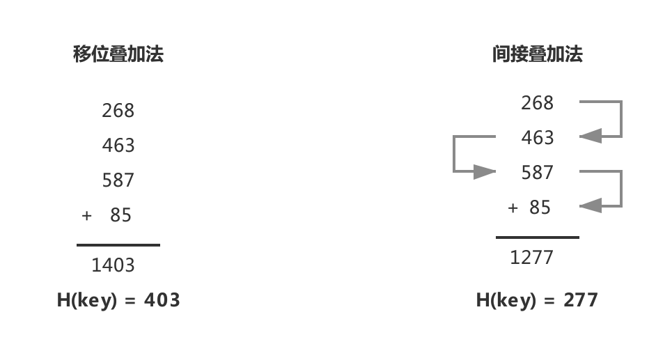
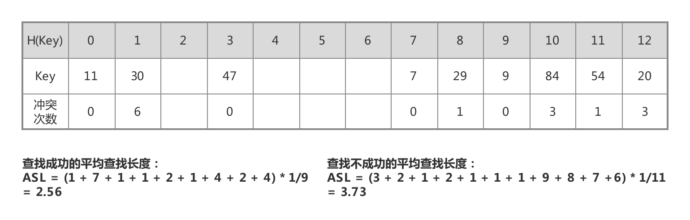

# 技术面试必备基础知识-数据结构

## 栈

## 队

## 树

## 排序

## 查找
### 查找概述
- `查找`：是根据给定的某个值，在查找表中确定一个关键字的值等于给定值的记录。
	- 若表中存在这样的一个记录，则称 `查找成功`，并返回记录的信息或指示该记录在查找表中的位置。
	- 若表中不存在关键字等于给定值的记录，则称 `查找不成功`，此时查找的结果可返回一个 `空记录` 或者 `空指针`。

- `查找算法分类`：
	- 静态查找和动态查找：静态或者动态都是针对查找表而言的。动态表指查找表中有删除和插入操作的表。
	- 无序查找和有序查找：
		- 无序查找：被查找数列有序无序均可。
		- 有序查找：被查找数列必须为有序数列。

- `平均查找长度` (Average Search Length，ASL)：为确定记录在查找表中的位置，需要与给定值进行比较的关键字个数的 `期望值` 称为查找算法在查找成功时的平均查找长度。
	- 对于含有 $n$ 个数据元素的查找表，查找成功的平均查找长度 (公式 1)：

		$$
		\mathcal{ASL}=\sum_{i = 1}^n P_i \cdot C_i
		\tag{1}$$

		> 其中 $P_i$ 为查找表中第 $i$ 个数据元素的概率，通常假设每个元素查找概率相同，且 $\sum_{i = 1}^n P_i = 1$；$C_i$ 为找到第 $i$ 个数据元素时已经比较过的次数。
		
	- 查找不成功的平均查找长度，通常是指从查找位置开始直到一个位置为空需要比较的次数。
	- 每种查找算法成功与不成功的 ASL 计算方式都有相异之处，为此将在具体算法的 `性能分析` 小节详细展开介绍。

### 哈希查找
- `哈希存储`：以关键字的值作为自变量，通过一定的函数关系 (哈希函数)，计算出对应的函数值 (哈希地址) 作为数据元素的地址，并将该数据存入相应地址的存储单元中。
- `哈希查找`：利用查找的关键字的值，采用同样的方式获得哈希地址，然后到相应的存储单元中取得数据元素。

#### 参考资料
- [现在魔法学院. 数据结构查找篇. nowamagic.net](http://www.nowamagic.net/academy/part/30/185/)
- [严蔚敏, 吴伟民. 数据结构 (C语言版) [M]. 清华大学出版社, 2007](https://www.douban.com/doubanapp/dispatch/book/24699581?dt_dapp=1)

#### 哈希函数
> 构造哈希函数的方法不限制一种，整体设计思路是尽可能将关键字集合空间均匀地映射到地址集合空间中。

- `除留余数法`：以关键字的值求模一个质数 $p$ (小于等于哈希地址集合总数 $m$)，其余数作为哈希地址。哈希函数如公式 (2) 所示。

	- 事实上，这方法不仅可以对关键字直接取模，也可在折叠、平方取中后再取模。  
	- 使用除留余数法的一个经验是，若散列表表长为 $m$，通常 $p$ 为小于或等于表长 (最好接近 m) 的最小质数或不包含小于 20 质因子的合数。

	$$
	H(key) = key \, \mathcal{mod} \, p, \, (p \leq m)
	\tag{2}
	$$

- `折叠法`：将关键字的值自左向右或者自右向左分成位数相同的几部分，将这几部分叠加求和，并按照哈希表表长求得最后几位作为哈希地址。对于位数很多的关键字，且每一位上符号分布均匀，可采用此方法求得哈希地址。
	
	- 移位叠加法：将分割后的各部分最低位对齐，然后相加。
	- 间接叠加法：从一端向另一端沿分割界来回折叠后，然后对齐最后一位相加。

		> 例如：假设关键字 key = 26846358785，哈希表长度为 3 位数，则可对关键字进行每 3 位一部分的分割。
		
		|  |
		| :---: |
		| 图 1-1 移位叠加法和间接叠加法的步骤演示 |

#### 解决冲突
> 设计再好的散列函数也不可能完全避免冲突，既然冲突不能避免，就要考虑如何处理它。

##### 开放定址法
`开放定址法`：`开放` 指的是没有被占用的位置，`定址` 指的是确定位置。当发生冲突时，形成一个地址序列，沿着序列逐个探测，直至找到一个空的开发地址，然后插入关键字。地址序列生成函数如公式 (3) 所示：

- 不是同义词却需要争夺一个地址的情况，我们称这种现象为 “堆积”。显然，堆积使得我们需要不断处理冲突，无论是存入还是査找效率都会大大降低。

	$$
	H_{c} = ( H(key) + d_i ) \, \mathcal{mod} \, m,  \,  i = 1, 2, ..., m-1
	\tag{3}
	$$
	
- 针对探测时的地址步进增量 $d$，也有多种方案。如表 1-1 所示：
			
	| 探测方案 | 公式 |
	| :---: | :---: |
	| 线性探测法 | $d_i = 1, 2, ..., m-1$ |
	| 二次探测法 | $d_i = 1^2, -1^2, 2^2, -2^2, ..., q^2, -q^2, (q \leq m/2)$ |
	
	> 二次探测法要求 $p$ 为 $4j+3, j \in N$ 的素数时才有可能再散列。

- 开放定址法的优缺点：
	- 开放定址法为减少冲突，要求装填因子 $\alpha (\leq 1)$，故当结点规模较大时会浪费很多空间。
		
		> `装填因子`：$\alpha = n / m$，其中 $n$ 为关键字个数，$m$ 为表长。  
		> `装填因子` 表示哈希表中元素的 `填满程度`。若装填因子越大 (越小)，填满的元素越多 (越少)，好处是空间利用率高 (低)，但冲突的机会加大 (减少)，查找成本上升 (降低)。
		
	- 开放地址法构造的散列表，删除结点不能简单地将被删结点的空间置为空，否则将截断在它之后填人散列表的同义词结点的查找路径。

		> 因为在各种开放地址法中，空地址单元 (即开放地址) 表示查找失败的结果。因此在用开放地址法处理冲突的散列表上执行删除操作，只能在被删结点上做删除标记，而不能真正删除结点。

##### 链地址法
`链地址法`：将所有关键字为同义词的记录存储在同一线性链表中。我们称这种表为同义词子表，在散列表中只存储所有同义词子表的头指针。

- 将所有关键字为同义词的结点链接在同一个单链表中。若选定的散列表长度为 $m$，则可将散列表定义为一个由 $m$ 个头指针组成的指针数组 $T[0..m-1]$。
- 凡是散列地址为 $i$ 的结点，均插入到以 $T[i]$ 为头指针的单链表中。T 中各分量的初值均应为空指针。在链地址法中，装填因子 $\alpha$ 可以大于 1，但一般均取 $ \alpha \leq 1$。

	|  |
	| :---: |
	| 图 1-2 链地址法 |
	
- 链地址法的优缺点：
	- 无堆积现象，即非同义词决不会发生冲突，因此平均查找长度较短；
	- 链地址法中各链表上的结点空间是动态申请的，故它更适合于造表前无法确定表长的情况；
	- 链地址法的装填因子可取 $\alpha \geq 1$。结点较大时，增加的指针域可忽略不计，因此节省空间；
	- 链地址法构造的散列表中，删除结点只要简单地删去链表上相应的结点即可。

##### 公共溢出区法	
- `公共溢出区法`： 假设哈希函数的值域为 $[0, m-1]$，则设向量 $HashTable[0...m-1]$ 为基本表，每个分量存放一个记录，另设立向量 $OverTable[0...v]$ 为溢出表。所有关键字和基本表中关键字为同义词的记录，不管他们由哈希函数得到的哈希地址是什么，`一旦发生冲突都填入溢出表`。

##### 再哈希法
- `再哈希法`：在同义词产生地址冲突时计算另一个哈希地址。该方法不易产生 “堆积”，但增加计算时间。

	$$H_c = RH_i(key), i = 1, 2, ..., k \tag{4}$$
 
#### 性能分析
- 平均查找长度 (Average Search Length，ASL)，是哈希表查找的查找效率的量化评价指标。以下将从 `散列函数`、`处理冲突的方法` 和 `装填因子` 方面展开探讨。
	- 哈希函数的 “好坏” 首先影响出现冲突的频繁程度。通常情况设定的哈希函数是均匀的，即产生冲突的可能性相同，故可不考虑它对 ASL 的影响。
	- 选定同样一组关键字，设定相同的哈希函数，则不同的处理冲突方法得到的哈希表不同，他们的 ASL 也不同。
		- 开放地址法：如图 1-3 所示，是开放定址法处理冲突时的哈希表。

			|  |
			| :---: |
			| 图 1-3 开放定址法处理冲突时的哈希表 |
			
			- 查找成功的 ASL：在哈希表中查找目标关键字所需要的比较次数。
			- 查找失败的 ASL：依次检索哈希表中每个下标位置，若遇到为空停止检索，表示该次查询失败的代价次数。
		
		- 链地址法：如图 1-4 所示，是链地址法处理冲突时的哈希表。

			|  |
			| :---: |
			| 图 1-4 链地址法处理冲突时的哈希表 |
		
			- 查找成功的 ASL：`竖着计数` 只需一次查找就能找到记录的个数，只需二次查找才能找到记录的个数...以此类推统计所有可能 (即使是链表为空也是查找一次的代价)，此时每个元素的查找概率为 $P = \frac{1}{记录的个数}$；
			- 查找失败的 ASL：`横着计数` 哈希表中每一分量的记录个数，即使是链表为空也是查找一次的代价。此时每个元素的查找概率为 $P = \frac{1}{哈希表表长}$；
	- 一般情况下，处理冲突方法相同的哈希表，则其 ASL 依赖于哈希表的 `装填因子`。