# 技术面试必备基础知识-数据结构

## 绪论

## 栈

## 队

## 树

## 图

## 排序
### 参考资料
- [1] [严蔚敏, 吴伟民. 数据结构:C语言版 [M]. 清华出版社, 2007](https://book.douban.com/subject/24699581/)
- [2] [CyC2018. CS-Notes-排序 [OL]. github.com](https://cyc2018.github.io/CS-Notes/#/notes/%E7%AE%97%E6%B3%95%20-%20%E6%8E%92%E5%BA%8F)

### 排序概述
-  在排序过程中所涉及的存储器不同，排序可分为 `内部排序` 和 `外部排序` $^{[1]}$。
	- 内部排序：待排序记录存放在计算机的随机存储器中进行的排序过程。
	- 外部排序：待排序记录的数量、规模很大，以致内存一次不能容纳全部记录，在排序过程中尚需对外存进行访问。
- `稳定排序` 与 `不稳定排序`：
	- 假设 $K_i = K_j (1 \leq i \leq n, 1 \leq j \leq n, i \neq j)$，且在执行排序算法前的序列中 $R_i$ 领先于 $R_j$。
	- 若在排序后的序列中 $R_i$ 仍然领先于 $R_j$，称所用的排序算法是稳定的。相反，则是不稳定的排序算法。
	- 算法是否具有稳定性，并不能衡量一个算法的优劣 $^{[1]}$。

		> 不稳定算法快速记忆：`快希选堆` (快速排序、希尔排序、选择排序和堆排序)。
		
### 内部排序
| 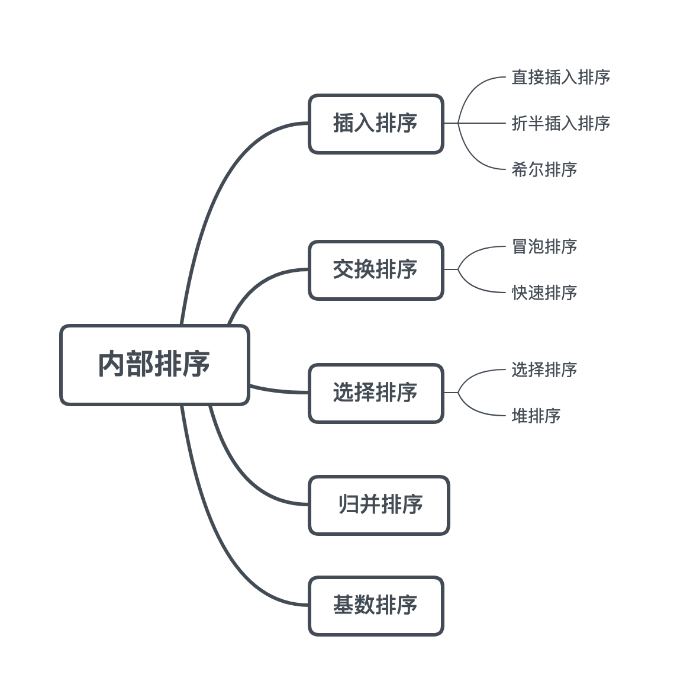 |
| :-: |
| 图 6-1 内部排序分类 |

#### 约定俗成
- 待排序的元素须实现 Java 的 `Comparable` 接口，该接口有 `compareTo()` 方法，可用于判断两元素的大小。
- 辅助函数 less() 和 swap() 用来进行比较和交换的操作。

	> 排序算法的成本模型是 `比较` 和 `交换`。
	
	```java
	public abstract class Sort<T extends Comparable<T>> {
	    public abstract void sort(T[] nums);

	    protect boolean less(T v, T w) {
	        return v.compareTo(w) > 0; // 升序排序
	    }
	    
	    protect void swap(T[] a, int i, int j) {
	    	
	        T t = a[i];
	        a[i] = a[j];
	        a[j] = t;
	    
	        // 整型可使用位运算替代
	        // a[i] = a[i] ^ a[j];
	        // a[j] = a[i] ^ a[j];
	        // a[i] = a[i] ^ a[j];
	    }
	}
	```

#### 选择排序

- 第一趟排序：从数据中选择最小元素，将它与数组的第一个元素交换位置。
- 第二趟排序：再从数组中选择次小元素，将它与数组中第二个元素交换位置。
- 以此类推，直至整个数组有序。
	
	```java
	public class SelectionSort<T extends Comparable<T>> extends Sort<T> {
	    @Override
	    public void sort(T[] nums) {
	        for (int i = 0; i < nums.length - 1; i++) {
	            int min = i;
	            for (int j = i + 1; j < nums.length; j++) {
	                if ( less(nums[j], nums[min]) ) {
	                    min = j;
	                }
	            }
	            
	            // 本趟排序的位置 i 为最小元素，则不发生交换
	            if ( i != min ) { 
	                swap(nums, i, min);
	            }
	        } 
	    }
	}
	```

#### 冒泡排序
- 从左到右边不断交换相邻逆序的元素，在每一轮循环后，让未排序序列中的最大元素上浮到右侧。
- 若在某一轮循环中，没有发生交换行为，那么说明数组已经是有序的，此时即可直接退出排序。

	```java
	public class BubbleSort<T extends Comparable<T>> extends Sort<T> {
	    @Override
	    public void sort(T[] nums) {
	        boolean isSorted = false;
	        for (int i = nums.length - 1; i > 0 && isSorted; i--) {
	            // 假设本趟排序是有序的 (若发生交换行为则破环该条件)
	            isSorted = true;
	            for (int j = 0; j < i; j++) {
	                if ( less(nums[j + 1], nums[j]) ) {
	                    isSorted = false;
	                    swap(nums, j, j + 1);
	                }
	            }
	        }
	    }
	}
	```

#### 插入排序
- 每次将当前元素插入左侧已经有序序列中，且插入元素后左侧序列依然有序。

	```java
	/* 直接插入排序 */
	 public class InsertionSort <T extends Comparable<T>> extends Sort<T> {
	     @Override
	     public void sort(T[] nums) {
	         for (int i = 1; i < nums.length; i++) {
	             // 每次纳入新元素，在左侧有序序列中寻找合适位置插入
	             for (int j = i; j > 0 && less(nums[j], nums[j - 1]); j--) {
	                 swap(nums, j, j - 1);
	             }
	         }
	     }
	 }
	 
	 /* 折半插入排序 (Beta) */
	 public class InsertionSort <T extends Comparable<T>> extends Sort<T> {
	     @Override
	     public void Sort(T[] nums) {
	         for (int i = 1; i < nums.length; i++) {
	             // 每次纳入新元素，在左侧有序序列中寻找合适位置插入
	             // 融合折半查找的思想 (待运行验证有效性)
	             int insert = i, low = 0, high = i;
	             int tmp = nums[insert];
	             while ( 1 != hight - low ) {
	                 int mid = (low + high) >> 1;
	                 if ( less(nums[insert], nums[mid]) ) {
	                     high = mid;
	                 } else {
	                     low = mid;
	                 }
	             }

	             // 右移动元素腾出插入位置
	             for (int j = insert; j > high; j--) { 
	                 swap(nums, j, j-1);
	             }
	             nums[hight] = tmp;
	          
	         }
	     }
	 }
	```
	
#### 希尔排序
- 对于大规模数组，插入排序只能交换相邻的元素，每次只能将 `逆序对` 数量减少 1，效率显得很慢。
- 希尔排序为了解决插入排序的这种局限性，它通过交换不相邻的元素，每次可以将逆序对数量减少大于 1。
- 希尔排序使用插入排序对间隔 h 的序列进行排序。每一趟增量减小 h，最后令 h=1，就可以使得整个数组是有序的。

	```java
	public class Shell<T extends Comparable<T>> extends Sort<T> {

	    @Override
	    public void sort(T[] nums) {

	        int N = nums.length;
	        int h = 1;

	        while (h < N / 3) {
	            h = 3 * h + 1; // 1, 4, 13, 40, ...
	        }

	        while (h >= 1) {
	            for (int i = h; i < N; i++) {
	                for (int j = i;j >= h && less(nums[j], nums[j - h]); j -= h) {
	                    swap(nums, j, j - h);
	                }
	            }
	            h = h / 3;
	        }
	    }
	}
	```
	
	> 希尔排序的运行时间达不到平方级别，使用递增序列 1, 4, 13, 40, ... 的希尔排序所需要的比较次数不会超过 N 的若干倍乘于递增序列的长度。后面介绍的高级排序算法只会比希尔排序快两倍左右。

#### 快速排序

##### 基本算法
- 快速排序通过一个切分元素将数组分为两个子数组，左子数组小于等于切分元素，右子数组大于等于切分元素，将这两个子数组排序也就将整个数组排序了。

	> 归并排序将数组分为两个子数组分别排序，并将有序的子数组归并使得整个数组排序；
	
	```java
	public class QuickSort<T extends Comparable<T>> extends Sort<T> {
	
	    @Override
	    public void sort(T[] nums) {
	        sort(nums, 0, nums.length - 1);
	    }
	
	    private void sort(T[] nums, int l, int h) {
	        if (h <= l)
	            return;
	        int pivot = partition(nums, l, h);
	        sort(nums, l, pivot - 1);
	        sort(nums, pivot + 1, h);
	    }
	}
	```

##### 切分
- 取 $a[l]$ 作为切分元素 (枢纽元素)，然后从数组的左端向右扫描直到找到第一个大于等于它的元素，再从数组的右端向左扫描找到第一个小于它的元素，交换这两个元素。不断进行这个过程，就可以保证左指针 i 的左侧元素都不大于切分元素，右指针 j 的右侧元素都不小于切分元素。当两个指针相遇时，将切分元素 $a[l]$ 和 $a[j]$ 交换位置。

	```java
	private int partition(T[] nums, int l, int h) {
	    int i = l, j = h + 1;
	    T v = nums[l]; // 取表中第一个元素为枢纽元素
	    while (true) {
	        // 以 v 为中轴调整元素位置 (左边比 v 小，右边比 v 大)
	        while (less(nums[++i], v) && i != h) ;
	        while (less(v, nums[--j]) && j != l) ;
	        if (i >= j)
	            break; // 注意中断条件
	        swap(nums, i, j);
	    }
	    swap(nums, l, j);
	    return j;
	}
	```

##### 基于切分的快速选择算法
- 快速排序的 partition() 方法，会返回一个整数 j 使得 $a[l..j-1]$ 小于等于 $a[j]$，且 $a[j+1..h]$ 大于等于 $a[j]$，此时 $a[j]$ 就是数组的第 j 大元素。
- 可以利用这个特性找出数组的第 k 个元素。该算法是线性级别的，假设每次能将数组二分，那么比较的总次数为 (N+N/2+N/4+..)，直到找到第 k 个元素，这个和显然小于 2N。

	```java
	public T select(T[] nums, int k) {
	    int l = 0, h = nums.length - 1;
	    while (h > l) {
	        int j = partition(nums, l, h);
		
	        if (j == k) {
	            return nums[k];		
	        } else if (j > k) {
	            h = j - 1;	
	        } else {
	            l = j + 1;
	        }
	    }
	    return nums[k];
	}
	```

##### 性能分析
- 快速排序是 `原地排序`，不需要辅助数组，但是递归调用需要 `辅助栈`。
- 快速排序最好的情况下是每次都正好将数组对半分，这样递归调用次数才是最少的。这种情况下比较次数为 CN=2CN/2+N，复杂度为 O(NlogN)。

	> `枢纽元素` 选得好，让左、右子序列被均匀划分，所需要的递归调用次数将减少。

- 最坏的情况下，第一次从最小的元素切分，第二次从第二小的元素切分......因此最坏的情况下需要比较 $\frac{N^2}{2}$。

	> 为了防止数组最开始就是有序的，在进行快速排序时需要随机打乱数组。

##### 算法改进
###### 退阶插入排序
- 小规模数据的处理：因为快速排序在小数组中也会递归调用自己，对于小数组，插入排序比快速排序的性能更好，因此在小数组中可以切换到插入排序。

###### 三数取中位数

- 从 [性能分析](#性能分析) 中可知，`枢纽元素` 决定了左、右子序列的划分均匀情况。
- 最好的情况下是每次都能取数组的中位数作为切分元素，但是计算中位数的代价很高。一种折中方法是随机抽取 3 个元素，并将大小居中的元素作为切分元素。

#### 归并排序
- 归并排序的思想是将数组分成两部分，分别进行排序，然后归并起来。

#### 堆排序
- 堆中某个节点的值总是大于等于其子节点的值，并且堆是一颗 `完全二叉树`。
- 堆可以用 `数组` 来表示，这是因为堆是完全二叉树，而完全二叉树很容易就存储在数组中。位置 `k` 的节点的 `父节点` 位置为 `k/2`，而它的两个 `子节点` 的位置分别为 `2k` 和 `2k+1`。

	> 这里不使用数组索引为 0 的位置，是为了更清晰地描述节点的位置关系。

	```java
	public class Heap<T extends Comparable<T>> {
	    private T[] heap;
	    private int N = 0;
	
	    public Heap(int maxN) {
	        // 不使用数组索引为 0 的位置，因此需多预留一位置
	        this.heap = (T[]) new Comparable[maxN + 1];
	    }
	
	    public boolean isEmpty() {
	        return N == 0;
	    }
	
	    public int size() {
	        return N;
	    }
	
	    private boolean less(int i, int j) {
	        return heap[i].compareTo(heap[j]) < 0;
	    }
	
	    private void swap(int i, int j) {
	        heap[i] = heap[i] ^ heap[j];
	        heap[j] = heap[i] ^ heap[j];
	        heap[i] = heap[i] ^ heap[j];
	    }
	}
	```

##### 上浮和下沉
- 在堆中，当一个节点比父节点大，那么需要交换这个两个节点。交换后还可能比它新的父节点大，因此需要不断地进行比较和交换操作，把这种操作称为 `上浮`。

	```java
	private void swim(int k) {
	    while (k > 1 && less(k / 2, k)) {
	        swap(k / 2, k);
	        k = k / 2;
	    }
	}
	```

- 类似地，当一个节点比子节点来得小，也需要不断地向下进行比较和交换操作，把这种操作称为 `下沉`。一个节点如果有两个子节点，应当与两个子节点中 `最大节点` 进行交换。

	```java
	private void sink(int k) {
	    while (2 * k <= N) {
	        int j = 2 * k;
	        if (j < N && less(j, j + 1)) {
	            j++; // 取子结点中最大的结点
	        }
	        if (!less(k, j))
	            break;
	        swap(k, j);
	        k = j;
	    }
	}
	```
	
##### 插入元素
- 将新元素放到数组末尾，然后上浮到合适的位置。

	```java
	public void insert(Comparable v) {
	    heap[++N] = v;
	    swim(N);
	}
	```
	
##### 删除最大元素
- 从数组顶端删除最大的元素，并将数组的最后一个元素放到顶端，并让这个元素下沉到合适的位置。

	```java
	public T delMax() {
	    T max = heap[1];
	    swap(1, N--);
	    heap[N + 1] = null;
	    sink(1);
	    return max;
	}
	```

### 排序总结
- 排序算法的性能比较：

  | 算法 | 稳定性 | 时间复杂度 (平均) | 空间复杂度 | 备注 |
  | :-: | :-: | :-: | :-: | :-: |
  | 选择排序 | ✕ | $O(N^2)$ | O(1) | -- |
  | 冒泡排序 | ✓ | $O(N^2)$ | O(1) | -- |
  | 插入排序 | ✓ | $O(N^2)$ | O(1) | 时间复杂度和初始顺序有关 |
  | 希尔排序 | ✕ | N 的若干倍乘于递增序列的长度 | O(1) | 改进版插入排序 |
  | 快速排序 | ✕ | $O(NlogN)$ | $O(logN)$ | 空间的消耗是递归栈 |
  | 归并排序 | ✓ | $O(NlogN)$ | O(N) | 需要等量辅助空间 |
  | 堆排序 | ✕ | $O(NlogN)$ | O(1) | 无法利用局部性原理 |

- Java 中通过 java.util.Arrays.sort() 实现排序方法：
  - 对于 `原始数据类型` 使用 `三向切分的快速排序`;
  - 对于 `引用类型` 使用 `归并排序`。

## 查找
### 查找概述
- `查找`：是根据给定的某个值，在查找表中确定一个关键字的值等于给定值的记录。
	- 若表中存在这样的一个记录，则称 `查找成功`，并返回记录的信息或指示该记录在查找表中的位置。
	- 若表中不存在关键字等于给定值的记录，则称 `查找不成功`，此时查找的结果可返回一个 `空记录` 或者 `空指针`。

- `查找算法分类`：
	- 静态查找和动态查找：静态或者动态都是针对查找表而言的。动态表指查找表中有删除和插入操作的表。
	- 无序查找和有序查找：
		- 无序查找：被查找数列有序无序均可。
		- 有序查找：被查找数列必须为有序数列。

- `平均查找长度` (Average Search Length，ASL)：为确定记录在查找表中的位置，需要与给定值进行比较的关键字个数的 `期望值` 称为查找算法在查找成功时的平均查找长度。
	- 对于含有 $n$ 个数据元素的查找表，查找成功的平均查找长度 (公式 1)：

		$$
		\mathcal{ASL}=\sum_{i = 1}^n P_i \cdot C_i
		\tag{1}$$

		> 其中 $P_i$ 为查找表中第 $i$ 个数据元素的概率，通常假设每个元素查找概率相同，且 $\sum_{i = 1}^n P_i = 1$；$C_i$ 为找到第 $i$ 个数据元素时已经比较过的次数。
		
	- 查找不成功的平均查找长度，通常是指从查找位置开始直到一个位置为空需要比较的次数。
	- 每种查找算法成功与不成功的 ASL 计算方式都有相异之处，为此将在具体算法的 `性能分析` 小节详细展开介绍。

### 动态表查找
#### 二叉排序树
##### 引入背景
| 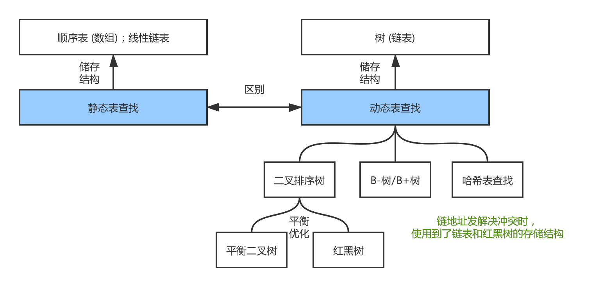 |
| :-: |
| 图 7-1 静态表查找与动态表查找 |

##### 基本概念
- 二叉排序树 (Binary Sort Tree, BST)，或是一棵空树，或者具有以下性质的二叉树：
	- 左子树不为空，左子树上所有结点的值均小于根结点的值。
	- 右子树不为空，右子树上所有结点的值均大于根结点的值。
	- 它的左、右子树也都是二叉排序树。

- 对二叉排序树进行中序遍历，将得到一个按关键字有序的记录序列。

##### BST 的构造过程
| 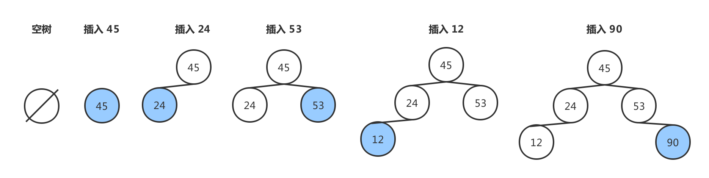 |
| :-: |
| 图 7-1-1 二叉排序树的构造过程 |

- 中序遍历 BST 可得一个关键字有序序列。顾名思义，这个性质是由 BST 的定义决定的，即构造树的过程实际是对无序序列进行排序的过程。

##### BST 的删除操作
- 与 BST 上进行插入操作要求相同，即删除一个结点，得保证删除结点后仍然是一棵 BST。
- 根据 BST 的结构特性，删除操作可分以下情况考虑：
	- 若删除结点无子树，即为叶子结点，则直接删除。

		| 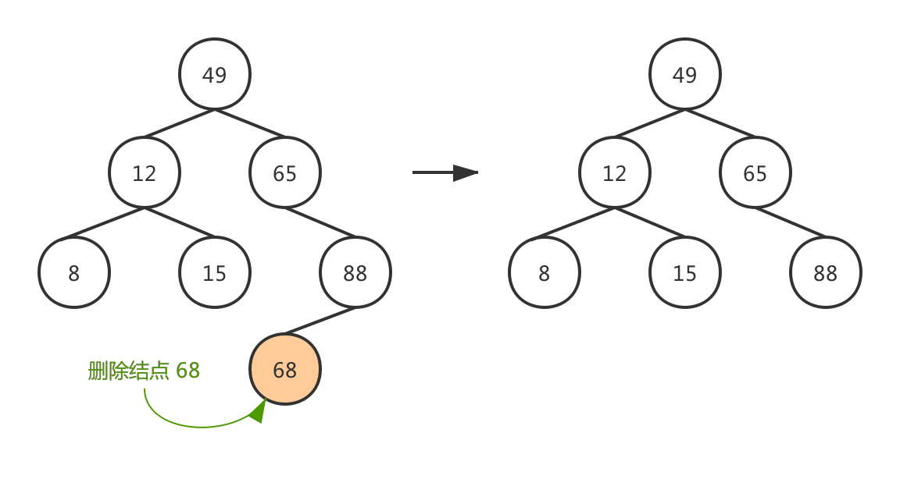 |
		| :-: |
		| 图 7-1-2 二叉排序树的删除操作 (叶子结点) |
	
	- 若删除结点只有左子树 / 右子树，则令该左子树 / 右子树直接成为待删除结点的父结点的左子树 / 右子树。

		| 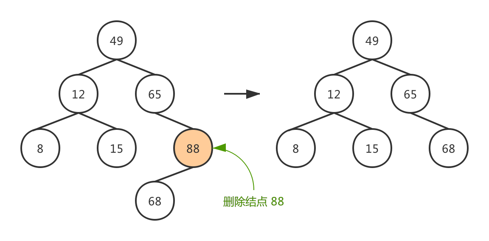 |
		| :-: |
		| 图 7-1-3 二叉排序树的删除操作 (只有一棵子树) |
	
	- 若删除结点含有左右子树， 根据二叉排序树的特点，可以用被删除结点在中序遍历下的前趋结点代替被删除结点 (或中序遍历下的后继结点)，同时删除其中序遍历下的前趋结点 (或中序遍历下的后继结点)。

		| 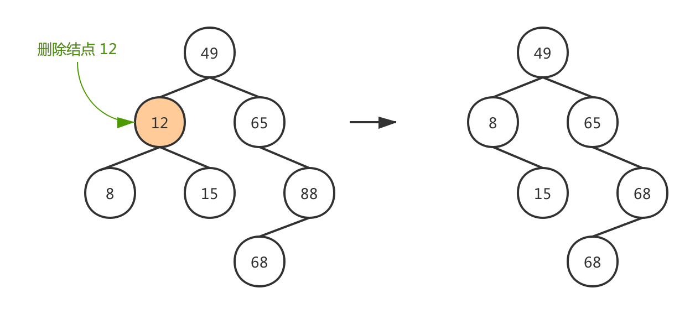 |
		| :-: |
		| 图 7-1-4 二叉排序树的删除操作 (包含左右子树) |

#### 平衡二叉树
##### 引入背景
| 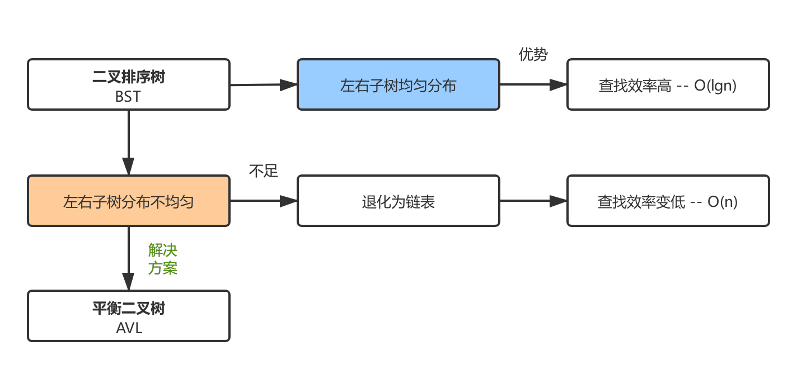 |
| :-: |
| 图 7-2 二叉排序树与平衡二叉树 |

##### 基本概念
- 平衡二叉树 (Balanced Binary Tree)，又称 AVL 树，具有以下性质：
	- 它的左、右子树都是平衡二叉树；
	- 它可以是一棵空树或它的左、右两个子树的高度差的绝对值不超过 1。

	|  |
	| :-: |
	| 图 7-2-1 AVL 树与非 AVL 树 |
	
- 平衡因子：某结点的左子树深度与右子树的深度之差。且在 AVL 树中，平衡因子的取值只能是 `-1，0，1`。
-  AVL 树因插入、删除结点导致失去平衡，可通过平衡调整方法以保持 AVL 树的性质。
	
##### 平衡调整
- 每次调整的对象都是最小单位的 AVL 树。
- 不管怎样作平衡调整，都保持为一棵 AVL 树。
- 假设由于在二叉排序树插入而失去平衡的最小子树的根结点为 A  (指离插入结点最近，且平衡因子的绝对值超过 1 的祖先结点 A)。

	> 以下命名方式的说明：`插入结点的类型 (平衡调整方案)`
	
	- `LL 型 (单向右旋)`：由于结点 A 的 `左孩子` 的 `左子树` 上插入了新结点，A 为根的子树失去平衡。可通过单向右旋转操作以调整平衡。

		|  |
		| :-: |
		| 图 7-2-2 AVL 树的 LL 型平衡调整 |
	
	- `RR 型 (单向左旋)`：由于结点 A 的 `右孩子` 的 `右子树` 上插入了新结点，A 为根的子树失去平衡。可通过单向右旋转操作以调整平衡。

		|  |
		| :-: |
		| 图 7-2-3 AVL 树的 RR 型平衡调整 |
	
	- `LR 型 (先左后右旋)`：由于结点 A 的 `左孩子` 的 `右子树` 上插入了新结点，A 为根的子树失去平衡。可通过先左后右的两次旋转操作以调整平衡。

		| 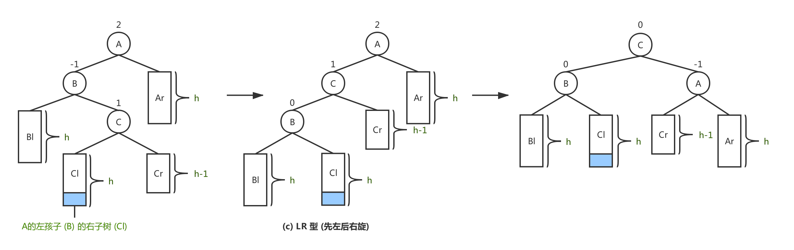 |
		| :-: |
		| 图 7-2-4 AVL 树的 LR 型平衡调整 |
	
	- `RL 型 (先右后左旋)`：由于结点 A 的 `右孩子` 的 `左子树` 上插入了新结点，A 为根的子树失去平衡。可通过先右后左的两次旋转操作以调整平衡。

		|  |
		| :-: |
		| 图 7-2-5 AVL 树的 RL 型平衡调整 |

		> 其中 LL 型与 RR 型相对称，LR 型与 RL 型相对称。

#### 红黑树
##### 引入背景
| 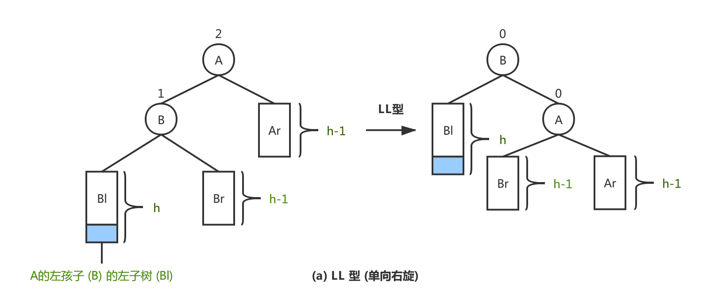 |
| :-: |
| 图 7-3 平衡二叉树与红黑树 |

##### 参考资料
- [维基百科. 红黑树. zh.wikipedia.org](https://zh.wikipedia.org/wiki/红黑树)
- [Julycoding. 教你透彻了解红黑树. github.com](https://github.com/julycoding/The-Art-Of-Programming-By-July/blob/master/ebook/zh/03.01.md)

##### 基本概念
- 红黑树：是一种 `自平衡` 的二叉查找树。如图 7-3-1 所示为一棵红黑树。

	|  |
	| :-: |
	| 图 7-3-1 红黑树 [来自 Wikipedia](https://zh.wikipedia.org/wiki/红黑树) |

- 红黑树除了具有 `二叉排序树` 的所有性质外，还具有以下性质：
	- `性质一`：结点可以是红色或者黑色的。
	- `性质二`：根结点是黑色的。
	- `性质三`：所有外部结点的颜色是黑色的。
		- `外部结点` 以 `空指针` 表示 (也可称其为叶子结点)。
		- `NIL` 表示叶子结点，它不含数据，而只充当树在此结束的指示。
		
			> 这样定义的好处是，即满足性质五的要求，且算法更容易描述。

	- `性质四`：每个红色结点的两个子结点都为黑色的，或者从根结点到外部结点的所有路径上没有两个连续的红色结点。
	- `性质五`：从根结点到外部结点的所有路径上都包含相同的黑色结点。

- 在以上性质的约束下，可知道红黑树的 `关键特性`：从根到叶子的最长可能路径不多于最短可能路径的两倍长，结果是这棵树是平衡的。
	
- 基于二叉查找数的红黑树，通过一些性质使得树相对平衡， 使得查找、插入、删除最坏情况的时间复杂度依然为 $O({log_2}^n)$。

##### 插入与插入修复
- 我们默认以二叉排序树的方法增加结点，并标记它为红色。
	- 若默认标记为黑色，将导致根到叶子的路径多了一个黑色结点，这样是难以实现调整的 --> `破环了性质五`。  
	- 设置为红色结点后，将导致连续红色结点的冲突 --> `破环性质四`。

- `解决方案`：通过颜色变换和树旋转调整，以满足红黑树的性质。
	- 若插入的根结点，原树是空树则直接 `涂黑` --> `满足性质二`
	- 若插入的结点的父结点是黑色，没有破坏红黑树，不做任何操作 --> `满足性质二、四`

- `插入修复`：红黑树的插入相当于在二叉排序树插入基础上，为了重新恢复平衡，继续做了插入修复操作。
	- `情况一`：若当前结点的父结点是红色，且祖父结点的另一个子结点 (叔叔结点) 是红色。

		> `对策`：将当前结点的父结点和叔叔结点涂黑，祖父结点涂红；以当前结点开始计算。
		
		|  |
		| :-: |
		| 图 7-3-2 红黑树的插入修复情况一 |
	
	- `情况二`：若当前结点的父结点是红色，且叔叔结点是黑色，当前结点是其父结点的右子。

		> `对策`：将当前结点的父结点作为新的当前结点；以新的当前结点为支点左旋。
		
		| 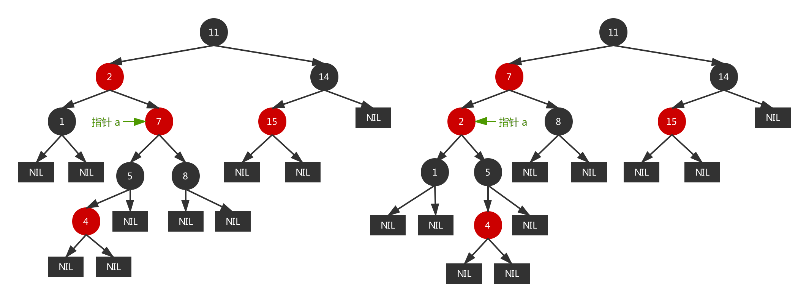 |
		| :-: |
		| 图 7-3-3 红黑树的插入修复情况二 |

	- `情况三`：若当前结点的父结点是红色，且叔叔结点是黑色，当前结点是其父结点的左子。

		> `对策`：将当前结点的父结点涂为黑色，祖父结点涂为红色；以祖父结点为支点右旋。
		
		| 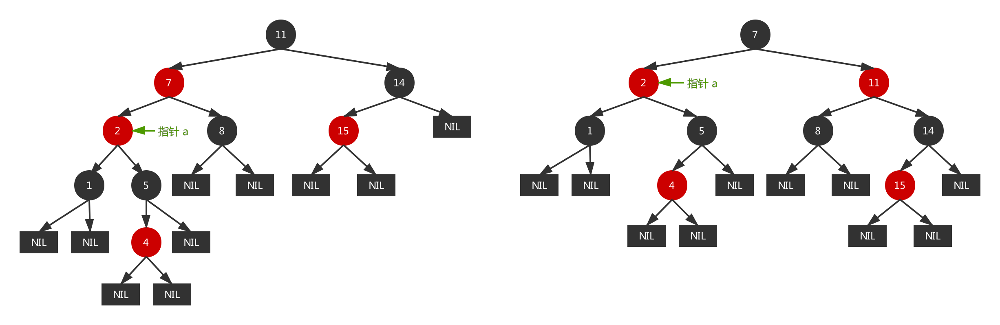 |
		| :-: |
		| 图 7-3-4 红黑树的插入修复情况三 |

##### 删除与删除修复
- 红黑树删除结点的方法与常规二叉排序树中删除结点的方法是一样的，待删除结点按照儿子个数可分三种情况：
	- `没有儿子结点`：即为叶子结点，直接把父结点对应的儿子指针设为 NULL，再删除该结点。
	- `只有一个儿子`：那么把父结点的相应儿子指针指向儿子的独生子，再删除该结点。
	- `含有两个儿子`：根据二叉排序树的特点，可以用被删除结点在中序遍历下的前趋结点代替被删除结点 (或中序遍历下的后继结点)，同时删除其中序遍历下的前趋结点 (或中序遍历下的后继结点)。

- 在删除结点后，原红黑树的性质可能被改变：
	- 若删除的是红色结点，原红黑树的性质依旧保持，此时不用做修正操作;
	- 如果删除的结点是黑色结点，原红黑树的性质可能会被改变，我们要对其做修正操作。

		> 红黑树的删除修复原理 (未整理)：[Julycoding. 红黑树的删除和删除修复](https://github.com/julycoding/The-Art-Of-Programming-By-July/blob/master/ebook/zh/03.01.md#%E7%BA%A2%E9%BB%91%E6%A0%91%E7%9A%84%E5%88%A0%E9%99%A4%E5%92%8C%E5%88%A0%E9%99%A4%E4%BF%AE%E5%A4%8D)

#### B-Tree 与 B+Tree

##### 引入背景

- 与前面讨论的查找算法有所区别，前者都是在内存中进行的，适用于小规模文件查找。B-Tree/B+Tree 则适用于磁盘等直接存取的设备上组织动态查找。
- B-Tree/B+Tree 多应用于数据库索引中，而数据库索引是存储在磁盘的索引文件上。当数据量大时，我们不能把整个索引全部加载到内存，只能逐一加载每一个磁盘页 (对应索引树的节点)。换句话说，数据库索引利用磁盘预读原理，即把一个 B-Tree/B+Tree 节点的大小刚好设为一个页的大小，这样一个树结点只需一次 I/O 即可完成加载。为此，检索目标一次最多需要访问 h 个结点 (h 次 I/O 操作)。
	
	> 对于 B-Tree/B+Tree 的数据结构来说，树的高度可代表 I/O 次数，而“矮胖”就是 B-Tree/B+Tree 的阶 m，m 的大小取决于磁盘页的大小。

  | 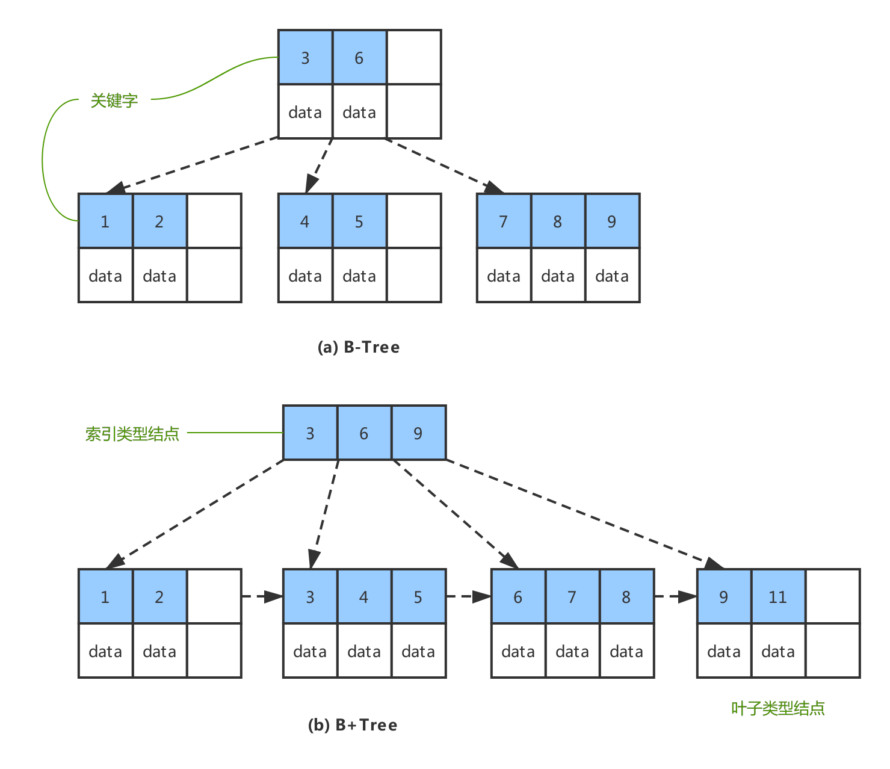 |
  | :---: |
  | 图 7-4 B 树 与 B+ 树 |

##### 参考资料
- [维基百科. B+树. zh.wikipedia.org]()
- [Nullzx. B 树和 B+ 树的插入删除图文详解. cnblogs.com](https://www.cnblogs.com/nullzx/p/8729425.html)
- [CodingLabs. MySQL索引背后的数据结构及算法原理. CodingLabs.org](http://blog.codinglabs.org/articles/theory-of-mysql-index.html)

##### B-Tree
###### 基本概念
- B-Tree (Balanced Tree)，一种 `平衡` 的多路查找树，它或是一棵空树，或满足下列特性的 m 叉树 ($m \geq 3$)：
	- 树中每个结点至多有 m 棵子树；
	- 树中非叶子结点至少有两棵子树；
	- 除根结点与叶子结点外，至少有 $\lceil m/2 \rceil$ 棵子树；
	- 每个结点的关键字个数 = $\{ n \, | \, \lceil m/2 \rceil \leq n \leq m-1 \}$；

		> 1) 根结点至少可以有一个关键字，即关键字个数 = $\{ n \, | \, 1 \leq n \leq m-1 \}$。  
		> 2) 当结点的关键字数量大于等于 (m-1) 时，则触发结点分裂过程，以结点中间的关键字为中心分裂成左右两部分。

	- 每个结点中的关键字都按照从小到大排序，每个结点的关键字的左子树中所有关键字都小于它，而右子树中所有关键字都大于它。
	- 所有叶子结点都位于同一层，或者说根到每个叶子结点的长度都相同。

		> 在实际应用中，B-Tree 的阶数 m 通常很大 ($m \geq 100$)，即使存储大量数据 B-Tree 的高度仍然很小。

##### B+Tree
###### 基本概念
- B+Tree 是 B-Tree 的一种变形形式，一棵 m 阶的 B+Tree 定义如下： 
  
  - 树中每个结点至多有 m 棵子树；
  - 若根结点而非叶子结点，则至少有两棵子树；
  - 除根结点与叶子结点外，至少有 $\lceil m/2 \rceil$ 棵子树；
	- 每个结点的关键字个数比它的孩子结点个数少 1；
  
		> 各种资料上对于 B+Tree 结点的关键字个数定义不同，这里取 Wikipedia 的定义 (也可以同步 B-Tree 的关键字个数定义)。
  
  - 所有叶子结点包含了全部关键字及相应记录的存储地址，按照从小到大的顺序排序，并存放在同一层的叶子节点中，而且叶子节点以指针进行链接。
  - 所有 `非叶子结点` 仅起到 `索引作用`，即结点中的每一个索引项只含有对应子树的最大关键字和指向该子树的指针，不含有该关键字对应记录的存储地址。

##### 两者比较
- 对于 `范围查找` 来说，B+Tree 只需 `遍历叶子节点链表` 即可，B-Tree 却需要重复地 `中序遍历整棵树`。
- B+Tree 只有叶子结点存储数据，非叶子结点只起到索引作用；B-Tree 的所有结点都存储数据。

### 哈希表查找
- `哈希存储`：以关键字的值作为自变量，通过一定的函数关系 (哈希函数)，计算出对应的函数值 (哈希地址) 作为数据元素的地址，并将该数据存入相应地址的存储单元中。
- `哈希查找`：利用查找的关键字的值，采用同样的方式获得哈希地址，然后到相应的存储单元中取得数据元素。

#### 参考资料
- [现在魔法学院. 数据结构查找篇. nowamagic.net](http://www.nowamagic.net/academy/part/30/185/)
- [严蔚敏, 吴伟民. 数据结构 (C语言版) [M]. 清华大学出版社, 2007](https://www.douban.com/doubanapp/dispatch/book/24699581?dt_dapp=1)

#### 哈希函数
> 构造哈希函数的方法不限制一种，整体设计思路是尽可能将关键字集合空间均匀地映射到地址集合空间中。

- `除留余数法`：以关键字的值求模一个质数 $p$ (小于等于哈希地址集合总数 $m$)，其余数作为哈希地址。哈希函数如公式 (2) 所示。

	- 事实上，这方法不仅可以对关键字直接取模，也可在折叠、平方取中后再取模。  
	- 使用除留余数法的一个经验是，若散列表表长为 $m$，通常 $p$ 为小于或等于表长 (最好接近 m) 的最小质数或不包含小于 20 质因子的合数。

	$$
	H(key) = key \, \mathcal{mod} \, p, \, (p \leq m)
	\tag{2}
	$$

- `折叠法`：将关键字的值自左向右或者自右向左分成位数相同的几部分，将这几部分叠加求和，并按照哈希表表长求得最后几位作为哈希地址。对于位数很多的关键字，且每一位上符号分布均匀，可采用此方法求得哈希地址。
	
	- 移位叠加法：将分割后的各部分最低位对齐，然后相加。
	- 间接叠加法：从一端向另一端沿分割界来回折叠后，然后对齐最后一位相加。

		> 例如：假设关键字 key = 26846358785，哈希表长度为 3 位数，则可对关键字进行每 3 位一部分的分割。
		
		|  |
		| :---: |
		| 图 7-5 移位叠加法和间接叠加法的步骤演示 |

#### 解决冲突
> 设计再好的散列函数也不可能完全避免冲突，既然冲突不能避免，就要考虑如何处理它。

##### 开放定址法
`开放定址法`：`开放` 指的是没有被占用的位置，`定址` 指的是确定位置。当发生冲突时，形成一个地址序列，沿着序列逐个探测，直至找到一个空的开发地址，然后插入关键字。地址序列生成函数如公式 (3) 所示：

- 不是同义词却需要争夺一个地址的情况，我们称这种现象为 “堆积”。显然，堆积使得我们需要不断处理冲突，无论是存入还是査找效率都会大大降低。

	$$
	H_{c} = ( H(key) + d_i ) \, \mathcal{mod} \, m,  \,  i = 1, 2, ..., m-1
	\tag{3}
	$$
	
- 针对探测时的地址步进增量 $d$，也有多种方案。如表 7-5-1 所示：
			
	| 探测方案 | 公式 |
	| :---: | :---: |
	| 线性探测法 | $d_i = 1, 2, ..., m-1$ |
	| 二次探测法 | $d_i = 1^2, -1^2, 2^2, -2^2, ..., q^2, -q^2, (q \leq m/2)$ |
	
	> 二次探测法要求 $p$ 为 $4j+3, j \in N$ 的素数时才有可能再散列。

- 开放定址法的优缺点：
	- 开放定址法为减少冲突，要求装填因子 $\alpha (\leq 1)$，故当结点规模较大时会浪费很多空间。
		
		> `装填因子`：$\alpha = n / m$，其中 $n$ 为关键字个数，$m$ 为表长。  
		> `装填因子` 表示哈希表中元素的 `填满程度`。若装填因子越大 (越小)，填满的元素越多 (越少)，好处是空间利用率高 (低)，但冲突的机会加大 (减少)，查找成本上升 (降低)。
		
	- 开放地址法构造的散列表，删除结点不能简单地将被删结点的空间置为空，否则将截断在它之后填人散列表的同义词结点的查找路径。

		> 因为在各种开放地址法中，空地址单元 (即开放地址) 表示查找失败的结果。因此在用开放地址法处理冲突的散列表上执行删除操作，只能在被删结点上做删除标记，而不能真正删除结点。

##### 链地址法
`链地址法`：将所有关键字为同义词的记录存储在同一线性链表中。我们称这种表为同义词子表，在散列表中只存储所有同义词子表的头指针。

- 将所有关键字为同义词的结点链接在同一个单链表中。若选定的散列表长度为 $m$，则可将散列表定义为一个由 $m$ 个头指针组成的指针数组 $T[0..m-1]$。
- 凡是散列地址为 $i$ 的结点，均插入到以 $T[i]$ 为头指针的单链表中。T 中各分量的初值均应为空指针。在链地址法中，装填因子 $\alpha$ 可以大于 1，但一般均取 $ \alpha \leq 1$。

	| 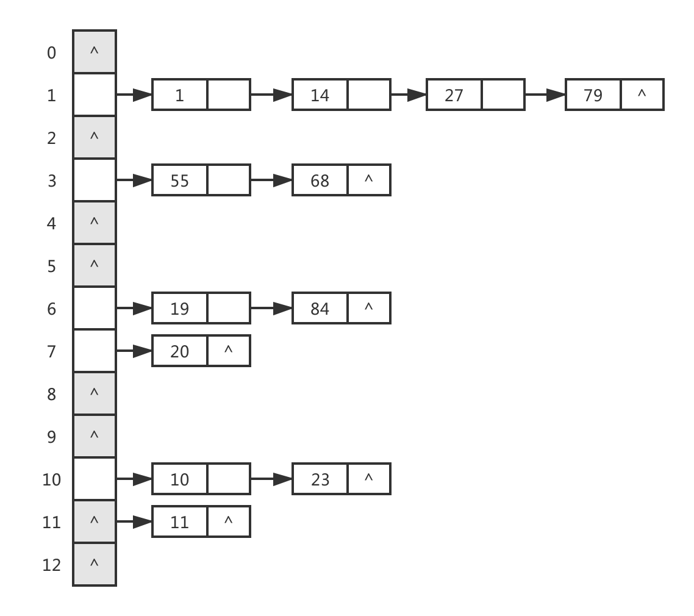 |
	| :---: |
	| 图 7-5-1 链地址法 |
	
- 链地址法的优缺点：
	- 无堆积现象，即非同义词决不会发生冲突，因此平均查找长度较短；
	- 链地址法中各链表上的结点空间是动态申请的，故它更适合于造表前无法确定表长的情况；
	- 链地址法的装填因子可取 $\alpha \geq 1$。结点较大时，增加的指针域可忽略不计，因此节省空间；
	- 链地址法构造的散列表中，删除结点只要简单地删去链表上相应的结点即可。

##### 公共溢出区法	
- `公共溢出区法`： 假设哈希函数的值域为 $[0, m-1]$，则设向量 $HashTable[0...m-1]$ 为基本表，每个分量存放一个记录，另设立向量 $OverTable[0...v]$ 为溢出表。所有关键字和基本表中关键字为同义词的记录，不管他们由哈希函数得到的哈希地址是什么，`一旦发生冲突都填入溢出表`。

##### 再哈希法
- `再哈希法`：在同义词产生地址冲突时计算另一个哈希地址。该方法不易产生 “堆积”，但增加计算时间。

	$$H_c = RH_i(key), i = 1, 2, ..., k \tag{4}$$

#### 性能分析
- 平均查找长度 (Average Search Length，ASL)，是哈希表查找的查找效率的量化评价指标。
- 以下将从 `散列函数`、`处理冲突的方法` 和 `装填因子` 方面展开探讨。

##### 散列函数
- 哈希函数的 “好坏” 首先影响出现冲突的频繁程度。通常情况设定的哈希函数是均匀的，即产生冲突的可能性相同，故可不考虑它对 ASL 的影响。

##### 处理冲突的方法
- 选定同样一组关键字，设定相同的哈希函数，则不同的处理冲突方法得到的哈希表不同，他们的 ASL 也不同。
	- 开放地址法：如图 7-5-2 所示，是开放定址法处理冲突时的哈希表。

		|  |
		| :---: |
		| 图 7-5-2 开放定址法处理冲突时的哈希表 |
		
		- 查找成功的 ASL：在哈希表中查找目标关键字所需要的比较次数。
		- 查找失败的 ASL：依次检索哈希表中每个下标位置，若遇到为空停止检索，表示该次查询失败的代价次数。
		
	- 链地址法：如图 7-5-3 所示，是链地址法处理冲突时的哈希表。

		| 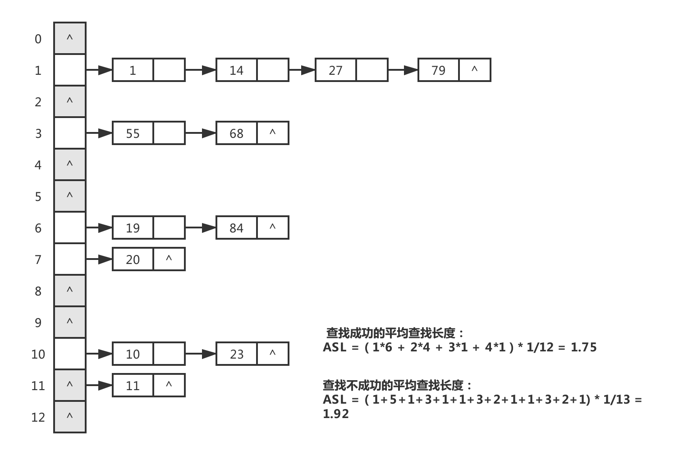 |
		| :---: |
		| 图 7-5-3 链地址法处理冲突时的哈希表 |

		- 查找成功的 ASL：`竖着计数` 只需一次查找就能找到记录的个数，只需二次查找才能找到记录的个数...以此类推统计所有可能 (即使是链表为空也是查找一次的代价)，此时每个元素的查找概率为 $P = \frac{1}{记录的个数}$；
		- 查找失败的 ASL：`横着计数` 哈希表中每一分量的记录个数，即使是链表为空也是查找一次的代价。此时每个元素的查找概率为 $P = \frac{1}{哈希表表长}$；

##### 装填因子
- 一般情况下，处理冲突方法相同的哈希表，则其 ASL 依赖于哈希表的 `装填因子`。