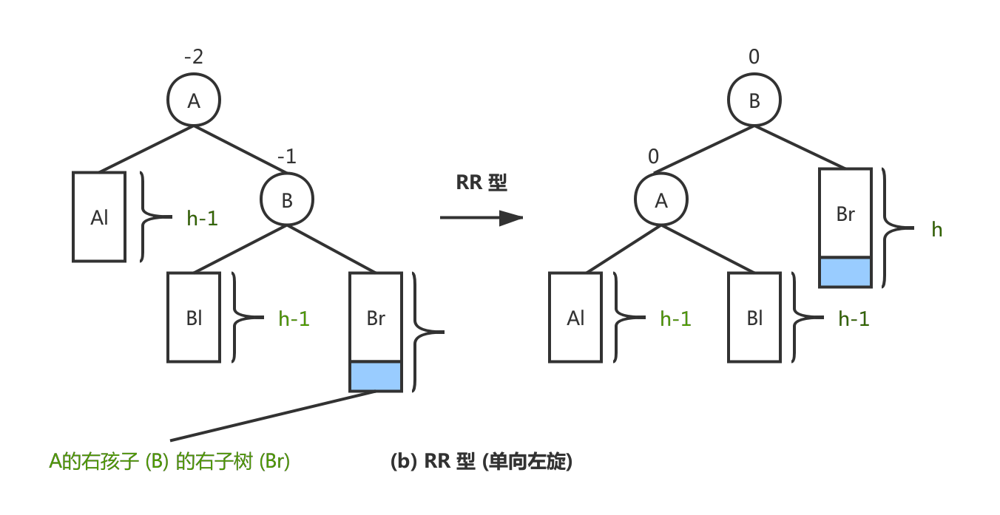
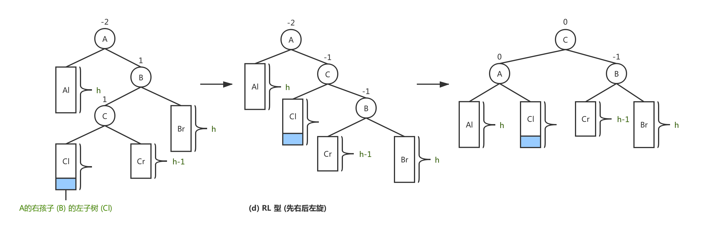
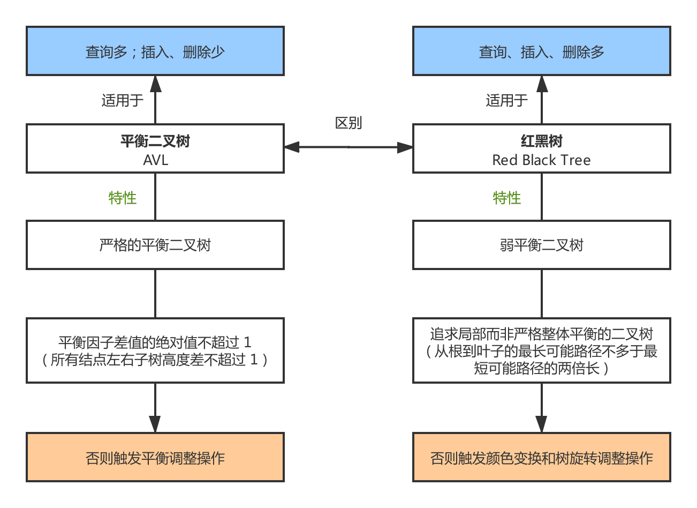
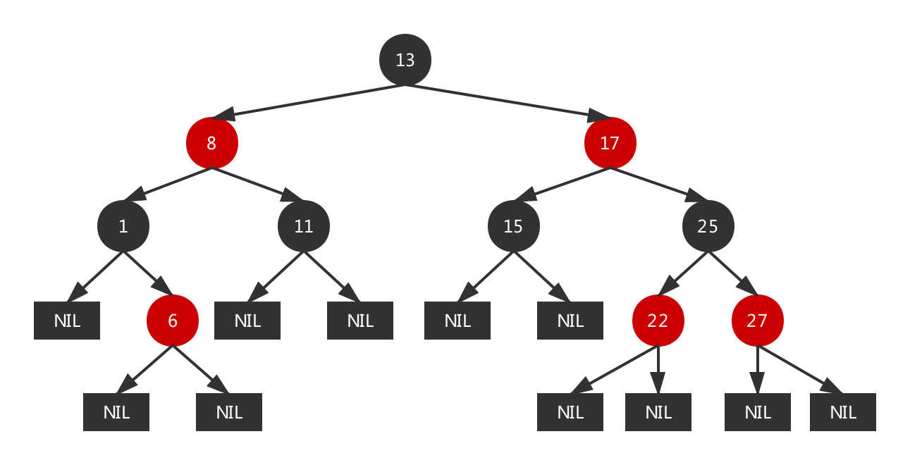
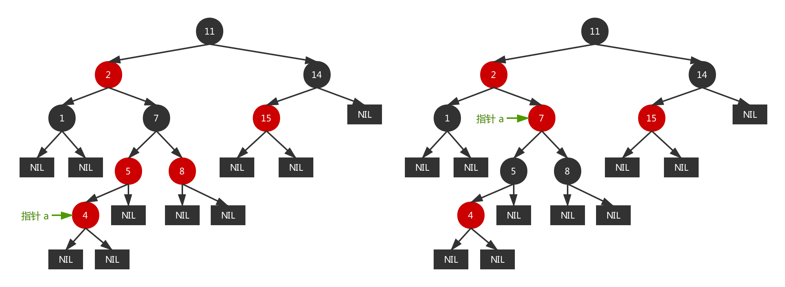

# 技术面试必备基础知识-数据结构

## 栈

## 队

## 树

## 排序

## 查找
### 查找概述
- `查找`：是根据给定的某个值，在查找表中确定一个关键字的值等于给定值的记录。
	- 若表中存在这样的一个记录，则称 `查找成功`，并返回记录的信息或指示该记录在查找表中的位置。
	- 若表中不存在关键字等于给定值的记录，则称 `查找不成功`，此时查找的结果可返回一个 `空记录` 或者 `空指针`。

- `查找算法分类`：
	- 静态查找和动态查找：静态或者动态都是针对查找表而言的。动态表指查找表中有删除和插入操作的表。
	- 无序查找和有序查找：
		- 无序查找：被查找数列有序无序均可。
		- 有序查找：被查找数列必须为有序数列。

- `平均查找长度` (Average Search Length，ASL)：为确定记录在查找表中的位置，需要与给定值进行比较的关键字个数的 `期望值` 称为查找算法在查找成功时的平均查找长度。
	- 对于含有 $n$ 个数据元素的查找表，查找成功的平均查找长度 (公式 1)：

		$$
		\mathcal{ASL}=\sum_{i = 1}^n P_i \cdot C_i
		\tag{1}$$

		> 其中 $P_i$ 为查找表中第 $i$ 个数据元素的概率，通常假设每个元素查找概率相同，且 $\sum_{i = 1}^n P_i = 1$；$C_i$ 为找到第 $i$ 个数据元素时已经比较过的次数。
		
	- 查找不成功的平均查找长度，通常是指从查找位置开始直到一个位置为空需要比较的次数。
	- 每种查找算法成功与不成功的 ASL 计算方式都有相异之处，为此将在具体算法的 `性能分析` 小节详细展开介绍。

### 动态表查找
#### 二叉排序树

#### 平衡二叉树
##### 引入背景
|  |
| :-: |
| 图 1-1 二叉排序树与平衡二叉树 |

##### 基本概念
- 平衡二叉树 (Balanced Binary Tree)，又称 AVL 树，具有以下性质：
	- 它的左、右子树都是平衡二叉树；
	- 它可以是一棵空树或它的左、右两个子树的高度差的绝对值不超过 1。

	|  |
	| :-: |
	| 图 1-2 AVL 树与非 AVL 树 |
	
- 平衡因子：某结点的左子树深度与右子树的深度之差。且在 AVL 树中，平衡因子的取值只能是 `-1，0，1`。
-  AVL 树因插入、删除结点导致失去平衡，可通过平衡调整方法以保持 AVL 树的性质。
	
##### 平衡调整
- 每次调整的对象都是最小单位的 AVL 树。
- 不管怎样作平衡调整，都保持为一棵 AVL 树。
- 假设由于在二叉排序树插入而失去平衡的最小子树的根结点为 A  (指离插入结点最近，且平衡因子的绝对值超过 1 的祖先结点 A)。

	> 以下命名方式的说明：`插入结点的类型 (平衡调整方案)`
	
	- `LL 型 (单向右旋)`：由于结点 A 的 `左孩子` 的 `左子树` 上插入了新结点，A 为根的子树失去平衡。可通过单向右旋转操作以调整平衡。

		|  |
		| :-: |
		| 图 1-3 AVL 树的 LL 型平衡调整 |
	
	- `RR 型 (单向左旋)`：由于结点 A 的 `右孩子` 的 `右子树` 上插入了新结点，A 为根的子树失去平衡。可通过单向右旋转操作以调整平衡。

		|  |
		| :-: |
		| 图 1-4 AVL 树的 RR 型平衡调整 |
	
	- `LR 型 (先左后右旋)`：由于结点 A 的 `左孩子` 的 `右子树` 上插入了新结点，A 为根的子树失去平衡。可通过先左后右的两次旋转操作以调整平衡。

		|  |
		| :-: |
		| 图 1-5 AVL 树的 LR 型平衡调整 |
	
	- `RL 型 (先右后左旋)`：由于结点 A 的 `右孩子` 的 `左子树` 上插入了新结点，A 为根的子树失去平衡。可通过先右后左的两次旋转操作以调整平衡。

		|  |
		| :-: |
		| 图 1-6 AVL 树的 RL 型平衡调整 |

		> 其中 LL 型与 RR 型相对称，LR 型与 RL 型相对称。

#### 红黑树
##### 引入背景
|  |
| :-: |
| 图 1-7 平衡二叉树与红黑树 |

##### 参考资料
- [维基百科. 红黑树. zh.wikipedia.org](https://zh.wikipedia.org/wiki/红黑树)
- [Julycoding. 教你透彻了解红黑树. github.com](https://github.com/julycoding/The-Art-Of-Programming-By-July/blob/master/ebook/zh/03.01.md)

##### 基本概念
- 红黑树：又称堆成二叉树，是一种 `自平衡` 的二叉查找树。如图 1-8 所示为一棵红黑树。

	|  |
	| :-: |
	| 图 1-8 红黑树 [来自 Wikipedia](https://zh.wikipedia.org/wiki/红黑树) |

- 红黑树除了具有 `二叉排序树` 的所有性质外，还具有以下性质：
	- `性质一`：结点可以是红色或者黑色的。
	- `性质二`：根结点是黑色的。
	- `性质三`：所有外部结点的颜色是黑色的。
		- `外部结点` 以 `空指针` 表示 (也可称其为叶子结点)。
		- `NIL` 表示叶子结点，它不含数据，而只充当树在此结束的指示。
		
			> 这样定义的好处是，即满足性质五的要求，且算法更容易描述。

	- `性质四`：每个红色结点的两个子结点都为黑色的，或者从根结点到外部结点的所有路径上没有两个连续的红色结点。
	- `性质五`：从根结点到外部结点的所有路径上都包含相同的黑色结点。

- 在以上性质的约束下，可知道红黑树的 `关键特性`：从根到叶子的最长可能路径不多于最短可能路径的两倍长，结果是这棵树是平衡的。
	
- 基于二叉查找数的红黑树，通过一些性质使得树相对平衡， 使得查找、插入、删除最坏情况的时间复杂度依然为 $O({log_2}^n)$。

##### 插入与插入修复
- 我们默认以二叉排序树的方法增加结点，并标记它为红色。
	- 若默认标记为黑色，将导致根到叶子的路径多了一个黑色结点，这样是难以实现调整的 --> `破环了性质五`。  
	- 设置为红色结点后，将导致连续红色结点的冲突 --> `破环性质四`。

- `解决方案`：通过颜色变换和树旋转调整，以满足红黑树的性质。
	- 若插入的根结点，原树是空树则直接 `涂黑` --> `满足性质二`
	- 若插入的结点的父结点是黑色，没有破坏红黑树，不做任何操作 --> `满足性质二、四`

- `插入修复`：红黑树的插入相当于在二叉排序树插入基础上，为了重新恢复平衡，继续做了插入修复操作。
	- `情况一`：若当前结点的父结点是红色，且祖父结点的另一个子结点 (叔叔结点) 是红色。

		> `对策`：将当前结点的父结点和叔叔结点涂黑，祖父结点涂红；以当前结点开始计算。
		
		|  |
		| :-: |
		| 图 1-9 红黑树的插入修复情况一 |
	
	- `情况二`：若当前结点的父结点是红色，且叔叔结点是黑色，当前结点是其父结点的右子。

		> `对策`：将当前结点的父结点作为新的当前结点；以新的当前结点为支点左旋。
		
		|  |
		| :-: |
		| 图 1-10 红黑树的插入修复情况二 |

	- `情况三`：若当前结点的父结点是红色，且叔叔结点是黑色，当前结点是其父结点的左子。

		> `对策`：将当前结点的父结点涂为黑色，祖父结点涂为红色；以祖父结点为支点右旋。
		
		|  |
		| :-: |
		| 图 1-11 红黑树的插入修复情况三 |

##### 删除与删除修复
- 红黑树删除结点的方法与常规二叉排序树中删除结点的方法是一样的，待删除结点按照儿子个数可分三种情况：
	- `没有儿子结点`：即为叶子结点，直接把父结点对应的儿子指针设为 NULL，再删除该结点。
	- `只有一个儿子`：那么把父结点的相应儿子指针指向儿子的独生子，再删除该结点。
	- `含有两个儿子`：根据二叉查找树的特点，可以用被删除结点在中序遍历下的前趋结点代替被删除结点 (或中序遍历下的后继结点)，同时删除其中序遍历下的前趋结点 (或中序遍历下的后继结点)。

- 在删除结点后，原红黑树的性质可能被改变：
	- 若删除的是红色结点，原红黑树的性质依旧保持，此时不用做修正操作;
	- 如果删除的结点是黑色结点，原红黑树的性质可能会被改变，我们要对其做修正操作。

		> 红黑树的删除修复原理 (未整理)：[Julycoding. 红黑树的删除和删除修复](https://github.com/julycoding/The-Art-Of-Programming-By-July/blob/master/ebook/zh/03.01.md#%E7%BA%A2%E9%BB%91%E6%A0%91%E7%9A%84%E5%88%A0%E9%99%A4%E5%92%8C%E5%88%A0%E9%99%A4%E4%BF%AE%E5%A4%8D)

#### B-树与B+树

### 哈希表查找
- `哈希存储`：以关键字的值作为自变量，通过一定的函数关系 (哈希函数)，计算出对应的函数值 (哈希地址) 作为数据元素的地址，并将该数据存入相应地址的存储单元中。
- `哈希查找`：利用查找的关键字的值，采用同样的方式获得哈希地址，然后到相应的存储单元中取得数据元素。

#### 参考资料
- [现在魔法学院. 数据结构查找篇. nowamagic.net](http://www.nowamagic.net/academy/part/30/185/)
- [严蔚敏, 吴伟民. 数据结构 (C语言版) [M]. 清华大学出版社, 2007](https://www.douban.com/doubanapp/dispatch/book/24699581?dt_dapp=1)

#### 哈希函数
> 构造哈希函数的方法不限制一种，整体设计思路是尽可能将关键字集合空间均匀地映射到地址集合空间中。

- `除留余数法`：以关键字的值求模一个质数 $p$ (小于等于哈希地址集合总数 $m$)，其余数作为哈希地址。哈希函数如公式 (2) 所示。

	- 事实上，这方法不仅可以对关键字直接取模，也可在折叠、平方取中后再取模。  
	- 使用除留余数法的一个经验是，若散列表表长为 $m$，通常 $p$ 为小于或等于表长 (最好接近 m) 的最小质数或不包含小于 20 质因子的合数。

	$$
	H(key) = key \, \mathcal{mod} \, p, \, (p \leq m)
	\tag{2}
	$$

- `折叠法`：将关键字的值自左向右或者自右向左分成位数相同的几部分，将这几部分叠加求和，并按照哈希表表长求得最后几位作为哈希地址。对于位数很多的关键字，且每一位上符号分布均匀，可采用此方法求得哈希地址。
	
	- 移位叠加法：将分割后的各部分最低位对齐，然后相加。
	- 间接叠加法：从一端向另一端沿分割界来回折叠后，然后对齐最后一位相加。

		> 例如：假设关键字 key = 26846358785，哈希表长度为 3 位数，则可对关键字进行每 3 位一部分的分割。
		
		|  |
		| :---: |
		| 图 1-1 移位叠加法和间接叠加法的步骤演示 |

#### 解决冲突
> 设计再好的散列函数也不可能完全避免冲突，既然冲突不能避免，就要考虑如何处理它。

##### 开放定址法
`开放定址法`：`开放` 指的是没有被占用的位置，`定址` 指的是确定位置。当发生冲突时，形成一个地址序列，沿着序列逐个探测，直至找到一个空的开发地址，然后插入关键字。地址序列生成函数如公式 (3) 所示：

- 不是同义词却需要争夺一个地址的情况，我们称这种现象为 “堆积”。显然，堆积使得我们需要不断处理冲突，无论是存入还是査找效率都会大大降低。

	$$
	H_{c} = ( H(key) + d_i ) \, \mathcal{mod} \, m,  \,  i = 1, 2, ..., m-1
	\tag{3}
	$$
	
- 针对探测时的地址步进增量 $d$，也有多种方案。如表 1-1 所示：
			
	| 探测方案 | 公式 |
	| :---: | :---: |
	| 线性探测法 | $d_i = 1, 2, ..., m-1$ |
	| 二次探测法 | $d_i = 1^2, -1^2, 2^2, -2^2, ..., q^2, -q^2, (q \leq m/2)$ |
	
	> 二次探测法要求 $p$ 为 $4j+3, j \in N$ 的素数时才有可能再散列。

- 开放定址法的优缺点：
	- 开放定址法为减少冲突，要求装填因子 $\alpha (\leq 1)$，故当结点规模较大时会浪费很多空间。
		
		> `装填因子`：$\alpha = n / m$，其中 $n$ 为关键字个数，$m$ 为表长。  
		> `装填因子` 表示哈希表中元素的 `填满程度`。若装填因子越大 (越小)，填满的元素越多 (越少)，好处是空间利用率高 (低)，但冲突的机会加大 (减少)，查找成本上升 (降低)。
		
	- 开放地址法构造的散列表，删除结点不能简单地将被删结点的空间置为空，否则将截断在它之后填人散列表的同义词结点的查找路径。

		> 因为在各种开放地址法中，空地址单元 (即开放地址) 表示查找失败的结果。因此在用开放地址法处理冲突的散列表上执行删除操作，只能在被删结点上做删除标记，而不能真正删除结点。

##### 链地址法
`链地址法`：将所有关键字为同义词的记录存储在同一线性链表中。我们称这种表为同义词子表，在散列表中只存储所有同义词子表的头指针。

- 将所有关键字为同义词的结点链接在同一个单链表中。若选定的散列表长度为 $m$，则可将散列表定义为一个由 $m$ 个头指针组成的指针数组 $T[0..m-1]$。
- 凡是散列地址为 $i$ 的结点，均插入到以 $T[i]$ 为头指针的单链表中。T 中各分量的初值均应为空指针。在链地址法中，装填因子 $\alpha$ 可以大于 1，但一般均取 $ \alpha \leq 1$。

	|  |
	| :---: |
	| 图 1-2 链地址法 |
	
- 链地址法的优缺点：
	- 无堆积现象，即非同义词决不会发生冲突，因此平均查找长度较短；
	- 链地址法中各链表上的结点空间是动态申请的，故它更适合于造表前无法确定表长的情况；
	- 链地址法的装填因子可取 $\alpha \geq 1$。结点较大时，增加的指针域可忽略不计，因此节省空间；
	- 链地址法构造的散列表中，删除结点只要简单地删去链表上相应的结点即可。

##### 公共溢出区法	
- `公共溢出区法`： 假设哈希函数的值域为 $[0, m-1]$，则设向量 $HashTable[0...m-1]$ 为基本表，每个分量存放一个记录，另设立向量 $OverTable[0...v]$ 为溢出表。所有关键字和基本表中关键字为同义词的记录，不管他们由哈希函数得到的哈希地址是什么，`一旦发生冲突都填入溢出表`。

##### 再哈希法
- `再哈希法`：在同义词产生地址冲突时计算另一个哈希地址。该方法不易产生 “堆积”，但增加计算时间。

	$$H_c = RH_i(key), i = 1, 2, ..., k \tag{4}$$

#### 性能分析
- 平均查找长度 (Average Search Length，ASL)，是哈希表查找的查找效率的量化评价指标。
- 以下将从 `散列函数`、`处理冲突的方法` 和 `装填因子` 方面展开探讨。

##### 散列函数
- 哈希函数的 “好坏” 首先影响出现冲突的频繁程度。通常情况设定的哈希函数是均匀的，即产生冲突的可能性相同，故可不考虑它对 ASL 的影响。

##### 处理冲突的方法
- 选定同样一组关键字，设定相同的哈希函数，则不同的处理冲突方法得到的哈希表不同，他们的 ASL 也不同。
	- 开放地址法：如图 1-3 所示，是开放定址法处理冲突时的哈希表。

		|  |
		| :---: |
		| 图 1-3 开放定址法处理冲突时的哈希表 |
		
		- 查找成功的 ASL：在哈希表中查找目标关键字所需要的比较次数。
		- 查找失败的 ASL：依次检索哈希表中每个下标位置，若遇到为空停止检索，表示该次查询失败的代价次数。
		
	- 链地址法：如图 1-4 所示，是链地址法处理冲突时的哈希表。

		|  |
		| :---: |
		| 图 1-4 链地址法处理冲突时的哈希表 |
		
		- 查找成功的 ASL：`竖着计数` 只需一次查找就能找到记录的个数，只需二次查找才能找到记录的个数...以此类推统计所有可能 (即使是链表为空也是查找一次的代价)，此时每个元素的查找概率为 $P = \frac{1}{记录的个数}$；
		- 查找失败的 ASL：`横着计数` 哈希表中每一分量的记录个数，即使是链表为空也是查找一次的代价。此时每个元素的查找概率为 $P = \frac{1}{哈希表表长}$；

##### 装填因子
- 一般情况下，处理冲突方法相同的哈希表，则其 ASL 依赖于哈希表的 `装填因子`。